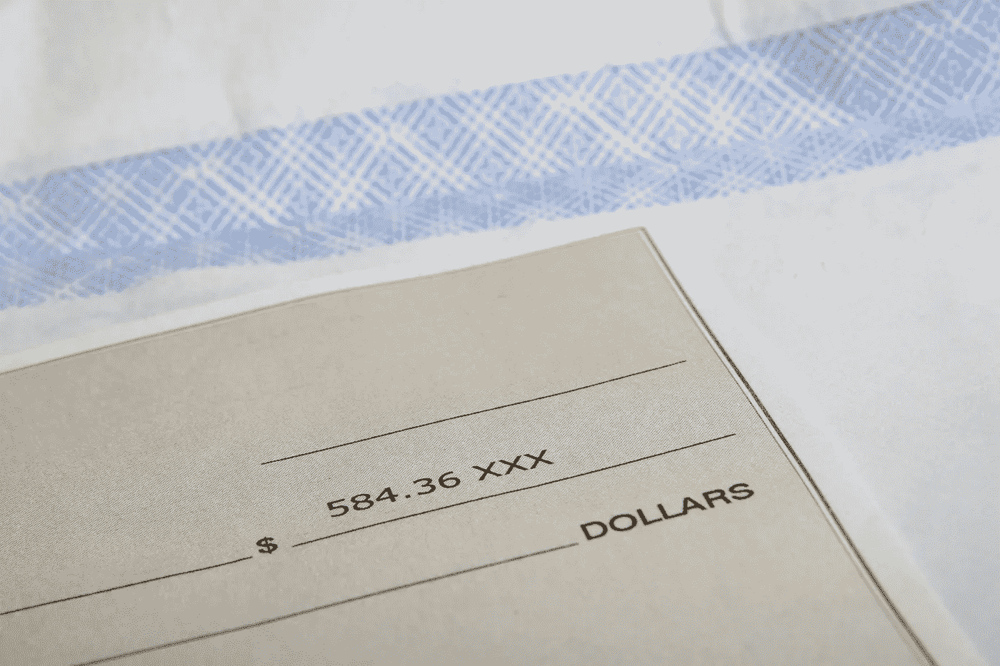

# 创业公司估值过高或过低的问题！

> 原文：<https://medium.com/hackernoon/the-problem-of-startup-valuation-going-too-high-or-too-low-56cb3353f060>

Credits: [ThugStart.com](http://www.thugstart.com)

作为一名[初创公司](https://hackernoon.com/tagged/startup)的创始人，知道[你的初创公司价值](https://amzn.to/2A1d8QX)可能是最困难的事情之一。但真正的问题不一定是为[找到正确的估值方法](https://amzn.to/2uywmI8)，而是避免估值过低或过高。错过[金发女孩原则](https://en.wikipedia.org/wiki/Goldilocks_principle)和找不到黄金中间地带有什么大问题？

# 简而言之，初创企业估值

创业估值本质上指出了你的企业的价值——它的想法、产品或服务等等。对于一家老牌企业来说，了解估值相当简单。他们可以使用有形的指标和资产(如收入、利润和客户)来计算企业的市场价值。

你的初创公司可能不具备这些条件——毕竟，你正朝着持续增长的方向努力。根据定义，初创公司是一种高增长的业务。在这种情况下，你如何知道自己的价值？

你需要关注影响成长的 [*要素*](https://amzn.to/2NueLs1) 。最常见的内容包括:

*   行业的热度。
*   创业团队的能力。
*   产品或服务及其竞争优势。

也有不同的估值方法可以用来计算你的创业估值。[最常见的方法](https://amzn.to/2uuvW5N)包括:

*   **可比公司** —你的初创公司与类似的初创公司相比估值更高。
*   **从众**——你的初创公司估值是通过考察投资者的偏好得出的。
*   **平均**——你的创业公司通过看平均或者最现实的估值来估值；也就是说，你取最坏和最好的情况，然后看平均值。

但无论你使用哪种估值方法，真正的问题是确保估值是正确的——不要太低也不要太高。

# 当你的估值不够时会发生什么？

你应该知道你需要筹集多少钱。如果你最终以较低的启动估值筹集资金，你可能会有麻烦。为什么？因为低估值通常有利于投资者——这让他们在公司中拥有更大的股权。

**然而，你也可能遭遇以下创业估值问题:**

*   你最终选择了错误的投资者。[找到合适的投资者](https://amzn.to/2uxQs5l)很重要——你要找的是了解你的激情和愿景的风险投资人。如果是的话，他们应该了解你的创业公司的确切价值，不要把它看得太低。当估值较低时，投资者可能不会真正得到你的业务。
*   **你的投资者关系变坏**。现在，这种投资者的冷漠(他们知道自己捡了个大便宜)可能会导致许多问题。投资者可能没有那么多兴趣帮助你，因为他们需要更努力地与估值更高的初创公司合作，也就是说，有更多的公司处于危险之中。你知道你的估值太低，投资者不感兴趣，所以你开始怨恨他们。当投资者关系恶化时，事情可能会开始走下坡路。
*   你将来在筹集资金方面会有困难。低估值导致大量稀释，尤其是在种子阶段。如果你的估值很低，但投资巨大，你最终自然会损失更多的股权。在早期阶段，你需要放弃的股权越多，在未来[轮](https://hackernoon.com/tagged/future)轮中，你需要放弃的股权就越少。对未来投资者来说，大幅稀释将是一个危险信号。

# 当你的创业公司估值过高时会发生什么？

毫无疑问，你的初创公司希望获得更高的估值，因为这意味着你可以在不损失大量股权的情况下筹集到所需的资金。

然而，你的初创公司也可能遭遇估值过高的问题。不合理的高启动估值可能会导致如下问题:

*   **你最终选择了错误的投资者**。与低估值类似，极高的估值并不一定意味着投资者理解你的创业概念。你可能只是吸引了一个有很多闲钱的投资者，但不是一个对公司超级兴奋的投资者。坏的风投[就在那里](http://christophjanz.blogspot.fi/2014/11/good-vcs-bad-vcs.html)，你需要警惕他们。
*   **你放弃长期战略**。高估值可能会带来短期收益，但从长期来看，它可能会对你的初创公司造成损害。你可能会向投资者发出错误的信号:你考虑的不是公司的成功，而是个人利益。高估值增加了对下一轮融资的预期，并使继续提高估值变得相当困难——你没有犯错的余地；创业公司应该经常做的事情。
*   你会疏远投资者。初创企业的高估值也能有效地疏远投资者。如果事情没有按计划进行，投资者可能会开始不满地看待高估值。此外，由于你的下一轮将需要大量的牵引力，你可能会发现更难吸引感兴趣的投资者。

# 如何获得恰到好处的估值？

那么，估值刚刚好的时候会发生什么呢？一个好的估值可能会让投资者和你都满意，但不会过度高兴。从某种意义上说， [*正确的估值*](https://amzn.to/2uxQY3h) *往往是一种妥协*——双方都不觉得自己从交易中获得了更好的利益。

如何保证估值是对的？你真的需要选择你的估价方法，并用它来得出一个你可以证明的数字。创业估值通常是关于预测和估计。然而，这并不意味着你得出的估值背后没有实际真相——投资者和你需要能够看着数字并理解推理。

也许你有 300 万美元的估值，理由是当前的市场或你的初创公司在过去六个月的吸引力。关键是要确保你能指出这些实际的指标和数据来支持你的评估。

为初创企业估值找到一种方法可能比确保你得出的估值是正确的更容易。重要的是尝试不同的事情，确保你的估价不是基于希望和梦想，而是基于冷酷的事实。

# 建议阅读

## [1。掌握风险投资游戏:一位风险投资业内人士揭示了如何根据你的条件从初创企业走向首次公开募股](https://amzn.to/2uESu3Z)

## [2。从创意到盈利和可扩展业务的创业发展曲线:创业营销手册](https://amzn.to/2zRt7Ro)

## [3。启动资金书](https://amzn.to/2L8RJKH)

## [4。资金就在那里！:获得影响业务所需的现金](https://amzn.to/2uLhBkE)

## [5。企业家成长创业手册:风险投资和成功成长的 7 个秘密](https://amzn.to/2Lz6EtS)

## 6。融资&早期公司的财务执行

## 7。众筹手册:通过股权融资门户网站为你的小企业或初创企业筹集资金

## [8。初创企业融资:成功的创始人如何为他们的初创企业筹集资金:建立一家可投资的公司，向投资者推销，谈判…否则科技创始人必须做的事情](https://amzn.to/2uIZfkr)

## [9。无论你是学生、企业家还是职场人士，如何进入风险投资领域并像投资者一样思考](https://amzn.to/2O3mjD9)

## [10。已资助:企业家第一轮融资指南](https://amzn.to/2uAHuUW)

# 如果你喜欢这个并且想要更多:

不如来点掌声，💬评论它，和/或关注我😀

此外，如果你想通过我的定期帖子阅读更多关于创业、营销、社交媒体、领导力、技术、创新和风险投资等主题的精彩内容，请点击“关注”，并随时通过 [SlideShare](http://www.slideshare.net/abhishekshah) 、 [Twitter](https://twitter.com/abhishekshah) 、[脸书](https://www.facebook.com/iAbhishekShah)和 [LinkedIn](https://www.linkedin.com/in/findingnewlands) 联系。

附:这是我在 Medium 上的其他[文章。](/@abhishekshah)