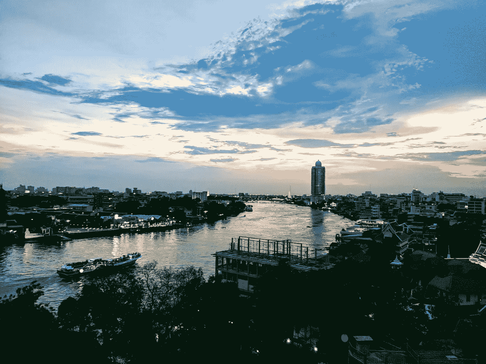
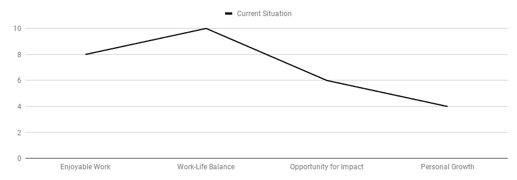
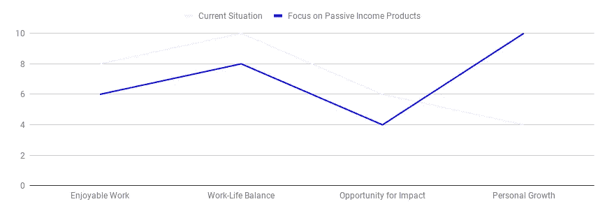
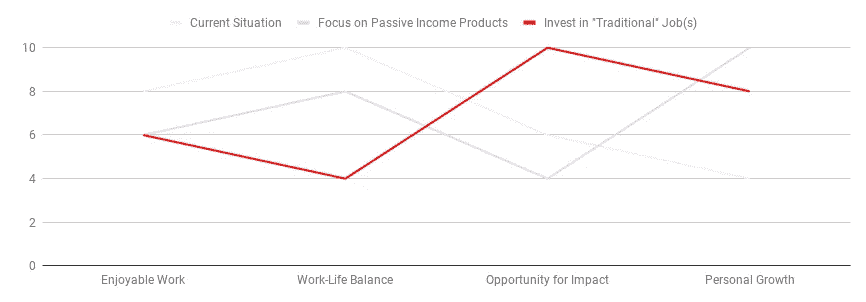
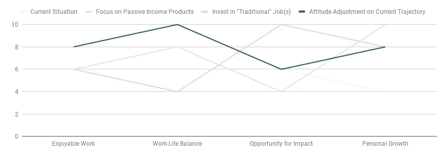

# 舒适职业的问题在于

> 原文：<https://medium.com/hackernoon/the-problem-with-a-comfortable-career-d586dd7cc362>

## 当你的工作生活过于轻松时，这是一个评估和重新评估事物的框架。

你有没有发现自己担心自己的生活或职业太舒适了？然后可能会立刻感到内疚，因为这是一个多么特权的问题？

这篇文章是写给像我一样曾经问过自己这个问题的人的:**是不是一切都有点太简单了？**

我在曼谷一栋公寓的 13 楼起草了这篇文章，从这里可以俯瞰一座美丽、现代的外国城市。前一周我在清迈爬山，探索寺庙，吃了一些我能想象到的最美味最便宜的食物。

The view from where I drafted this post. Bangkok, Thailand.

从泰国，我飞回开普敦——可以说是世界上最好的城市之一——在那里，我回到了目前的生活，每周工作 30 个小时，做一些业余项目，在山上徒步旅行和跑步，在地球上一些条件较好的地方冲浪。

我非常幸运。我希望大家能理解这一点。

承认了自己的特权之后，我们现在可以深入到我最近一直在努力解决的更复杂、更微妙的问题:现在的事情可能有点太好了。

*太好了？*“你问吧。这难道不是一种矛盾修饰法吗？

是真的。准确地说，“好”不是一个合适的词。更像是“太容易了”。还是“太舒服了”。

过舒适生活的问题是停滞不前。当我们到达一个舒适的地方时，我们会决定喜欢它，并想呆在那里。可能会持续很长时间。可能是永远。

但是当你感到舒适的时候，也有可能你并没有真正挑战自己。当你不挑战自己的时候，你可能没有充分意识到你的潜力。然后四十年过去了，你发现自己坐在退休之家，想知道也许你应该做一些更有雄心或鼓舞人心的事情。*也许。*

They say rolling stones gather no moss. But if stones never got comfortable then moss would never have anywhere to grow.

# 面对事业上的安逸

让我解释一下我是如何来到这里的。

因此，去年，面对巨大的压力和精疲力竭，我决定休息六个月来规划我的下一步——包括尝试推出软件产品，自由职业咨询，以及寻找我热爱的职业。

那段时间快结束时，我想出了一个我认为万无一失的计划。*我可以拥有一切。*我会继续制造和销售产品，为[一个我热爱并信任的组织做兼职](https://www.dimagi.com/)，并通过有趣的自由职业咨询工作来填补收入缺口。与此同时，工作时间完全在可控范围内——留出充足的时间来照顾我的身体和精神。

这个计划奏效了。有点太好了。

所以现在——以任何标准衡量，过着相当于美好生活的生活——我一直质疑这个计划背后的智慧。为平衡的生活和日复一日的幸福而优化是正确的选择吗，或者我应该更积极地将自己完全奉献给一个更专注的目标——并愿意接受随之而来的日复一日的努力和压力？

我今天没有这些答案。事实上，我想我会——很多人都会——用一生去寻找它们。我今天知道的事实是，我一直感觉停滞不前——好像我没有尽可能多地学习或成长——我希望这种情况能够改变。

# 你在优化什么？你的职业生涯是一个规范。

当我试图想出下一步该做什么时，我不断回想起我去年接受的一个想法:设计一个人的生活。

作为一个书呆子/工程师，这有助于我从工程的角度思考我的未来——也就是设计规范。有哪些重要要求？美好的未来？关键权衡？

例如，如果我正在为我的职业写一份详细说明，那么关键的*要求*将是足够的收入来过上舒适的生活。一些关键的*美好生活*将包括**我喜欢的工作**、**工作与生活的平衡**、**产生影响**和**个人成长**。我目前的情况在其中一些方面表现很好，但在其他方面就不那么好了。

复杂的是——像大多数设计/工程决策一样——不同的轴相互权衡。对工作的深度投资创造了最大的影响机会，但也可能导致最糟糕的工作生活平衡。就像任何一个优秀的产品经理会告诉你的那样，*你不能拥有一切*——你必须选择你要优化的东西，并做出一系列与这个决定一致的权衡。

# 面向未来——绘制新的航向

将这个框架应用到我自己的生活中，我目前已经找到了快乐和工作生活的平衡，但是在影响和个人成长方面我还做得不够。将这些绘制出来，可能看起来像这样:

How my current career scores on my four desired “career axes”

我目前的舒适危机似乎是我的潜意识告诉我，是时候在个人成长方面迈出大步了。

所以我知道我想增加生活中的挑战和成长机会。理想情况下，我希望能够做到这一点，而不牺牲享受或工作与生活的平衡；当然，我想尽我所能对这个世界产生积极的影响。我也知道实现所有这些是不可能的，所以我不得不从一些不同的可能途径中选择——每种途径都有自己的优缺点。

这篇文章的其余部分特别适用于我自己的情况，但我希望看到有人经历这个思考过程可能会帮助你思考如何将其应用到你自己的职业生涯中。

第一条路是加倍投资被动收入。

在这个世界里，我不再把我的副业( [Place Card Me](https://www.placecard.me/) 、 [Chat Stats](https://chatstats.co/) 和 [Build With Django](https://buildwithdjango.com/) )当作副业，而是开始把它们当作我通往财务自由的道路。

在这条道路上，有大量的个人成长机会和挑战。去年，我成功启动了两个创收项目，但我还没有想出如何让它们达到可持续收入水平。

投资这条道路可能会让我更加努力地打造一个企业对企业(B2B)产品，或者出版一本电子书或一门课程——这两件事我都考虑过，但迄今为止都没有认真对待。

在更努力地关注这些事情的过程中，我预计会有大量的不适，相反，会有增长。与此同时，这条道路可能在快乐和影响力方面得分很低，这就是为什么我至今仍在很大程度上抵制它。

How pursuing passive income projects might score on my four career axes. High on growth but low on impact.

**途径二是在我的工作上投入更多。**

独自工作的一个缺点是，它通常会限制你对工作的影响力。为一个范围和使命远大于个人的组织工作是放大这种影响的好方法。

最重要的是，我现在的有偿工作实际上是我觉得我现在学得最多的地方——也可能是最困难的问题所在。其中一些问题是技术性的—例如，为世界上最强大的[移动数据收集平台](https://www.dimagi.com/commcare/)设计可扩展和可持续的报告架构。然而，有些也是围绕人和组织的复杂的人的问题。

毫无疑问，这些问题很难，我肯定有机会通过这项工作成长。然而，尚不清楚这种增长是否会出现在我想要优先考虑的领域，我会有多喜欢它，最重要的是，在这个世界上保持我目前的工作和生活平衡有多难。

Working for others scores higher on impact, but worse on work-life balance.

第三条路是对我当前轨迹的态度调整。

我在开头提到，我目前的职业道路感觉有点像滑行。不过，仔细想想，很明显，T2 有很多挑战的机会，只是我没有完全接受这些机会。

这条道路提出了一个微妙的——但我希望是重要的——心理转变；一个我继续做我一直在做的同样的*类型*的工作，但只是更努力地拥抱它。

这就是“我会让 Place Card 慢慢成长”和“今年我会让 Place Card 每月收入达到 1000 美元”之间的区别。或者“我将在这个咨询项目上用我的时间换取美元”到“我将尽我所能建立最好的该死的数据系统。”

希望这种调整能保留我目前拥有的强烈的享受和工作生活平衡的属性，同时促进个人成长(并承认对影响的持续牺牲)。

An attitude adjustment on my current trajectory continues to prioritize work-life balance and enjoyment while hopefully improving the personal growth axis over my current trajectory.

权衡这些不同的计划，我决定最后一个选择是最佳的短期行动方案。这就是我的计划！

我希望这种微妙但真实的态度调整足以让我摆脱当前的舒适危机，回到一个让我不舒服、害怕并再次成长的世界(顺便提一下，包括发表一篇文章的行为——你现在正在阅读的——这是今年第一次)。

让我们看看进展如何。

*原载于*[*www.coryzue.com*](http://www.coryzue.com/writing/the-crisis-of-comfort/)*。*