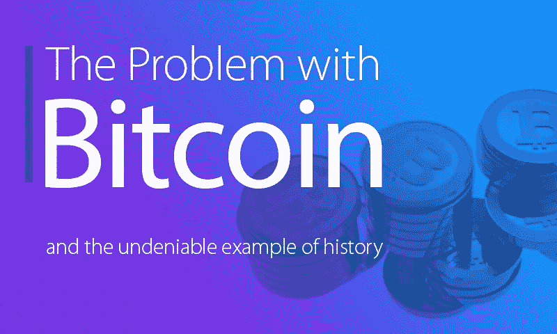

# 比特币的问题(以及不可否认的历史例子)

> 原文：<https://medium.com/hackernoon/the-problem-with-bitcoin-and-the-undeniable-example-of-history-5b18a53783f1>

**Craig Sproule，挤塑机首席执行官&创始人**

*美国圣何塞，2018 年 1 月 18 日*——似乎很久以前，我开始编写代码。那是在汇编或 C 语言成为首选的时候。从寄存器推送和弹出是常态，由于有限的内存可用性，编写超高效代码是强制性的。

对你们中的许多人来说，这听起来可能很陌生。这是完全可以理解的，因为随着时间的推移，这些类型的任务已经被抽象掉了，取而代之的是简化了编写程序的语言。例如，使用 Python 的开发人员不必担心内存管理或缓冲区溢出。

**美好的过去？**

当我戴着玫瑰色眼镜回顾那些日子时，我不得不承认，它们可能不是过去的美好时光。我记得花了两天时间跟踪一个错误，结果发现一行代码的末尾缺少一个分号。幸运的是，预处理器和编译器比以前更加用户友好了。话虽如此，它仍然远远没有达到我们作为一个行业所需要的水平。

这让我想到了比特币。Blockchain 的一个极好的实现，有如此多的希望，以至于很难理解它会在多大程度上影响我们的生活。它给可能是新互联网煽动者的东西注入了活力。承诺如此之多，却又如此难以使用。这种情况让我想起了历史上的另一个例子。

**苹果 vs 微软**

许多年前，有一个叫苹果的小公司。他们制造了一台每个人都喜欢的神奇的个人电脑。它非常容易使用，而且在当时，苹果似乎掌控了世界。紧随苹果之后的是微软的微软操作系统，然后是他们的第一个 Windows 化身。这太可怕了，我知道这是因为我曾经为他们编写代码。

问题是，为什么我没有为苹果写代码？答案很简单——苹果对所有开发者都关闭了。你不能为苹果写应用程序，因为苹果不让你写。如今，可以肯定地说，苹果在消费者中占据主导地位。然而，微软拥有企业市场，他们通过这样做赚了很多钱。

微软在这一领域占据主导地位的原因是，成千上万的开发人员开始为 DOS 和 Windows 编写应用程序，仅仅是因为他们可以。在你无法为苹果获得应用程序的地方，你当然可以为个人电脑获得一个。

这就是关键点——应用推动技术的采用。简单明了。

**比特币 vs 以太网**

所以，你可能会问自己，这和比特币有什么关系？

虽然比特币不对开发者关闭，但它让我想起了苹果，而以太坊让我想起了微软。我敢肯定，比特币的顽固分子会认为比特币更强大，它的侧重点也不同。然而，我的回答是‘我们以前都听说过’。在过去，我们已经经历过几次人们对技术变得虔诚的情况。苹果 vs PC，Windows vs Linux……不胜枚举。

我现在看到的一个最大的不同是，开发人员正涌向以太坊，因为它更容易。你可以用抽象的语言为它写一个智能合约，然而为比特币写一个智能合约是痛苦而有限的。有一些第三方计划可以解决这个问题，但实际上比需要的要困难得多——更容易犯简单的错误，而且由于它所提供的性质，它可能会导致可怕的后果。

不要忘记开发人员！

在我看来，无论是比特币还是以太坊，都还有很长的路要走。然而现在，比特币正在成为苹果，以太坊正在成为微软。如果你创建了一个允许开发者轻松参与的范例，他们就会被吸引去开发应用。正如我之前指出的，应用推动采用，如果没有应用在上面，区块链是没有用的。

你可能会惊讶地听到，就我个人而言，我更喜欢比特币。可能是因为我有点老派，喜欢纯洁。如果历史提供了一个可资借鉴的例子，那就是世界并不是这样运转的。除非比特币变得更容易编写应用程序，否则以太坊将继续获得牵引力，因为使用它的应用程序数量很多。

我并不是说比特币会消失，但在应用程序栈中占主导地位的可能不是区块链。它可能最终成为金融交易的分类账，这完全没问题。挑战在于，它也可能成为其他区块链参与者的附庸。

然而，这对其长期经济状况有什么影响，可能最好留给学者们去研究。

**关于作者**

【克雷格·斯普劳斯
*众机 CEO 兼创始人*
[www.crowdmachine.com](http://www.crowdmachine.com)
[https://t.me/crowdmachine](https://t.me/crowdmachine)

Craig Sproule 是一名资深软件工程师，目前正在开发世界上最先进的分散式云和应用执行网络。这项技术从根本上改变了应用程序的开发过程，不受区块链的限制，已经被许多财富 500 强公司采用。