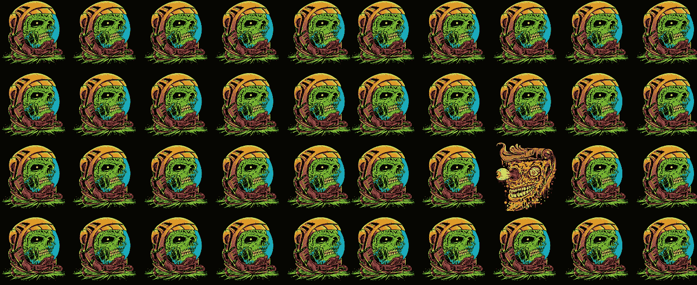

# 数字收藏品的问题是

> 原文：<https://medium.com/hackernoon/the-problem-with-digital-collectibles-e67b0c51f2e5>

## 以及如何修复…

# 什么是数字收藏品？

2018 年，我们已经进入了区块链时代。没有回头路了。政府和大公司抑制了区块链产品和加密货币的发展——这是有充分理由的。这些实体正在努力保护消费者，但一个副作用是，使用区块链或加密货币的合法公司面临一连串的合法性和审查。区块链和加密货币将改变我们的世界——这只是时间问题。但是对一些人来说，区块链这个词已经成为一个与诈骗和罪犯联系在一起的脏话。这很不幸，我的另一篇帖子描述了我在 SnapChat 上推广区块链产品的经历。

让我们把加密货币从区块链等式中剔除。我们还剩下什么？一个分散的数据库，由人民管理，不会被黑客攻击。听起来像是理查德·斯托尔曼的乌托邦。令我兴奋的一件事是使用区块链来追踪数字艺术的所有权。区块链技术使你拥有可爱的加密小猫和“F🔥咯咯作响的[洋娃娃](https://www.kickstarter.com/projects/1952645749/dolli-lit-digital-collectibles)。加密小猫和洋娃娃的区别在于，小猫是根据算法程序生成的，而每个洋娃娃是由艺术家创作并上传到区块链的数字绘画。洋娃娃制作完成后，在区块链上就会产生一个代表洋娃娃的代币。这些是我们最喜欢的纪念品！NFT(不可替代的令牌)。区块链用于确定有多少美元可用以及谁拥有它们。把它比作一个艺术家为你最喜欢的画制作版画。印刷品被印刷，洋娃娃被铸造。不同之处在于，每个代币都与原始的数字资产相关联，与印在画布上的一件实物艺术品相比，你可以用这些代币做更多的事情。

# 进入的障碍问题。

那么问题出在哪里？向科技世界之外的人谈论区块链或加密货币，他们的目光会变得呆滞。这项技术将会改变世界，但是如果没有人使用它，这是不可能的。如果你想拥有一个 Crypto Kitty 或任何其他数字收藏品，你必须下载一个浏览器插件，弄清楚如何购买加密货币，创建一个钱包，将你的密码转移到你的新钱包，最后可能购买一个收藏品。除了密码爱好者、开发者，也许还有一些非常坚定的人，这对于主流社会来说是一个太大的进入壁垒。我们需要从我们的应用程序中抽象出所有区块链/加密的东西。这正是 Dolli T1 所做的。把区块链这个词从 Dolli 的所有描述中去掉，普通用户仍然可以使用这个应用。用户不仅可以用信用卡或借记卡购买加密收藏品，还可以在手机上使用移动应用程序进行购买。

用户需要慢慢熟悉区块链技术。我们不能指望我们的用户下载插件，创建钱包，转移资金等。用户不希望这样，似乎所有我见过的加密收藏产品都希望他们这样做。我们这里有一个 UX 问题！抽象所有区块链功能，让人们用手机用信用卡支付。这正是他们所习惯的。我们需要为人们建造通往区块链的桥梁，这就是[多利](https://www.kickstarter.com/projects/1952645749/dolli-lit-digital-collectibles)所做的。

我们计划在 10 月 31 日之前完成与 [Dolli](https://www.kickstarter.com/projects/1952645749/dolli-lit-digital-collectibles) 的代码🎃。我们已经有超过 350 名用户注册了，并获得了忠实的 Instagram 粉丝。

如果你想申请你的用户名，请前往 [www.dolli.io](https://www.dolli.io) 如果你觉得慷慨，想为我们的 KickStarter 活动捐款，请前往[这里](https://www.kickstarter.com/projects/1952645749/dolli-lit-digital-collectibles)如果你想要一些涂料衬衫，请前往[商店](https://shop.dolli.io)。

💀🔥