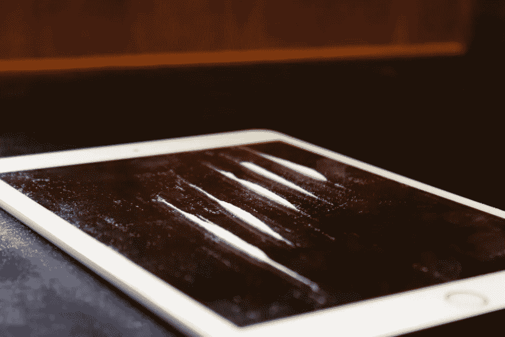
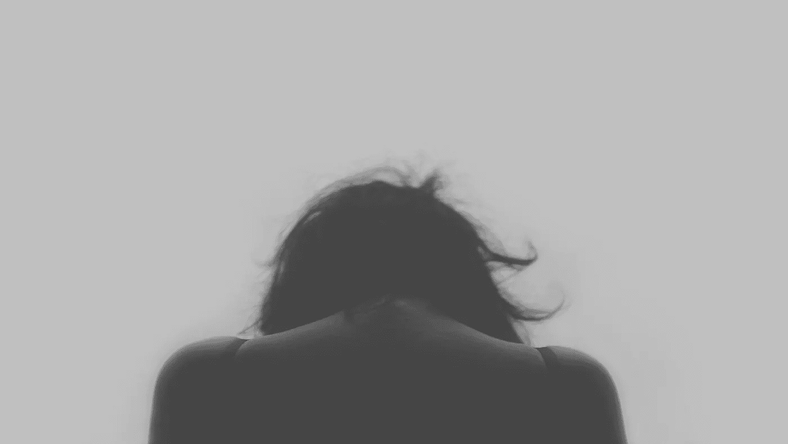
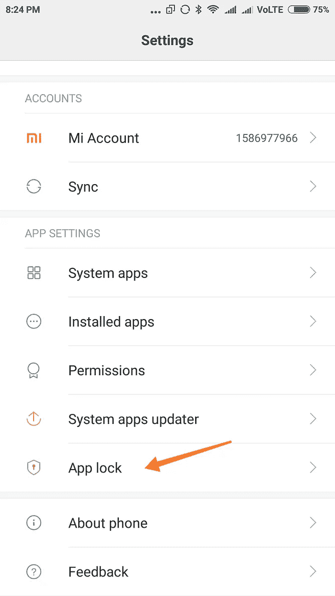
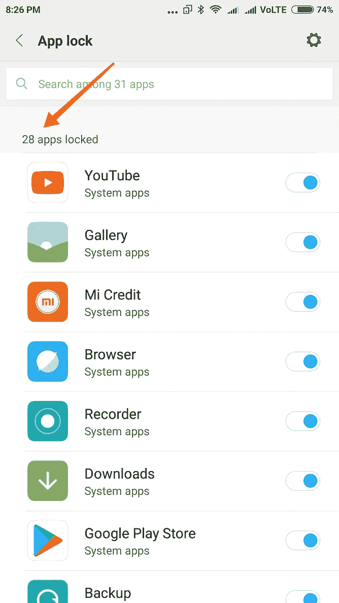
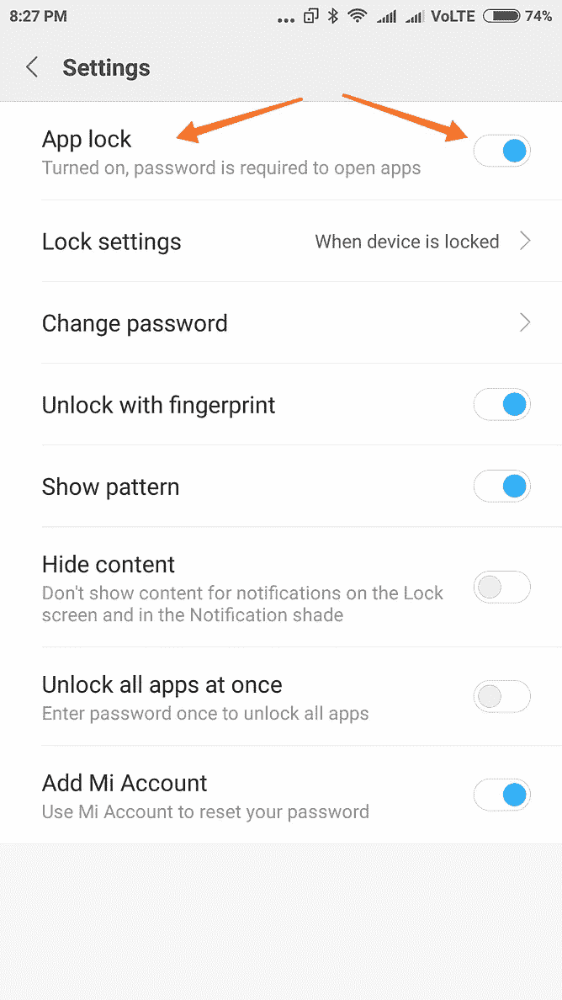
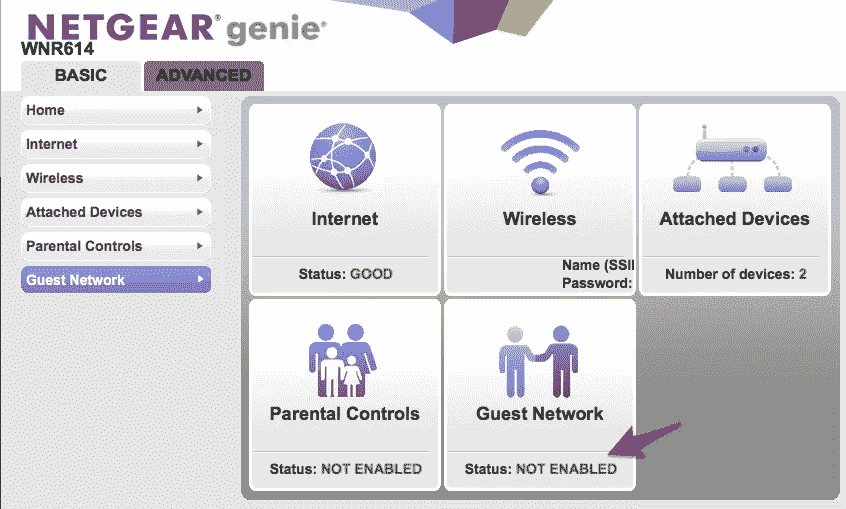
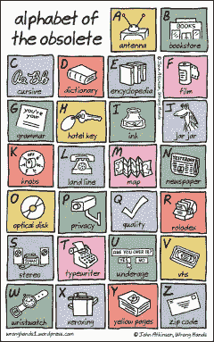
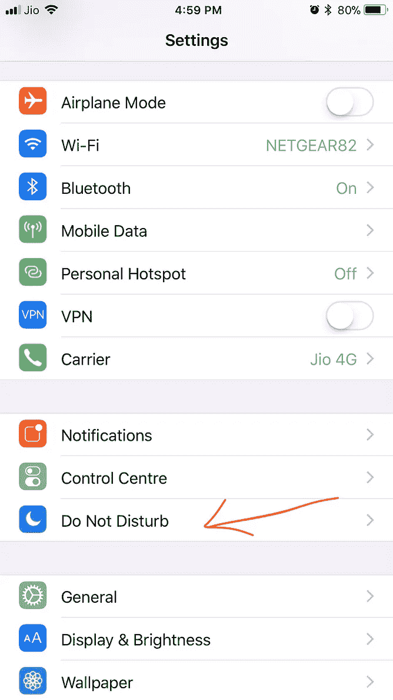
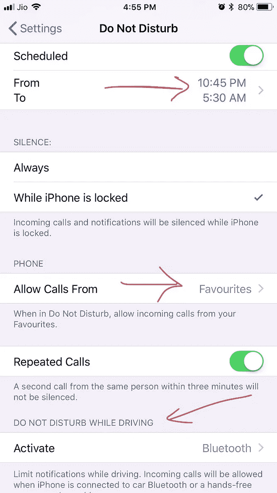
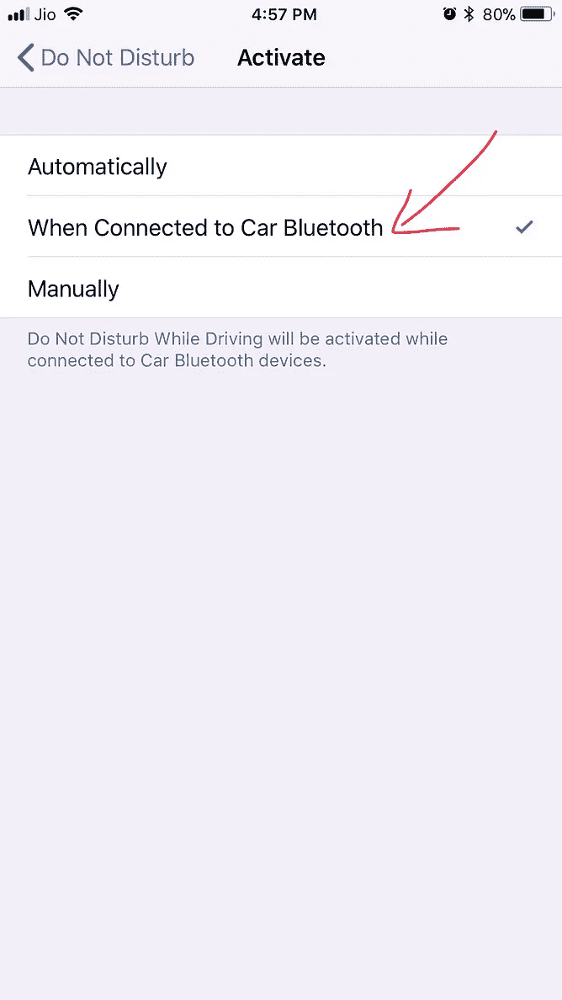

# 电话成瘾的问题是我们认为这不是问题

> 原文：<https://medium.com/hackernoon/the-problem-with-phone-addiction-is-we-think-its-not-a-problem-fb7dedd76597>

Phone addiction is real and it’s beginning to demand our attention

几天前，拥有价值 20 亿美元苹果股票(该公司价值超过 9000 亿美元)的两名主要苹果投资者[要求](http://money.cnn.com/2018/01/08/investing/apple-investor-pressure-children/index.html)苹果打击儿童手机成瘾。我相信苹果或许能做些什么，但这是众所周知的‘马到水边’的场景。

让我们假设苹果给 iphone 用户友好的限制模式，允许父母轻松控制手机的使用。除非孩子们接受过度使用手机对他们有害的观念，否则这种方法是行不通的。在这个世界上，这很难让人接受，因为他们每天 24 小时都看到成年人在使用他们的设备，并认为这与工作有关。

只有成年人承认智能手机是一种成瘾，并采取具体措施减少其使用，才能打破这种恶性循环。这并不容易，这篇文章在一定程度上反映了我首先了解手机成瘾，然后找出如何减少它对我和我的孩子的影响的斗争。

## **残废一代**

事实是，正如下面的采访所指出的，我们对手机的上瘾确实有着深远的影响，尽管是从企业的角度来看。

Sinek 的观察相当发人深省。几乎没有什么让我们分心，我们这一代中的许多人能够将他们所有的精力集中在他们所选择的领域，而不去理会其他所有的事情。我相信正是这一代人对他们领域的这种专注导致了技术创新的持续时代。具有讽刺意味的是，下一代太过于关注创新技术带来的可能性。没有同样的关注点，他们可能无法实现从优秀到卓越的飞跃。如果我是对的，未来几年创新突破将会放缓，世界将因此变得更加贫穷。

采访的另一个结论是，我们已经被我们的小玩意的魔力冲昏了头脑，并且轻易地忽略了这些小玩意对孩子的影响还没有得到足够的研究这一事实。比如它如何影响他们的注意力，它如何破坏他们学习重要社交技能的尝试，等等。让我们的孩子不受阻碍地接触电子产品就像给电话行业提供活的豚鼠来测试他们的发明一样好。

## **没有执念，没有完美**

这里有另一篇[文章](https://www.stuff.co.nz/sport/tennis/100391105/wanted-new-tennis-stars-as-sun-starts-to-set-on-big-fours-golden-era)讲述了我们的分心设备是如何影响生活的方方面面，甚至是运动。我引用了关于网球四巨头的讨论，以及为什么他们的继任者还没有出现。

> 然而，并不是每个人都相信下一代的集体潜力。一位不愿透露姓名的主要教练告诉《每日电讯报》，年轻的伪装者和他们年长的前辈有很大不同。
> 
> “这些孩子很有运动天赋，”他说，“他们可以超级用力地击球，因为他们受过良好的生物力学训练。但令人惊讶的是，他们实际上并不看网球！如果你让世界上排名前 100 位的球员坐下来，给他们一个网球测验，这些年轻人将会全部垫底。
> 
> “这与四大有很大不同。这是一种文化现象:现在的孩子有太多的干扰。这就是为什么我们会在这一代看到一些优秀的球员，而不是伟大的球员。要成为一名伟大的球员，你需要痴迷。”

## **专为瘾君子设计**

小玩意的上瘾特性可以解释为什么史蒂夫·乔布斯禁止他的孩子拥有他向世界介绍的迷人设备。在创造了它之后，乔布斯足够聪明地意识到了它的危险性，并确保他的孩子不会染指它。因此，这两位苹果投资者坚持认为苹果有道德责任防止所有孩子对智能手机上瘾，这可能有一定道理。

Steve Jobs and his gadget-free family

我必须补充一点，虽然苹果开始了智能手机革命，但他们可能并没有有意让我们沉迷于手机。然而，对于一些追随苹果脚步的企业巨头来说，情况并非如此。

## 利用人类的弱点

Napster 的创始人、脸书前总统肖恩·帕克在这篇强有力的[自白中解释了脸书是如何故意侵入人类大脑，让用户迷上这个平台的。](https://www.axios.com/sean-parker-facebook-was-designed-to-exploit-human-vulnerability-1513306782-6d18fa32-5438-4e60-af71-13d126b58e41.html)他是这样说的:

To be vulnerable is human, to take advantage is Facebook

> “当脸书开始的时候，有些人会走过来对我说，‘我不在社交媒体上。’我会说，‘好吧。你知道，你会的。然后他们会说，‘不，不，不。我重视现实生活中的互动。我珍惜这一刻。我重视存在。我重视亲密关系。我会说，…我们最终会抓到你的。”“我不知道我是否真正理解了我所说的后果，因为当一个网络发展到 10 亿或 20 亿人时，它会产生意想不到的后果……它确实会改变你与社会的关系，以及彼此之间的关系……它可能会以奇怪的方式干扰生产力。只有上帝知道它对我们孩子的大脑有什么影响。”“构建这些应用程序的思维过程，脸书是第一个，……都是关于:‘我们如何尽可能多地消耗你的时间和有意识的注意力？’”“这意味着我们需要偶尔给你一点多巴胺，因为有人喜欢或评论了一张照片或一个帖子或其他东西。这将让你贡献更多的内容，这将让你…更多的喜欢和评论。”“这是一个社会验证反馈循环……正是像我这样的黑客会想出的那种东西，因为你在利用人类心理的一个弱点。”“发明家、创造者——是我，是马克(扎克伯格)，是 Instagram 上的凯文·斯特罗姆，所有这些人——都有意识地理解这一点。但我们还是做了。"

说得委婉一点，那很令人不安。限制小工具的使用不再有争议。真正的问题是我们如何去做。

## 手机不会让人上瘾；用户有

我越想越觉得，把手机上瘾归咎于苹果就像把赌博上瘾归咎于‘扑克牌’的制造商一样。“52 副牌”本身是无害的。问题在于你如何使用这些卡片。不像香烟在你点燃的那一刻是有害的，我享受了几个小时与朋友和家人玩纸牌游戏，或者玩有时基于数学的“纸牌魔术”的无害乐趣。我必须补充的是智能手机的到来杀死了扑克牌。它们比不上我们手机里的多巴胺。

从这个意义上说，手机成瘾并不像毒品成瘾那样非黑即白。这些灰色阴影使问题变得复杂。

## 未知的领域

那么多少电话才算太多电话呢？我们如何界定多少信息是可以的？我们什么时候才能对没完没了地浏览 Facebooks 和 Instagrams 说“够了”?当被困在一群陌生人中间时，我们如何抑制住逃进手机屏幕的冲动？

此外，当我们自己都不愿意的时候，我们如何让我们的孩子把设备收起来呢？当我们对互联网和智能家居的依赖使得“无互联网时间”政策不再可行时，我们如何按下“暂停”按钮？

当几乎没有具体的证据反对一项技术时，社会怎么能反对它呢？

当世界上大多数人都在拥抱一项技术时，我们怎么能放弃它呢？

上述任何一个问题都没有普遍接受的答案。这就是为什么手机成瘾正在失去控制。

当我们的孩子要求我们证明使用手机对他们有害时，我们该怎么说？我们如何证明不可证明的事情？

## 身体危险

一个相关的问题是手机对我们身体的影响。手机辐射有多危险，把手机放在我们的口袋里或与我们的身体密切接触有多安全？这本身就是一个很大的问题，我在之前的一篇文章中已经试图解决这个问题。

## 回去继续前进

当面对这样的问题时，我们倾向于寻找过去的指导，看看是否有相似之处。如果我们拿吸烟来说，只有当社会采取反对的立场时，反对吸烟的斗争才开始取得成功。只有当反对吸烟的证据积累到无法再为其辩护的程度时，他们才能这样做。

举个与吸烟类似的例子，我们的电子产品使用目前停留在如下所示的吸烟时代。那时，吸烟不仅被认为是可以接受的，而且医生还建议吸烟对你的喉咙有好处。

Stanford Research into the impact of tobacco advertising

吸烟花了几十年才从喉咙痛的药物变成人类的杀手。我们不能等待历史重演。但是我不认为在不久的将来社会会反对手机。

所以我想每个人都是为了自己。

## 几乎每个人都上瘾了，包括我

我自己是一个重度手机用户，每天都看到新的用途，导致互联网和手机更加无缝地交织到我的生活中。

我通常以晨练开始我的一天，包括网球或跑步，可能还会顺便去当地超市。这加起来有一两个小时。我的手机一直在口袋里。但是我只在跑步的时候使用它，记录跑步和播放音乐，然后查看我的购物清单。

晨间过后，除了在开车的时候说“嘿 Siri…请放音乐”之外，我真的不怎么用手机了。开车时的电话会自动转到我汽车的系统。不知道这有多好。我听说汽车的封闭金属笼往往会反弹并放大车上乘客的蓝牙辐射，没有人知道这种情况的长期影响。

我在电脑上工作，所以从这个意义上说，我从来没有离线过。我的电脑通常代替我的电话。比如我用 WhatsApp(在我的电脑上),因为它是印度的即时通讯应用。但我在社交媒体上并不怎么活跃，而且已经屏蔽了我所在的几个 WhatsApp 群组。我确实有一个脸书账户，但是我已经两年多没有在里面发帖了，并且尽量避免访问这个网站。

我必须承认我是一个新闻迷，但我尽量把它限制在早上和晚上的固定时间。离开电脑阅读通常在我的 iPad 上进行，因为较大的屏幕对我的眼睛来说压力较小。

我尽可能避免使用电话功能。大部分是来电，如果一个电话显示出很长的迹象，我通常会插上耳机，以减少手机与我身体的距离。否则，随着谈话的进行，我真的能感觉到耳朵在发热。

我的问题是当我离开公司的时候。

假设我正在做一次火车旅行。我没有向陌生人伸出手，而是走捷径，伸手去拿我的拐杖。我可能只是浏览新闻，但我错过了现实生活。可悲的是，我只是在做火车上几乎所有人都在做的事情。偶尔，我会遇到一些没有电子产品的老人，他们会搭讪。但这是一个垂死的趋势。

总的来说，我可能不怎么用手机，但如果你算上 Mac 和 iPad，我在减少设备使用方面不是很成功，不是吗？

至于我的家庭，我的妻子是个工作狂，经常几天都懒得去查看她的信息。无论如何，她对一部手机的辐射有很深的不信任感，通常会保持一定距离。不用担心她会对电话上瘾。

我十几岁的孩子正相反。像她这个年龄的大多数孩子一样，她可以花几个小时发信息和发微博。我曾试图限制学生时代玩电子产品的时间，但这是一场永无止境的战斗，而且多半会失败。我也尝试过让孩子设定自己的极限。但是就像 Sinek 说的，自控不起作用。如果允许的话，她可以一天到晚不停地玩她的小玩意。这里肯定没有快速的解决方案！

## 减少手机成瘾的一些方法

启用家长限制功能苹果肯定能让家长更容易对手机进行限制。例如，我告诉我的孩子，她需要在考试时把手机放在一边，以免被它分散注意力。她回来说她需要打电话给一个同学，询问一些和她学习有关的事情。问题是，一旦她拿到手机，她可能会忍不住想要查看她的 WhatsApp 或 Instagram 应用程序。

我需要做的是限制她只能访问手机上的一个应用程序(拨号器)。下面的视频展示了如何在 iPhone 上做到这一点，包括禁用拨号器应用程序上除数字键盘之外的所有其他按钮。

Video showing how to restrict an iPhone to just one app with just a triple click

问题是这个过程对于技术上有挑战的父母来说并不容易。我能做到，但我怀疑我妻子能否做到。苹果应该能够很容易地自动化这个过程，也许可以在“应用锁定”标签下提供。事实上，这正是小米在其 Android fork 中所做的，正如我在之前一篇关于电话黑客的文章中所详述的。大多数机器人都有类似的版本。(苹果也允许你限制应用程序，但这毫无意义，因为大多数应用程序和功能即使在启用该功能后也能工作。)

Android makes it easy to lock down all apps on a phone

**使用访客网络限制互联网**我不能在家里关闭互联网来限制访问，因为我的工作需要我在线。这就是我的 Netgear 路由器派上用场的地方。它允许我创建可以关闭的访客网络。我可以通过我手机上的 Netgear 应用程序，或者通过从我的 Mac 访问路由器来完成这项工作，如下所示。我孩子的手机没有数据包，所以理论上，一旦我关闭访客网络，她就会离线。如果她坚持要上网学习，我会给她一部备用手机，我会把它锁定在浏览器上。

小米(我的 Android 的制造商)，[在印度提供了一款与 Netgear 路由器功能相似的路由器](http://www.mi.com/in/mi-router-3c/)，仅在₹999 出售(16 美元)。我没有用过，所以我不知道它有多好，但评论是积极的。如果小米能做到这一点，我认为苹果也应该为他们的客户做同样的事情。他们绝对有能力提供补贴路由器，更好地控制互联网使用，以帮助减少手机成瘾。

Guest networks can keep kids off the net without turning off the main home network

小工具替代品:寻找一些东西来替代设备显然是减少使用的最好方法。我减少孩子玩小玩意时间的尝试可能会失败，但有一点是好的，她又回到了书本上。在我看来，读一本真正的书总比在设备上无休止地滚动要好。

Credit: [wronghands](https://wronghands1.com/2013/12/06/alphabet-of-the-obsolete/)

在另一个层面上，我们的手机是一种多功能设备，它使许多设备变得过时。也许我们应该让一些恐龙转世。好像我又开始戴手表了。算是吧。这是一块不太智能的智能手表——它能显示时间，还能计算我的步数。我还更新了我的报纸订阅，这在₹120/month 没什么大不了的(2 美元)。我确实得到一个闹钟，但是它不工作。好吧，虽然不多，但这是个开始。

父母的自我否定这是一个可行的选择，但可能不太实际。当我的孩子处于反思情绪时，她承认孩子们这些天有太多分散注意力的事情，强行拿走他们的小玩意可能对他们的灵魂有好处。她提到一个同学家里没有手机，甚至没有电视。这个孩子非常专注于她的主要目标，那就是成为一名职业高尔夫球手。她在印度的高尔夫锦标赛中表现出色，已经获得了国际排名。此外，虽然她很少上学，但她在学校的学习成绩名列前五。

这让我想知道，我们这一代人是否因为给我们的孩子太多小玩意而感到内疚。一些父母很明智，没有这样做，也很幸运，他们的孩子接受了这种逻辑。高尔夫球员孩子的父母就是一个很好的例子。除了家里没有电视，她爸只带了个基本的电话，只能打电话发信息的那种。这位母亲陪同孩子巡回演出，并在孩子需要访问学校的 Whatsapp 群组时，将她的智能手机借给孩子。身为飞行员的父亲一有机会就和他们一起旅行。自我否定是游戏的名字。但话说回来，如果父亲是在网上工作，而不是当飞行员，这个故事可能会有一个不同的结局。那么他们用什么来代替小玩意呢？全家人都喜欢读书。

**请勿打扰**值得称赞的是，苹果公司已经认真尝试通过这一功能来减少 iPhone 的使用。“请勿打扰”是一个有效的工具，可以停止手机上的通知和呼叫。您可以设置就寝时间，并免除“收藏夹”的来电。

从安全的角度来看,“驾驶时请勿打扰”选项可以防止在驾驶时使用手机。一旦汽车点火，手机就会自动锁定屏幕。手机知道我在车里，因为它被设置为自动识别和连接到汽车的蓝牙。苹果需要做更多这样的事情。

**语音助手**这是一个登月计划。很多时候，我在网上搜索了一些东西后，就在我的设备上结束了。我有一个理论，语音助手(没有屏幕)可以通过给我快速回答来堵塞这个漏洞，这样我就可以避免去找我的设备。如果你不使用这个设备，你就不会上瘾。

当然，语音助手也是一种设备，但我有一种感觉，只要它没有屏幕，就不会让人上瘾。就像我说的，这只是一个理论，但我已经有了一个基本的语音助手，亚马逊回声。习惯 Alexa 有点像学习曲线，我还没有掌握。如果我发现它符合我的期望，我会更新这个部分。

## 小变化

你可以做很多小事来阻止自己使用手机。比如避免邮件的推送通知，这样你就不用经常查看收件箱了。让手机远离餐桌和卧室。从脸书和 Twitter 等社交应用中注销，这样他们就无法向你发送通知。(你在一个时间段内登录并完成所有社交活动，然后再次退出。)

但这一切都假设你明白什么是手机成瘾，不会做艾米怀恩豪斯，“他们试图让我去康复中心…我说，不，不，不。”

我们都知道这给了她什么，尽管她才华横溢。