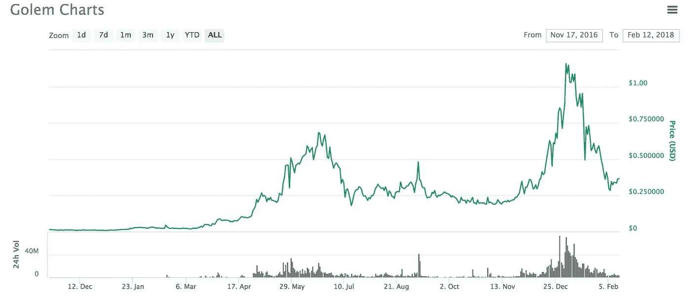

# 私人 ico 和风险资本主义的问题

> 原文：<https://medium.com/hackernoon/the-problem-with-private-icos-and-venture-capitalism-23d4c16f35ac>

Photo by [Mark Finn](https://unsplash.com/photos/SgraLCyISWs?utm_source=unsplash&utm_medium=referral&utm_content=creditCopyText) on [Unsplash](https://unsplash.com/search/photos/stock?utm_source=unsplash&utm_medium=referral&utm_content=creditCopyText)

区块链技术最具革命性的方面之一是它能够将资金公平分配给个人。换句话说，获得金融或货币不仅仅局限于那些有权力、地位或财富的人。实现这一目标的方式最初是通过一个叫做“采矿”的过程当区块链技术首次通过比特币引入时，人们挖掘它其实相当容易。他们只是需要一个 CPU 来开始采矿，以赚取区块奖励。

以太坊进一步将这种金融可及性的原则扩展到一种被称为初始硬币发行(ICO)的东西，这是一种类似于风险资本主义的概念。更具体地说，ico 是一种众筹方法，用于为基于以太坊的协议和公司提供资金，以资助他们的项目。如果这听起来耳熟，那应该是因为它相当于区块链的首次公开募股(IPO)概念。然而，以太网所有者不是购买股票，而是将他们的以太网发送到 ERC20 合同地址，以接收最常用于访问所述项目的令牌。

从历史上看，投资创业公司的领域是为风险投资家保留的。即拥有巨额财富的个人或公司。这是因为投资新公司风险极高，因此只有那些在初创企业失败时有能力承担的人才会投资。作为对风险资本家财务支持的回报，他们通常会获得公司的股份(或股权)以及资金使用的控制权。

另一方面，ICOs 通过允许任何拥有 ETH 的人参与创业，彻底扰乱了这个市场。在这个时代的开始，没有最低或最高限额，也没有所谓的私人预售。每个人都有和风险资本家一样的承担风险/回报的机会。对一些人来说，冒这个险是值得的。

例如，假人(GNT)是一台全球超级计算机，迄今为止主要用于创建高端计算机图形。也是以太坊生态圈中较早做一个 ICO 的项目之一。以下是他们自 2016 年 11 月以来的增长趋势。

正如你所看到的，GNT 的价值在 2017 年 12 月飙升至每枚硬币近 2 美元的历史高点。这种回报率是风险投资界之外的人永远无法获得的。这意味着无论你投资 0.01 ETH 还是 100 ETH，每个人投资的回报率都是一样的。

> 顺便说一下，ico 是有风险的。许多人在代币销售之前没有可行的项目，而且很可能在之后的一段时间内也不会有。如果您参与，请理解您所承担的风险。没有保证回报这回事。任何向你保证的项目都是骗局。他们也是 SEC 关闭的主要目标。

然而，一个正在发展的趋势是 ICOs 内部所谓的私人“预售”。这些公司不是通过众筹融资来开发产品，而是私下向合格投资者出售代币。

ICO 通过预售筹集资金的一个例子是[Ripio](https://www.coindesk.com/ripio-credit-network-37-million/)(3700 万美元中的 31 美元)。另一个例子是 [Swarm](https://www.coindesk.com/swarm-closes-5-5-million-ico-alternative-investment-fund/) ，它在 2017 年 11 月下旬通过预售筹集了几乎所有的 550 万美元资金。

现在，进行 ICO 的私人预售有许多优势:

*   你可以获得大量的资金来制定预算。
*   你放弃了 0 股权。
*   你不必处理投资者的反馈。
*   你不必为主持一个 ICO 而头疼。

然而，这种资金充足的私人预售完全削弱了之前通过区块链技术提供的分布式和公平的财务分配和可访问性。ICOs 的这种新方法实质上切断了以太坊社区的“公共和开放的生态系统”，限制了那些拥有特殊特权的人的访问。

然而，一家新的风险资本投资公司并没有默默默许，而是希望渗透到这种日益增长的私人预售趋势中，同时再次让人们获得金融服务。

# 等价令牌

该项目旨在通过区块链技术为非行业专业人士提供与风险资本家相同的机会。通过引入一个由在各自行业取得成功的个人组成的团队，EQUI 团队将评估许多投资机会，为 EQUI 持有人提供精心挑选的投资组合。通过这种方式，EQUI 社区将能够从与合格投资者相同的奖金(有时高达 40%)中获利。

此外，EQUI 还试图通过两种主要方式为其用户提供投资回报:

1.  在 EQUI 平台上持有他们的代币，从而从 EQUI 平台的已实现投资组合中获得 5%的利润。
2.  或者，选择在 EQUI 平台上主动投资某个项目的人，将获得成功项目已实现利润的 70%。投资者也受到激励来支持一个项目，因为他们通过所谓的“EQUICredit 奖励令牌”获得所投资 EQUI 令牌的 5%的奖励

通过利用他们的风险投资者地位和提供一个友好的用户界面，EQUI 希望帮助把风险投资带给人们。尽管在 ICOs 领域已经有[关于私人预售的改革](https://www.coindesk.com/ico-presales-boost-vc-3iq-multicoin/)的呼声，但不幸的是，这种持续的趋势似乎不会很快停止。如果私人预售主宰了 ico 的世界，EQUI 很可能是一个合理的防范排斥的对冲。

**这已提交给 EQUI bounty 计划*