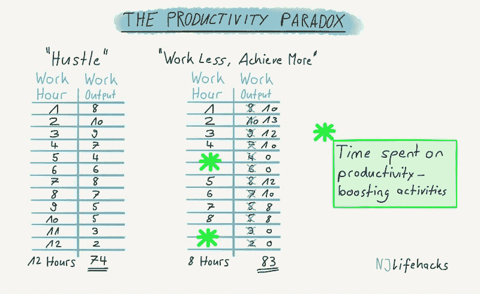
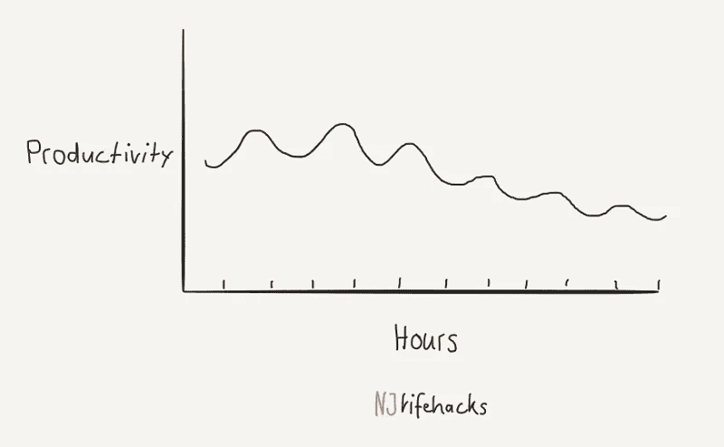
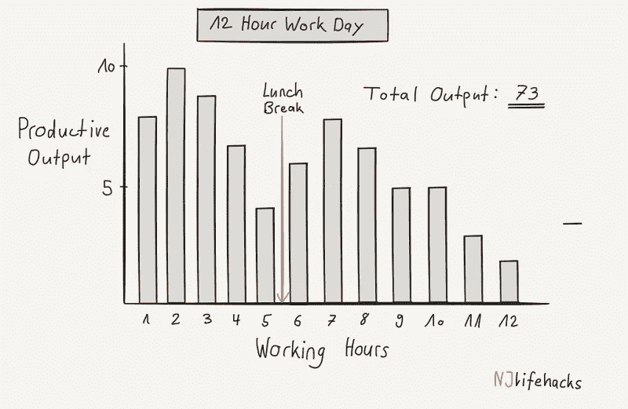
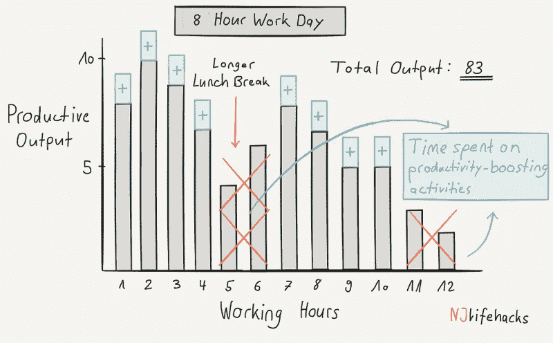

# 生产率悖论:工作越少越有效率

> 原文：<https://medium.com/hackernoon/the-productivity-paradox-how-working-less-will-make-you-more-productive-b7c6d3df442c>

我们都想完成大量有意义的工作。这是自然的。没有人去工作时说，*“今天，我一点也不想取得任何进展。我想尽可能少地完成工作。我会努力工作，但我会努力一事无成。”*

好吧，也许有一些真正愚蠢的人是这样的。然而，我们大多数人都意识到完成工作和取得成就的感觉很好，有助于我们过上更愉快、更成功的生活。永无止境的挑战是:

*我们如何*完成*更多*有意义的工作？

大多数人只是投入更多的时间。他们不再工作 8 小时，而是工作 10 小时、12 小时或 14 小时。有用吗？算是吧。但是有一个更好的，不那么痛苦的方法。一种是你工作*少*，但完成*多*。让我解释一下…

# 为什么仅仅投入更多的时间是错误的方法

如果人类是机器，那么投入更多的时间会工作得非常好。一台机器无论工作 5 小时还是 15 小时，每小时产出都是一样的。

然而，人类不是机器。无论我们在任何一天工作 5 小时还是 15 小时，都有很大的不同。为什么？因为我们没有无尽的精力、意志力、专注力、注意力和其他我们需要用来工作的东西。

与机器不同，我们经历所谓的收益递减。我们工作的时间越长，通常每个连续小时的效率就越低。

一天中的第一个小时——精力、意志力、注意力和专注力都很高的时候——通常是我们效率最高的时候。一天中的最后几个小时——精力、意志力、注意力和专注力都很低的时候——通常是效率最低的时候。

关键是:在任何一天连续工作一个小时，效率都会降低一点。工作时间越来越长，回报越来越少。我们每天工作的时间越长，平均每小时的效率就越低。

Average productive output per hour diminishes as we work more and more hours while running out of energy, concentration, willpower, etc.

在达到某个阈值后，投入越来越多的时间会变得无效——一旦你的精力、意志力、注意力和专注度太低，你就不再有效率了。

现在，你可能会插嘴说，“那又怎么样？即使我在一天的第 12 个小时里只完成了一点点工作，也比什么工作都没完成要好！”

嗯，也不尽然。你看，每一小时的工作都意味着你在为其他活动牺牲时间。足够愚蠢的是，这也是有趣的地方，我们大多数人为了投入更多的工作时间而牺牲了提高生产力的活动，比如睡眠、午睡、冥想和锻炼。

让我重复一遍:我们大多数人为了工作更长时间而牺牲了提高生产力的活动。(当我写关于提高生产力的活动时，我只是指那些被科学证明能够[提高我们生产力的活动](http://www.njlifehacks.com/productivity-tips-backed-by-science/)。他们增加了我们每小时的工作产量。例如，这些活动帮助我们每小时生产 12 个单位，而不是每小时生产 10 个单位。)

如果我们不工作更长时间(同时遭受收益递减)，而是把时间用于提高生产率的活动，会怎么样？

通过这样做，我们可以把一些效率最低的时间换成可以提高每小时效率的活动。我们将[工作更少的时间，但生活更丰富](https://vandrew.com/live-richer/)，并大幅增加我们每小时的平均工作产出。

这里有一个假设的例子，展示了如何做得更少，但做得更多:

在**的“忙碌”工作时间表**中，一个人每天工作 12 个小时，每小时的工作产出在 2 到 10 之间(在一天的开始，他的工作效率更高——前三个小时的工作产出为 8、10 和 9，但在一天结束时，他的工作效率越来越低——最后三个小时的工作产出为 5、3 和 2)。他在 12 小时工作日内的总工作产出是 74 个单位。

在**的“工作更少，成就更多”工作时间表**中，一个人每天只工作 8 小时，其余 4 小时用于提高生产力的活动，如午睡、锻炼或冥想。这些活动帮助他实现了更高的每小时工作产出，范围在 8 到 13 之间(他在一天的开始也更有效率——在一天的前三个小时工作产出为 10、13 和 12——在一天的最后几个小时工作产出较低——在最后三个小时工作产出为 10、8 和 8)。他八小时工作日的总工作产出是 83 个单位。

现在你知道了。通过将一些效率最低的时间用于提高效率的活动，这个人能够工作得更少，但完成更多的工作。他将自己的工作产出从“忙碌”工作时间表中的 74 个单位提高到了“工作更少，成就更多”工作时间表中的 83 个单位。

看看下面的插图。如果我的解释不够充分，他们希望能把事情弄清楚。只要花足够长的时间看这些图片，你就会明白我想要表达的意思…

This beautiful illustration portrays how the guy from our example got more done by working less. He simply switched out four of his least productive hours for productivity-boosting activities (e.g. exercise, meditation, or napping). This way he managed to increase the work output of his remaining eight hours of work. His average work output per hour increased dramatically, so that he managed to get more done in eight hours than in the previous twelve hours.

The “hustle” schedule. Working twelve hours, but with a relatively low average work output per hour because willpower, energy, concentration, and other resources are running out.

The “work less, achieve more” work schedule. Switching out four of the least productive hours for productivity-boosting activities that replenish willpower, energy, concentration etc. Average work output is drastically higher, which leads to an increased total work output.

一句话:我认为我们最好增加每小时的平均工作产出，而不是仅仅投入越来越多的时间。

我明白了。你可能会持怀疑态度，*“真的有活动对我的小时生产率有这么大的影响吗？所以利用这段时间工作是值得的吗？*

你打赌有。让我来说服你。**这里有 5 种提高工作效率的方法，而不是增加工作时间:**

# 1.少工作，多睡觉

我们许多人为了工作牺牲了睡眠。

虽然这可能*看起来*很有效，但科学却不这么认为。研究表明，睡眠不足会让你效率低下、不开心、暴躁、喜怒无常、记忆力差。慢性失眠甚至会严重到让你的大脑萎缩。

在睡眠不足的状态下完成工作要比睡眠充足的情况下多花大约 2-3 倍的时间。为了工作牺牲睡眠是不合理的。

一项有趣的研究发现，被要求每晚睡 10 个小时的男子篮球运动员的表现显著提高:三分球和罚球命中率平均提高了 9%。

充足的睡眠会让你成为一个更有效率、更友好、更快乐的人。见鬼，它甚至会帮你翘一两节课。

# 2.少工作，多思考

冥想是训练你思维的第一号工具。

科学证明，它可以提高你的注意力、集中力和注意力。此外，它增加了你的创造潜力、你的记忆力、你跳出框框思考的能力，甚至你一心多用的能力(尽管这并不意味着一心多用是个好主意！).

冥想被证明确实能增加你大脑的容量。例如，与专注和注意力相关的大脑区域以及与自我控制、积极情绪和情绪调节相关的区域都随着冥想而变大。

减少一些非生产性的工作时间，用它来冥想肯定会[提高你的生产力](http://www.njlifehacks.com/measure-to-improve-productivity/)。

如果你不知道如何开始，这里是我的建议:

1.  下载[顶空 app](https://www.headspace.com/)
2.  用它来冥想明天早上的第一件事
3.  从那以后，每天早上第一件事就是用它来冥想

遵循这些步骤，你将会养成每天冥想的习惯。

# 3.少工作，多休息

在理想世界中，所有人，包括你，都会打盹莎拉·梅德尼克，领先的午睡研究者

想知道列奥纳多·达芬奇、阿尔伯特·爱因斯坦、托马斯·爱迪生、约翰·肯尼迪、埃莉诺·罗斯福、拿破仑、约翰·d·洛克菲勒、温斯顿·丘吉尔和当今许多精英表演者的秘密吗？

他们都把午睡作为一种提高效率的工具——而且理由很充分…

[研究](http://abcnews.go.com/GMA/OnCall/story?id=2831235)显示，午睡可以提高 34%的表现和 54%的整体警觉性。它还能改善主观睡意、表现水平、自信心和你的多任务处理能力。

一项特别有趣的研究发现，60 到 90 分钟的小睡和八小时的睡眠一样能完全改善记忆测试结果。).

午睡是恢复你的意志力、注意力、精力和注意力水平的好方法，这些水平在一天的工作中都会下降。这就像在马拉松中途注射一些咖啡因。

# 4.少工作，多锻炼

“锻炼是优化大脑功能的最有力的工具……锻炼对认知能力和心理健康有着深远的影响。” *—约翰·雷蒂*

为了多工作而牺牲锻炼是你能做的最愚蠢的事情之一。为什么？因为运动就像你大脑的超级燃料。让我们看看一些由 T2 研究支持的好处:

它极大地提高了学习成绩，增强了创造力，改善了规划、注意力、注意力、记忆力和组织能力等领域的认知功能。它还[保护你的大脑免于衰老](https://www.thebestbrainpossible.com/how-exercise-helps-your-brain/)，增加你大脑中多巴胺受体的数量[，刺激新神经元的生长](http://www.richardsonthebrain.com/growth-factors/)，字面上[增加你大脑的大小](http://fasttwitchgrandma.com/exercise-induced-increases-brain-size/)。

如果你一整天都锻炼和移动身体，你的大脑会工作得更好。我不需要告诉你，一个功能更好的大脑对你的生产力有好处。

# 5.少工作，多休息

*“谁需要该死的午休时间？！那段时间最好用来工作。你可以在办公桌上吃点东西，同时完成一些工作。那是一举两得！他妈的是啊！”*

(真的吗？放松…)

不过说真的，工作期间不休息不会帮助你完成更多的工作。相反，研究表明，休息对你的工作效率大有裨益。

例如，发表在《认知》杂志上的一项研究表明，当大脑每 20 分钟思考一次其他事情时，人们可以更长时间地保持注意力或警觉。

神经科学家马克·沃尔德曼支持每 20 分钟超级短暂休息的想法:“我们的研究发现，每小时休息 2-3 次，有意识地放松、伸展、冥想或做一些令人愉快的事情，即使只有 10 秒钟，也会减轻压力，增强你的意识，显著提高你的注意力和工作效率。”

此外，15-30 分钟的长时间休息被证明对你的表现有益。研究员 K. Anders Ericsson 研究精英演员，包括音乐家、运动员、演员和棋手。他发现，这些领域中表现最好的人通常会不间断地练习，持续大约 90 分钟，然后休息 15 分钟。

时间追踪应用 [Desktime](http://desktime.com/) 的其他研究发现，效率最高的人工作 52 分钟，然后休息 17 分钟。

与其连续工作 4 个小时，我们还不如只工作 3 个小时，然后用另外一个小时进行[战略休息](https://simpleprogrammer.com/2016/04/06/taking-breaks-will-boost-productivity/)。(可以用来午睡、锻炼、冥想等的休息时间。)

# 我们可以继续…

除了加班之外，还有很多其他的活动可以让你更有效率。

尤其是[计划你的一天](http://www.njlifehacks.com/plan-your-day/)浮现在脑海里。生产力专家卡尔·纽波特是详细计划的忠实粉丝，并为此投入了大量的时间(这些时间可以用来工作！)正如他在自己的博客中解释的那样:

*“有时候有人问我为什么要费心做这么详细的计划。我的答案很简单:它产生了巨大的生产力。我估计，一周 40 个小时的工作时间和一周 60 多个小时的无结构工作时间产生的产出是一样的。*

你可以做的其他事情是[在大自然中度过时光](http://www.njlifehacks.com/nature-productivity/)，度假，进行酷酷的旅行，做瑜伽，或者只是做一些有趣的、能产生积极情绪的事情。这些都是被证明能让你更有效率的活动。

# 好吧，让我们回顾一下

事实:我们大多数人对目前的生产力水平并不完全满意。我们希望在更短的时间内完成越来越多有意义的工作。

今天，我们看了实现这一目标的两种方法:

错误的方法:投入越来越多的时间。为什么这个不行？因为[你不是机器](http://www.njlifehacks.com/power-full-engagement-book-summary/)。你没有[无尽的意志力](http://www.skilledatlife.com/how-willpower-works-and-how-to-get-it/)，精力，动力，或者专注。当你用完这些的时候，你的每小时生产率将会急剧下降——你的时间和努力得到的回报越来越少(你的机会成本越来越高)。

正确的方法:把你效率最低的工作时间换成提高效率的活动，比如睡觉、午睡、锻炼、冥想或战略性休息。这些活动被证明可以增加你每小时的平均工作产出。因为你每小时的平均生产率更高，你需要更少的工作。

# 又及:想要更多吗？

想要额外的策略来提高效率吗？然后点击下面的链接下载我的一些顶级生产力秘诀:

[我的 7 大生产力秘诀让我做得更多](http://www.njlifehacks.com/lp/our-top-7-productivity-hacks/)(免费 PDF)

*原载于*[*www.njlifehacks.com*](http://www.njlifehacks.com/work-less-be-more-productive/)*。*