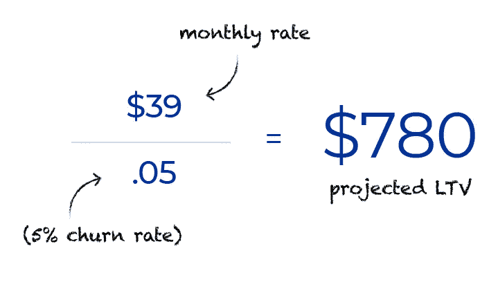

# 你可能没有追踪到的利润漏洞——以及如何解决

> 原文：<https://medium.com/hackernoon/the-profit-leak-you-might-not-be-tracking-and-how-to-fix-it-21a8d3fbc800>

Photo by [Michael Jasmund](https://unsplash.com/photos/t-WxNy6CMyU?utm_source=unsplash&utm_medium=referral&utm_content=creditCopyText) on [Unsplash](https://unsplash.com/search/photos/exit?utm_source=unsplash&utm_medium=referral&utm_content=creditCopyText)

当你经营订阅业务时，客户流失只是游戏的一部分。当然，你希望它尽可能低，你可能会努力逐月减少你的流失率……但是你对你的*非自愿*流失率有多少关注呢？

虽然你永远不可能完全消除流失——不管是不是有意的——但你*可以*尽可能减少流失。

## 特别是，当以前快乐的顾客由于诸如信用卡过期或拒绝交易等情况而流失时，非自愿流失通常是可以预防的。

这不仅是可以预防的……它可能会让你付出比你意识到的更多的钱。

平均而言，大多数发行的借记卡和信用卡在三年后到期，一些美国发卡机构甚至缩短了周期，以响应 EMV 新的“芯片”&pin "指令。**这意味着，至少有 1/36 的流通卡(或 2.8%)每月到期。**这并没有考虑到由于盗窃或其他情况而被取消的卡，但我们将使用它作为基线来讨论非自愿流失的成本。

# 以下是一个非自愿流失会对订阅业务产生多大影响的例子:

*   假设您从 1，000 名订户开始，并且没有努力赢得新订户*或*在他们的卡到期时联系客户(不太可能，但我们将运行它，因此为了这个示例，我们有一个整数)。
*   仅在一年内，与前一年(或 336 个用户)相比，你将损失 34%的收入。
*   在你的第二个 your 中，你将会有 336 个新用户，收入会比上一年下降 50%。
*   到第三年年底，你将失去几乎所有的收入和用户——全面下降的信用卡交易和非自愿流失。

在现实世界中，你的销售和营销引擎增加新用户的速度比你失去他们的速度要快得多。但不管怎样，建立制度来减少不自觉的流失是值得的。这可以让你在发生一些偏离你的销售和营销目标的事情时得到保护(比如[你的主要社交媒体平台改变了它显示帖子的方式](https://later.com/blog/how-instagram-algorithm-works/))。

同样值得注意的是，减少客户流失比获得新客户更实惠。**因此，无论你增加用户的速度有多快，你仍然要比保持现有用户花费更多。**

# 让我们看另一个例子…

如果你的流失率是每月 5%,你收取每月 39 美元的订阅费，你的预计终身客户价值(LTV)是 780 美元。(39 美元除以. 05 = 780 美元)

如果你从另一个角度来看，这意味着你的平均客户寿命是 20 个月。通过降低你的非自愿流失率，你可以反过来增加你的平均客户寿命(和你的平均 LTV)。

就本例而言，如果我们假设您的总流失率中有 2%是自愿的(客户主动选择取消订阅)，这意味着剩余的 3%是非自愿的流失率。**如果你能将这一比例减半，达到 1.5%的非自愿流失率或 3.5%的总流失率，你就能让你的客户终身价值增加不少，达到 1114 美元(或增加近 43%)。**

# 利用收入减少非自愿流失——是还是不是？

如果我告诉你，要减少 1.5%的非自愿流失，需要花费你收入的 2%，你会接受这笔交易吗？大概不会吧？乍一看，这似乎是一笔糟糕的交易。但是如果你分解数学，你会发现一个不同的故事。

当你没有在减少客户流失上投资时，你的客户终身价值是 780 美元。如果你将 2%的收入投入到降低 1.5%流失率的策略中，你最终会得到 1114 美元的 LTV，成本为 22.28 美元(1114 x .02 美元)。

## 换句话说，你只需花 22 美元多一点就能赚到 334 美元，这是**15 倍的投资回报。**

你能多快实现投资回报？完全实现它需要 29 个月，但第一次“赚回来”通常发生在短短几个月后。

**即使回报更加保守，投资*而不是*减少客户流失也是没有意义的。如果你 2%的投资使月流失率降低了 0.01%，你仍然可以每月挽救 1/1000 的客户，完全实现投资的收支平衡。**

在极端的情况下，我们遇到过每月流失率高达 20%的客户。这些公司实际上是在大出血，在他们的情况下，在减少流失方面的非常小的投资不仅拯救了他们，而且对其中一些公司来说，使他们再次疯狂盈利。

# 那么…我如何开始修复它呢？

有很多方法可以解决非自愿流失的问题——但是现在开始取得进展的最快方法是什么？

## 主动与卡即将到期的客户联系，尽可能简化他们的更新过程。

到期数据都在那里，这只是一个自动化流程的问题。例如，在 [Rebilly](https://www.rebilly.com/?utm_source=Medium&utm_medium=StartUpGrind) 中，您可以为您的客户设置自动卡片更新提醒电子邮件。您将创建一个自定义事件，并安排它在支付卡过期一定时间(例如，30 天)之前运行。然后，您将向带有电子邮件操作的自定义事件添加一个规则(并撰写电子邮件)。

大多数其他订阅软件都有类似的功能，但即使它们没有，只要你使用电子邮件营销工具(如 MailChimp、Aweber、Drift 等),你仍然可以接触到人们。).只需搜索信用卡将在未来两个月内到期的客户，然后导出客户列表。然后，你可以用它来创建一个电子邮件列表，安排一系列提醒他们更新支付卡的电子邮件。

## **这是一个简单的操作，只需要几分钟就可以设置好(并且随着时间的推移需要一些维护)，但是你会在不知不觉中看到回报。**

*本帖原载* [*于 Rebilly 博客*](https://www.rebilly.com/blog/how-to-fix-involuntary-churn/?utm_source=Medium&utm_medium=StartUpGrind) *。*