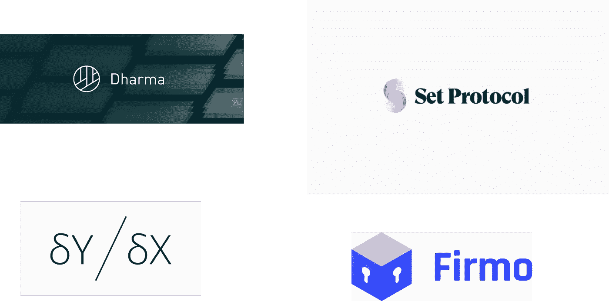
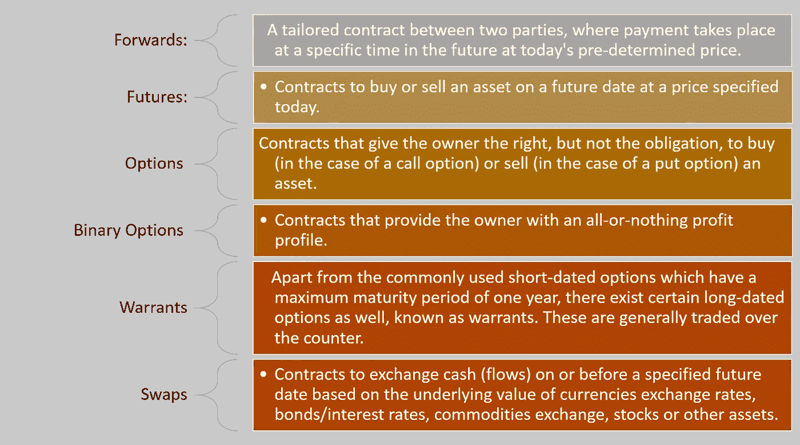
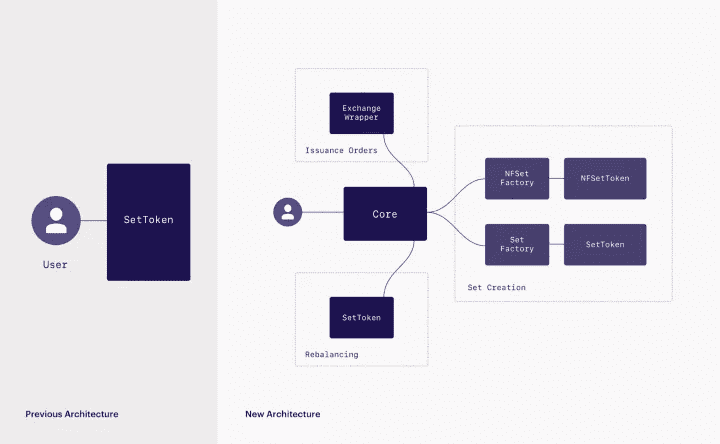
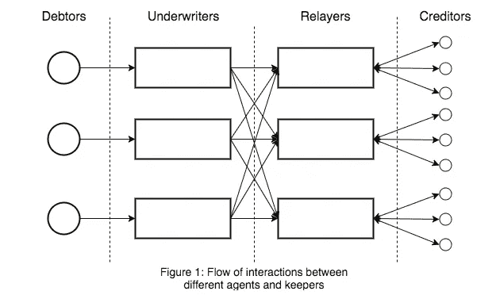
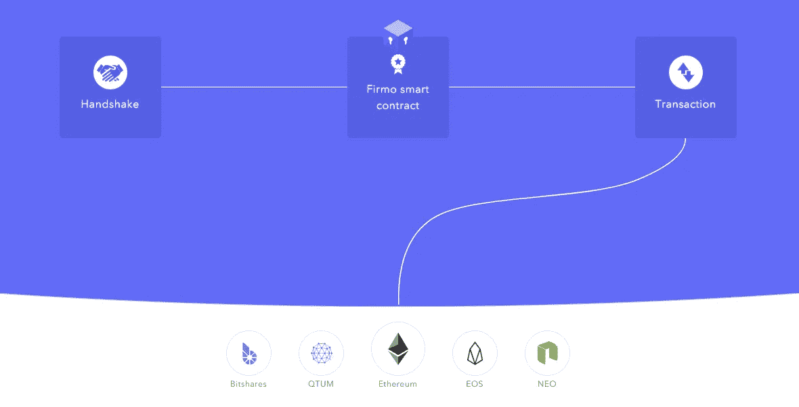

# 可编程的短:四个你应该知道的加密衍生协议

> 原文：<https://medium.com/hackernoon/the-programmable-short-four-crypto-derivative-protocols-you-should-know-about-b0b4ecad9e95>

历史上，衍生品几乎在每个金融市场都扮演了关键角色。就加密资产而言，你可以证明，在一级区块链协议、交易所，当然还有代币销售的发展中，衍生品已经排在了第二位。在某种程度上，芝加哥商品交易所和芝加哥期权交易所的比特币期货的第一次迭代并没有像最初预测的那样对市场产生重大影响。然而，随着围绕比特币交易所交易基金(ETF)潜在批准的所有噪音以及安全令牌等趋势的出现，加密衍生品被称为成为下一代加密资产的基础构件。

密码衍生工具在一个关键点上不同于任何其他类型的金融衍生工具:它们是可编程的协议，为各种有趣的可能性打开了大门。今天，我想回顾一组新的协议，它们在可编程衍生品的概念上进行创新，使各种复杂的金融工具得以实施。

# 和文字一样古老

大多数人将衍生品与 20 世纪 80 年代复杂的金融工具联系在一起。事实是，自从人类学会许下承诺以来，衍生品就一直伴随着我们。书写的发明无疑促进了记录的产生，记录使基于未来货物交付的商业协议正式化。有记录可以追溯到公元前 1700 年，农民会借收获所需的物品，并承诺未来会有回报。

第一个类似现代产品的衍生产品可以追溯到 18 世纪的封建日本。1730 年左右，在政府的全力支持下，多岛大米交易所成立。在交易所，有两种类型的大米市场；shomai 和 choaimai。shomai 市场是交易商根据现货价格买卖不同等级大米的地方。每笔交易都发放大米券，并在四天内结算。在 choaimai，第一个期货市场开始运作。在春季、夏季和秋季，不同等级的水稻签订了标准化协议。没有交换现金或凭证；所有相关信息都记录在票据交换所的一本书里。合同期限一次限定为四个月

如今，芝加哥商品交易所(CME)是衍生品的代名词。1919 年金融强国的建立代表了金融市场中衍生品的合法化。在 20 世纪 70 年代之前，衍生品仍将是模糊的工具，在 20 世纪 70 年代，计算机使得在不到一秒的时间框架内执行复杂的数学模型成为可能，从那时起，衍生品一直是市场上每一种相关金融工具的核心，并且是不止一场灾难的原因。

# 衍生产品的类型

从概念上讲，衍生产品是任何从基础资产中获取价格的金融产品。从这个角度来看，金融衍生品市场是没有限制的。当我们在这里纠结于一个价值低于 3000 亿美元的加密资产市场时，金融衍生品的价值却超过了万亿美元，这个市场的一个重要部分实际上仍然不受监管。

能够代表衍生产品的数学模型的类型实际上是无限的，但是有一小组衍生产品类别包含了市场上的大多数模型:

# 定量分析师的梦想:可编程衍生品

使加密衍生工具不同于任何其他金融衍生工具的简单事实是，它们是可编程的智能合约，可以在更高级的合约中动态使用。银行将花费数年时间来构建代表掉期模型的法律合同，而黑客可以使用加密衍生协议，在几分钟内构建一个金融衍生品。更重要的是，加密衍生品的性质使得更复杂的金融模型得以实现，因为有许多事情可以用代码和智能合约来表达，而使用简单的统计数据是做不到的。

# 安全令牌催化剂

毫无疑问，安全令牌的出现应该成为简化加密衍生品采用的因素之一。根据定义，许多证券令牌是潜在替代资产的代表，如房地产租赁或货币贷款，这使得根据这些资产的未来表现创建模型变得很自然。更重要的是，当今金融市场中的大部分衍生产品都可以适应证券令牌空间。我已经在这里写了关于证券衍生品的影响。

# 密码衍生协议

总的来说，为加密资产实现衍生模型的尝试并没有获得广泛的成功。然而，在过去的几个月中，新一代的协议已经出现，它们似乎将金融和加密的严格性正确地结合起来，为加密衍生空间建立了坚实的基础。以下是我最喜欢的几个。

## [{Set}协议](https://setprotocol.com/)

{Set}协议是一个基于以太坊的协议，用于抵押 ERC20 令牌。实际上，{Set}令牌是一个具有两个附加功能的 ERC20 令牌:issue 和 redempt，用于在{Set}令牌及其组成令牌之间进行转换。{Set}协议的体系结构如下图所示:

虽然{Set}协议团队着眼于支持指数基金等高阶衍生品，但他们最近推出了 [TokenSets](https://www.tokensets.com/) 来说明该协议的可能性。

## [dYdX](https://dydx.exchange/)

dYdX 是市场上最完整的衍生协议之一。其核心是，dYdY 引入了模拟金融市场类似行为的保证金交易协议的概念。在传统的保证金交易中，交易者借入一种资产，然后立即用它交易另一种资产。该资产必须在日后偿还给贷方，通常是连同利息一起。保证金交易包括卖空和杠杆多头。

dYdX 保证金交易协议使用一个主要的以太坊智能合约来促进 ERC20 代币的分散保证金交易。贷方可以通过签署包含贷款信息(如金额、涉及的令牌和利率)的消息来为保证金交易提供贷款。这些贷款可以在区块链以外的平台上传播和上市。

最近，dYdX 团队发布了一系列第二层合同，这些合同使用基本保证金交易协议来实现更复杂的金融结构，如价格 Oracle 或贷款机构。

## [达摩](https://dharma.io/)

达摩协议是一个高度通用的结构，允许几乎任何类型的债务协议作为代币发行、众筹和交易。达摩协议基于两个主要概念:

**代理:**代表协议的最终消费者，即希望借入或借出加密资产的实体。主要的两类代理人是债务人和债权人。

**管理者:**代表向网络提供增值服务的公用事业公司，它们在各自的市场上竞争补偿性费用。主要的两种保管人是承销商和中继商。

## [**Firmo。网络**](https://www.firmo.network/)

Firmo 协议是加密衍生品生态系统的有趣补充。从技术上讲，该平台实现了一种更高级的特定于领域的语言 FirmoLang，这种语言使得能够在任何区块链上使用代币来实现金融工具。显然，这是 FirmoLang 支持在不同的区块链上实现 crypt 衍生工具的另一种方式😉该平台已经为以太坊虚拟机提供了编译器，其他平台也将很快得到支持。

这些只是在加密领域变得相关的衍生协议的一些主要例子。随着安全令牌或加密 ETF 等趋势变得越来越流行，我们应该会看到加密衍生品成为下一代加密资产中更相关的组成部分。