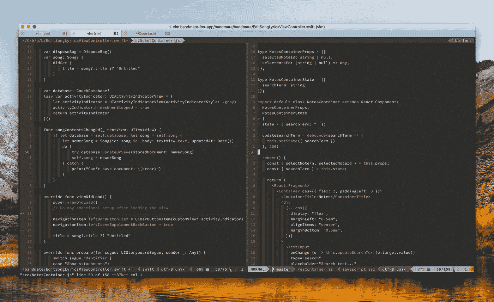

# 我正在寻找的编程语言

> 原文：<https://medium.com/hackernoon/the-programming-language-im-looking-for-948d93f7a396>

## 我喜欢编程语言。他们每个人都有我希望其他人拥有的吸引人的东西。最近，如果我要开始一个新的兼职项目，我会使用哪种语言，这个问题让我心烦意乱。

So many awesome programming languages!

在阅读之前，有几件事值得了解。虽然在我短暂的职业生涯中，大部分时间我都是使用 Java、JS 和 Ruby 创建生产应用程序，但我一直在学习新的语言和框架。我相信语言和特定于语言(或框架)的社区带来了新的想法，你以后可以在其他情况下使用:函数式[编程](https://hackernoon.com/tagged/programming)可以教你很多关于面向对象编程的知识，全职工作在 Rails 应用程序上会教你很多关于测试的知识(如果你愿意练习的话)。从每种语言中学习所有令人敬畏的概念的问题是，你最终会发现自己对在一种语言中寻找这些其他语言的所有好的特性感到沮丧。

另一个需要知道的关键点是，我一直在使用终端。我在电脑上的大部分时间是在浏览器和终端上度过的。是的，我用 Vim 编码。我喜欢没有空值的类型系统(我喜欢可选类型),并且是强的。就此而言，我不喜欢 Java 的类型系统，尽管我使用的最新版本的 Java 是 Java 6，所以很有可能有些东西已经改变了！Java 的类型系统是我尝试 Ruby 的原因，因为 Ruby 社区总是谈论它们与 Java 有多大的不同。当我写 Java 代码的时候，我总觉得我是在帮助编译器，而不是相反。

最后想说的是，我要找的语言可能不是你要找的语言！在这篇文章中，我将介绍我在过去几个月中使用的一些语言，可能是为了严肃的工作和/或有趣的项目。

# 红宝石

你看，我就是喜欢露比。Ruby 是一种优秀的、富于表现力的语言，有很多成熟的库(我们称之为“gems”)，可以帮助你快速启动并运行你的应用程序。Rails 已经非常成熟并且易于使用。测试融入社区核心的程度超过了我使用过的任何其他语言。Ruby 是一种纯 OOP 语言，所以大部分代码将共享相同的 API 风格——类，不管你选择哪个库。这个社区也很强大——Ruby 开发人员似乎向已经制作好的库贡献代码，而不是每次都编写他们自己的库(ActiveRecord 和 Sequel 就是一个极好的广泛传播的库的例子)。库方面的这种共识有助于对库进行扩展，我通常会给出 Rails Admin gem 作为简化工作的例子。

就速度而言，Ruby 并不在最佳状态。部署通常很繁重，需要时间来加载。练习 Rails 很棒，也很有趣，但实际上，运行 Rails 应用程序既费时又费钱:尤其是在 Heroku、AWS ECS 这样的“无服务器”容器平台上，因为 RAM、磁盘、流量和启动时间的原因，你需要为所有这些事情支付额外的费用。在本地运行 Rails 完全没问题，Bundler 也很棒——但有时，Rails 使用的“热重装”机制会有问题和缺陷，因为中等大小的应用程序启动时间可能需要 5-10 秒。

# Java Script 语言

我也喜欢 JavaScript。我的大部分前端工作都是针对网络的，因为每个人都有一个浏览器——所以发货很容易。对我的大多数同事来说，选择另一种语言听起来很奇怪:“为什么你想招两个人而不是一个？”。JavaScript 也是一种简单的语言，因为它如此广泛且容易上手，所以使用它似乎不会出错。用这种简单的语言实现原型是如此容易，你总是可以弹出`node` REPL 或者打开你的开发工具！和开发人员工具...哦，开发工具！它们无处不在，令人惊叹，吸引了大量 web 开发者的关注。太精彩了。

难怪这是我们在 T4 使用的主要语言。

但是……JS 也有它的问题。npm 模块的状态与 JS 本身的状态没有什么不同——社区已经围绕类型系统(Flow vs TS)、库和所有东西产生了分歧。[我也有我的喜好](/@galstar/composable-sql-in-javascript-db51d9cae017)，所以……我想我是这个社区的一部分。缺乏“社区选择”的结果是，虽然 npm 中有很多模块，我是说很多，但它们中的大多数都不成熟。几年前，当我决定在几年的纯 JavaScript 开发之后给 Ruby 第二次机会时，我已经写了一篇关于它的博客文章。我称之为“回归”。

# 迅速发生的

最近，我开始学习 Swift 来提升我的 iOS 开发游戏。以前它是零级的，因为我只知道如何让原生应用反应——这完全没问题，但我想体验一些新的东西。

Swift 是一种静态类型的编译语言。它最初是为苹果生态系统开发应用程序而设计的，但它是开源的，现在可以用来在 Linux 系统上开发可执行文件。我所知道的最多产的 npm 库作者之一， [Sindre Sorhus](https://medium.com/u/37166cebf99b?source=post_page-----948d93f7a396--------------------------------) 说他想做更多快捷的工作。我能理解他！Swift 的快速启动时间和有用的编译过程可以确保运行时出错的几率越来越低。你没有 NULL，你有`Optional`类型。你不能`throw`不告诉你的函数抛出，但不是像 Java 的`throws`声明那样直白地抛出，而且有一个很好的语法糖围绕着它，以“尝试它，并在可选的情况下，在失败的情况下包装”的形式。您拥有与 Swift 的 enums 完美配合的模式匹配，这使得它非常强大。他们也有类型推断，这不包括方法定义，但我想这很好。哇哦。一门伟大的语言！

为什么斯威夫特不是我的赢家？在非 XCode 的编辑器中使用 Swift 并不容易或有趣。我平时用 Vim，用其他编辑器感觉很慢。我试过用 VSCode 或者 Atom，都没那么好。也许，最终，我会编写一个 Swift CLI 工具，它将帮助我编写编辑器插件，并让开发人员的体验棒极了，但现在——它不在那里。Swift 还没有静态编译，因此您需要使用 Swift 设置环境，以便使用 CLIs。对于 Mac 应用程序来说没问题，但服务器是 Linux，我希望我的二进制文件是自包含的。

# 原因

我对脸书开发的 OCaml 的这种全新语法很感兴趣。整个工具链感觉很成熟很牛逼。OCaml 的包管理器 [OPAM](https://opam.ocaml.org/) 有表情符号，这表明这种看起来很老的语言的工具一点也不老。Merlin[和 OCaml](https://github.com/ocaml/merlin) / [Reason](https://github.com/jaredly/reason-language-server) 语言服务器也很棒，甚至与 Vim 配合得非常好。有一个功能齐全的自动完成引擎(！)、定位定义、悬停类型定义以及更多功能。对于一门语言来说，从编辑器中分离出来的惊人的开发工具是如此强大。

可以使用 BuckleScript 将 Reason 编译成 JS，BuckleScript 从 Reason/OCaml 代码生成 performant JS。这太棒了，因为现在你已经有了带有很好的 JS 互操作的全类型系统，你可以使用你想要的库了。我被迷住了。实际上，我不喜欢它的唯一一点是，我必须创建大量的类型定义来使用依赖关系，但通常情况下，这是没问题的:我们不必对整个模块建模，只需对我们使用的特定函数/类/方法的输入和输出建模。因为理性不是纯粹的功能性的(你可能会有副作用)——对我来说，**理性感觉是目前构建 JS 的最佳方式**。

Reason 也可以编译成字节码/native。使用纯 OCaml/Reason 意味着如果您的代码编译，您将不会有运行时错误，它也可以静态构建，占用空间小，启动速度快。它建造得非常快。我是说，哇。很快。很快。

OCaml toolchain is fast!

我在尝试构建一个原生 Reason 应用时注意到的最大问题是，我不知道人们在做什么，以及如何使用一些库。其中大部分是 OCaml，但是由于 OCaml 和 Reason 是可以互换的，所以我只是使用 Chrome 扩展来读取原因代码。尽管如此，还是不清楚。有 OCaml 代码无法转换为 Reason，可能是因为 Chrome 扩展中缺少 PPX。据我所知，PPX 是语法的扩展——基本上是将代码从一种语法版本转换成另一种语法版本的宏。你可以把它想象成一个巴别塔插件或者类似的东西。Native Reason/OCaml 还没有多核支持，但是对于并发进程，可以使用 Lwt，这是一个类似 promise 的库。我仍然没有找到一个简单的 Lwt 指南/博客帖子！

还有，似乎对于原生 OCaml/Reason 开发来说，入门水平很高，可能会比较沮丧。该社区不解释事情，并认为知识是已知的，主要是让读者看看实现或接口，但我坚信这最终会改变，因为这只是 JS devs 转换的开始。😺

# 戈朗

围棋是一门奇妙的语言。它易于学习，编译和运行速度快，具有 [goroutines 和使用 CSP](https://www.golang-book.com/books/intro/10) 的简单并发性。它支持多核，你可以编译一个静态的二进制文件，这个文件可以在普通的 Linux 系统上运行，启动时间很快。它有变量声明的类型推断，但没有函数定义。它有界面，看起来它有一个基础良好的专业社区。

事实上，Go 中编写了许多强大的模块和应用程序，如 Docker、Kubernetes、CockroachDB，这意味着您可以制作一个包含应用程序内部基础设施的二进制文件，用于小型和简单的分发(如在 raspberry pi 上)。这个很厉害。

在使用通用数据结构(图、树)和算法方面，它缺乏泛型(应该在下一个主要版本中添加)对我来说很奇怪:它每次都强制编写东西或使用代码生成步骤，这也可以工作，但我宁愿让编译器为我做这些。此外，我并不完全了解新的模块系统，称为 VGO，但我想我们会听到更多关于它和更多简单的指南将可作为社区变得更加熟悉它。最后，就我个人而言，我认为这种语言本身并不漂亮。我知道，我知道。这不是一个不使用语言的好理由，但它让我避免全面测试它或用它做一个附带项目。就是不好玩，简单，无聊，好。我确信，最终，我会在一个生产系统中使用它，我会喜欢它的。要知道，口味是可以变的！

# 透明的

我们已经从 Ruby 开始，所以让我们用 Crystal 结束它。

Crystal 是另一种相当新的语言——仍然不是 1.0——看起来几乎像 Ruby，但它是编译的、静态类型的，而且速度很快！它像 Ruby 一样支持 OOP，并且有很多很好的特性，比如类型推断、可选类型、用于并发的 CSP 和编译时宏，比如 Golang codegen，但是在编译器内部。Crystal 也有一些新的网络框架，比如 Lucky 和 Amber。凯末尔是辛纳屈，但对克里斯托来说。ORM 也是可用的，因为 Crystal 类似于 Ruby(有一点儿灵丹妙药)，您可以找到使用几乎相同的 API 以及类型安全的 ORM。这是一件大事！

因为这种语言还很年轻，所以在它可以投入生产之前还有时间。我希望 Crystal concurrency 能够使用所有可用的内核，比如 Go，而不是为了达到这个目的而必须手动分叉。我宁愿抛出异常的方法返回`result`类型，这样错误处理将是显式的。我希望枚举可以包含值，这样我们就可以像 Swift 枚举和 OCaml 变体一样使用枚举。更好的编辑器支持也会有所帮助:鼠标悬停时的自动完成和类型提示是一个很棒的附加功能。此外，在 [Scry](https://github.com/crystal-lang-tools/scry) 中，语言服务器的自动完成功能对标准库有效，但对用户代码无效。我还有点担心 Crystal 无法升级到 1.0 版本。但我真的希望它会。

你可能知道，我希望我的编程未来是 Crystal、Go 和 ReasonML 的奇怪组合。我还不确定我最喜欢哪种语言，但我认为它们是最适合我的。我想我们只能等着看所有这些语言在几个月到几年后会发生什么😃

你最喜欢的语言是什么？为什么？