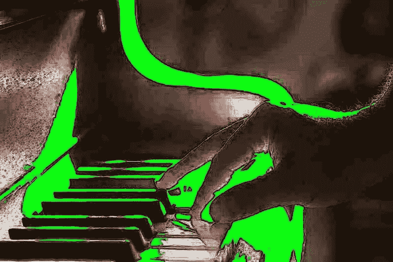
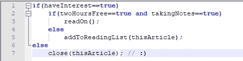
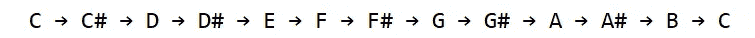
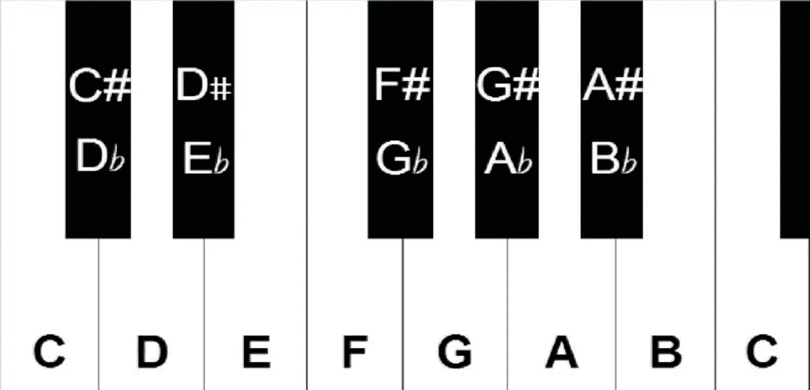
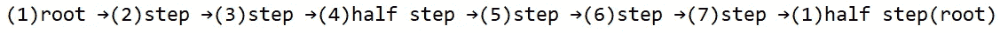
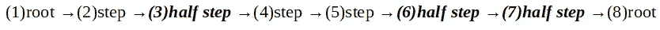

# 音乐的编程语言

> 原文：<https://medium.com/hackernoon/the-programming-language-of-music-cb4ef603967b>

## **TL；音乐和软件，类似的方法；如果你欣赏其中一个，那么很有可能你会欣赏另一个。此外，对五声音阶有点厌烦。如果你懂乐理，建议你跳过这个。☺**

此外，这可能是非常沉重的东西。忽略“6 分钟读数”估计。您可能需要的:

*   好奇[音乐](https://hackernoon.com/tagged/music)是如何运作的
*   大约两个小时的时间
*   (铅笔/钢笔和笔记本)或设备上的笔记应用程序

a simple decision script

音乐“生产”不仅仅是歌曲。类似地，软件“生产”不仅仅是代码，而是一块更大的画布。然而，歌曲和代码仍然是音乐和软件的核心。每项努力中最具创造性的部分也是最重要的部分。

根据我度过的一天，我可能会花 15 分钟写一首美妙的歌，或者花一周写一首平庸的歌。但是是什么让一首歌或一段代码变得伟大呢？我认为这是 T4 的雄辩和简单的结合。这既适用于一首歌，也适用于一段代码。

他们有多相似？首先，两者都有两个重要的组成部分:理论和实践。如果我不知道这个理论，我就不能称自己为音乐家，即使我每天练习拉小提琴 5 个小时，持续 10 年。如果我有博士水平的音乐理论知识，我的说法也不会变得更可信，但我不知道如何在钢琴上从一个和弦转到另一个和弦。好吧，在这个节骨眼上，我安全声明:*我不是音乐家*。而且，为了圆场，*我大概在* [*编码*](https://hackernoon.com/tagged/coding) *太*上相当一般。

然而，我发现*了解系统* *如何工作*有助于我满怀信心地追求任何一门学科，或许还能获得一定程度的灵活性。*考虑一下这个:仪器是操作系统和 IDE，笔记是编程语言。那么，音阶和调式就是语法。*

下面的段落是关于我如何理解音乐理论的，如果你想看它在吉他上的表演，我强烈推荐马蒂·施瓦茨。他是一个真正的冠军:令人难以置信的是他在教学视频中的耐心！或者，如果你真的受到启发，想转向一些更有条理的学习，我推荐[保罗·吉尔伯特](https://artistworks.com/guitar-lessons-paul-gilbert)。保罗才华横溢，充满自信。他会让你大吃一惊，让你相信你甚至可以演奏最难的独奏。如果你对其他乐器有兴趣，我相信 YouTube 也会为你介绍一些优秀的老师。

*嘶..我很喜欢小调五声音阶，这可能是音乐家中最受欢迎的一种。这篇文章的秘密意图是介绍五声音阶，但在此之前，先讲一点基础知识。*

## 八度音阶

也许你已经知道，整个音符范围被校准为 12 个“停顿”或“音调”:范围从 C-G，然后再从 A-C。这是怎么回事？如果你是新手，不要惊慌。只知道“#”读作“*锐*”。比如“F#”要读作“ *F 夏普*”。所以笔记排列如下:

现在你知道了:音乐列车从 C 开始，然后经过 11 个站才回到 C。这是一个八度音阶的代表。当你阅读这篇文章时，在一张纸上写下这些笔记，这将有助于理解接下来的几个概念。或者最好还是这样画出来:

为什么是“八度”？因为有 8 个字母:C、D、E、F、G、A、B、C，这些是构成八度音程的 8 个*音符或音调*，这里的#被称为*半音*。所以，D 比 C 高一个音*，G#比* A 低半个音*，这就是 11 个不同的音符(为了完整起见，C 加在最后)，这是所有音乐中最基本的词汇。*

> ***法则一:*** *记住，E 和 B 没有升半音。*

还记得高中物理吗？每个音符代表一种具有特定频率的声波，频率随着你上升八度逐渐增加。也就是说，D#的频率高于 D，所以我们说，D#比 D 高半个音，或者 F 比 g 低一个音。

现在让我们进一步复杂化。就像你刚刚遇到了#(夏普)，你需要了解他的敌人♭(flat).#(升半音)表示半音符*增加*，而♭(flat 表示半音符*减少。*因此，如果我们尝试写下上述所有笔记，但这次用♭'s 代替#的，我们会得到:

> ***规则二:*** 所以，从上面的 ***规则一*** ， *F 和 C 没有降半音。*

## 天平

音阶是全部 12 个音符的子集，按升序或降序演奏。音阶有很多种，我们会看到三种类型:大调、、**小调、**当然还有我最喜欢的**五声音阶**。每个音阶都有一个*根*。例如，A 大调音阶在“A”处有根音。C#小调五声音阶有根音…你猜对了，在“C#”。

或许我们可以把一个标尺想象成一个*循环*双向链表。至少在学习音阶的阶段，知道音符的升序和降序是有意义的。在演奏的时候，当你在舞台上演奏，聚光灯对着你的时候，你显然不会按顺序演奏音阶的音符，但是对结构的充分了解给了你出色演奏的自由。

## 大调音阶

大调音阶由七个音符组成，排列如下。

让我们试着推导出 c 大调音阶中的音符。
-词根当然是“ **C** ”。
-对于第二个音符，上升一个音级，从 C… C#… **D.**
开始数两个半音级-然后对于第三个音符，再上升一个音级，从 D… D#… **E**
开始数两个半音级-对于大调音阶的第四个音，记住它只是上升一个半音级。所以从 E 上升半音就是 E#？
*啊哈！规则 1，E 和 B 没有升半音！*所以第四个音符会是一个 **F** 。以此类推……这里是 c 大调音阶。

**C →D →E →F →G →A →B →C**

那很容易。这是 c 大调音阶的实际运用。

让我们再试一次。说一个.
——词根当然是**一个**。
-第二个音符上升了一个全音级。也就是从 A…A#… **B** 数两个半音。
-第三个音符又是一个全音程，也就是 B…C… **C#** 。以此类推……这里是 A 大调音阶。

**A →B →C# →D →E →F# →G# →A**

希望你能掌握这个。也许，试着自己推导一些。或许，D#大调和 G 大调。你可能需要花些时间在这里，因为如果你得到这个，你已经破解了它的其余部分，真的。

## 小调音阶

小调音阶有几种，这里我们会看到‘自然小调’。自然小调音阶来源于大调。拿一个*快乐的*大调，把它变成一个*悲伤的*小调。示例:

Major::Happy::Minor:Sad

派生出小调，词根保持不变，但是大调音阶的一些小变化使它变成了一个全新的怪物。简单:拿*快乐*大调音阶，在第 3、6、7 音投一桶*降半音*，让它*悲伤*。

为 C 自然小调音阶推导:
-你取根音为 **C** 。
-从 C 向上一个全音程，当你数的时候，就是 C…C#… **D** 。
-从 d 向上半个音程就是 **D#(或 E♭)** ，以此类推。
C 自然小调音阶是:

**C →D →E♭ →F →G →A♭ →B♭ →C**

看到了吗？只需在第 3、第 6 和第 7 个位置放一个降半音，就可以得到自然小调音阶。这个音阶在升半音的语言中不是那么直观，但那会是:

**C →D →D# →F →G →G# →A# →C**

就是这样。如果你喜欢的话，可以自己试一对(比如，B 小调和 F#小调音阶)。这是一段 C 自然小调的视频。

The C Natural Minor Scale

## 小调五声音阶

这个美丽的音阶只有 5 个音，因此得名*五音*主音。从技术上讲，五声音阶有很多种，但人们通常指两种:大五声音阶和小五声音阶。但是当没有指定专业/辅修专业时，假设辅修专业是相当安全的。

我可以一整天都在谈论为什么五声音阶如此特别，但我会让鲍比·麦克菲林来演示。

Bobby McFerrin Demonstrates the Power of the Pentatonic Scale

五声音阶有 5 个音符，分别来自自然小调音阶上的位置 1、3、4、5、7。不需要向上滚动，这里又是 C 小调音阶，但这一次，五声音阶位置被突出显示了。

***c***→d→***e♭***→***f***→***g***→a♭→***b♭***→c

简单地说，C 小调五声音阶通过从上方选取位置 1、3、4、5 和 7，

**C →E♭ →F →G →B♭ →C**

这里是马蒂·施瓦茨向你展示如何用他漂亮的红色[吉他弹奏 A 小调五声音阶。](https://en.wikipedia.org/wiki/Fender_Stratocaster)

Marty Schwartz: instructional video on the A Minor Pentatonic

虽然在实践中这是最简单的音阶之一，但在理论上，只有当学生严格遵循从大调到自然小调的进程，并在此之后到达小调五声音阶时，才能欣赏它的简单和美丽。这是否让你想起了*作品*中的一些东西？

在学校的时候，我常常想知道为什么我们需要知道如何使用卑鄙的[中点算法](https://www.geeksforgeeks.org/mid-point-circle-drawing-algorithm/)来画一个圆，而人们总是可以使用一些 *DrawCircle()* 类型的函数。现在我很欣赏学术严谨的优势。就在上周，我花了几个小时调试一个非常可怕的 bug，并发现根本原因是在一个 *if 中对[德摩根定律](https://en.wikipedia.org/wiki/De_Morgan%27s_laws)的不可靠应用..elseif* 兔子*孔*。**

就这样了，伙计们。坦白地说，我很惊讶你能和我一起写这篇文章。但是对于少数坚持下来的人来说:我希望这能让你体会到音乐是如何结构化和美丽的，就像你结构化和美丽的代码一样。

最后，我将让两个图标演示 E 小调五声音阶:首先是安格斯·杨，然后是埃迪·黑兹尔。

AC/DC — Back in Black (E Minor Pentatonic)

Funkadelic — Maggot Brain (E Minor Pentatonic)

接下来阅读:本系列的第 2 部分，用戴夫·布鲁贝克调试 c 大调音阶。