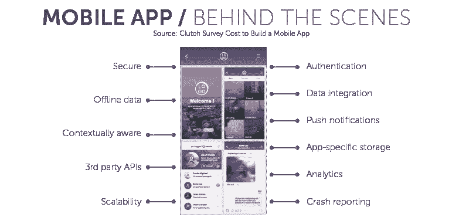
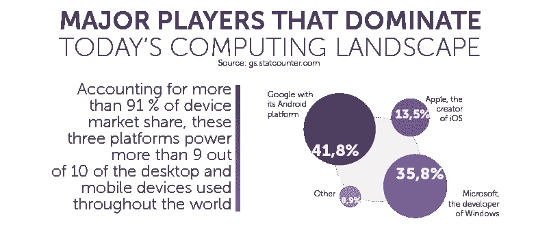
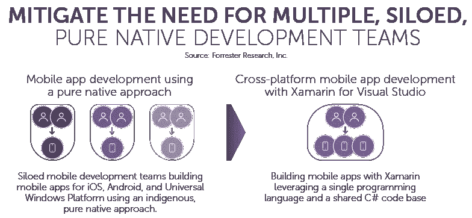
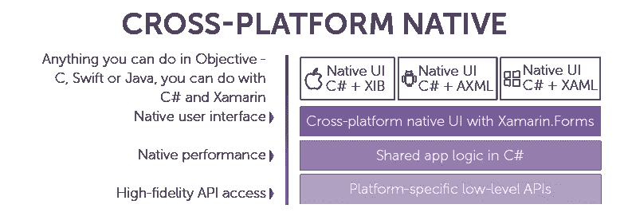
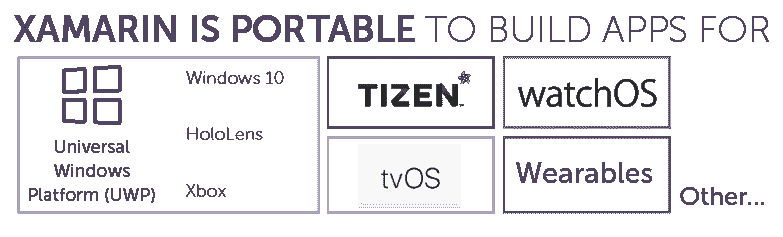
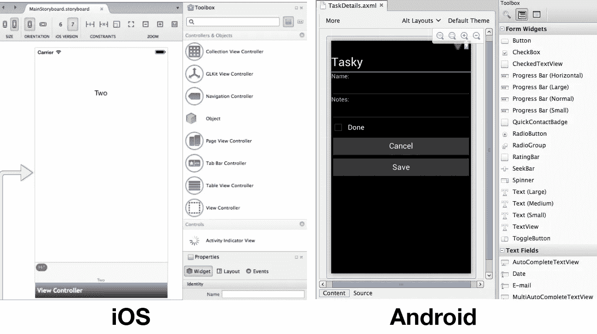

# Xamarin 对于跨平台开发的利与弊

> 原文：<https://medium.com/hackernoon/the-pros-and-cons-of-xamarin-for-cross-platform-development-2a31c6610792>

网络可能是联系用户、分享数据和交流想法的绝佳方式，但当谈到充分利用计算设备时，没有什么能比得上本地应用。原生应用旨在利用特定的硬件要求、API 和其他以平台为中心的优化，仍然是用户充分利用手机、平板电脑和电脑的最佳和最有效的方式。

尽管三种平台占据了绝大多数计算设备，但开发彼此兼容的应用程序却是另一回事。用 Objective-C 或 Swift 为 iOS 编写的应用程序需要时间和工具来将代码移植到 Android 的 C++或 Java 中，这需要大量的开发资源来使应用程序跨不同平台兼容。也就是说，直到 Xamarin。

# **什么是 Xamarin？**

[Xamarin](https://xamarin.com/) 是由 Xamarin 公司开发的平台，该公司于 2016 年被微软收购，旨在通过单一共享为 Android、iOS、macOS、Tizen、GTK#和 Windows 创建应用程序。NET 代码库。使用 Xamarin 构建应用程序允许开发人员同时为所有主要平台开发应用程序，这些应用程序与原生应用程序没有区别。事实上，Xamarin 应用程序是原生的，充分利用了原生用户界面控件、特定于平台的 API 和特定于平台的硬件加速。

# **谁使用 Xamarin？**

大公司都在采用 Xamarin 来简化他们的开发过程。全球最大的体育赛事直播公司之一 Fox Sports 使用 Xamarin 帮助开发其移动体育应用，并在数百种不同的 Android 设备上进行虚拟测试。[阿拉斯加航空公司](https://azure.microsoft.com/en-us/resources/videos/alaska-airlines-visual-studio-team-services-xamarin/)也使用 Xamarin 构建其移动旅行应用程序，允许用户在桌面和移动设备上无缝体验办理登机手续、登机或更改航班信息。

Forrester 进行了研究，以找出 Xamarin 为 Visual Studio 跨平台移动应用程序开发带来的[成本节约和业务优势。研究发现，Xamarin 降低了移动应用程序开发和生命周期管理成本，同时优化了现有开发人员资源的利用率。Forrester 对投资了 Xamarin for Visual Studio 解决方案的 4 家现有客户进行了访谈，并分析了他们的财务指标:](https://info.microsoft.com/forrester-study-xamarin-for-visual-studio-total-economic-impact.html)

1.  年收入超过 25 亿美元的全球娱乐公司
2.  总部位于美国的咨询公司，拥有 500 名顾问，为企业客户提供移动战略和应用程序开发
3.  拥有 35 名移动开发者的全球移动应用开发公司
4.  休闲餐饮连锁的全球组合(1000 多家餐厅，10 万多名员工，年收入超过 40 亿美元

研究发现，基于受访组织的复合组织经历了以下风险调整后的投资回报率和收益:

**在 3 年的时间里，拥有多个移动应用的组织预计:**

*   1，365，003 美元—通过使用跨平台的共享 C#代码库，降低了移动应用程序开发成本
*   829，475 美元—使用 Xamarin for Visual Studio 的共享代码库提高移动应用维护和升级效率
*   6，558，360 美元—节省特定平台的移动应用程序开发人员费用。

# **用 Xamarin 开发的好处**

用 Xamarin 制作应用程序是开发团队节省时间和资源的一个好方法。如果您是一名开发人员，希望在另一个平台上提供一款应用程序，简化您的技术堆栈或简化您的开发操作，以下是选择 Xamarin 的一些最大优势:

*   **单一的技术堆栈加快开发:**基于 Xamarin 的应用程序由 Visual Studio 创建，使用单一语言 C#开发。

Xamarin 应用程序利用 C#和共享代码库，这些代码库覆盖了每个平台 90%的特定语言、API 和数据结构，并将它们包装在一个. NET 层中，从而实现跨平台开发。通过用 C#开发并允许 Xamarin 处理跨平台实现，开发团队将能够事半功倍。

*   **快速成型:**用 Xamarin。表单，开发人员可以使用完整的跨平台 UI 工具包来构建可在任何设备上工作的界面。这允许跨所有设备创建单个用户界面，使开发人员能够共享更多代码，而不必为每个平台修改 UI。

*   **原生性能和用户体验:**在 Xamarin 中，可以访问每一个原生 API，因此可以使用完全原生的 UI、蓝牙、SDK 等。因为 Xamarin 可以充分利用特定于系统和硬件的 API，所以使用该软件构建的应用程序将与用每个平台的首选语言编译的应用程序运行得一样好。用户将无法区分你的应用程序和原生应用程序，因为没有原生应用程序。
*   **缩短上市时间:**使用共享代码库构建应用程序消除了通常用于翻译、重写或重新编译代码以在不同平台上工作的时间。这将开发周期缩短了数周、数月甚至数年，允许同时开发所有三大平台的应用程序。由于这些应用程序是一起构建的，这意味着功能对等性不会从您最受欢迎的平台慢慢渗透到您最不受欢迎的平台，它们将立即部署到您的所有平台。
*   **更少的维护:**维护和更新使用 Xamarin 构建的应用需要更少的工作。一旦您对我们的源文件进行了更改，它们就可以直接应用到您的应用程序中，这样，如果需要任何更新、错误修复或新功能，您就无需单独更新应用程序的源代码。
*   **适用于所有平台的应用:**如果你有一个杀手级的桌面应用需要移动版本，或者相反，会发生什么？有了 Xamarin，就没有问题了——开发者可以同时为移动和桌面体验创建应用。这也有助于开发团队减少必须决定是否只为一个平台开发的时间，因为 Android、iOS 和 Windows 可以同时处理。

*   **易于保持更新。** Xamarin 利用了原生框架，通常 iOS 和 Android 平台需要 1-3 天才能赶上最新的功能。这就是为什么一旦 Xamarin 更新，新的平台特定功能可以迅速引入您的应用程序。

# **用 Xamarin 开发的缺点**

*   **对企业来说贵。** Xamarin 对个人和小公司是免费的，但是，企业需要购买微软 Visual Studio 的许可证。对于没有高级 Azure DevOps 功能或云服务的 Visual Studio 的基本访问，单用户许可证起价为 499 美元。需要所有这些功能的企业用户支付高达 2，999 美元的 Visual Studio Enterprise 年费。根据开发人员的规模和需求，这些许可证的成本会很快增加。
*   使用所有开源库可能会很复杂。虽然 Xamarin 确实支持大多数。Net 库，如果没有特定的包装器，它不支持 Android 和 iOS 的所有可用的第三方库。
*   **不适合重图形的应用。**每个平台都有不同的可视化屏幕布局方法:

Credit: [docs.microsoft.com](https://docs.microsoft.com/en-us/xamarin/cross-platform/app-fundamentals/building-cross-platform-applications/understanding-the-xamarin-mobile-platform)

如果应用程序有丰富的 UX/用户界面，它应该在本地实现。

*   **更大的 App 尺寸**。Xamarin 为发布版本增加了 3-5 兆字节，为调试版本增加了大约 20 兆字节。

# **Xamarin 赢了**

如果您是一名开发人员，显示出需要为多个平台开发应用程序的任何迹象，Xamarin 是可以让您的生活更轻松的最佳工具之一。由于 Xamarin 强大的 C#环境、原生和跨平台的库和 API，以及易于部署，它是保持 Android、iOS 和 Windows 应用程序同步开发的最佳选择。这反过来减少了总体开发时间，并更快地为用户带来新的特性。

> 这篇文章的作者是 Ciklum 移动堆栈的负责人 Oleksandr Leuschenko。查看 [Ciklum 博客](https://www.ciklum.com/blog/)，了解更多关于应用开发的文章。