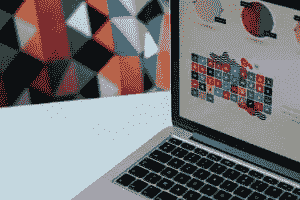

# UX 设计专家指南

> 原文：<https://medium.com/hackernoon/the-pros-guide-to-ux-design-7fcdc7285a7f>

*人类经历*。有一种观点认为，收集经验是生活的意义；看到新的风景，感受新的感受，可以让一个人理解人类经历的广度，从而充分享受生活。

我们将从这个崇高的(也许是*有点自负的*)位置来审视 UX 设计的世界，因为 UX 设计师的角色就是为数码产品的用户精心打造体验。他们控制着 UX(用户体验)的可用性、可访问性和乐趣，并对它是否是一个令人愉快、满足、令人瞠目结舌的，或者确实是*糟糕的*有最终决定权。

塑造一个数字世界是一个令人兴奋的前景，近年来 UX 设计师的角色变得越来越受欢迎。虽然我们在*Martec*之前已经谈论过[如何在 UX 开始职业生涯](https://www.themartec.com/insidelook/how-to-kick-off-your-ux-developer-career)和[如何在职业的最高层航行](https://www.themartec.com/insidelook/getting-promoted-mid-senior-ux)，但我们还没有引导 UX 设计师走过这个角色的中间阶段——这是一个关键的发展阶段，许多新面孔的设计师要么沉沦，要么游泳。

为了寻找答案，我们采访了三位 UX 设计大师*——**贝蒂娜·马森**、UX 专家 [**、澳洲电讯**](https://careers.telstra.com/home?utm_source=Martec&utm_medium=Martec&utm_campaign=Telstra&utm_term=UX%20Design&utm_content=UX%20Design) 、**汉娜·赫弗南**、 [**产品设计师坎瓦**](https://www.canva.com/careers/?utm_source=Martec&utm_medium=Martec&utm_campaign=Canva&utm_term=UX%20Design&utm_content=UX%20Design) 和**罗伯特·威廉斯**、UX 艺术学院首席设计导师 Xi —*

# 关于打造 UX 设计的道路，专家们有什么要说的？让我们找出答案。

# 了解 UX 设计职业是否适合你

许多初露头角的 UX 设计师都惊讶于一旦选择了职业生涯，这个角色会带来什么。了解你是否适合这个角色是 UX 设计成功之路的第一步。

“我总是被创造性的追求和技术所吸引，”马森说。她进入 UX 领域并不特别传统，但这似乎为她走向成功奠定了基础。“最初，我学习了游戏设计学士学位，这让我开始了概念艺术家和环境设计师的职业生涯。在那段时间里，我培养了一种兴趣，即与技术更紧密地合作，以改善其他人的生活——既创造引人入胜的体验，又解决现实世界的问题。这让我注册了硕士学位，以微调我的重点，并把 UX 和交互设计作为职业。”

虽然马森对 UX 的所有事物都产生了热情，但对其他人来说，这种热情是与生俱来的。那么，你是天生的 UX 设计师吗？找出答案的一个方法是看看 UXers 和其他专业人士的区别，看看你的优势是否一致。

# 让 UX 设计师与众不同的关键技能

那么，我们的专家认为 UX 顶级设计师都有哪些天赋呢？

作为设计软件供应商 Canva 的一名 UX 专业人士，赫弗南认为，能够通过草图传达你的想法是一种将 UX 最好的设计师与众不同的技能。“作为一个有艺术和插图背景的人，我可能有偏见，但能够用涂鸦在几秒钟内直观地分享一个想法对我有很大的帮助。只需要纸和笔，我就可以和我的产品经理或工程师一起想出一个主意。这比在我的电脑上制作线框或模型要协作得多。”

当被要求更多技能时，赫弗南补充道:“交流”。“我曾与一些其他方面都很出色的 UX 研究人员和设计师合作过，他们很难让关键人物加入进来，因为他们不知道如何(沟通)。你不能以这种精英理论专家的身份运作，并期望当你提出你的建议时其他人会同意。让人们尽早在 UX 投资，让初来乍到的人也能接触到它，并对它实用和包容。”

威廉姆斯表示同意。“在 UX 设计中，软技能有着巨大的作用。良好的沟通能力——促进、组织和合作——是杰出 UX 设计师的标志。”他还建议，一个杰出的 UX 设计师需要善于识别什么能为顾客创造一个更好的世界，并且必须明白创造变化需要勇气。

马森没有关注学到的技能，而是确定了一名 A 级 UX 设计师的关键特质。她认为适应性和动力是该领域最优秀的专业人士共有的两个最重要的品质，因为这是一个不断发展的职业。“随着技术被开发和采用的速度，我发现的最大挑战之一是，你不仅需要了解 UX 的实践，还需要了解最新的技术及其局限性。”

这就把我们带到了 UX 设计专家指南的下一章…

# 提升技能的方法和有帮助的资源

“UX 设计中有如此多的思想和方法可供借鉴，”赫弗南指出。在这样一个多样化的领域里，不可能了解所有的事情。她建议你根据项目需要更新你的技能。

考虑到这一点，赫弗南为 UX 的设计师们提供了以下提升技能的方法和资源，他们希望尽可能做到最好:

*   成为 meetup.com 与[产品社区的一员。当我第一次接触悉尼的科技领域时，这些活动真的很有帮助，而且通常花费不超过一杯酒！](http://meetup.com/)
*   几年前，我读了沃伦·伯杰的《T4 的微光》，但它真的深深吸引了我。这是我第一次接触设计思维，在它成为一个术语之前。
*   唐·诺曼的《日常用品的设计》是一个非常有趣的可用性研究，如果你只是一个追求漂亮设计的书呆子，也是一个很好的读物。
*   [*设计显而易见的*](https://www.amazon.com.au/Designing-Obvious-Robert-Hoekman-Jr/dp/0321749855) 小罗伯特·霍克曼(Robert Hoekman Jr .)是我刚入门时(Canva 创始人)梅尔推荐的一本书。它教会了我一些关于 Canva 如何思考产品设计的有用的东西。
*   [*别让我胡思乱想！史蒂夫·克鲁格的作品是最受欢迎的。我总是重温它以获得实用的技巧——至少每月一次！克鲁格的网站*](https://www.amazon.com.au/Dont-Make-Think-Steve-Krug/dp/0321344758)**也有一些非常棒的下载资源。**

*同样，威廉姆斯警告说，不要急于成为一个万事通，并建议你成为一个(或者几个)大师。*

*“知道你做得好。我们有如此多的机会在不同的方向展示我们的才华，所以认可你的特长是值得的。你是一个出色的研究员吗？利用你的洞察力在原型中形成一系列的目标！你擅长设计和创造用户旅程吗？有时间和研究团队一起出去，直接倾听客户的声音！”*

*对于那些对文学感兴趣的人，Williams 呼应了赫弗南对 Steve Krug 的看法，并列出以下书籍作为 UX 设计师的必读书目:*

*   *埃里克·赖斯 [*可用的可用性*](https://www.amazon.com/Usable-Usability-Simple-Making-Better/dp/1118185471)*
*   *[*粉碎 UX 设计*](https://www.amazon.com/Smashing-Design-Foundations-Designing-Experiences/dp/0470666854) 杰斯蒙德·j·艾伦和詹姆斯·j·查德利*
*   *[*服务设计:从洞察到实现*](https://www.amazon.com/Service-Design-Implementation-Andy-Polaine/dp/1933820330) 安迪·波伦*
*   *杰夫·高瑟夫的《精益 UX》*

*Williams 还建议初出茅庐的 UXers 们去看看由他称之为“UX 创始人”的组织提供的在线资源。*

# *从以前做过这一切的人那里得到的教训*

*关于他们的职业，UX 设计师还应该知道什么？我们的专家在这一领域已经工作了多年，他们早就见识过了。那么，他们会向那些试图在 UX 取得成功的人传授什么经验和建议呢？*

*马森先走。“当你想到用户体验设计时，你会立刻想到界面和客户服务。但是 UX 的设计远不止这些。我们生活在一个拥有许多不同技术的世界，这些技术允许许多不同类型的用户体验，例如虚拟现实和基于语音的交互，如亚马逊的 Alexa 和谷歌 Home 等产品。用户体验不是纯粹的视觉，我们必须记住，人们以不同的方式与技术互动。重要的是，不仅要跟上快速变化的技术世界，还要确保你所创造的体验是包容性的、直观的和令人愉悦的。”*

*在她的职业生涯中，赫弗南从 UX 设计中学到了什么？“它在每个公司都有不同的含义！一些企业需要更多基于研究和战略的专家。我面试过的其他职位可能会提到 UX，但你会发现这主要是一个 UI 设计职位。”简而言之，她说，你需要为任何事情做好准备——“它涵盖了如此广泛的技能。”*

*“根据我的经验，我发现我们的大部分工作都是无形的，而且对最终用户来说往往是不可见的，”Williams 说。“用户可能只能看到我们提供给他们的单个功能、按钮或工具的结果视图。”*

*因此，作为一名 UX 设计师，他说创造的不是“什么”，而是“如何”——“我们如何在一个项目组中工作，*我们如何与他人合作并交流我们的发现和成果”——这是最重要的。**

# *上升中的角色*

*对 UX 设计师的需求不会很快减少。随着如此多的人类经历正在数字化，组织机构总是需要专家来帮助实现他们的 UX 梦想。*

*那些负责设计用户体验的人也需要给自己最好的用户体验，只是在专业的意义上。从更有经验的同龄人那里获得指导。从他们的错误中吸取教训。找出你的优势并发挥出来。激励自己提高技能。做到这一切，你就会成为你所在领域最杰出的 UX 设计师之一。*

# *你想在你的 UX 设计或技术职业生涯中迈出下一步吗？好消息——澳大利亚和国际科技界的知名人士正在寻找人才！查看我们的[求职公告栏](https://www.themartec.com/jobs)，了解最新的空缺职位。*