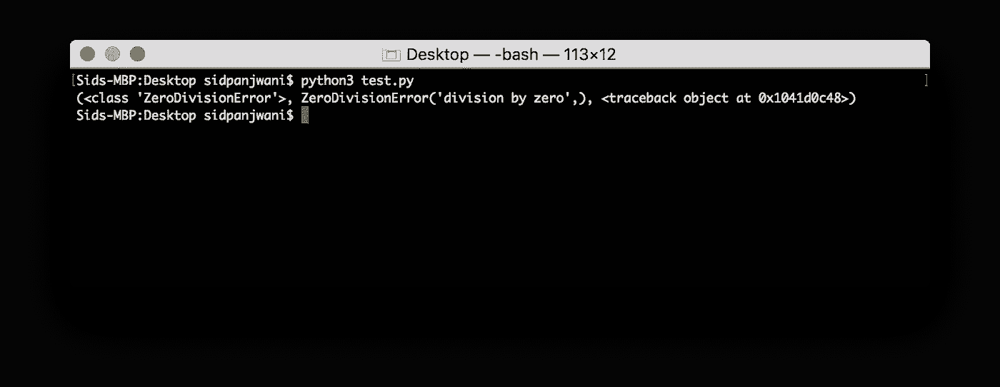
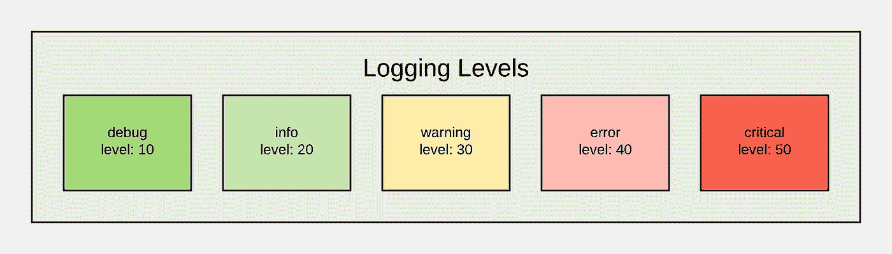
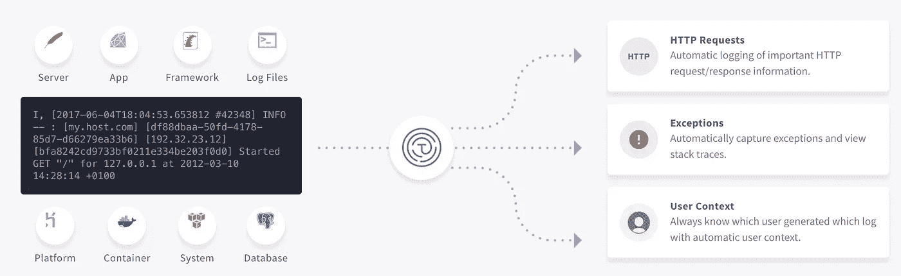

# Pythonic 日志指南

> 原文：<https://medium.com/hackernoon/the-pythonic-guide-to-logging-df7b088f99dd>

> 披露: [**流形**](https://bit.ly/2lk2sCG) **，**开发者集市，此前曾赞助过黑客正午。 [**使用 code HACKERNOON2018 获得任何服务 10 美元的折扣。**](https://bit.ly/2lk2sCG)

如果处理得当，日志是您的可观察性套件的一个有价值的组件。日志讲述了[数据](https://hackernoon.com/tagged/data)在您的应用程序中是如何变化的。他们让你回答这样的问题:为什么 John Doe 昨天结账时收到一个错误？他提供了哪些输入？

日志记录的实践范围从非常简单的静态字符串语句到丰富的结构化数据事件。在本文中，我们将探索在 [Python](https://hackernoon.com/tagged/python) 中登录如何让您更好地了解应用程序中正在发生的事情。此外，我将探索一些最佳实践，帮助您从日志中获得最大价值。


许多 Python 教程向读者展示了如何使用`print`作为调试工具。下面是一个使用`print`作为脚本打印异常的例子:

```
>>> import sys
>>>
>>> try:
...     1/0
... except:
...     print(sys.exc_info())
...
(<class 'ZeroDivisionError'>, ZeroDivisionError('division by zero',), <traceback object at 0x101acb1c8>)
None
```



虽然这在较小的脚本中很有用，但是随着您的应用程序和操作需求的增长，`print`变成了一个不太可行的解决方案。它没有为您提供关闭整个输出语句类别的灵活性，它只允许您输出到`stdout`。它还会丢失诸如行号和生成时间等有助于调试的信息。虽然`print`是最简单的方法，因为它不需要设置，但它会很快回来咬你。将打印的包直接发送给`stdout`也是一种不好的做法，因为这剥夺了用户控制信息的能力。

# Logging . info(" Hello World to Logging ")

日志模块是 Python 标准库的一部分，从版本 2.3 开始就有了。它会自动向日志中添加上下文，如行号和时间戳。该模块使添加名称空间日志和严重性级别变得容易，从而使您能够更好地控制输出的位置和内容。

我相信学习的最好方法是去做，所以我鼓励你跟随 Python REPL。开始使用日志模块很简单，您只需做以下事情:

```
>>> import logging
>>> logging.basicConfig()
>>> logger = logging.getLogger(__name__)
>>>
>>> logger.critical('logging is easier than I was expecting')
CRITICAL:__main__:logging is easier than I was expecting
```

刚刚发生了什么？ `getLogger`为我们提供了一个 logger 实例。然后我们给它一个事件“日志记录比我预期的要简单”，级别为`critical`。

## 级别

Python 模块允许您根据事件的严重程度来区分事件。级别用 0 到 50 之间的整数表示。该模块定义了整个频谱中的五个常数，使得区分消息变得容易。



每个级别都有其特定的含义，你应该批判性地思考你正在登录的级别。

```
>>> logger.critical("this better be bad")
CRITICAL:root:this better be bad
>>> logger.error("more serious problem")
ERROR:root:more serious problem
>>> logger.warning("an unexpected event")
WARNING:root:an unexpected event
>>> logger.info("show user flow through program")
>>> logger.debug("used to track variables when coding")
```

注意到`info`和`debug`没有打印消息。默认情况下，记录器将只打印`warning`、`error`或`critical`消息。您可以定制这种行为，甚至在运行时修改它，以动态激活更详细的日志记录。

```
>>> *# should show up; info is a higher level than debug*
>>> logger.setLevel(logging.DEBUG)
>>> logger.info(1)
INFO:root:1
>>>
>>> *# shouldn't show up; info is a lower level than warning*
... logger.setLevel(logging.WARNING)
>>> logger.info(2)
```

## 格式化日志

默认格式化程序对格式化日志没有用，因为它不包含关键信息。日志模块使您可以通过更改格式来轻松地添加它。

我们将设置显示时间、级别和消息的格式:

```
>>> import logging
>>> logFormatter = '%(asctime)s - %(levelname)s - %(message)s'
>>> logging.basicConfig(format=logFormatter, level=logging.DEBUG)
>>> logger = logging.getLogger(__name__)
>>> logger.info("test")
2018-06-19 17:42:38,134 - INFO - test
```

其中一些数据，比如`time`和`levelname`可以自动捕获，但是您可以(并且应该)将`extra`上下文推送到您的日志中。

## 添加上下文

一般日志消息提供的信息和没有日志消息提供的信息一样少。想象一下，如果你必须浏览你的日志，你看到了`removed from cart`。这使得很难回答这样的问题:*该项目何时被移除？谁移除了它？他们拿走了什么？*

最好将结构化数据添加到日志中，而不是将对象字符串化来丰富它。没有结构化数据，将来很难破译日志流。处理这个问题的最好方法是将重要的元数据推送到`extra`对象。使用这个，你将能够丰富你的信息流中的信息。

```
>>> import logging
>>> logFormatter = '%(asctime)s - %(user)s - %(levelname)s - %(message)s'
>>> logging.basicConfig(format=logFormatter, level=logging.DEBUG)
>>> logger = logging.getLogger(__name__)
>>> logger.info('purchase completed', extra={'user': 'Sid Panjwani'})
2018-06-19 17:44:10,276 - Sid Panjwani - INFO - purchase completed
```

## 表演

日志记录引入了开销，需要与您编写的软件的性能需求进行平衡。虽然开销通常可以忽略不计，但是不良实践和错误会导致[不幸的情况](https://www.youtube.com/watch?v=uyIlAO390v4)。

***这里有几个有用的提示:***

*将昂贵的通话包在等级检查中*

Python 日志文档建议将昂贵的调用封装在级别检查中，以延迟评估。

```
if logger.isEnabledFor(logging.INFO):
    logger.debug('%s', expensive_func())
```

现在，`expensive_func`只有在日志级别大于或等于`INFO`时才会被调用。

*避免登录热路径*

热路径是对性能至关重要的代码，因此它经常被执行。最好避免在这里记录日志，因为这会成为 IO 瓶颈，除非因为要记录的数据在热路径之外不可用而必须这样做。

# 存储和访问这些日志

既然你已经学会了写这些(美丽的)日志，你必须决定如何处理它们。默认情况下，日志被写入标准输出设备(可能是您的终端窗口)，但是 Python 的日志模块提供了一组丰富的选项来定制输出处理。鼓励将日志记录到标准输出，Heroku、Amazon Elastic Beanstalk 和 Docker 等平台通过捕获标准输出并重定向到平台级的其他日志记录工具来构建这个标准。

**记录到文件**

日志模块使用一个“处理程序”将您的日志写入本地文件，以便长期保留。

```
>>> import logging
>>> logger = logging.getLogger(__name__)
>>>
>>> handler = logging.FileHandler('myLogs.log')
>>> handler.setLevel(logging.INFO)
>>>
>>> logger.addHandler(handler)
>>> logger.info('You can find this written in myLogs.log')
```

现在使用`grep`可以很容易地搜索你的日志文件。

```
grep critical myLogs.log
```

现在你可以搜索包含关键词如`critical`或`warning`的信息。

**旋转圆木**

Python 日志记录模块使得在一段时间间隔后或日志文件达到一定大小时记录不同的文件变得很容易。如果您想自动删除较旧的日志，或者如果您打算按日期搜索日志，这将变得非常有用，因为您不必搜索一个巨大的文件来查找一组已经分组的日志。

要创建一个每天创建一个新日志文件并自动删除超过五天的日志的`handler`，您可以使用一个`TimedRotatingFileHandler`。这里有一个例子:

```
logger = logging.getLogger('Rotating Log by Day')

*# writes to pathToLog*
*# creates a new file every day bc `when="d"` and `interval=1`*
*# automatically deletes logs more than 5 days old bc `backupCount=5`*
handler = TimedRotatingFileHandler(pathToLog, when="d", interval=1,  backupCount=5)
```

# 缺点

在观察您的应用程序时，理解日志的作用非常重要。我建议读者看一看[可观察性](https://peter.bourgon.org/blog/2017/02/21/metrics-tracing-and-logging.html)原则的 3 个支柱，因为日志应该是你在观察应用程序时可以使用的几个工具之一。日志是可观察性栈的一个组成部分，但是度量和跟踪同样如此。

*伐木可能会变得昂贵*，尤其是大规模伐木。指标可用于汇总数据和回答有关客户的问题，而不必跟踪每个操作，同时跟踪使您能够看到您的请求在整个平台中的路径。

# 包扎

如果你从这篇文章中学到什么，那就是日志是用户行为的真实来源。即使对于短暂的动作，比如将一个项目放入购物车或从购物车中取出，能够跟踪用户的步骤以获得错误报告也是必不可少的，日志允许您确定他们的动作。

Python 日志模块使这变得很容易。它允许您格式化日志，使用级别动态区分消息，并使用“处理程序”将日志发送到外部。虽然这不是您应该用来洞察用户行为的唯一机制，但它是捕获原始事件数据和回答未知问题的有效方法。

***代替你自己做这些，我们得到了一个非常棒的服务***[***here @ Timber***](https://timber.io/)***(它真的很棒)自动捕捉你的日志的上下文，使调试更容易。免费试用我们；你甚至不需要信用卡！***

将您的日志写入托管日志聚合服务会让您的生活更加轻松，因此您可以将时间集中在重要的事情上。

*免责声明:我是@ Timber 的现任员工。这一部分完全是可选的，但是我真诚地相信，登录到云会让您的生活更加轻松(并且您可以完全免费地尝试)。*

```
pip install timberimport logging
import timber

logger = logging.getLogger(__name__)

timber_handler = timber.TimberHandler(api_key='...')
logger.addHandler(timber_handler)
```

**就这样。你所需要做的就是从 [timber.io](https://timber.io/) 那里得到你的 API 密匙，然后你就可以看到你的日志了。我们从日志模块中自动捕获它们，因此您可以继续遵循最佳实践并正常记录，同时我们无缝地添加上下文。**



*本文由*[*Sid panj Wani*](https://www.linkedin.com/in/sidhanthp/)*撰写，最初发表于*[*timber . io*](https://timber.io/blog/the-pythonic-guide-to-logging/)*。*