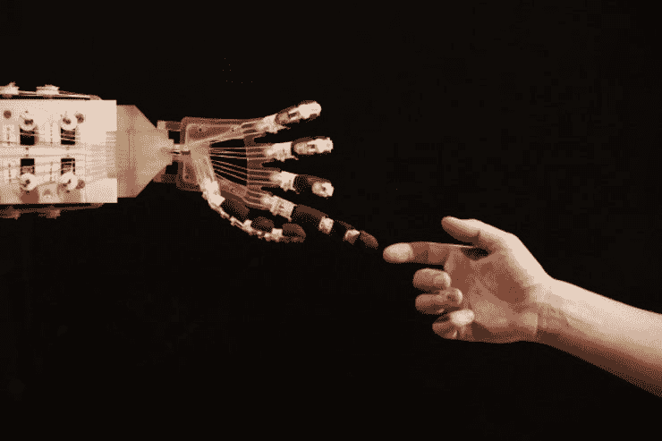
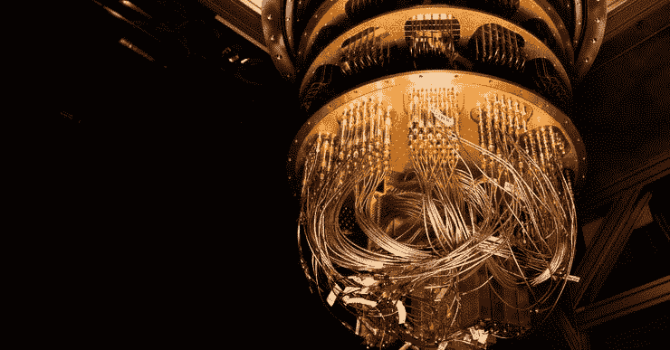
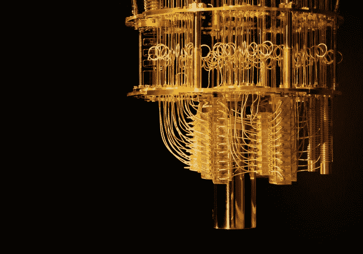
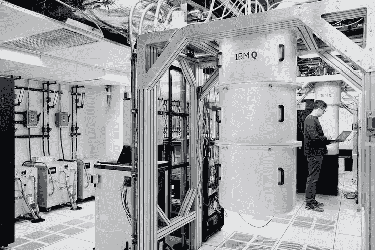
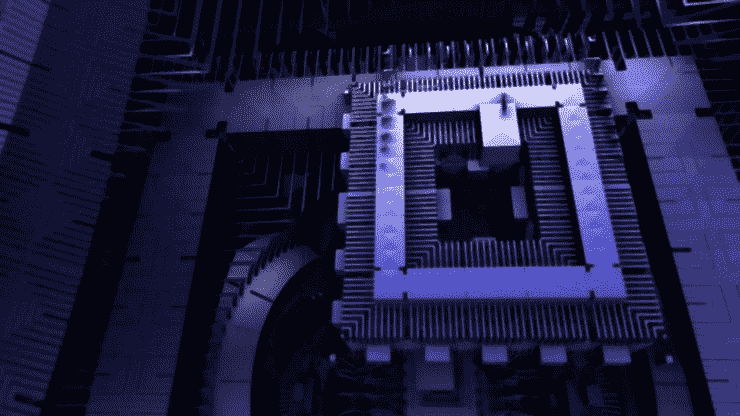
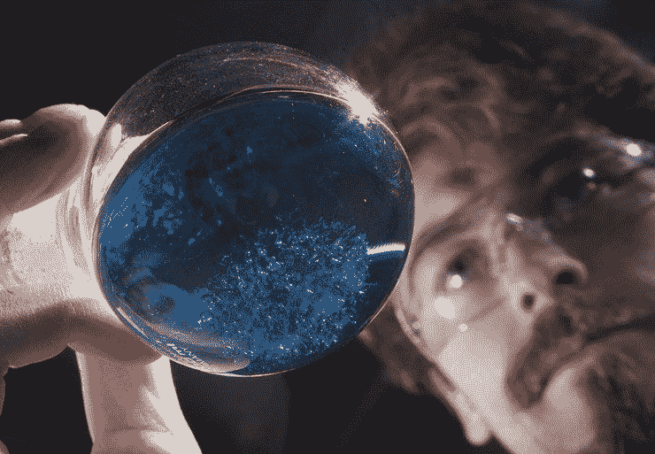
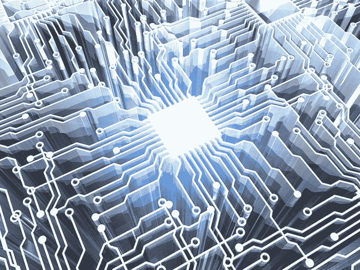
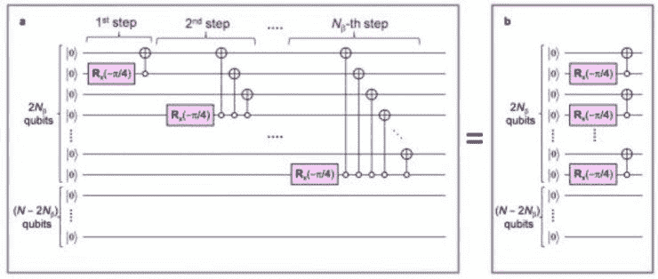
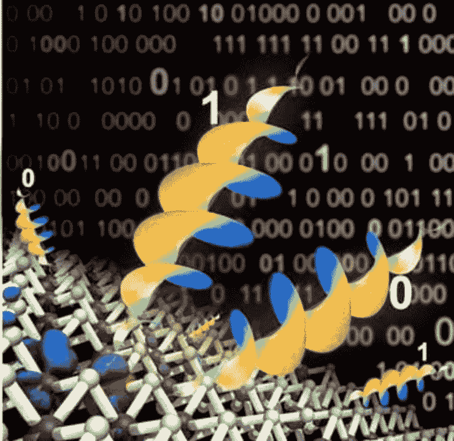

# 量子怪物

> 原文：<https://medium.com/hackernoon/the-quantum-bogeyman-quantum-computing-weekly-roundup-dec-18-2018-e9e387ee2d45>

## 量子计算每周综述

> 这是我每周电子邮件中关于量子计算新闻的综合版本。[访问主页](https://www.quantumcomputingweekly.com/)订阅更新和查看以前的问题。

👋你好，祝你星期二快乐！

这将是 2018 年的最后一期，因为我会在接下来的两周内尝试断开一点连接，享受一些与家人在一起的时间。为了补偿这一点，我已经包括了双倍的新闻报道来支持你。有趣的是，最近量子计算的安全问题似乎特别值得关注。美国情报机构甚至将量子计算列为国家安全的“新兴威胁”！(详情请见下面的新闻部分)

你在寻找量子计算的某个特定领域，希望在下一期文章中看到它吗？ [Ping 我](https://twitter.com/jesperht)然后让我知道！

# 本周的小事实

上周我们讨论了 Shor 算法，本周我们将看看另一个可能同样著名的算法:Grover 算法:

> 经典地，搜索未排序的数据库需要线性搜索，时间上是 O(N)。格罗弗的算法需要 O(N1/2)时间，是搜索未排序数据库的最快量子算法。它“只”提供二次加速，不像其他量子算法，可以提供超越经典算法的指数加速。然而，当 N 很大时，即使是二次加速也是相当可观的。(来源: [Quantiki](https://www.quantiki.org/wiki/grovers-search-algorithm) )

[卡耐基梅隆大学的优秀讲稿。](https://www.cs.cmu.edu/~odonnell/quantum15/lecture04.pdf)

[可爱的草图注释，但可能对来自 IBM 的解释稍有启发](https://quantumexperience.ng.bluemix.net/proxy/tutorial/full-user-guide/004-Quantum_Algorithms/070-Grover's_Algorithm.html)

[格罗弗的动画可视化工具](http://davidbkemp.github.io/animated-qubits/grover.html)

# 学习

[上周](https://www.quantumcomputingweekly.com/issues/what-s-shor-s-algorithm-quantum-computing-weekly-7-149952)我们谈了一些 Shor 算法，本周我们有一个我最喜欢的 youtube 节目之一 Infinite Series 的精彩视频，正好涵盖了这个主题。看着享受吧！

# 新闻

[**美国情报界称量子计算和人工智能对国家安全构成“新兴威胁”**](https://techcrunch.com/2018/12/13/us-intelligence-quantum-computing-artificial-intelligence-national-security-threat/?utm_campaign=Quantum%20Computing%20Weekly&utm_medium=email&utm_source=Revue%20newsletter)**——**[**techcrunch.com**](https://techcrunch.com/2018/12/13/us-intelligence-quantum-computing-artificial-intelligence-national-security-threat/)

你很难将核武器、恐怖主义和气候变化与量子计算、人工智能和物联网放在一起，但美国政府认为所有这些都对其国家安全构成“新威胁”。

[**量子计算需要你帮助解开它的核心谜团**](https://www.wired.com/story/quantum-computing-needs-you-to-help-solve-its-core-mystery/?utm_campaign=Quantum%20Computing%20Weekly&utm_medium=email&utm_source=Revue%20newsletter)**——**[**www.wired.com**](https://www.wired.com/story/quantum-computing-needs-you-to-help-solve-its-core-mystery/)

量子计算机的建造者希望更多的编码员使用他们的机器，并找出它们真正的用处。

[【www.techspot.com】](https://www.techspot.com/news/77887-new-type-quantum-computer-has-smashed-every-record.html?utm_campaign=Quantum%20Computing%20Weekly&utm_medium=email&utm_source=Revue%20newsletter)【**——**[**一种新型量子计算机打破了每一项记录**](https://www.techspot.com/news/77887-new-type-quantum-computer-has-smashed-every-record.html)

IonQ 建立在一场赌博上，即“俘获离子量子”计算可能会胜过谷歌和其他公司正在建造的硅基量子计算机。

[**量子计算机威胁网络安全。世界现在必须行动起来。**](http://fortune.com/2018/12/15/quantum-computer-security-encryption/?utm_campaign=Quantum%20Computing%20Weekly&utm_medium=email&utm_source=Revue%20newsletter)**——**[**fortune.com**](http://fortune.com/2018/12/15/quantum-computer-security-encryption/)
如果我们不采取行动提高网络加密标准，量子计算机将破坏世界的数字安全。

[**量子计算将解决的 5 个棘手问题**](https://interestingengineering.com/5-intractable-problems-quantum-computing-will-solve?utm_campaign=Quantum%20Computing%20Weekly&utm_medium=email&utm_source=Revue%20newsletter)**——**[**interestingengineering.com**](https://interestingengineering.com/5-intractable-problems-quantum-computing-will-solve)
计算机科学中最著名的无法解决的问题正是量子计算能够解决的那类问题。我们着眼于这些问题在经济的五个领域所带来的挑战，以了解它们是如何被破坏的。

[**克雷格·赖特对量子计算的(非)可行性攻击**](https://coingeek.com/craig-wright-nonviability-quantum-computing-attacks/?utm_campaign=Quantum%20Computing%20Weekly&utm_medium=email&utm_source=Revue%20newsletter)**——**[**coingeek.com**](https://coingeek.com/craig-wright-nonviability-quantum-computing-attacks/)
中国首席科学家克雷格·赖特博士对量子计算最终导致加密货币安全风险的观点提出质疑。

企业家和物理学家**——**[**【gizmodo.com】**](https://gizmodo.com/its-time-to-plan-for-how-quantum-computing-could-go-wro-1831075632)
可以破解我们最强加密方法的量子计算机可能需要几十年的时间——但一群企业家和研究人员认为我们最好现在就开始谈论伦理。

[**铜化合物作为有前途的量子计算单元**](https://phys.org/news/2018-12-copper-compound-quantum.html?utm_campaign=Quantum%20Computing%20Weekly&utm_medium=email&utm_source=Revue%20newsletter)**——**[**phys.org**](https://phys.org/news/2018-12-copper-compound-quantum.html)

“为了能够将分子用作量子比特——量子计算机中的基本信息单位——它需要有足够长的寿命的[自旋状态](https://phys.org/tags/spin+state/)，可以从外部操纵，”教授温弗里德·普拉斯博士解释道

[**实用的量子计算机至少还要十年才能问世**](https://physicsworld.com/a/practical-quantum-computers-remain-at-least-a-decade-away/?utm_campaign=Quantum%20Computing%20Weekly&utm_medium=email&utm_source=Revue%20newsletter)**——**[**physicsworld.com**](https://physicsworld.com/a/practical-quantum-computers-remain-at-least-a-decade-away/)

（..)建造一台大型的、容错的量子计算机，而这种计算机在未来十年内是不太可能建造出来的。这是根据美国国家科学、工程和医学科学院的一份报告。

[**量子计算机上的量子化学计算**](https://www.sciencedaily.com/releases/2018/12/181214110805.htm?utm_campaign=Quantum%20Computing%20Weekly&utm_medium=email&utm_source=Revue%20newsletter)**——**[**www.sciencedaily.com**](https://www.sciencedaily.com/releases/2018/12/181214110805.htm)
一种新的量子算法在量子计算机上实现了全 CI 等量子化学计算，没有指数/组合爆炸，首次给出了原子和分子的薛定谔方程的精确解。

[**不完美让光子成为量子计算的完美之选**](https://www.nanowerk.com/nanotechnology-news2/newsid=51732.php?utm_campaign=Quantum%20Computing%20Weekly&utm_medium=email&utm_source=Revue%20newsletter)**——**[**www.nanowerk.com**](https://www.nanowerk.com/nanotechnology-news2/newsid=51732.php)
科学家展示了原子平面材料如何按需产生偏振光子。

## [量子计算在什么意义上是一门科学？](http://cognitivemedium.com/qc-a-science?utm_campaign=Quantum%20Computing%20Weekly&utm_medium=email&utm_source=Revue%20newsletter)

[cognitivemedium.com](http://cognitivemedium.com/qc-a-science)

在这最后一篇文章中，我们将以更具哲学意味的方式结束，回顾时间/历史以及它对科学的意义。

# 感谢阅读！投稿？

写了一篇有趣的博文或者发现了一些关于量子计算的趣事分享？发现了一个错误？通过电子邮件(点击回复)或在 twitter 上 ping 我来保持联系( [@jesperht](https://twitter.com/jesperht) )。