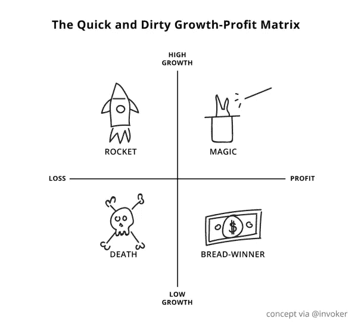

# 快速而肮脏的增长利润矩阵

> 原文：<https://medium.com/hackernoon/the-quick-and-dirty-growth-profit-matrix-908a001e15d4>

[*瑞安·霍姆斯*](https://www.fastcompany.com/user/ryan-holmes)

增长还是利润？对于科技初创公司来说，这是一个百万美元(有时是十亿美元)的问题。如果要拓展业务，一般都要花钱。但什么时候不惜一切代价的增长变成了一种鲁莽的策略？如何在成长和燃烧之间找到合适的平衡点？

科技界对这个问题的最后一次重大清算要追溯到 2014 年 3 月，当时硅谷宠儿 [Box](https://www.fastcompany.com/company/box) 提交了一份 S-1 文件，表明它准备进行 IPO。多年来，向企业提供基于云的内容管理软件的 Box 一直在快速增长。投资者愿意忽略该公司损失的巨额资金，理由是其长期潜力。

但是后来意想不到的事情发生了。市场发生了变化。投资者保持观望。有传言称，Box 的“单位经济学”不起作用。所以这家公司等了九个月才最终上市。新的态度是:增长很重要，但公司也需要盈利(或至少显示出清晰的盈利路径)。

那么这两个基本面之间的最优比例是多少呢？最终，答案仍然是相当主观的，但有一个非常简单的图表可以帮助你理清头绪。

# 满足增长利润矩阵

有很多方法可以评估你的创业公司是否已经取得了增长和利润的平衡——真正的问题是“刚刚好”到底意味着什么。例如，[现在著名的“40 法则”](http://feld.com/archives/2015/02/rule-40-healthy-saas-company.html)认为，一个成功的软件即服务(SaaS)初创公司的增长率和利润之和应该是 40:例如，如果你的增长率是 60%，你可以承受损失 20%。

但我是一个高度视觉化的人，开始想知道是否有一种方法可以用图形来表达这种动态。考虑到 Hootsuite 自己的轨迹，我拼凑了这个超级简单的图表:

现在，我意识到这远非科学，我也知道基本概念不是新的或革命性的——从波士顿咨询集团到风险投资家 Tomasz Tunguz，每个人都使用这样的图表来评估企业。这是非常基本的，但是——一眼就能让你知道你的公司是否朝着正确的方向前进。

不用说，这里的左下象限通常是你*不想*发现自己的地方。除了少数例外，你不希望你的创业公司赔钱并且没有真正成长。这是一个明确的信号，表明你还没有掌握产品的市场适应性。

左上角是大多数有前途的创业公司的起点。这绝对是 Hootsuite 早期所在的地方。我们在赔钱，但理由都很充分:为了快速增长，我们耗尽了投资。回想起来，这种方法让我们在社交关系平台领域大大领先于我们的竞争对手。

随着我们逐渐成熟，我们的优先事项也发生了变化。增长仍很重要，但投资者和分析师越来越关注如何实现盈利。所以我们减少了开支，勒紧裤带，要求员工少花钱多办事。去年，我们[实现了现金流的里程碑](https://www.linkedin.com/pulse/how-run-billion-dollar-company-2016-ryan-holmes?trk=mp-reader-card)。毫无疑问，我们现在是一家更健康的公司，一家为赚钱而生的公司*和为持续赚钱而生的公司*。

# 一场持续不断的四方游戏

“收支平衡”的想法听起来可能不像是一个里程碑，但如果你看看我们这个领域中类似规模的公司，它实际上是一种革命。我们是一个有八年历史的企业，我们仍在快速增长，但我们实际上是现金正的。对于大多数云公司来说——从 Zendesk 和 Marketo 到 Hubspot 和 Shopify——直到 IPO 后的两到四年，收支平衡的想法才会出现。

因此，当谈到增长利润矩阵时，关键是要在正确的时间将自己置于正确的象限——要知道试图永远停留在那里可能不符合你的最佳利益。对于很多创业公司来说，这是很容易错过的。

另一方面，如果我们把这四种类型的增长率-利润率看作是按时间顺序排列的阶段，我们可能会失败。我不认为我们的高速增长时代已经结束。虽然同时实现高盈利和高增长并不容易，但有一种方法可以打破图表中难以捉摸的右上象限(如果你不得不放慢速度，重新聚焦一段时间，还可以回到右上象限):持续创新。通过开发新的产品线和寻找新的方法[为客户带来真正的利益](http://www.amanet.org/training/articles/profitability-vs-growth-how-to-achieve-both.aspx)，有可能在扩大市场份额的同时保持高利润。

例如，在我们的案例中，我们已经在核心平台中构建了新的功能，包括[购买社交媒体广告](https://hootsuite.com/products/social-ads)的能力。我们还增加了一些功能，使我们的仪表板不仅对营销人员有用，而且对净新受众也有用——即[销售](https://hootsuite.com/solutions/social-selling?utm_source=publication&utm_medium=earned_media&utm_campaign=ryan_thought_leadership)和客户服务团队。所有这些步骤都符合我们的长期目标，即成为 100 亿美元的公司，这是基于高增长和高利润的。

利润增长问题没有简单的答案。更重要的是，你永远不能停止问这个问题，因为正确的答案可能会根据情况而改变。根据你所在的行业和公司所处的阶段，“成功”可能意味着一个非常不同的比率，而不是一个不同阶段的不同创业公司。最终，每个投资者都主要关心一件事:你的公司在其生命周期中产生了多少现金流。你现在可能无法盈利，但是需要有一个清晰的盈利途径，最好是在不久的将来——不管你的商业想法有多么开创性。

*本文* [*文章*](https://www.fastcompany.com/40424468/this-ceo-doodled-a-chart-to-help-your-startup-balance-growth-with-profit) *原载于* [*快公司*](https://www.fastcompany.com/) *经许可转载*。

**更多来自快公司:**

*   [减少雇佣和缓慢增长的理由](https://www.fastcompany.com/3050317/how-and-why-to-hire-less-and-grow-as-slowly-as-possible)
*   [为什么这位 CEO 任命一名员工来改变愚蠢的公司规则](https://www.fastcompany.com/3068931/why-this-ceo-appointed-an-employee-to-change-dumb-company-rules)
*   [关于成功创始人的三个不朽神话](https://www.fastcompany.com/40483237/three-myths-about-successful-founders-that-just-wont-die)