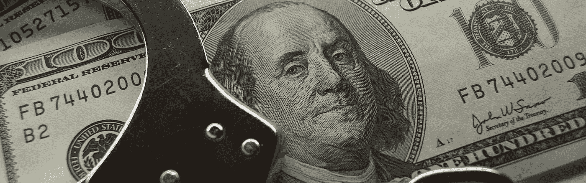

# 证券交易委员会关于 ico 新指南的快速和肮脏的法律指南

> 原文：<https://medium.com/hackernoon/the-quick-and-dirty-legal-guide-on-the-secs-new-guidance-on-icos-2e74d51f648d>

自从美国证券交易委员会今年早些时候开始对“未注册”的 ico 采取零星行动以来，整个行业已经停止了发展。

尽管法律专家能够根据 SEC 的评论、意见书和执法行动对形势有一个合理的理解，但监管并不确定。

例如，我们知道，SEC 认为 ico 是需要在 SEC 注册或符合注册豁免的证券产品。但即使知道了 SEC 希望该行业遵循的总体框架，也不清楚 ICOs 究竟应该如何进行。

如何启动完全兼容的安全令牌？这对以前完成但未注册的 ico 意味着什么？如果令牌是一种证券，中央加密交易所是否需要像其他证券交易所一样在 SEC 注册？分散加密交换怎么样？

每个人都迫不及待地想听到证交会对这些关键问题的回应。这个问题的答案可能意味着两者之间的区别，一方面，成功筹集数百万美元的资金，另一方面，在被高端白领辩护律师破产后，在监狱里度过接下来的几年。

幸运的是，证交会终于发话了。在上周发布的一份公开声明中，SEC 概述了对 ico、加密投资工具、集中式和分散式交易所的一些关键要求，以及加密相关业务何时必须注册为经纪自营商。

SEC 的这份声明为该行业带来了更多的监管清晰度，并且与我们过去一年在 [*Crypto Law Insider*](http://cryptolawinsider.com/) 所做的预测非常一致。要获得 SEC 声明的完整概要以及这些声明对所有相关人员的影响，请继续阅读

# 初始代币发行

虽然他们之前暗示过，但 SEC 现在明确阐述了他们判断[令牌何时是证券](https://cryptolawinsider.com/security-token/)的标准，正如我们所料，这是基于美国最高法院的“豪威测试”

我个人的看法是，用一个~70 年前创造的法律标准来判定代币是否是证券，这是没有意义的，但我不制定法律，我只是在上面发表意见。

所以现在，我们可以肯定地说，ico 必须在 SEC 注册，或者符合注册豁免条件，以避免民事和刑事起诉。因此，所有希望通过象征性发行筹集资金的项目都必须准备好面对漫长的 SEC 合规官僚程序，其中包括支付数十万美元或更多的法律和会计费用。

幸运的是，项目仍然有可能符合注册豁免。虽然这不会将项目*完全*从 SEC 合规要求中移除，但它可以显著降低与证券发行相关的总体法律和合规成本。

为了证明他们的权威，并吓唬行业的其他人遵守规定，SEC 瞄准了两家非法的 ICO，AirFox 和 Paragon，这两家公司都被罚款，被迫追溯登记其证券发行，并向其 ICO 投资者提供解约权。

对 AirFox 和 Paragon 的处理方式意义重大，因为它凸显了其他进行非法证券发行的 ICO 发行者未来遵守 SEC 法规的道路。

鉴于他们的 ico 现在被认为是“非法的”,已经有几个项目找到我，要求我帮助他们达到 SEC 标准。如果你之前推出了一个未注册的 ICO，并担心你会成为下一个目标，我建议你也这样做。

# 加密投资工具

SEC 的执法重点不仅仅是 ico。相反，SEC 正在检查整个加密生态系统，以确定 SEC 参与的必要性，包括持有或建议加密的投资工具。

SEC 在其指南中确认，所有加密投资工具必须在《投资公司法》规定的注册、监管和信托义务范围内持续运营。这意味着作为集合资本投资 crypto 的企业(如对冲基金、共同基金、ETF……)必须像传统基金一样获得许可。

为了说明他们的立场，SEC 重点提到了 9 月份的 Crypto Asset Management 及其创始人蒂莫西·恩内金(Timothy Enneking)的案件，他被指控未能将该基金注册为投资公司。

Crypto Asset Management 曾宣称自己是“美国首只受监管的加密资产基金”，但实际上从未注册过自己，也从未公开发行过该基金。作为惩罚，该基金不得不立即停止运营，支付 20 万美元罚款，并提出以原发行价从受影响的投资者手中回购股票。

近年来，我们已经看到投资基金在加密生态系统中大量涌现。如果你已经建立了这些基金中的一个，这是一个明确的警告，现在是时候在 SEC 注册你的基金了。

# 密码交换

SEC 确认，所有证券交易平台都必须注册，无论是集中式还是分散式。美国证交会强调，它将采取“功能方法”，通过考虑相关事实和情况，来确定一个交易平台是否符合交易所的标准。SEC 将评估买卖双方之间实际发生的活动，而不是技术或术语，以确定该系统是否作为一个需要监管的市场运行。

这项裁决的第一个受害者是 EtherDelta，SEC 本月早些时候对其罚款 38.8 万美元。根据美国证券交易委员会的说法，以太三角洲(没有以任何身份在美国证券交易委员会注册)通过联合使用订单簿、显示订单的网站和在以太坊区块链运行的智能合同，为密码的买家和卖家提供了一个市场。

EtherDelta 的智能合约被编码为验证订单消息、确认订单的条款和条件、执行配对订单，并指示分布式分类帐进行更新以反映交易。美国证券交易委员会发现，以太三角洲的活动显然属于交易所的定义，以太三角洲的创始人导致该平台未能注册为交易所，也未能根据豁免进行运营。

展望未来，很明显*所有的*交易所都需要在美国证券交易委员会注册，以遵守法律，至少应该准备引入[更强有力的 KYC/反洗钱流程](https://cryptolawinsider.com/kyc-aml/)。

# 经纪人-交易商注册

与传统证券的情况一样，任何为 ico 发行提供便利的人都可能充当“经纪人”或“交易商”，他们需要在 SEC 注册并获得 FINRA 的许可。

这意味着任何从事为他人进行证券交易的人都必须获得许可。虽然我们通常认为投资银行或证券经纪公司是经纪自营商，但这个定义可以更广泛。

美国证券交易委员会强调了 TokenLot 的案例，这是一个“ICO 超市”，投资者有能力购买 ICO。虽然 TokenLot 不是传统的证券交易所，但其活动包括营销和促进 crypt 的销售，接受投资者的订单和付款资金，以及向 ICO 发行人支付收益。TokenLot 还根据 ico 募集的收益的一定比例获得补偿，但有最低佣金保证。

美国证券交易委员会命令 TokenLot 支付约 50 万美元的罚款，并禁止其创始人在至少 3 年内经营另一家投资公司。

据证交会官员说，托肯洛特很容易就逃脱了。

“此案中的处罚反映了 TokenLot 的及时合作和补救措施……”证交会执法部门的联席主管史蒂文·佩金(Steven Peikin)表示。“token lot……向委员会工作人员提供了有价值的信息，制止了这种行为，并向投资者退款。”

# 这对密码法律内部人士意味着什么？

虽然看到与加密相关的项目被关闭并不令人愉快，但至少 SEC 为该行业提供了监管透明度。这些令人不快的举动将为*内部人士*提供前进的必要框架。

当然，我们不太可能看到像 2017 年那样疯狂的 ICO 活动，尽管考虑到所有的骗局和欺诈，这可能是一件好事。展望未来，我们应该看到对更多高质量项目的重视，由愿意并能够获得 SEC 注册的有能力的团队提供支持。

业内人士应该做好准备，迎接 SEC 针对之前完成但未注册的 ico 的一波诉讼。我将很快写下这一点，但我怎么强调都不为过，对于坦白从宽来说，这个窗口是多么有限。美国证券交易委员会已经展示了一条合规之路，它希望发行人能够走这条路。如果你在 ICO 发起，我鼓励你立即寻求法律顾问。不这样做可能会导致远远超过金钱罚款。

*原载于 2018 年 11 月 27 日*[*【cryptolawinsider.com*](https://cryptolawinsider.com/breaking-sec-guidance-on-icos/)*。*