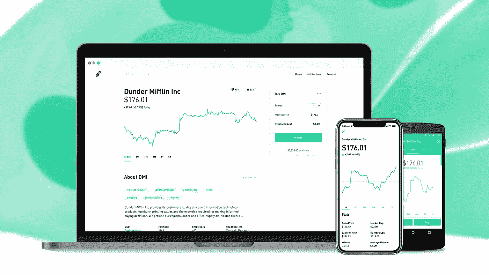

# 为你的设计挑选颜色的快速实用指南

> 原文：<https://medium.com/hackernoon/the-quick-practical-guide-to-picking-colors-for-your-designs-81dc8fe4f784>

## 为你的设计添加色彩的 4 步框架

如果人们不知道如何浏览你的[设计](https://hackernoon.com/tagged/design)，拥有一个漂亮的调色板也没用。

任何人都可以选择很棒的颜色，但是使用颜色来引导用户进行新的体验本身就是一门艺术。作为设计师，颜色是你腰带上最强大的[工具](https://hackernoon.com/tagged/tools)之一。

任何时候你选择颜色，你的主要目标都应该是增加设计的可用性和可理解性。这里有一个快速指南，告诉你如何创建不仅好看，而且让你的设计更容易被第一次使用的用户理解的调色板。

# 1.明确你的目标

我们都知道当你开始毫无目的地添加功能时会发生什么…

颜色也是如此。

就像线框图一样，你不能开始为一个设计创建调色板，除非你已经建立了一个目的。

幸运的是，手里拿着拍纸簿，问自己三个简单的问题，就可以轻松完成。

## 你的关键信息是什么？

## 你为什么要做这个设计？

## 你希望你的用户有什么样的感受？

使用这些问题的答案作为你的颜色选择过程的一个松散框架。等待随机的灵感用完美的调色板填满你的大脑不会有好的回报。

拥有一个系统来持续地创建伟大的调色板要有效得多。

猜猜看，你刚刚完成了系统的第一部分。

# 2.识别您的用户

颜色几乎是一种通用语言。

关键词是*几乎*。

通过与全球各地的客户合作，我们真正了解了不同地区的用户对不同调色板的反应。

尽管不管你在世界的哪个角落，许多颜色都有着普遍的含义，但其他颜色则因文化背景和地理位置的不同而有着不同的含义。

根据你设计的地区，这一点尤为重要。

例如，绿色被普遍认为是一种证明，一种成功的状态，或者是前进的信号。

另一方面，红色根据你所处的位置有很大的不同。

这里重要的部分是研究。在美国，红色通常与紧急状态、失败和激情联系在一起。在中国，人们把红色与繁荣、幸福和幸运联系在一起。

大多数情况下，它们是微小的差异，但是当你为多个地区设计时，仅仅几个颜色就可以代表整个世界。

# 3.获得灵感

你不能等着灵感来找你。你需要*找到*灵感。

如果你找对了地方，其实很容易。

在 Melewi，我们都是在开始任何设计工作之前使用 [Dribbble](http://dribbble.com) 、 [Behance](http://behance.com) 、 [Pinterest](http://pinterest.com) 和 [WebGradients](https://webgradients.com) 等网站创建 moodboards 的狂热粉丝。

看看其他设计师的作品有助于你了解哪些颜色搭配得好，哪些颜色不协调。这也有助于你了解你所在行业的流行色彩趋势。

**当我们挑选颜色时，我们并没有不断尝试重新发明轮子。我们只是想让轮子尽可能好用。**

不要害怕走出 UI 设计的世界去寻找灵感。看看当地的建筑，参观你所在城市的艺术博物馆，在大自然中散步，可以说是获得灵感和创造真正独特的调色板的最佳方式。

# 4.挑选你的调色板

当你已经为你的设计建立了一个基本的基础时，创建一个动态调色板是最容易的。

换句话说，**总是从风格指南**开始你的设计。

所有的界面和产品最终都会有所不同，但是你最终几乎总是需要相同的基本资产。

至少，这意味着选择你的字体，按钮设计，导航条，你猜对了，你的调色板。

对于大多数设计，您需要选择:

## 原色强调色

## 次要强调色

## 背景颜色

## 错误颜色

## 成功颜色

你设计的主调通常应该是品牌最容易识别的颜色，所以在挑选调色板的其他颜色时要记住这一点。

对于 CTA、错误状态和成功状态，更多的是关于**清晰度**而不是实际颜色。只要你的 CTA 和不同的按钮状态之间有明显的对比，你应该没问题。

绿色不一定是你走向成功的颜色。

不要害怕尝试，但是不要选择让你的界面很难导航的颜色。

有时候，最好的设计是那些通过挑战所有当前趋势——包括调色板——来颠覆其行业的设计。如果你还没有，当你有空的时候，看看《罗宾汉》。

Photo: Robinhood blog

他们已经成为增长最快的股票交易平台，凭借独特的调色板和简约的设计吸引了千禧一代。他们的两个交易平台都拥有你不会发现他们的竞争对手使用的颜色和设计。

几乎整个界面只使用了四种颜色，Robinhood 依靠它们的调色板在整个用户体验中传达关键信息。

这是任何成功的调色板的主要组成部分。将看起来不错的颜色搭配在一起很容易，但选择能引导用户通过新界面的颜色则完全是另一回事。

喜欢这篇文章？查看我们的博客了解更多—[http://melewi.net/blog](http://melewi.net/blog/)