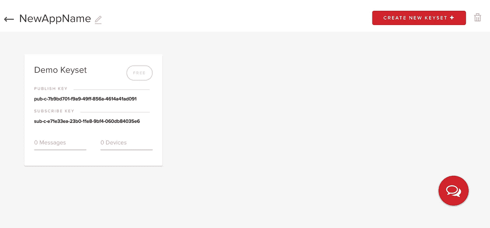

# 使用 PubNub EON 进行实时分析的最快方法

> 原文：<https://medium.com/hackernoon/the-quickest-way-to-have-real-time-analytics-using-pubnub-eon-f7f9a11d9ea2>

## 我花了不到一天的时间创建了一个非常基本的实时平台，并允许我以易于理解的格式查看加密货币价格的实时分析。


似乎无论你走到哪里，都有一些大公司试图用复杂的环境来获取你的数据，这些环境需要花费大量的时间来设置，但不像宣传的那样可扩展😫。

> 看在上帝的份上😤我只想快速构建一些东西，并在需要时添加功能。

我最近发现了 [PubNub](https://www.pubnub.com/) ，并认为它值得一篇过于复杂的文章来巩固我自己的理解，然而它也有易于使用的额外好处。所以也许这不会太复杂。

# 让我们点燃并编码😌🔥

首先，确保你有所有这些东西的最新版本:

*   勇气🦁
*   固执🐯
*   精神💃🕺
*   [阿帕奇🚁](https://httpd.apache.org/)(或其他网络服务器)

现在进入您的 IDE 开始编码。就我个人而言，我将使用 [c9](http://c9.io) ，因为它建立了一个快速的环境，我不必担心在线保存我的代码，因为 IDE 已经托管在 [***云*** ☁ ***中。***](https://www.howtogeek.com/howto/32016/what-is-cloud-computing-and-what-does-this-stupid-buzzword-mean/)

很好，现在创建两个名为`js`和`css`的文件夹。这些将包含我们的不同文件，将在我们的 index.html(主页)使用。

我选择的武器是终端，所以我将*输入*以下命令来让我的环境运行起来。

```
$ mkdir punhub && cd punhub
$ mkdir js
$ mkdir css
```

现在是创造我们的 index.html 的最佳时机。这个文件将是我们的页面结构的位置。

在这个文件中，你需要添加你想要显示数据的图表类型。我们将专注于建立一个网站，向我展示我正在关注的不同加密货币的价格，所以我将使用[样条图](https://www.pubnub.com/developers/eon/chart/spline/)。

为了让不同的组件在 PubNub 上工作，我们需要添加它们的 javascript 标签。当使用普通的 HTML/JSS/CSS 时，我倾向于把我所有的 javascript 文件放在结束的`</body>`标签的底部，因为它允许网页在抓取插入所有的 javascript 之前可视化地加载。

```
<!-- PubNub Eon -->
    <script type="text/javascript" src="//pubnub.github.io/eon/v/eon/1.0.0/eon.js"></script>
    <link type="text/css" rel="stylesheet" href="//pubnub.github.io/eon/v/eon/1.0.0/eon.css"/> 
```

接下来，我们需要导航到我们的`js`文件夹并创建一个名为`eon.js`的文件。在该文件中，我们将添加所有与 PubNub 相关的 javascript。

PubNub 的 javascript 流从创建一个新的 PubNub 对象开始。

```
let pubnub = new PubNub({
      publishKey: 'your unique key',
      subscribeKey: 'your other unique key '
});
```

该对象需要两个密钥。第一个键是向 PubNub 发送数据，第二个键是侦听来自 PubNub 的数据。要获得这两个密钥，我们需要创建一个新帐户，然后在 PubNub 仪表板中创建一个新应用程序。



一旦创建了新的应用程序，我们就会看到我们获得了发布密钥和订阅密钥。

# 图表图表图表

现在让我们把*插入*😌我们的图表。我们可以通过在我们的`eon.js`文件中[初始化](https://en.wikipedia.org/wiki/Initialization_(programming))来做到这一点。

```
eon.chart({
  channels: ['crypto-chart'], //Where the data will be received from
  history: true, // maintains data
  flow: true,
  pubnub: pubnub, //pubnub object with keys
  generate: {
    bindto: '#chart', // tag in html where chart will be inserted
    data: {
      labels: false
    }
  }
});
```

当我们初始化时，我们还需要在我们的`index.html`中创建一个连接标签，它与我们的`bindto`中的名称具有相同的`id`。

```
<div id='chart'>
    Spline chart
</div>
```

好了，我们的图表运行了，但是没有数据。

这就是我们的 publish 键发挥作用的地方，因为我们可以开始将数据发布到我们的 PubNub 通道。

```
$.getJSON( "[https://min-api.cryptocompare.com/data/price?fsym=USD&tsyms=XVG,TRON,ZIL,DGB](https://min-api.cryptocompare.com/data/price?fsym=USD&tsyms=XVG,TRON,ZIL,DGB)", function( json ) {
      var dateCurrent = new Date();
      var dateMilli = dateCurrent.getTime();

      pubnub.publish({
        channel: 'crypto-chart',
        message: 
          {"eon":{
            "XVG": json.XVG,
            "TRON": json.TRON,
            "ZIL": json.ZIL,
            "DGB": json.DGB,
            "_eonDatetime": dateMilli
            }
          }
        });
    })
```

现在，正在从一个 [REST api](http://searchmicroservices.techtarget.com/definition/RESTful-API) 中获取数据，并以可读格式(由 PubNub 定义)将数据发送到我们的通道。但是它只发送一次数据，我们想要实时的、不断更新的数据，所以在同一个`eon.js`文件中，我们可以添加一个间隔，继续无限期地获取数据。

```
setInterval(() => {
    $.getJSON( "[https://min-api.cryptocompare.com/data/price?fsym=USD&tsyms=XVG,TRON,ZIL,DGB](https://min-api.cryptocompare.com/data/price?fsym=USD&tsyms=XVG,TRON,ZIL,DGB)", function( json ) {
      var dateCurrent = new Date();
      var dateMilli = dateCurrent.getTime();

      pubnub.publish({
        channel: 'crypto-chart',
        message: 
          {"eon":{
            "XVG": json.XVG,
            "TRON": json.TRON,
            "ZIL": json.ZIL,
            "DGB": json.DGB,
            "_eonDatetime": dateMilli
            }
          }
        });
    })
},2000)
```

你有它！我们以极低的延迟运行完全实时的图表。


Goodboy!!!

# 展望未来👀

我正在我的 [GitHub](https://hackernoon.com/tagged/github) 上发布代码，所以请随意添加到这个项目中并改进它。您可以添加的一些点可能是连接到一个 api，该 API 提供了一个更新的数字，或者允许用户选择他们可以查看的货币。

还有其他来自 [PubNub](https://hackernoon.com/tagged/pubnub) 的制作图表的选项，你可以在这里查看[。](https://www.pubnub.com/developers/eon/)

这里可以看到我的[PunHub](https://punhub-analytics-stackezz.c9users.io/index.html)。

如果你有任何问题，欢迎来信。