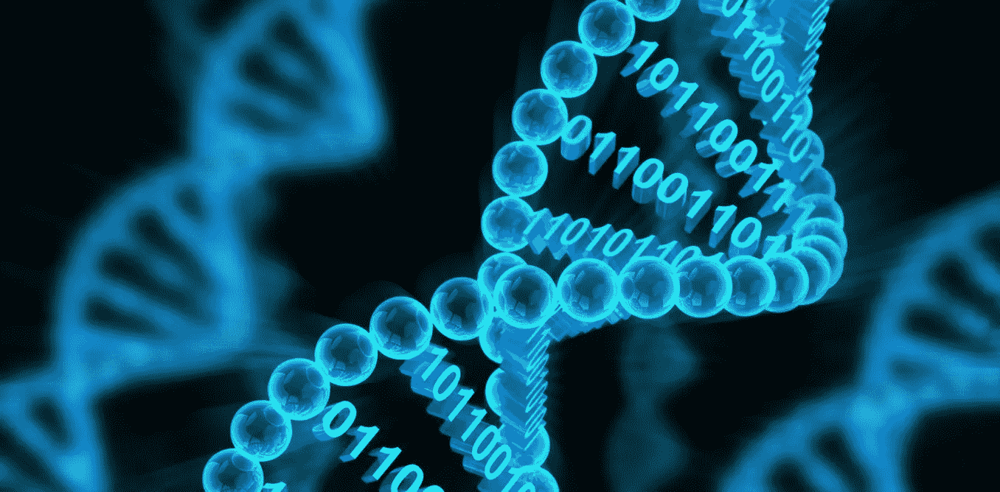

# 典型的 DNA 存储机制可能是分散的

> 原文：<https://medium.com/hackernoon/the-quintessential-dna-storage-mechanism-is-decentralised-9b0453d891d9>

## 利用区块链技术为未来的 DNA 生态系统奠定基础

区块链基础设施的灵活性吸引了许多垂直行业的创新者、企业家和开发者(比去年更是如此)。许多人开始真正意识到分布式账本技术的价值，尤其是在数据安全方面。

用简单的话来说，区块链可能是最好的描述，即由众多参与者组成的共识机制控制的仅附加数据库(没有层级或集中的监督者)。与传统数据库相比，这意味着攻击者没有攻击目标的中心故障点。当一个“块”(数据块)被添加到网络中时，有问题的参与者将各自维护该分类帐的副本，并将其与他们的对等方的副本同步。

乍一看，这似乎不是特别令人兴奋，但事实上，这是一个非常强大的工具——添加到分类帐的每个块都与前一个块加密链接，这意味着任何改变信息的尝试都将被其余参与者自动拒绝。因此，区块链经常被吹捧为不可改变的和防篡改的。

这种网络的安全性源于这种结构、对等级别的拓扑以及使用强大的加密技术(私人/公共密钥对)来确保只有上传数据的个人才能解密数据或证明所有权。

**走向医疗应用**

随着 Ancestry 或 23AndMe 等服务的出现，家庭基因测试最近获得了消费者的大量关注，这些服务可以提供对用户健康状况的洞察——当然，这是以共享基因组数据为代价的。

很难想象对一个人来说，还有比基因信息更私人的数据来源。显而易见，保持这些数据的安全和隐私至关重要——在信息数字化、家庭 DNA 检测工具和猖獗的数据泄露的时代，说起来容易做起来难。

大多数公司在分享你的数据之前会不遗余力地对其进行匿名处理，以保证数据的安全。但是分享这种类型的敏感个人信息伴随着固有的风险。消费者基因检测公司通常不受 HIPAA 的约束，这意味着个人信息的流动完全不受监管。数据流动的地方越多，泄露的机会就越大。

[区块链](https://hackernoon.com/tagged/blockchain) [技术](https://hackernoon.com/tagged/technology)最初可能看起来非常适合这些目标，尽管它只是一个部分解决方案——不可变分布式账本的一个缺点是其吞吐量有些不足(记住，每个参与者都必须记录每次交互)，存储即使是少量的数据也是一项昂贵而耗时的任务。

显然，在设计一个大规模采用的平台时，一种混合的方法是最好的。利用区块链技术的特性，并将其与更具可扩展性的存储介质相结合，可以构建出比现有的“数据孤岛”现象优越得多的替代方案。有了这样的替代方案，完全由个人控制的安全数据存储库被锚定在区块链中，这提供了跨网络发生的交互的不可更改的记录。

**真正的自我主权**

第三方托管人和数据安全不是相辅相成的概念。我们已经看到像 Equifax 和脸书这样的违规行为会给受害者的生活带来灾难性的后果。在将大量遗传信息转移到数字领域的过程中，这是不允许的。DNA 不像用户名/密码那样容易更改。

借助建立在区块链之上的技术堆栈，我们可以逆转由于过度信任数据生态系统而出现的一些破坏性模式，让个人完全重新控制原本属于他们的信息。虽然完全“自我主权身份”的概念已经存在了几十年，但我们终于开始完善技术，使数字空间中真正私人和安全的互动成为可能。