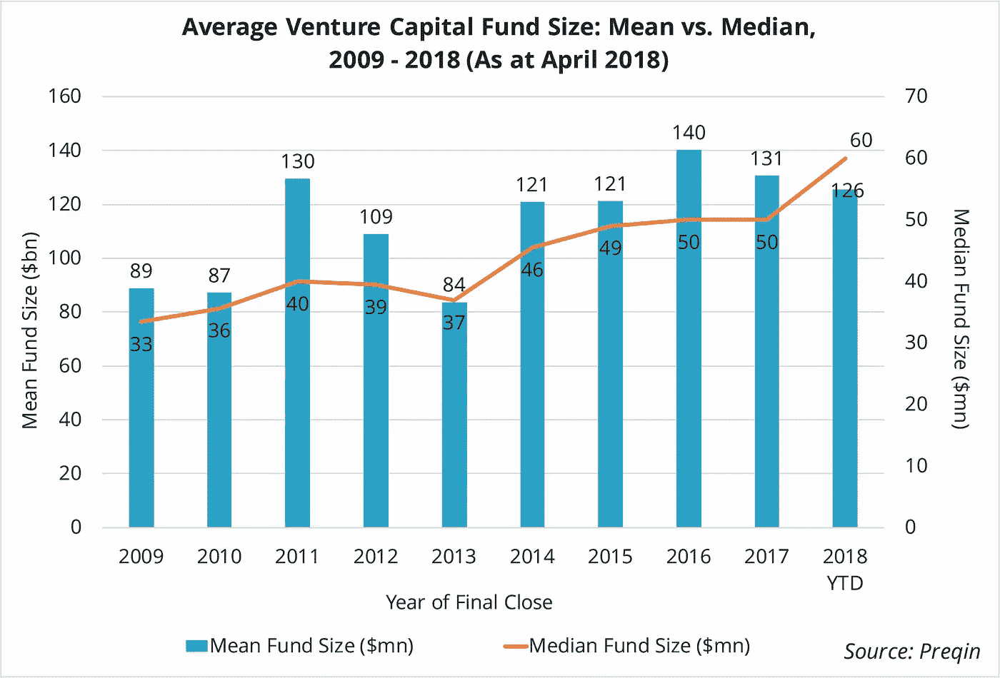

# 筹集风险资本的竞赛

> 原文：<https://medium.com/hackernoon/the-race-to-raise-venture-capital-c3f1f3b3cbe6>

*   *在推特上关注我*[*@菲利斯 _ 埃吉迪奥*](https://twitter.com/felice_egidio)

风险投资最近有一个趋势，资产估值增加，经理人的筹资目标也更高；在 Preqin 的 **H1 2018 年风险投资基金经理展望**中，55%的 gp 报告投资组合公司的定价高于 2017 年 6 月。此外，过去一年，98%的经理认为交易竞争水平保持稳定或有所上升，导致难以找到准确定价的投资机会。基金经理之间对资产的争夺导致了一场“军备竞赛”,基金经理需要筹集尽可能多的资金，以便在对有吸引力的投资组合公司的竞标中胜出。

软银愿景基金(Softbank Vision Fund)目前价值 930 亿美元，目标是 1000 亿美元，是全球最大的科技投资者。基金利用上述战略在全球进行了大量风险资本投资。软银愿景基金有能力在一轮融资中投资 10 亿美元，就像 Flipkart、WeWork 和优步等公司一样。随着基金目标规模的不断扩大，这一策略已渗透到业内其它大型风险投资公司。

投资于北美创新企业的风险投资公司 General Catalyst Partners 为其有史以来最大的基金 General Catalyst Group IX 筹集了 14 亿美元。该基金于 2018 年 3 月关闭，超过了 10 亿美元的目标，也大大超过了该公司为其前一只基金筹集的 6.6 亿美元。此外，红杉资本的最新基金红杉资本全球增长基金 III 的目标是 50 亿美元，是该系列中上一只基金的 2.5 倍。去年，New Enterprise Associates (NEA)、Institutional Venture Partners(IVP)、Canaan Partners、Clarus Ventures 和旗舰先锋公司各自筹集了其 141 年历史上最多的资金。

在 Preqin 跟踪的 100 笔最大的风险投资交易中，85%发生在 2015 年至 2018 年年初。这一趋势在整个行业都有所体现，在过去十年中，风险资本基金的平均规模和中值规模都呈上升趋势。2013 年，风险投资基金的平均规模为 8400 万美元，在此后的 5 年里，平均规模为 1.28 亿美元，2016 年达到 1.4 亿美元的峰值。2018 年迄今为止，基金规模中值为 6000 万美元，比 2013 年高出 38%，接近 2009 年的两倍。

2018 年可能会继续基金规模增长的趋势，因为资产估值没有稳定的迹象。除了上述红杉资本基金，目前市场上还有八只风险投资基金寻求超过 10 亿美元的资金，包括 Next Orbit Ventures Fund II(20 亿美元)和 nova quest Pharma Opportunities Fund V，后者的目标是投资 15 亿美元，用于制药和医疗行业。尽管这些基金的规模远不及软银愿景基金，但它们的存在表明，基金经理们仍需要筹集越来越多的资金，以争夺资产。

*   *访问更在*[*【www.preqin.com/blog】*](https://www.preqin.com/go.aspx?lid=25661)
*   *特别感谢 Meaghan Conlon 和 Justin Hall 的贡献。*