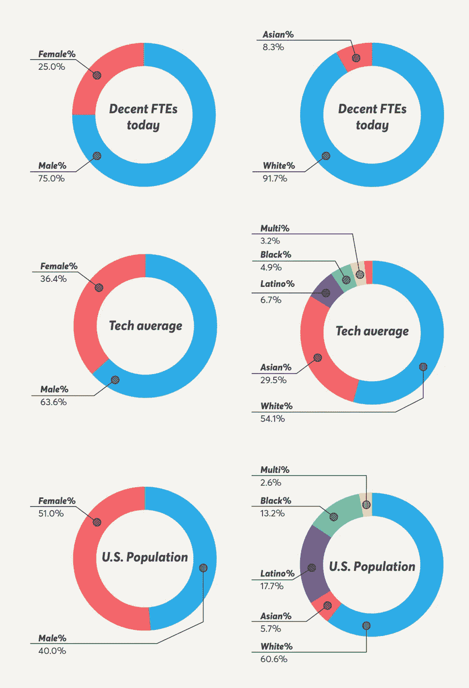

# 激进的包容性宣言:不要做混蛋

> 原文：<https://medium.com/hackernoon/the-radical-inclusivity-manifesto-dont-be-an-asshole-95425b5c3786>

## 我们将多元化目标设定在[体面的](https://www.decent.com)，因为我们需要做得更好。

我们努力提供一种工作体验，让每个人都能感受到同等的尊重和重视。我们接受每一个人的性别身份或表达、性取向、宗教、[种族、](https://hackernoon.com/tagged/ethnicity)、年龄、国籍或任何其他使他们积极独特的方面。

但是到今天为止，我们 75%的人是男性，超过 90%的人是白人。

多样性和包容性必须是有意的。为什么？很难。为什么？因为我们的大脑是按照熟悉的路径构建的，改变这些路径意味着建立新的路径。你有没有开车回家，一旦你到了那里，你记得你应该停下来买鸡蛋？你在自动驾驶仪上。

我们经常在招聘上做同样的事情。我们根据我们所知道的去做。它是无意识的。因此，如果你是像由三个白人创立的[正派](https://www.decent.com/)这样的科技公司的一员，你将需要有意识地共同努力来雇佣有色人种和女性。均富国际 2015 年的一项研究估计，如果董事会中有更多女性，美国的 GDP 将增长 3.5%。

在她的书《集体天才》中，Linda Hill 强调了真正创新的组织都拥有的动力:大胆的雄心、对社区的责任、协作和学习。正派认为多元化和包容性对我们的公司和文化非常重要。我们将此视为我们的使命，为所有人提供负担得起的医疗保健。尽管面临挑战，体面正在使多样性和包容性成为我们招聘过程的真正目标。这并不容易，尤其是在失业率达到十年来最低的时候，我们激烈地争夺人才。

我们公开声明我们的衡量标准是透明的，并与其他希望将行业变得更好的人保持一致，因为正派正在努力比我们今天做得更好。我们现在看起来不怎么样。

Decent today vs. 2017 Tech Average vs. 2017 U.S. Population

正派有关于女性、[非二元](https://hackernoon.com/tagged/non-binary)性别和有色人种的多样性和包容性目标。我们认识到有许多方法可以实现包容性，我们已经选择了这些领域在未来几年进行解决。我们将向您汇报我们在实现目标方面的进展。(想为贵公司做类似的事情？从“信息是美丽的”中找到我们正在使用的数据[在这里](https://informationisbeautiful.net/visualizations/diversity-in-tech/)——原始数据的链接在该页的底部。)

**进球***

体面的第一年-到 2019 年 10 月 1 日

*   35%的体面自我认同为女性和/或非独联体性别
*   40%的正派人是有色人种

体面的第二年-到 2020 年 10 月 1 日

*   40%自认为是女性和/或非独联体性别
*   40%的正派人是有色人种

体面的第 3 年-到 2021 年 10 月 1 日

*   50%的人认为自己是女性和/或非独联体性别
*   40%的正派人是有色人种

**LGBTQ+没有被特别指出，因为在我的研究中，我发现最佳做法是在雇佣时支持体面的 LGBTQ 社区的成员，而不是让候选人在面试中透露他们的状态。*

就当是邀请你参加我们的派对吧。

体面正在建设的是让所有人都能负担得起的医疗保健。

所有人——每个人。

如果这种情绪吸引了你(耶！我们正在招聘。