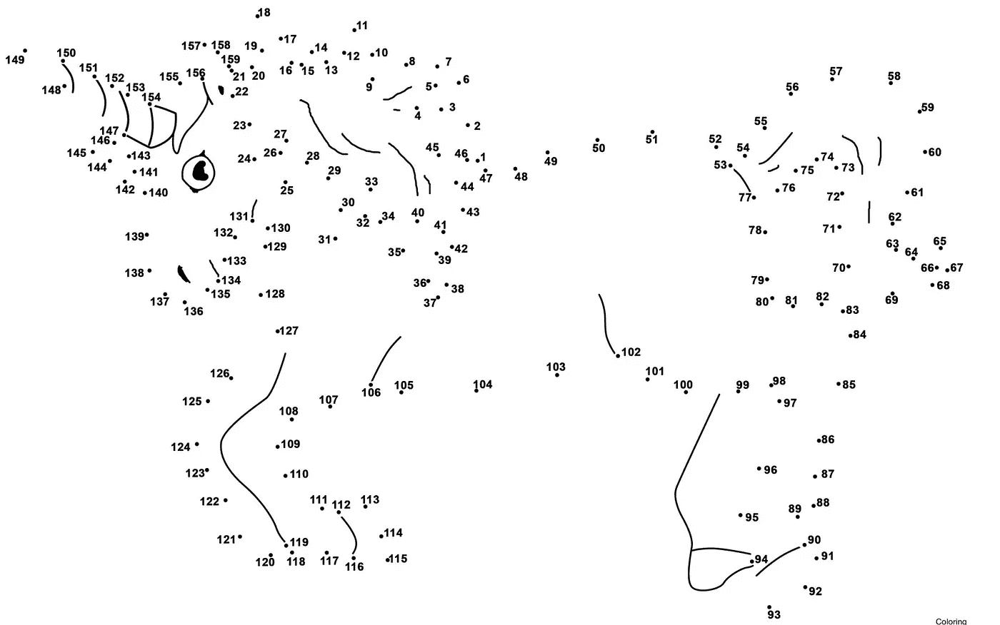

# 随机彩票游戏

> 原文：<https://medium.com/hackernoon/the-random-ticket-game-693f6a6c7ea4>

这里有个小游戏。

随机挑选一张**进行中的**“票”(卡片、故事、任务等)。)在您选择的工具中/上(例如，物理板、吉拉、[俱乐部会所](https://clubhouse.io/)等。).确保它没有父级…例如，它不是“史诗”。现在，试着把这张票和一个大公司的目标联系起来。

尝试这种格式…

> 我们正在做那张去[*的票，那张票的任务*帮助我们[*一些更高级别的任务*，这将帮助我们[*一些更高级别的任务*，这将帮助我们[一些更高级别的任务]…。(重复)

坚持下去，直到你完成某个有意义的 12-18 个月的公司使命。你可能会遇到这样的情况，那张票可以执行多个更高级别的任务。没关系……处理每个“分支”,直到终点。

示例:

> 我们正在研究**吉拉票据法-1252，以预测性地自动填写交易细节**，这将帮助我们**提高银行对账工作流程**的效率，这将帮助我们**通过内部簿记员**保留更大的账户，这将帮助我们**增加经常性收入**，并将帮助我们**向更大的潜在客户营销，这些潜在客户是我们在尝试对账工作流程**时“失去”的

我本可以更具体地说明这些任务(例如，在 2018 财年将经常性收入提高 X 美元至 Y 美元)，但你已经明白了。

如果你想冒险，描述一下这两个项目之间的影响关系:

> 这将帮助我们提高银行对账工作流程的效率**，节省 15 到 20 分钟来完成该流程**

…甚至冒险进入你所知道和假设的领域，首先用“我们相信会……”替换“哪个会”，并添加一些数据

> 我们相信将帮助我们提高银行对账工作流程的效率，节省 15 到 20 分钟来完成这个过程**，因为我们知道 80%的客户每次对账都要花大约 15 分钟来填写数据，我们有 90%的可能性猜得准确**。

怎么样了？写下你的回答并交给别人。这对他们有意义吗？密切关注“跳”的次数。如果您有< =3 次跳跃，您是否跳过了影响链中的中间步骤(例如，从 1-3 天的任务，到 6 个月的目标范围，再到 18 个月的目标范围)？

最重要的是——对自己诚实——这一切都站得住脚吗？有巨大的信仰跳跃假设吗？你会用自己的钱打赌这些影响会实现吗？如果你是一个项目经理，你的团队在这个练习中会做得怎么样？

请在评论中让我知道这对你有什么帮助。

以下是我在许多不同环境下做这个练习所学到的东西:

*   产品经理(可能是因为他们练习这种水平杂耍)通常能够在第一次尝试中绊倒。但结果并不理想。开发人员和设计人员竭尽全力——不是因为缺乏技能，而是缺乏连贯的最新信息。
*   “混乱的中间”是事情分崩离析的地方。高层次的公司目标是大胆和连贯的。近期目标是有意义的。这票有道理。但是通常缺乏对中间环节的共同理解——3-9 个月的“为什么”以及对链条上下游的影响。
*   真正的工作通常不会分成整齐的小季度增量。即便如此，四分之一的目标也只是一连串影响中的一步。此外，根据行业的不同，可以有连贯的 4 跳描述和连贯的 8 跳描述。没有硬性规定(除了公司里的每个人都能在工作中快速背诵出来。并且相信它(包括相信不确定性是如何被描述的)。并以此指导他们的工作…寻找更具创新性的方法来实现重要的事情。那不是很棒吗？现在是这样吗？为什么不呢？如果你正在使用 OKRs，而他们没有提供这个概述，这是为什么？
*   在我看来，这是一个产品团队要承担的负担。往前走…
*   Once you get 2+ steps “up”, you are in the realm of being able to solve the problem in multiple ways.
*   Finally…the whole impact chain is absolutely filled with assumptions, even as you get up into the 3+ range. In my mind, this is what is missing from common goal setting frameworks. There’s no honest treatment of uncertainty. So the “nice roll up” falls apart with any scrutiny.

So what?

Imagine *everyone* in your company being able to rattle this off for their work. And believe it (including believing how uncertainty is described). And have it guide their work…finding more innovative ways to achieve the things that matter. Wouldn’t that be awesome? Is that happening right now? Why not? If you’re using OKRs and they aren’t providing this overview, why is that?

In my mind, this is a product team burden to bear. Go forth….