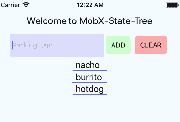
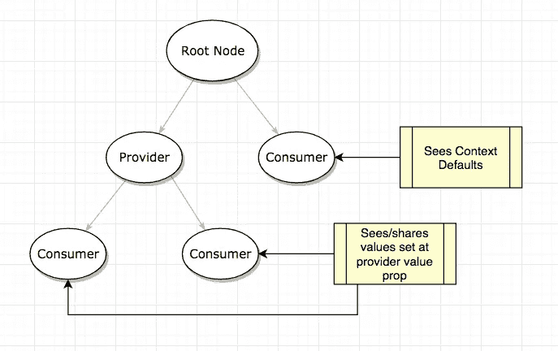
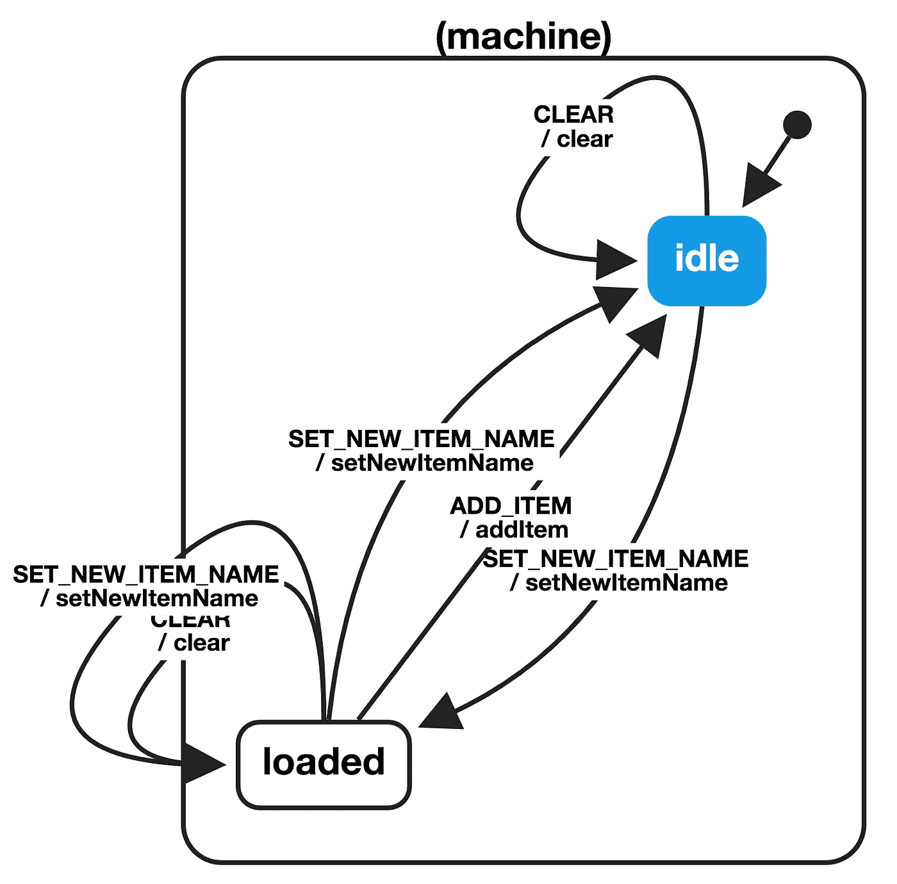

# ⚛反应州立博物馆

> 原文：<https://medium.com/hackernoon/the-react-state-museum-a278c726315>

## ⚡️View 是 React 最热门的州管理图书馆

# 为什么？

这将成为国家管理系统的一块罗塞塔石碑。内置了一个基本的装箱单应用程序:

*   **设置状态**
*   **React 16.x 上下文**
*   **Redux — by** [**丹·阿布拉莫夫**](https://medium.com/u/a3a8af6addc1?source=post_page-----a278c726315--------------------------------)
*   **MobX — by** [**米歇尔·韦斯特斯特**](https://medium.com/u/de4496bfa1e2?source=post_page-----a278c726315--------------------------------)
*   **未说明——由** [**杰米·凯尔**](https://medium.com/u/cc2eaf4f2cd2?source=post_page-----a278c726315--------------------------------)
*   **MobX-State-Tree-by**[**Michel Weststrate**](https://medium.com/u/de4496bfa1e2?source=post_page-----a278c726315--------------------------------)**再**
*   **阿波罗 GraphQL 与亚马逊 AppSync**
*   **setState+react-automata—by**[**Michele Bertoli**](https://medium.com/u/cb6b99cd9ea7?source=post_page-----a278c726315--------------------------------)
*   **Freactal——戴尔在** [**令人生畏**](https://medium.com/u/543b34f6e9c6?source=post_page-----a278c726315--------------------------------)
*   **ReduxX—by**[**Mikey Stecky-Efantis**](https://medium.com/u/ebedec07767d?source=post_page-----a278c726315--------------------------------)
*   **纯商店——阿瑟·冈恩著**
*   还有更多！

毫无疑问，您熟悉一个或多个上述系统，现在您可以利用这些知识来更好地理解许多其他系统。这是一个机会，让你看看所有的嗡嗡声是关于什么的，老实说，所有这些国家的体制是多么的相似。

为了以简洁易懂的形式描述这些系统，所选的应用程序是一个简单的装箱单应用程序，只有*添加*和*清除*的能力。

Simple as it gets app (Native and Web)

为了说明状态跳转，在所有示例中，ADD/CLEAR 是一个组件，LIST 是次要组件。

甚至两个主要组件(添加/列表)都被抽象到一个导入的库中，只留下基本代码来强调状态选择。代码应该是极简的。

# 欢迎来到 React 州立博物馆！

这些系统的代码可以在 React 和 React Native 中找到。

> [https://github.com/GantMan/ReactStateMuseum](https://github.com/GantMan/ReactStateMuseum)

使用上述回购亲自潜入这些系统，并检查它们！🔥

另外:观看来自 Connect 的演讲。这里的技术人员:

 [## 反应州立博物馆| recallact.com

### “用 redux，不要用 redux。用 mobx，但不要用 mobx。他只会使用 setState！别担心，新的环境会…

www.recallact.com](https://www.recallact.com/presentation/react-state-museum) 

# 每个解决方案的个人注释:

如果你想要代码，请查看 GitHub，如果你想要意见，请继续阅读下面这篇很长的描述。

在这里，我将介绍博物馆中每件展品的不同之处，以及它们的独特之处。如果你有一些强烈的观点或经历，请在评论中分享。我也有兴趣把这个报告作为一个充满乐趣的会议报告。

## 设置状态

这是状态管理最基本的结构，它只依赖于对组件及其封装的基本理解。从很多方面来说，这是 React 初学者的一个很好的例子。显式地将状态提升到所有组件都是其子组件的根组件标识了属性与状态的关系。随着应用程序的增长，向下到组件的显式连接会变得越来越复杂和脆弱，这就是为什么这种方法不常用的原因。

> 代号:[React](https://github.com/GantMan/ReactStateMuseum/tree/master/React/setState)|[React Native](https://github.com/GantMan/ReactStateMuseum/tree/master/ReactNative/setState)

## 反应上下文

[https://reactjs.org/docs/context.html](https://reactjs.org/docs/context.html)

有很多关于 Context 更新的讨论。事实上，16.x 中上下文的最终形式感觉有点像状态管理系统本身。为了简单起见，上下文考虑到了**提供者**和**消费者**。提供者的所有子代都可以访问在那里应用的值。所有非子节点都将看到上下文默认值。下图解释了这种谱系。

Only children inherit

第二，非常固执己见，我不喜欢消费语法结构。显然，这是一个消费者的孩子的功能，但它感觉像是违反了 JSX，同时超负荷大括号的所有用例。

这是一个迂腐的问题，但是代码的可读性应该总是考虑到 API，在这方面，上下文开始有点脏了。

> 代号:[React](https://github.com/GantMan/ReactStateMuseum/tree/master/React/context)|[React Native](https://github.com/GantMan/ReactStateMuseum/tree/master/ReactNative/Context)

## Redux

[https://github.com/reactjs/react-redux](https://github.com/reactjs/react-redux)

我敢说在我写这篇文章的时候，Redux 是最流行的状态管理工具，因此也是最受攻击的。用 Redux 编写一个解决方案需要很多文件，几乎是代码行的两倍。但是给 Redux 的辩护是，简单灵活。

如果您不熟悉 Redux，它是一种功能性的状态管理方法，以类似 reducer 函数的形式提供时间旅行和干净的状态管理。丹·阿布拉莫夫解释 redux 的视频已经被观看了很多次。

简而言之，这就像有人在你的应用程序中大喊命令(动作)，这些命令是通过动作创建者发出的。应用程序中的数据管理器(Reducers)听到了这些呼声，并可以有选择地采取行动。我喜欢我的海盗船比喻，所以喊“MAN_OVERBOARD”可以告诉你的船员计数器减去工作人员一，会计重新分割宝藏，擦甲板的家伙可以忽略它，因为他不在乎。

我喜欢这个比喻，因为大喊大叫是管理你的应用程序各个角落的强大方法，在更大的应用程序中，很吵。结合这一点，没有办法处理副作用，并且需要粘合一个不可变的结构来使其全部工作，Redux 是按小时计费的开发人员的朋友。

> 代码:[反应](https://github.com/GantMan/ReactStateMuseum/tree/master/React/redux) | [反应原生](https://github.com/GantMan/ReactStateMuseum/tree/master/ReactNative/Redux)

## MobX

[https://github.com/mobxjs/mobx-react](https://github.com/mobxjs/mobx-react)

MobX 是最容易上手的状态管理器之一。打开自述文件，按照说明进行操作，您很快就能让事情运转起来。感觉像是可变的 JS，也确实有点像。唯一可能让你陷入循环的部分是类上的装饰器，比如`@observer`。虽然很奇怪，但它们多少清理了一些代码。

> @observer 就像一个自动的“mapstatetoprops”+“reselect ”,如果你已经习惯了重复的东西的话

一定要看看 Nader 的博客文章，其中强调了一些关于切换到 MobX 的更高级的主题。

 [## 放弃 MobX - Nader Dabit - Medium 的 setState

### 在 2017 年末，我与一个团队合作了一个 React Native 项目，该项目使用 MobX 作为他们的状态管理库。我有…

medium.com](/@dabit3/766c165e4578) 

总之，MobX 是可以添加的最小最简单的工具之一！

> 代号:[React](https://github.com/GantMan/ReactStateMuseum/tree/master/React/mobx)|[React Native](https://github.com/GantMan/ReactStateMuseum/tree/master/ReactNative/MobX)

## 未说明的

[https://github.com/jamiebuilds/unstated](https://github.com/jamiebuilds/unstated)

无状态就像 MobX 一样简单。就像 MobX 感觉像可变的 JavaScript 一样，stated 感觉像添加更多的 React 代码。实际上，我觉得未陈述的感觉比上下文更像反应。

很简单，你创建一个容器，在这个容器中，你管理状态。像`setState`这样简单的已知函数存在于状态容器中。这不仅仅是一个贴切的名字；这是一个基于反应的管理器。

我不确定它的伸缩性或处理中间件的能力如何。但是如果你是状态管理的初学者，MobX 和 stated 是最简单的启动和运行工具！

> 代码:[反应](https://github.com/GantMan/ReactStateMuseum/tree/master/React/unstated) | [反应原生](https://github.com/GantMan/ReactStateMuseum/tree/master/ReactNative/Unstated)

## MobX 状态树

[https://github.com/mobxjs/mobx-state-tree](https://github.com/mobxjs/mobx-state-tree)

是的，这和香草 MobX 很不一样。这是一个常见的误解。

甚至我的同事也试图将标题缩短为“MobX”，而我总是推荐 MST 作为替代。话虽如此，但重要的是要注意 MobX-State-Tree 用较少的代码在一个自以为是的包中展示了 Redux + reselect +副作用管理等所有强大功能。

在这个小例子中，唯一明显的是简洁的语法。代码行仅仅比我们最初的 MobX 例子大一点。两者都共享简洁装饰语法。虽然要真正获得 MobX-State-Tree 的所有好处还需要一点时间。

最重要的一点是，如果您来自 ActiveRecord 或其他类型的 ORM，MobX-State-Tree 就像一个带有规范化关系的干净的数据模型。对于可扩展的应用程序来说，这是一个很好的状态管理工具。

> 代码:[反应](https://github.com/GantMan/ReactStateMuseum/tree/master/React/mobx-state-tree) | [反应原生](https://github.com/GantMan/ReactStateMuseum/tree/master/ReactNative/MobXStateTree)

## **阿波罗 GraphQL 和亚马逊 AppSync**

[https://github.com/apollographql/react-apollo](https://github.com/apollographql/react-apollo)T5[https://aws.amazon.com/appsync/](https://aws.amazon.com/appsync/)

如果您还没有跳上 GraphQL 列车，那么您就错过了。Apollo GraphQL + AppSync 是管理状态、处理离线、处理获取 API 和设置 GraphQL 服务器的好方法。这是一个严肃的解决方案。许多人认为 GraphQL 可以有效地“解决”州辩论。从很多方面来说，这很容易，但从很多方面来说，这很难。

不是每个人都准备好使用 GraphQL 服务器，但是如果你准备好了，那么 AppSync 是一种处理 DynamoDB 中所有数据的简单方法。启动和运行它需要更多的时间/精力，但好处是显而易见的。

在我的例子中，我并没有真正使用所有的花里胡哨。您可以看到延迟，因为数据等待来自服务器，我没有使用订阅来获取更新。这个例子可以变得更好。但是这就像用组件包装配置一样简单。Tadaaaaa！剩下的就是历史了。

特别说明:在这个例子中，请注意你放在装箱单中的东西，因为是共享的。

> 代码:[反应](https://github.com/GantMan/ReactStateMuseum/tree/master/React/appsync) | [反应原生](https://github.com/GantMan/ReactStateMuseum/tree/master/ReactNative/AppSync)

## 设置状态+反应自动机

[https://github.com/MicheleBertoli/react-automata](https://github.com/MicheleBertoli/react-automata)

这是群里比较奇怪的一个。从很多方面来说，您可能想知道 setState 是如何参与进来的，答案很简单。将状态分解成状态机的想法与大多数状态管理系统非常不同。

通过创建一个 [xstate](https://github.com/davidkpiano/xstate) 机器配置，您可以处理状态如何被传递、调用和识别。因此，你必须确定你的应用程序可能处于的所有状态，以及它从一个状态转移到另一个状态的所有方式。很像在 Redux 中调度一个动作，您必须`transition`到给定事件的另一个状态。

这不是一个完整的国家管理系统；它只是一个用于状态管理的状态机。

[这是我们的状态图](https://musing-rosalind-2ce8e7.netlify.com/?machine=%7B%22initial%22%3A%22idle%22%2C%22states%22%3A%7B%22idle%22%3A%7B%22on%22%3A%7B%22CLEAR%22%3A%7B%22idle%22%3A%7B%22actions%22%3A%5B%22clear%22%5D%7D%7D%2C%22SET_NEW_ITEM_NAME%22%3A%7B%22loaded%22%3A%7B%22actions%22%3A%5B%22setNewItemName%22%5D%7D%7D%7D%7D%2C%22loaded%22%3A%7B%22on%22%3A%7B%22ADD_ITEM%22%3A%7B%22idle%22%3A%7B%22actions%22%3A%5B%22addItem%22%5D%7D%7D%2C%22CLEAR%22%3A%7B%22loaded%22%3A%7B%22actions%22%3A%5B%22clear%22%5D%7D%7D%2C%22SET_NEW_ITEM_NAME%22%3A%7B%22loaded%22%3A%7B%22actions%22%3A%5B%22setNewItemName%22%5D%7D%2C%22idle%22%3A%7B%22actions%22%3A%5B%22setNewItemName%22%5D%7D%7D%7D%7D%7D%7D)创建的图表

使用状态图会带来令人兴奋的好处。首先，你可以避免你不想要的转变。例如，如果不先输入文本，就不能转换到“已加载”状态。这空站增加了我们的装箱单。

其次，所有的状态转换都可以自动生成和测试。只需一个简单的命令，就可以生成多个状态快照。

**警告**:在 React Native 上，我必须`yarn add path`满足依赖关系中一些未使用的导入。这是一个偷偷摸摸的陷阱，只适用于本地人

> 代码:[反应](https://github.com/GantMan/ReactStateMuseum/tree/master/React/react-automata) | [反应原生](https://github.com/GantMan/ReactStateMuseum/tree/master/ReactNative/ReactAutomata)

## Freactal

[https://github.com/FormidableLabs/freactal/](https://github.com/FormidableLabs/freactal/)

当然，我们将展示强大实验室的出色工作。Freactal 是一个非常先进的例子，它可以取代`[redux](https://redux.js.org/)`、`[MobX](https://mobx.js.org/)`、`[reselect](https://github.com/reactjs/reselect)`、`[redux-loop](https://github.com/redux-loop/redux-loop)`、`[redux-thunk](https://github.com/gaearon/redux-thunk)`、`[redux-saga](https://github.com/redux-saga/redux-saga)` 等等。

虽然这可能是我最难设置的一个，但我仍然认为它有很大的价值。更多的例子会有所帮助。特别感谢肯·惠勒，他同意回答我在阅读文件时的任何问题。

最终的代码简洁明了。感觉最后有点像上下文语法。我特别喜欢将名称间距`effects`与`state`和`computer`分开使用，尽管这并不妨碍你将这种惯例带到其他库。

> 代码:[反应](https://github.com/GantMan/ReactStateMuseum/tree/master/React/freactal) | [反应原生](https://github.com/GantMan/ReactStateMuseum/tree/master/ReactNative/Freactal)

## ReduxX

[https://github.com/msteckyefantis/reduxx](https://github.com/msteckyefantis/reduxx)

ReduxX 虽然在 SEO 方面可能有点麻烦，但仍然是一个很酷的名字。

> "为什么你可以在某物上加 X 来使它变酷？"
> 
> — Gant X

ReduxX 读起来很好，因为在某些方面它让我想起了《未声明》中的魅力，因为我们使用了*反应式的*措辞来设置和改变状态。一个可能看起来有些奇怪的方面是，状态是用`getState`作为函数来检索的。这感觉有点像钥匙串访问，我想知道是否可以很容易地混合一些证书/密码？精神食粮。我看到有`obscureStateKeys: true`将密钥换成 GUIDs。在安全方面，这个库可能有一些有趣的优点。

至于怎么用，通过按键设置和获取。就是这样！如果你不担心中间件，并且熟悉 keychain globals，那么你已经知道 ReduxX 了。

*特别感谢作者*[***Mikey Stecky-Efantis***](https://medium.com/u/ebedec07767d?source=post_page-----a278c726315--------------------------------)*提供这个例子！*

## 纯商店

[https://github.com/gunn/pure-store](https://github.com/gunn/pure-store)

100%测试覆盖率，麻省理工学院许可，打字稿支持的小型图书馆的状态管理。这个库感觉最接近“只用全局”。事实上，如果你发现`update`接受了`setState`的签名，那么你看到的是一个单例的全局状态。

特别感谢 Arthur Gunn 提供了这个例子！

# 失踪州的例子？

我敢肯定，还有其他国家的经理在这里被严重低估，如果你认识他们，请向公共回购发送一份公关。我很乐意接受捐款，这样我们都能受益。随着新系统的加入，我甚至会更新这篇博文。所以，请申请门票，更重要的是贡献自己的力量！博物馆感谢你😆

> **更新:**自从写这篇文章以来，许多人都做出了贡献！！！我特别感激和高兴的是，在某些情况下，人们使用这个库了解到他们的状态系统与 React Native 不兼容，并在上游修复了它！！！
> **要获得状态系统的完整列表，请访问******。****

# **总而言之:**

****你想要没有依赖吗？使用 setState 和 Context 你可以走得很远！为什么要引入依赖呢？如果你不确定你的应用是否需要它，试着不带外部库。您也许能够将上下文与 react-automata 这样简单的东西结合起来，以得出一个清晰的、可测试的结果！****

****你想要简单的吗？** 无状态、还原、纯态*非常*简单易行。他们有轻微的意见分歧，并为每一个小的差异化优势。MobX 也很简单，但是会出现一些您必须接受的修饰语法。如果您这样做了，那么代码仍然是可读的和优化的，有大量的 docs/stackoverflow 帮助。**

****你想要可伸缩的吗？如果你确定你的应用程序需要所有的花里胡哨的东西，那么是时候拿出大家伙了。这就是 Redux 的闪光点。当你实现 Redux 时，你永远是一个机械师，所以你知道你可以适应。MobX-State-Tree 显示了 MobX +意见、状态、优化等所有功能。这不是你一次就能理解的，但是每一次你对它了解得越多，你就能让你的应用程序更强大。****

**你想要未来吗？毫无疑问，GraphQL 正在技术领域火起来。现在，如果您将它与 AppSync 一起用于联网，或者如果您只是使用 [apollo-link-state](https://github.com/apollographql/apollo-link-state) 来管理您的本地数据，您会放弃一些细粒度的控制，但作为回报，您会获得更大的能力。请务必关注这些库的发展。很可能在不久的将来，上面的许多状态系统将不得不适应 GraphQL。**

********

**[Gant Laborde](https://medium.com/u/6ca0fe37eac1?source=post_page-----a278c726315--------------------------------) is Chief Technology Strategist at [Infinite Red](http://infinite.red), published author, adjunct professor, worldwide public speaker, and mad scientist in training. Please clap/follow/tweet or just say hi to him [at a conference](http://gantlaborde.com/).**

## **信用**

*   **标题图片感谢:[https://unsplash.com/photos/uqMBLm8bAdA](https://unsplash.com/photos/uqMBLm8bAdA)**
*   **特别感谢[胡安·大卫·卡斯特罗](https://medium.com/u/6fde1c662692?source=post_page-----a278c726315--------------------------------)，自从这篇博文最初发表以来[做出了巨大贡献](https://github.com/GantMan/ReactStateMuseum/commits?author=juandc)！**
*   **还有，Marcel Kalveram ，他帮助升级了无数的项目！**

## **有时间吗？再来看看几个:**

** [## 远程工作的 5 大弊端

### 远程工作的陷阱+建议的解决方案

红色](https://shift.infinite.red/5-things-that-suck-about-remote-work-506b98dd38f9)  [## 团结——开发人员理智的 CLI

### 为您的项目增加团结，让多机安心

红色](https://shift.infinite.red/solidarity-the-cli-for-developer-sanity-672fa81b98e9)**