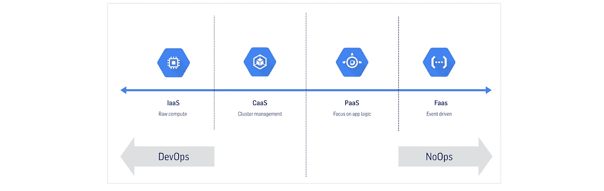

# 云功能的真正好处和缺点⚡️

> 原文：<https://medium.com/hackernoon/the-real-benefits-and-drawbacks-of-cloud-functions-%EF%B8%8F-c663767ff9a5>

几周前，谷歌在旧金山的谷歌云 Next '18 上宣布了许多有前景的技术发展。

[*谷歌*](https://hackernoon.com/tagged/google)T4【云下一步】是一个为期两天的会议，旨在了解最新的(谷歌)云技术以及该行业如何通过云进行适应、创新和发展。它包括讲座、实验室和训练营。

其中一个有趣的公告与云功能有关，它直接与诸如 [AWS Lambda](https://aws.amazon.com/lambda/) 、 [Azure Functions](https://azure.microsoft.com/en-us/services/functions/) 和 [IBM 云功能](https://console.bluemix.net/openwhisk/)等服务竞争。谷歌早在 2016 年就首次宣布了云功能，现在普遍支持其他编程语言(Node.js 6 & 8 和 Python 3.7)。更多关于本次公告的信息请点击[查看](https://cloudplatform.googleblog.com/2018/07/bringing-the-best-of-serverless-to-you.html)。

# 但是，谷歌云功能到底是什么呢？

谷歌云功能就是我们所说的“功能即服务”(FaaS)。 **FaaS 属于无服务器计算类别。**这是否意味着您现在不用服务器运行代码？不完全是，无服务器[计算仍然需要服务器。无服务器的真正含义是，作为开发人员，您可以编写和部署代码，而无需管理底层基础架构。](https://hackernoon.com/tagged/serverless)

您只是在运行一段代码或函数，而不是运行过度调配的服务器基础架构。无服务器计算服务将您的功能作为输入，执行逻辑，返回输出，然后关闭。因此，您只需要为执行这些功能时使用的资源付费。

*   **事件驱动** 运行代码以响应事件。
*   **可扩展**
    轻松自动扩展。
*   **无状态**
    云函数没有任何内存状态。
*   **无管理**
    无需担心服务器的配置和维护。
*   **生命周期短** 云功能执行时间有限。

FaaS 是一个真正的 **NoOps** 技术，它完全抽象掉了服务器。

# FaaS 用例

云函数非常适合构建事件驱动的架构。它们可以对存储中的文件变化、队列中的消息或任何 HTTP 请求等事件做出反应。

以下是您可以使用这些云功能做些什么的一些示例:

*   **微服务**每个功能都可以独立部署和管理。
*   **数据处理** 云函数可以执行你的代码来响应数据的变化。比如在图像上传到存储桶后生成缩略图，或者处理传入的日志。
*   **物联网** 物联网设备产生的数据需要被摄取和处理。通过云功能，您可以处理实时数据，分析这些数据以获得洞察力，并获得特殊情况的通知。
*   **视频和图像分析** 您可以轻松地将 FaaS 与其他服务相结合。通过谷歌云视频智能 API 和云视觉 API，我们可以从视频和图像中提取相关的语义信息。
*   **扩展 SaaS 应用**
    一个公司可以通过监听 webhook 事件来自动化他们的 GitHub 工作流。例如，每次在 GitHub 上创建一个问题，你可以通过触发一个云功能将问题的细节发布到 Slack 上。

最酷的是，你可以用云功能创建无限的解决方案，并将它们与混合云解决方案完美结合。

# 真正的好处

*   **无需管理服务器**
    在云中运行您的代码非常容易，您可以完全专注于编写代码，忘记服务器管理的麻烦。
*   **易于部署**
    只需一个命令，您就可以将云功能部署到生产就绪环境中。
*   **自动扩展**
    无需扩展管理，云功能会自动扩展您的应用。该函数的代码并行运行，只处理传入的触发器。
*   成本是非常透明的，你只需在你的代码运行时付费。与预先调配的云虚拟机相比，它可以真正节省成本。

> 就像无线互联网在某处有电线一样，无服务器架构在某处仍然有服务器。
> 
> *serverless.com*

# 缺点

*   **架构复杂性** 云功能会给你的项目增加额外的复杂性，让整个架构变得有些难以理解。
*   调试
    有很多工具可以调试云功能，比如仿真器和云监控工具。但总的来说，它们仍然很难调试，你必须相信云提供商提供的任何工具。
*   **供应商锁定** 功能可以在任何地方运行，但让它们运行并连接到其他服务取决于每个供应商，你必须遵守他们的规则。
*   **控制起来可能会令人望而生畏** 跟踪您部署的所有云功能并非易事。您需要将监控、分析和部署脚本与现有系统同步。

# 最后的想法

云功能会接管世界吗？是不是应该从现在开始只写云函数？就我个人而言，我认为它们非常棒，这是拥抱云原生组件真正力量的又一步。我的预测是，在接下来的几年里，我们将会看到向无服务器和功能即服务的更大转变。

无服务器确实有助于开发团队专注于他们的代码，而不是担心他们需要供应、维护和扩展的基础设施。

当然，你不应该用云功能取代每一个传统架构，而且总会有不实现它们的理由。在您当前的系统中实施云功能之前，从微服务的心态开始真的很有帮助。

简而言之，未来是无服务器的，但需要一些时间来转变我们的思维方式。🤟

*最初发表于*[*inthepocket.com*](https://inthepocket.com/blog/2018/function-as-a-service)*。*