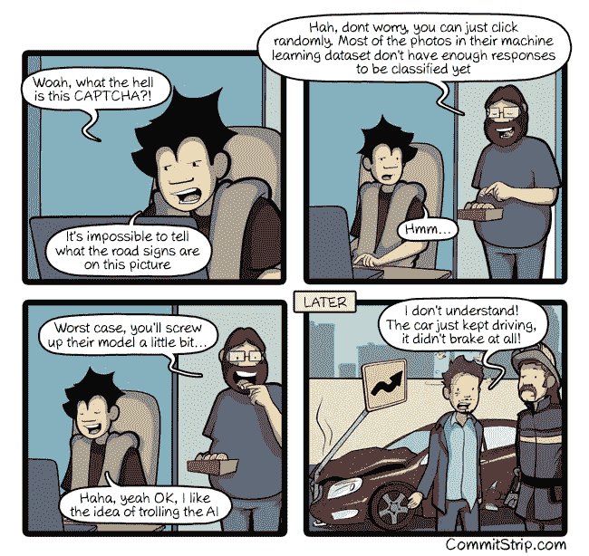

# “坏人工智能”的真正威胁

> 原文：<https://medium.com/hackernoon/the-real-threat-of-bad-ai-e45d09eb42>

/via [http://www.commitstrip.com/en/2018/09/24/trolling-the-ai/](http://www.commitstrip.com/en/2018/09/24/trolling-the-ai/)

CommitStrip 的这一集很好地代表了大众对人工智能的看法。请注意，“流行的拍摄”通常是“T2”，而不是“现实的”。毕竟，[当你设计健壮的系统时，你要做的第一件事就是纠正缺失、错位或错误识别的标志](https://dieswaytoofast.blogspot.com/2018/08/deep-learning-and-security.html)，如果/当自动驾驶汽车真正进入现实世界时，它们*将*的一件事就是在多个层面上对错误保持健壮。
见鬼，这几乎就是人类**的工作方式——我们的视觉非常容易出错，但我们会将许多*其他*信息关联起来，以确保我们不会搞砸！**

想想你在驾驶时是如何处理视觉反馈的。你会无意识地在脑海中一直运行这样的规则
*住宅区的标志上写着“60 英里每小时”显然是错误的* *如果你想知道这是街道标志还是香蕉，就用街道标志
不管它是什么，如果它在高速公路中间，减速，然后停下*
是的，[这正是任何一种健壮的人工智能都会做的事情](https://dieswaytoofast.blogspot.com/2018/05/carcrashapocalypsenot-quite-yet.html) 

然而，现实是，有一个更深层次、更隐蔽的问题在起作用——用于实际创建人工智能的模型和训练数据中的偏差🤬。

毫无疑问，你已经看到了最近关于亚马逊构建人工智能招聘工具的失败尝试的文章，对吗？他们根据自己的招聘历史来训练它，而且——令人惊讶！——他们最终得到了一个压倒性地倾向于雇佣男性的系统。这并不特别令人惊讶，因为这就是科技文化曾经的样子。

或者，更糟糕的是，在面部识别方面，IBM、微软和 Face++的商业产品在分析深色皮肤的人时发现了巨大的差异。事实上，深色皮肤的女性表现最差，错误率接近 35%，相比之下，浅色皮肤的男性只有 1%。！！

最糟糕的是，事实证明[当谈到风险评分时，在数学上不可能在多个群体之间做到真正的“公平”](https://dieswaytoofast.blogspot.com/2018/07/risk-scores-fairness-and-impossibility.html)——问题空间如何定义的背景将会不可挽回地影响你的系统的结果。当谈到如何设计这些系统时，背景真的是 T4 的关键🤯。

简而言之，我不是特别在意汽车撞上交通标志。我*做*担心的是自动驾驶出租车不会搭载美国的黑皮肤的人(因为……犯罪)，或者沙特阿拉伯的女人(因为……文化)等等。因为，如果有一件事是我们人类擅长的，那就是将技术的缺点武器化。[物联网设备上真正糟糕的安全性](https://dieswaytoofast.blogspot.com/2018/05/the-security-on-most-devices-is-st.html?q=IoT) ( `admin/admin`有人吗？)驱动了许多机器人，谁知道电子投票机会造成什么样的不良后果呢，哦，还有很多。

所以，是的，在我们对自动驾驶汽车撞上路标感到恐惧之前，我们可能想考虑一下这些汽车中人工智能设计方式的选择和背景…

1.  回复:亚马逊的招聘/人工智能失败，这个问题有点微妙，但要点是“坏数据进来，坏数据出去”。

*(* [*这篇文章也出现在我的博客上*](https://dieswaytoofast.blogspot.com/2018/10/the-real-threat-of-bad-ai.html) *)*