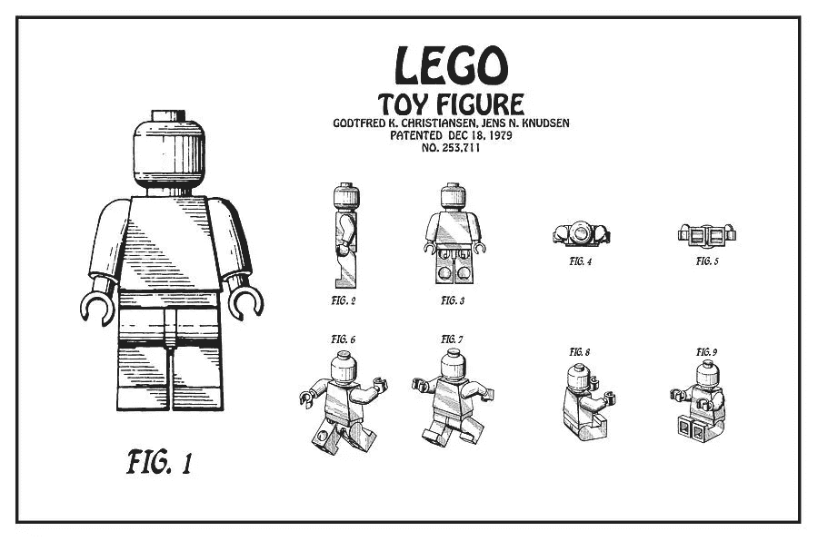
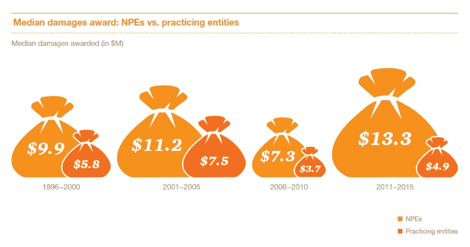

# 你的科技创业专利的真正价值(或缺乏价值)

> 原文：<https://medium.com/hackernoon/the-real-value-or-lack-thereof-of-your-tech-startup-patent-d5b592cb9a6a>

几年前，作为一名应用经济学和金融学的本科生，我第一次涉足创业生态系统，并试图尽可能多地学习如何经营一家初创科技公司，我的工作已经为我准备好了。仅仅是从“创业大师”们鼓吹的时髦词汇和陈词滥调中寻找真正的智慧就已经足够具有挑战性了，在这一点上，我的大脑已经用从实际运营和投资经验中吸取的教训覆盖了大部分内容。

不过，有一点我一直记得，这是我一直听到的真理，直到今天。

不要在专利上浪费你的时间、金钱或精力。

科技创业公司的创始人可能会考虑完全无视专利程序，这有几个原因。

话虽如此，最近进入风险投资领域后:

**我或我的同事选择投资一家公司的首要因素之一是防御性。**

我想确定我投资的团队能够独一无二地解决市场中存在的任何问题或差距，他们已经开始着手解决这些问题。可以肯定的是，其中的一个主要组成部分是团队本身——人才的可防守性——以及确保他们既有资格又有动力实现自己的世界观。然而，知识产权(IP)的可辩护性，确保我的公司的品牌和产品在市场上保持独特性和竞争力，也同样重要。

这个问题并不明确，今天的答案可能与几年前不同。

## 为什么你不应该申请专利

创业公司应该避免追求专利的格言在现实中确实有一些依据，作为一家初创公司，避开专利程序有一些非常真实的好处。

*   **逆向工程。专利是公开的，虽然竞争对手可能没有权利完全复制一个作品，但没有什么可以阻止他们生产功能相似的东西，只是*足够不同*以避免诉讼。**
*   **外国竞争者。在美国专利商标局申请专利并不能保护专利持有者免受海外侵权，在专利法庭不那么复杂的国家，即使在外国办公室申请也不能提供保证。**
*   **资源约束。**作为一家早期公司，时间和金钱都很短缺；申请专利所涉及的工作只是另一种从执行、雇佣等等中转移注意力的方式。一家初创公司发现自己在法庭上与一家大公司对抗，根本没有资金来挑战任何侵权行为。
*   **旋转。**一家公司完全有可能——事实上也很有可能——带着与创始人最初设想截然不同的想法走向市场。在这种情况下，创始人可能会发现自己在不再相关的知识产权上花费了大量资源。

The [Lean Startup](http://theleanstartup.com/) methodology, which advocates iterative learning and pivoting

即使考虑到这些问题，知识产权*应该*成为任何初创公司的主要关注点，无论创始人是否打算寻求外部资金，申请任何专有技术的专利都可以大大有助于公司的成功。

*   **威慑。**拥有专利将有助于抵御专利流氓，或者被称为*非执业实体*或*专利主张实体*，它们会很乐意对初创公司和跨国公司等提起无聊或恶意的诉讼。这些索赔通常要花费数百万美元来打退堂鼓，迫使初创公司支付巨额赔偿。
*   **进入壁垒。**就一个想法的所有权和进展进行沟通可能会劝阻竞争对手和新进入者，或将潜在的竞争对手转变为[未来的](https://hackernoon.com/tagged/future)团队成员或合作者。
*   **收购机会。**虽然资金雄厚的大型恶意在位者可能有资源侵犯初创公司的专利，并在法庭上击败它们，但拥有宝贵知识产权和强大防御能力的公司往往更容易被收购。
*   **替代知识产权保护。在绝大多数情况下，专利甚至不是保护公司知识产权的必要手段。通常，版权和商标保护就足够了。**

## 历史先例

根据保罗·格拉厄姆的说法，至少 70%的创业公司在三个月后，他们的核心理念与创业时有所不同。

这个数字如果准确的话，应该不会令人惊讶。在建立 MVP 或规划潜在的商业模式时，大多数成功的公司都追求与潜在客户的迭代学习过程。这个过程不可避免地会产生新的见解，这些见解常常会改变公司的整个方向。在这种情况下，专利申请可能很快变得毫无价值或过时。

在任何情况下，商业模式往往比专利保护更能决定公司的未来。许多电动滑板车独角兽现在正在美国各地争夺市场份额，他们使用小米的滑板车，而不是自己的设计，像优步和 Lyft 一样，主要是在商业模式和营销实力上竞争。

专利确实有意义的地方是硬件公司: [Skydio](https://www.skydio.com/) 、 [Planet](https://www.planet.com/) 和 [Magic Leap](https://www.magicleap.com/) 都围绕其核心技术申请了专利保护。然而，这些公司都指望他们的技术优势，并在新兴的前沿技术市场经营，突破几乎可以保证市场主导地位。

一个有趣的例子是 SpaceX，可以说是迄今为止提到的所有公司中最前沿的公司。2012 年，埃隆·马斯克(Elon Musk)声称，公布专利将让中国在构建类似技术时有[【食谱】](https://www.businessinsider.com/elon-musk-patents-2012-11)可循。专利是不必要的；由于其员工的保密协议，以及竞争公司或民族国家有机会全面剖析和分析他们的火箭的可能性很低，SpaceX 的优势是有保证的。

## 糟糕的演员

不幸的是，专利法很容易被欺诈和滥用，这使得它很容易被希望从他人的发明中获利的公司或个人所利用，这使得专利保护在一些行业中成为必要。在美国，专利保护是基于*先申请*的基础上授予的，而不是*先发明*的基础上授予的，这给了专利钓鱼者分析现有技术、申请专利、然后起诉发明者的余地，可能数额巨大。事实上，专利流氓在专利案件中通常比执业实体赚得更多。

[PriceWaterhouseCoopers](https://www.pwc.com/us/en/forensic-services/publications/assets/2016-pwc-patent-litigation-study.pdf)

或许打击专利钓鱼者最明显的转折点是网络泡沫的破裂。在泡沫的余波中，许多科技公司破产，清算他们的资产，看着他们的专利被非执业实体攫取。在这波破产浪潮之后，从 2000 年到 2010 年，专利投诉数量比之前的十年激增了 47%。

针对初创公司和大型老牌公司的诉讼日益增多，迫使许多公司联合起来，组成所谓的*防御性聚合器*。LOT Network 是一家非营利专利共享组织，最近统计了其成员中的 149 家大公司和 75 家初创公司，包括红帽、联想和 Alphabet，它的成立是为了应对非执业实体。

抛开专利巨魔的琐碎诉讼不谈，初创公司仍然很容易让自己的 R&D 被逆向工程，并被现任者用作创新的捷径。幸运的是，这仍然是一个相对罕见的现象，在受害方遭受公然专利侵权的情况下，即使是针对更成熟的公司，美国专利法院传统上也会做出正确的裁决。

接下来的挑战是如何筹集资金，与一家规模大得多的竞争对手进行专利侵权诉讼。这对任何初创公司来说都是一种危险。

然而，知识产权保护开始瓦解的地方是在国外市场。对于初创公司和老牌公司来说，中国一直是一个问题特别多的市场，尽管大量新的专门知识产权法院和专利法使中国表面上对走向全球的公司更加安全，但公然无视知识产权的例子仍然比比皆是。

# 不是“如果”的问题，而是“何时”的问题

有一件事必须事先确定:投资者要求知识产权保护。没有那种额外的安全感，你不太可能从任何老练的天使投资人或风险投资人那里获得资金。

*当然，你会放弃你的产品路线图，但你仍然可以超越和创新你的任何竞争对手，这没关系。*

这就是论点，而且是对的。

尽管知识产权保护可能至关重要，但你不一定要马上申请，也不应该只关注专利。

如果你的公司将技术创新置于商业模式之上，那么就要关注商业秘密。在早期阶段，这已经足够了——如果谷歌可以用数千名员工实现这一目标，那么你也可以——在确定核心技术和商业模式时，你将有更多的实验/迭代余地。

作为[创业](https://hackernoon.com/tagged/startup)，反而担心商标；他们更容易和更快地保护。与专利不同，这是绝对必要的。同时，你产生的任何代码都自动受到版权保护，即使使用它的任何物理设备没有受到保护。如果你是一家软件初创公司，或者你已经创新了你的商业模式，那么你就完了。恭喜你。

如果没有，即使你是一家硬件或高科技公司，在你的商标和技术战略完全确立之前，你也没有理由担心专利，最好是在你已经获得足够的资金来聘请一名高质量的专利律师之前。这个过程可能不便宜，但对你和任何未来投资者的安全感是无价的。

一旦完成，放松。喘口气。那是你背上的一个大包袱。

然后回去工作。

Marcello Miranda 是个科技迷，经常写一些关于创业公司的文章。在 [*中*](/@marcelloecm) *和* [*推特*](https://twitter.com/marcelloecm) *上关注他，如果你喜欢这些内容，请鼓掌帮助传播！*