# 向与梯度相反的方向移动的原因

> 原文：<https://medium.com/hackernoon/the-reason-behind-moving-in-the-direction-opposite-to-the-gradient-f9566b95370b>

在这篇文章中，我将给出一个[梯度下降的数学](https://hackernoon.com/tagged/mathematical)直觉，以及在与梯度相反的方向上移动的原因。

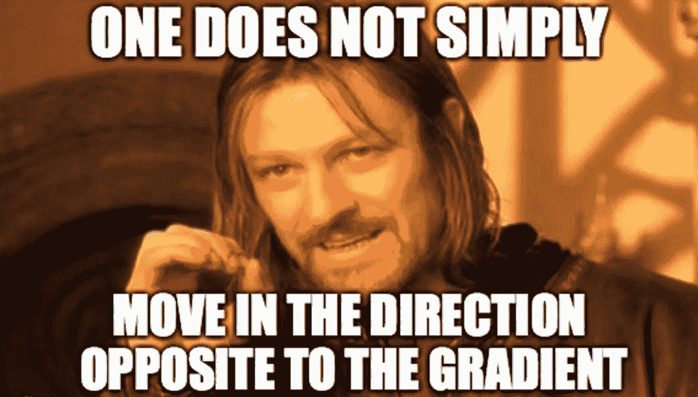

我假设有偏导数、[、向量代数](https://hackernoon.com/tagged/vector-algebra)、泰勒级数和神经网络的基本知识。

所以让我们开始吧。

> 在神经网络中，我们总是需要从我们拥有的数据中学习权重和偏差，以便我们达到损失函数的绝对最小值，因此我们需要有一种原则方法来达到损失函数的绝对最小值。

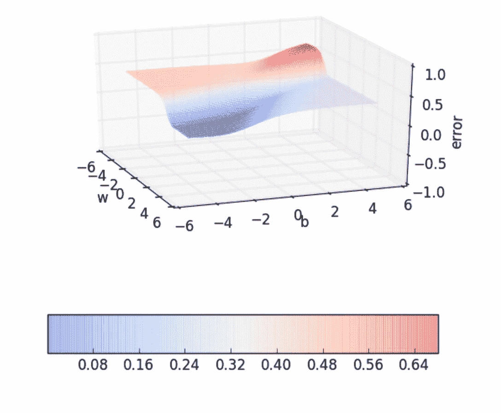

Error Surface

我们的主要目标是导航通过误差表面，以便到达误差小于或接近零的点。

让我们假设θ **= [** w，b **]** 其中 w & b 分别是权重和偏差。θ是误差曲面上的任意点。从 w 开始& b 是随机初始化的，这是我们的起点。

θ 是参数 w 和 b 的向量，使得θ ∈ R 。

让我们假设δθ**=[**δw，δb]其中δw&δb 是我们对权重和偏差所做的改变，使得我们朝着减少损失的方向移动，并停留在误差较小的地方。δθ是减少损失方向的向量。

δθ是参数δw 和δb 的向量，使得δθ**∈R**。****

****现在我们需要从θ移动到θ+δθ，这样我们就朝着损失最小的方向移动。****

****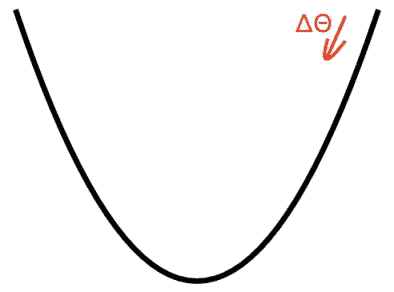****

****Loss Function****

****如果我们把δθ**加到θ 上，我们就得到一个新的矢量。******

****设新向量为θ *new。*****

****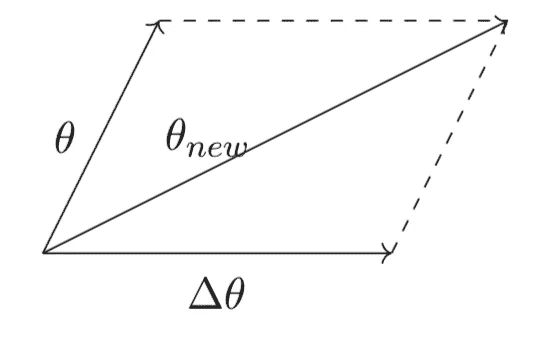****

****因此从上图可以看出，矢量θ 是向矢量δθ的方向移动。****

****但是如果我们不朝着δθ**大步前进会更好，尽管我们有兴趣朝着那个方向前进。如果我们大步前进，我们就有可能错过损失函数的绝对最小值。******

****因此，我们向δθ迈一小步。这由标量“η”决定。****

****标量“η”称为学习率。η一般小于 1。因此，我们将向δθ方向移动，并按η的比例缩小。****

****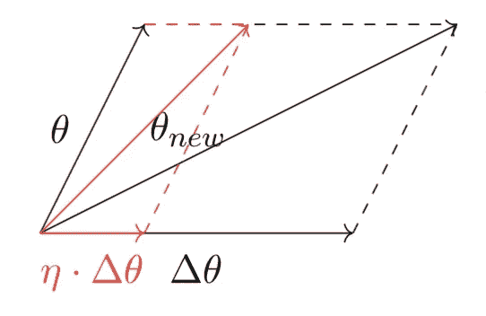****

****因此θ *new =* θ + η。δθ其中δθ是减少损耗的方向。****

****所以我们从θ的随机值开始。然后我们向δθ方向移动，这确保了我们的损耗减少。我们需要以循环的方式来达到全球最低。****

****但是什么是δθ呢？δθ的正确值是多少？****

****坚持住，我们会找到的。****

****所以上面这个问题的答案来自泰勒级数。****

****为了简单起见，让我们假设δθ= u。****

****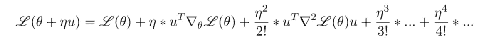****

****Taylor Series****

****泰勒级数告诉我们的是，如果我们在θ的某个值，我们对θ的值做一个小的改变，那么损失函数的新值是什么。****

****L(θ)称为损失函数。****

****这里∇L(θ) = [∂L(θ)/∂w，∂L(θ)/∂b]是梯度向量，它是关于θ分量的偏导数的集合。****

****η的值通常取为小于 1。还有那个η <<<1\. So we might as well ignore the higher order terms.****

****And we end up with the equation as below.****

****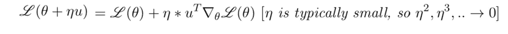****

****So we have some value of θ and we want to move away from that direction such that the new loss L(θ+ηu) is less than the old loss L(θ).****

****So a desired value for “ u ” is obtained when the following condition holds.****

****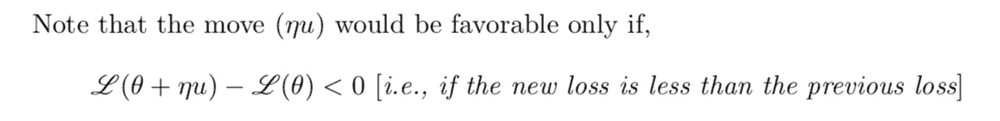****

****This implies,****

****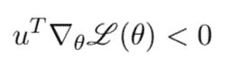****

****This condition should hold for the vector u that we are trying to choose so that we can be sure that we have chosen a good value for “ u ”. A good value of “ u ” can be obtained if the loss of the new step is less than the loss of the previous step.****

****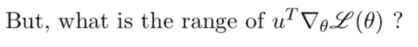****

****So the range is ± ||u|| || ∇L(θ)|| .This is just the dot product of u and ∇L(θ).****

****Let us assume β as the angle between the vector u and the gradient vector ∇L(θ).Then we know that,****

****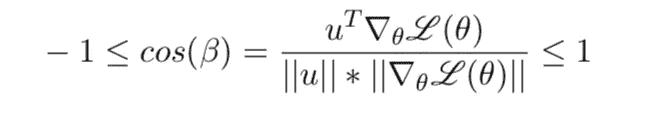****

****And assuming k = ||u|| || ∇L(θ)|| the inequalities simplify to,****

****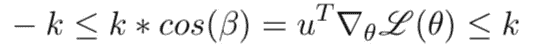****

****We want the difference between the new loss and old loss to be as negative as possible. The more negative it is, the more the loss will decrease. So the dot product of the vector u and ∇L(θ) should be as negative as possible and so should be equal to **-k** 。这种情况下，cos(β)的值应等于-1。****

****这是符合条件的 https://onlinecourses.nptel.ac.in/noc18_cs41)< 0.****

****The value of cos(β) will be equal to -1 when the angle between the vector u and the gradient is 180°.****

****The direction “u” that we intend to move in should be at 180° with respect to the gradient.****

****And this is the reason why need to move in the direction opposite to the Gradient.****

****So what the gradient descent rule tells us is that if we are at a particular value of θ and if we want to move to a new value of θ such that the new loss is less than the current loss then we should move in the direction opposite to the gradient.****

********

****Now these are the parameter update equations. And they follow what we have discussed so far.****

****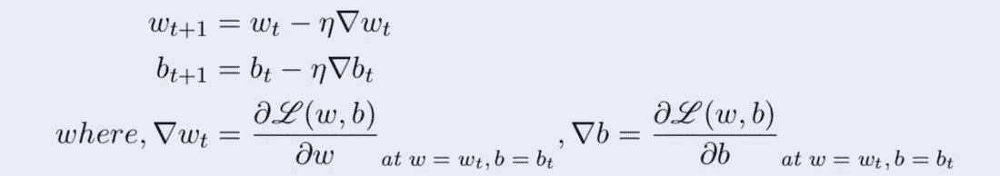****

****I guess this article would have given you a mathematical intuition of gradient descent and the reason behind moving in the direction opposite to the gradient. Any feedback will be appreciated.****

****Citation:****