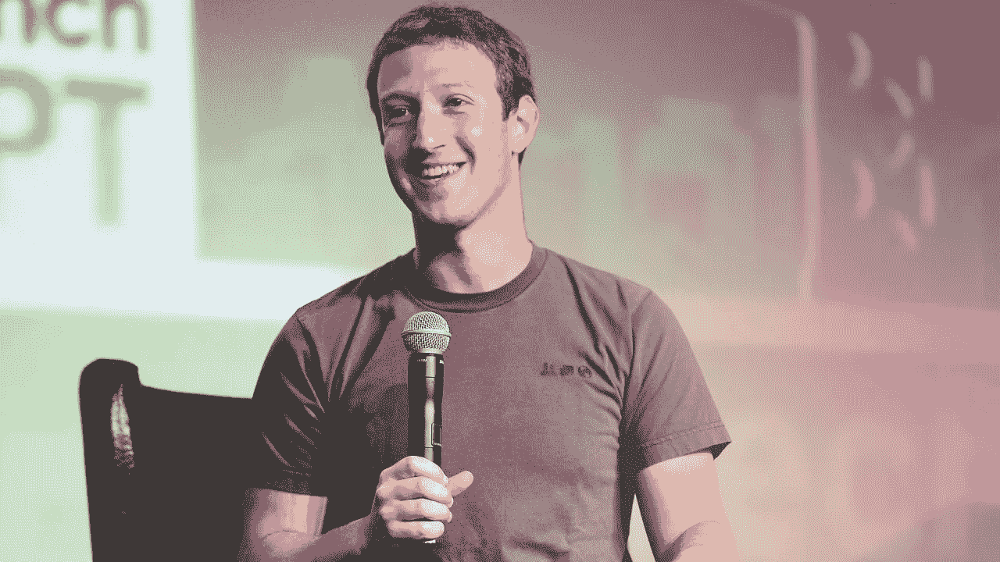

# 马克·扎克伯格每天穿同一件衬衫的原因

> 原文：<https://medium.com/hackernoon/the-reason-why-mark-zuckerberg-wears-the-same-shirt-everyday-68e4f907f661>

在任何时候，我们的意志力都是有限的。你在每项任务上都用了同样多的时间，那么你为什么要把它浪费在琐碎的事情上呢？

 [## 每当彼得·施罗德发表文章时，就收到一封电子邮件。

### 每当彼得·施罗德发表文章时，就收到一封电子邮件。通过注册，您将创建一个中型帐户，如果您还没有…

medium.com](/subscribe/@peterschroederr) 

每一天，你都以这样或那样的形式发挥意志力。你忍住了去脸书冲浪的冲动，而没有完成你的费用报告。你艰难地开车经过你最喜欢的汉堡店，选择吃沙拉。当你想对你的老板说些尖刻的话时，你会保持沉默。

然而，越来越多的研究表明，抵制反复的诱惑会对我们的精神造成伤害。一些专家将意志力比作肌肉，肌肉会因过度使用而疲劳。

[明尼苏达大学市场营销学副教授凯瑟琳·沃斯](http://www.nytimes.com/2010/10/09/your-money/09shortcuts.html)指出:

> “有研究表明，人们仍然拥有与过去几十年相同的自制力，但我们受到越来越多的诱惑，”以及“我们的心理系统并不是为了应对所有潜在的即时满足而建立的。”

结果，我们的潜意识每天都受到世俗生活名义任务的打击。从“我今天要穿什么”到“我们应该去哪里吃饭？”致“OMG 今天[比特币](https://hackernoon.com/how-i-turned-26-24-into-1-000-of-bitcoin-c0b44bf2b17d)的价格是多少？!"消耗了我们有限的意志力。

你可能想知道，马克·扎克伯格和其他人是如何对抗这个沉默的精神杀手的？

# 选择简约主义

在过去的十年里，思想精英们已经发现了一个非常基本的事实。他们不应该把时间和精力浪费在可以预先确定或自动化的不相关的事情上。

史蒂夫·乔布斯也做了同样的事情，每天都穿黑色高领毛衣。他不仅穿得像 80 年代的圣诞节一样，看起来温文尔雅，而且他还把选择极简主义的习惯灌输到他的生活方式中。

**简单地说就是由** [**蒂姆·费里斯**](https://tim.blog/2008/02/06/the-choice-minimal-lifestyle-6-formulas-for-more-output-and-less-overwhelm/) **:**

> 当我们考虑两个事实时，选择最少的生活方式成为一个有吸引力的工具:
> 
> 1)考虑选项会耗费注意力，而这些注意力不能花在行动或现状意识上。
> 
> 2)注意力不仅对生产力是必要的，对欣赏也是必要的。

因此:

选择太多=生产力下降或没有生产力
选择太多=欣赏力下降或没有欣赏力
选择太多=压迫感

[这是你每天面对太多选择时的潜意识](https://youtu.be/QX_oy9614HQ)。

# 这对你意味着什么

1.  **审视你的日常生活—** 开始写日记，记录你每天做出的所有选择。
2.  **衡量结果—** 按类别查看您的日志和小组决策。然后问:“这个决定会影响我想要的结果吗？”很多都不会。
3.  **做帕累托分析—** 问自己，“[我做的 20%的决定中有哪些占据了我 80%或更多的时间？这些是首先要解决的问题。](https://www.mindtools.com/pages/article/newTED_01.htm)

接下来，你需要开始在你的生活中实施这些改变。不要试图打开开关，一夜之间开始你的极简生活。*走一步看一步*。

从一些简单的事情开始，比如建立一个每天都可以重复的一致的早晨惯例。例如:

*   早上 5 点醒来
*   穿上你前一天晚上准备好的衣服
*   吃你放在柜台上的水果
*   去健身房
*   遵循你一贯坚持的锻炼计划
*   回家喝蛋白质奶昔
*   淋浴，为新的一天做好准备

虽然这听起来很简单，但这一切都始于实际行动并坚持下去。这就是为什么你不应该贪多嚼不烂。在你用一件事经历了这个过程之后，用另一件事去做。

洗涤，冲洗，重复。

在你意识到之前，你会用你所有的意志力去做一些重大的决定，而不是你是否应该吃一个海潮豆荚。

感谢阅读！如果你喜欢这篇文章，我想你一定会喜欢我关于 API 经济的其他文章。