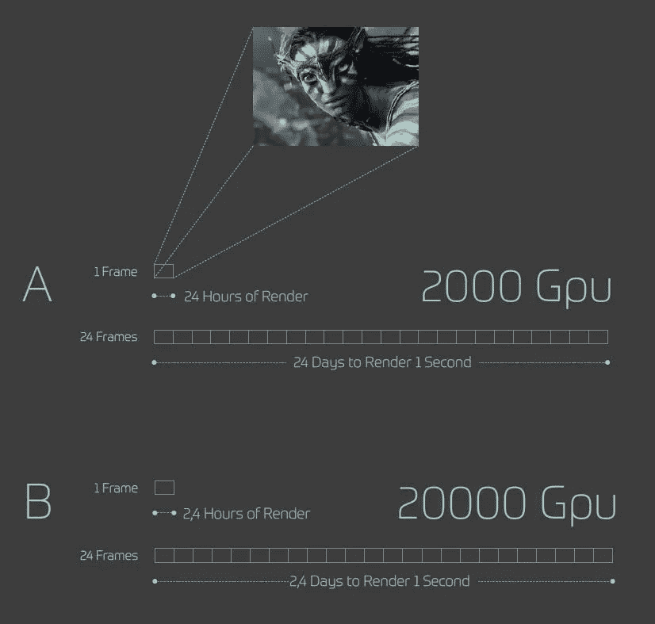
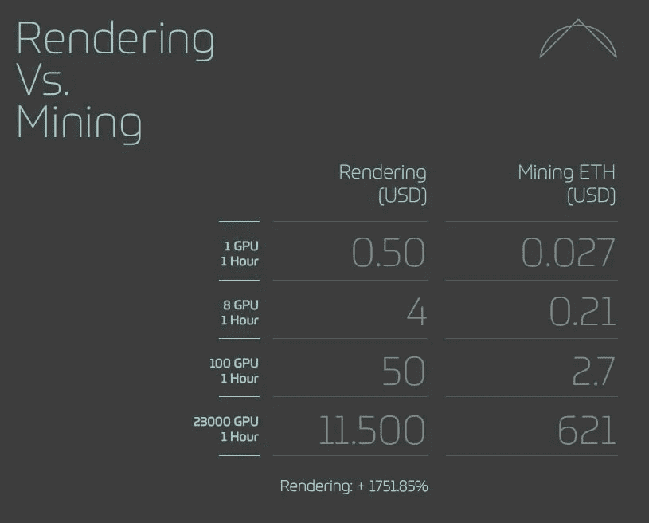

# 渲染机会

> 原文：<https://medium.com/hackernoon/the-rendering-opportunity-8e2ab6567a91>

## *对 CGI 渲染市场的解释*

令人惊讶的是，在 2018 年，CGI 动画师可以为每一秒渲染的视频等待长达一个月。单幅高分辨率图像往往需要 24 小时。尽管 CGI 渲染的普及性不断扩大——预计这一行业在未来两年内将增长到 1500 亿美元，并且是从工业设计到建筑、视频游戏和电影的一切事物的重要组成部分——但渲染过程中仍存在重大瓶颈，这些瓶颈造成了不可接受的延迟，并已准备好通过一个全新的技术平台来解决:[莱昂纳多渲染](https://www.leonardorender-ico.com/)。

**了解瓶颈**

渲染速度是 GPU 分配的一个函数。GPU 或图形处理单元是当代计算机中最常见的视频卡。它们是专门设计的电路，用于快速调整计算机内存，以在计算机屏幕或类似设备上显示图像。

对于图形渲染，下图显示了 GPU 数量影响渲染时间的方式:

巧合的是，GPU 对于挖掘加密货币也非常有用。GPU 并行执行大量的小型计算，这使得它们在完成向[区块链](https://hackernoon.com/tagged/blockchain)添加块所需的计算任务时效率极高。因此，加密采矿场通常包含大量的 GPU——在 Leonardo Render 的推出合作伙伴采矿场 Giga Watt 的情况下，有 23，000 个 GPU。

尽管到目前为止，GPU 钻机一直是以太坊采矿等许多采矿作业中的领先[技术](https://hackernoon.com/tagged/technology)，但它们正开始被新的 ASIC(专用集成电路)采矿机所取代，这些采矿机是为采矿定制的，其速度和能效比 GPU 前辈提高了四倍。这意味着现有的 GPU 矿商将越来越多地寻找新的收入来源。即使以今天的价格计算，Leonardo Render 也为 ETH 矿工提供了一个有利可图的选择:

盈利能力提高了近 1，752%，这不仅为采矿者提供了变革性的新收入流，也是 CGI 渲染者的重大业务创新，他们很快就可以利用加密采矿的 GPU 能力来大幅加速他们的项目。

连接矿工和 CGI 专业人员的桥梁是 Leonardo Render——一个在过去四年中开发的软件和平台，它将直接连接重量级的加密矿工和渲染项目。GGI 目前普遍采用的模式是，渲染者将文件上传到云，进行渲染，然后在经过相当长的延迟后下载文件，这种模式存在明显的安全风险，与之不同的是，Leonardo Render 为渲染者提供了通过 Leonardo Render 专有的分布式超级计算平台，从个人计算机直接连接密码挖掘 GPU 的机会。这使得渲染项目有可能实时交付，并大大节省了成本。

**完美时机的卓越技术解决方案**

莱昂纳多渲染平台正以一个令人羡慕的机会进入市场，并且与所有竞争系统相比具有明显的、容易识别的优势。Leonardo Render 提出打破 CGI 渲染固有的长时间延迟，并通过这样做为加密货币矿工打开了一个全新的商业模式的大门。

要了解更多信息，请访问 https://www.leonardorender-ico.com/

*跟随项目加入莱昂纳多渲染电报:* **@leonardorender**

*也在推特上保持联系:* **@leonardorender**

[对于 Youtube，请点击此链接](https://www.youtube.com/channel/UCssLTrIrtY6zXDApKcgYnVg)

[对于脸书，请点击此链接](https://www.facebook.com/LEOS-The-Leonardo-Render-Token-2004142919840227/)

-

