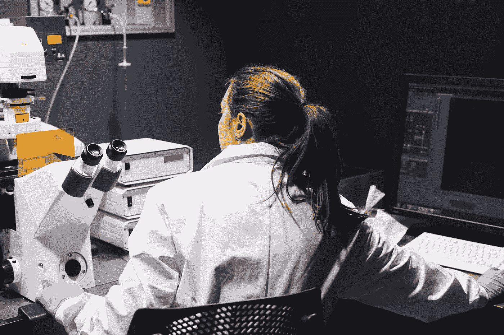
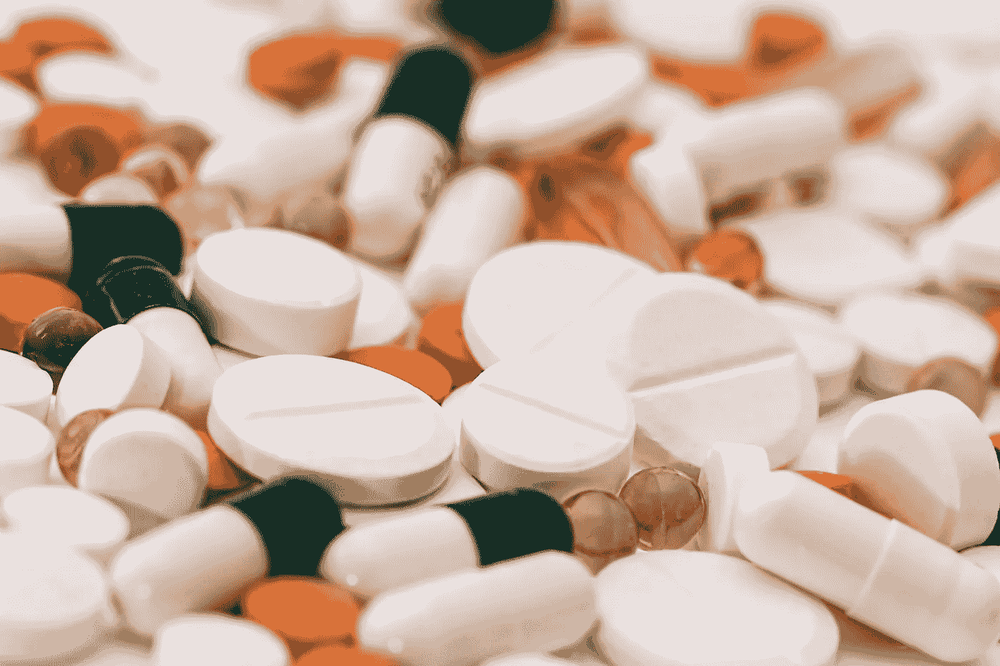
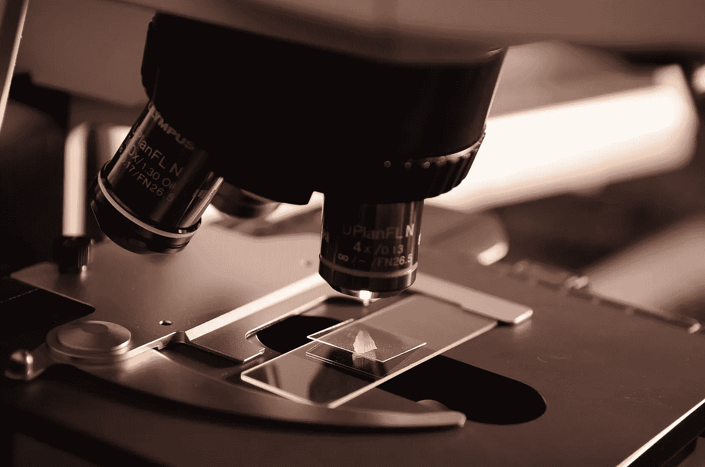
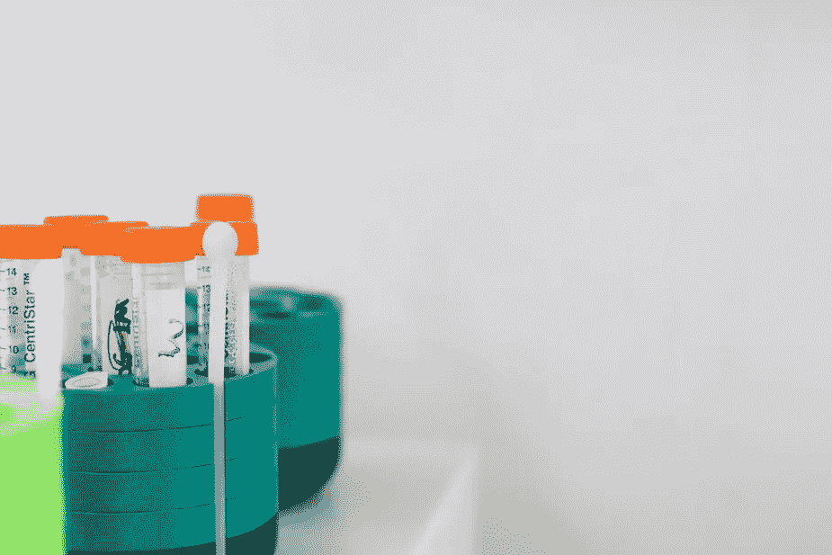

# 科学的复兴

> 原文：<https://medium.com/hackernoon/the-resurgence-of-science-ccab7b5552de>

就目前的情况来看，2010 年将因手机的崛起而被人们记住，人工智能作为主要演员出现在 T2 技术舞台上。然而，还有两年的时间要写。

我相信 2018 年将会是商业化科学生效的一年。

2010 年，人类利用基因组测序首次诞生了[合成生命](https://www.theguardian.com/science/2010/may/20/craig-venter-synthetic-life-form)。从那时起，这十年中的技术力量一直在慢慢润滑创新的车轮，以便科学能够首次成为主流。现在，比以往任何时候都更快、更有力地将科学突破推向市场的舞台已经搭好。

**主工具**

除了作为一项技术本身占据中心地位，人工智能在科学中也发挥着重要作用。

当人工智能首次赢得我们的关注时，许多人认为它是自己的技术垂直领域。风险公司投资了人工智能。权威人士估计了干扰成本。为人工智能预算做计划的公司。

尽管对人工智能的兴趣和投资显然仍在上升(例如，人工智能技术的投资预计将从 2016 年的 6.4 亿美元增长到 2025 年的 370 亿美元)，但一个重要的转变正在发生。人工智能不再被视为孤立的技术。聪明的风投不再投资广义的 AI，现在专注于具体解决方案的应用型 AI。人工智能现在渗透的垂直行业将他们的模拟竞争对手远远甩在身后。

现在，人工智能与科学平台的横向整合正在以前所未有的规模推动突破和商业化。

药物发现是一个很强的案例研究。如果我们能在一年内将一种药物推向市场，而不是十年，会怎么样？想象一下这将对大型制药和生物技术，这个价值一万亿美元的行业，以及他们治疗的数百万人的生活，包括我们的亲人产生的影响。借助人工智能，我们可以自动化、规模化和创新药物开发的科学流程，从而加快突破速度，进而加快上市速度。

新兴的科学公司已经在利用人工智能。TwoXAR 正在利用其计算平台来识别有前途的候选药物，通过临床前研究减轻一些风险。另一个名为 [Arzeda](https://arzeda.com/) 的人能够利用机器学习进行代谢工程。应用计算生物学和合成化学，Arzeda 已经将计算从头设计扩展到单个酶之外。AI 和 ML 的应用使我们离将这一过程应用于药物开发更近了一步。

人工智能使我们能够对蛋白质进行反向工程，以设计药物和预测副作用，确定市场需求，预测结果和治疗方法——所有这些都将商业化的时间加快了一个数量级。潜力是无限的，因为这些公司和无数其他公司利用人工智能来支持各行各业的科学突破。

**商业化平台&管道**

编辑 DNA 的费用一度高达几十万美元。今天，一个住在地下室的研究生只需几千美元就能创造出一个新物种。但是她能把这个物种介绍给世界吗？差不多了。

公司和研究人员不再满足于简单地取得突破；他们还想尽快将其推向市场。

创新的新步伐正在推动公司提前两步思考，设计专门建造的管道，以更快地将发现送到客户手中。在这种新的包装中，科学驱动的平台是现代的装配线，将实验室之间的工作流连接起来，并在沿途进行分析。它对客户友好，旨在中断。很快。

一个很好的例子就是 [NuMat 科技](https://www.numat-tech.com/)。NuMat 可以研究、设计和开发一种旨在解决特定问题的新材料，例如更有效地储存气体。然后，NuMat 会全程跟踪其产品，直至其客户的实施管道——这是一个从想法到影响的真正端到端的旅程。

食品检测公司 Clear Labs 正在进行下一代测序，并将其商业化用于食品安全行业。基于他们的专有平台，他们开发了一种分销模式，在这种模式下，这种测试可以用于多种用途，从转基因测试到真实性验证。

Aromyx 已经将哺乳动物的嗅觉系统(让你品尝味道的系统)放在芯片上，为香水、食品、国防和无数其他行业的新规模测试打开了大门。

另一家名为 [Emulate Bio](https://emulatebio.com/) 的公司正在削减动物和人类测试的流程，并用芯片级技术取而代之。他们的“芯片上器官”技术模拟了人类生物学，帮助研究人员了解不同的疾病、药物、化学品和食物如何影响人类健康。这种测试平台是科学如何从单一用例转向跨行业规模的完美例子，只需围绕突破建立一个平台结构和生态系统。

> 正如人工智能正在推动大规模突破一样，这些完全集成的商业化平台和管道的建设将有助于科学以我们无法理解的方式改变行业。

**消费者聚焦**

直到最近，人们可以说科学发现一直被锁在学术研究和商业实验室的象牙塔里。大学和孵化器的技术转移项目现在已经开始为市场带来突破。然而，科学正面临着一个更加彻底的转变。在人工智能的催化下，在商业化平台和管道的推动下，我们现在正在推动科学领域的消费主义运动。

消费者第一科学的例子已经进入市场。在测序成本大幅降低的推动下，基因组公司已经毫无疑问地到达了消费者手中。 [UBiome](https://ubiome.com/) ， [23andME](https://www.23andme.com/) ，[everly well](https://www.everlywell.com/)——所有这些公司都通过降低用户成本，提供用户友好的界面，使消费者无需看医生就可以直接获得复杂的实验室测试，从而实现了民主化。[手持测序仪](https://www.theatlantic.com/science/archive/2016/04/this-technology-will-allow-anyone-to-sequence-dna-anywhere/479625/)也上架了。对于这些产品中的每一种来说，不仅大众可以接受它们的价格，而且它们被设计成可以在家里使用。这些突破在开发时都考虑到了这个用例。

食品行业基于这种新模式的颠覆也已经成熟。像 [Hampton Creek](https://justforall.com/en-us?gclid=EAIaIQobChMI8u_oouPY2gIViEVpCh3uNQP3EAAYASAAEgIdm_D_BwE) 、 [Beyond Meat](http://beyondmeat.com/) 和 [Impossible Foods](https://www.impossiblefoods.com/) 这样的公司正在重新定义我们如何为消费者开发传统农业和加工产品之外的食品。这些品牌通常被归类为肉类替代品，它们在研究实验室中花费了数年时间来了解我们食物的组成部分(下至分子水平)，以及我们如何使用 FDA 批准的对人类和环境更好的成分来再造食物。

虽然这些新型食品要感谢科学，但每家公司都必须考虑监管环境、消费者需求和食品行业的结构，才能让他们的突破进入市场。你明天吃的食物将是今天消费者第一思维的直接结果。

**科学的复兴**

2018 年已经到来，随之而来的是科学创新的新步伐，新的生产平台，以及将我们这些普通消费者置于设计过程中心的新心态。虽然我们只剩下两年的时间来为这十年留下我们的印记，但我们有足够的时间来推出下一种拯救生命的药物，下一个符合伦理道德的汉堡，或者下一个了解和跟踪你自己的生物学的设备。

今年将作为科学的复兴和创新新时代的开端而被铭记。