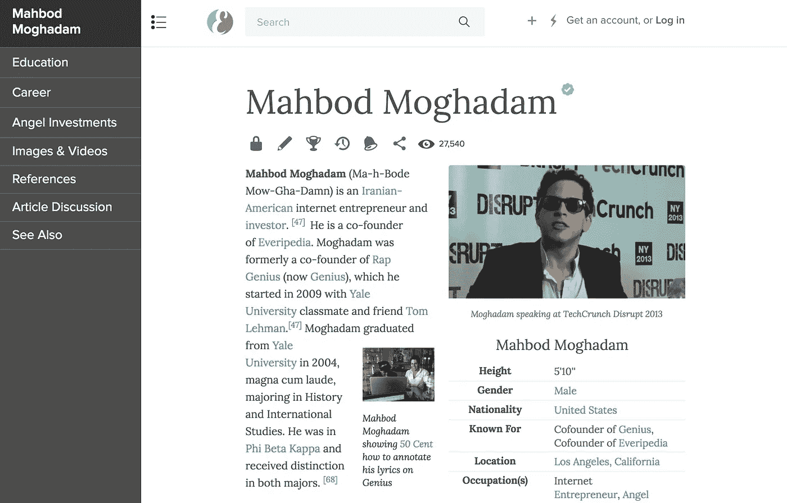
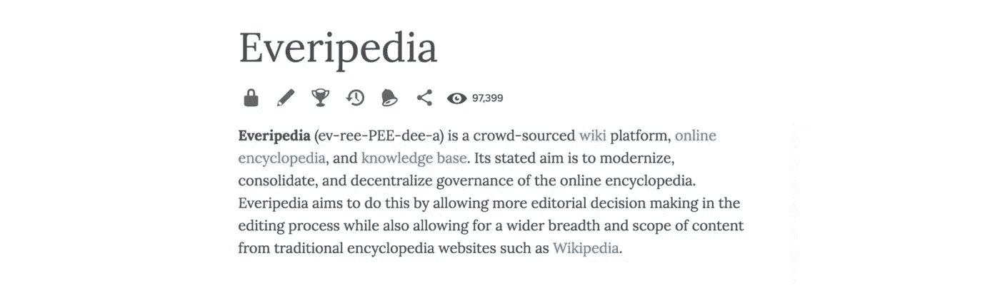
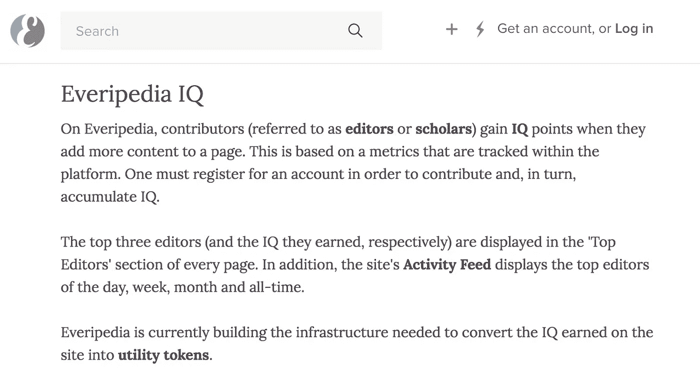

# Everipedia 如何用区块链去中心化历史

> 原文：<https://medium.com/hackernoon/the-revolution-of-knowledge-how-everipedia-is-decentralizing-history-6eb44bb9ea75>

## 采访 Mahbod Moghadam，Everipedia 和 T2 天才的联合创始人。

几周前，我和我的一个朋友一起工作时，我听到他开始在笔记本电脑后面咯咯地笑。

他把他的 MacBook 转过来，给我看了一个名叫 *Mahbod Moghadam* 的人发来的脸书状态。

“我只关心我的密码和腹肌”，上面写道。

我心想，这家伙是我的灵兽。我笑着浏览他分享的一些丰富多彩的状态。

我的朋友内森·拉弗尔向我解释说，马哈茂德是他的一个熟人。他创立了[说唱天才](https://everipedia.org/wiki/Genius_%2528website%2529/)，现在正在从事一个名为 [Everipedia](http://everipedia.org) 的区块链项目。

Rap Genius 是 Y-Combinator 有史以来发展最快的初创公司。作为一个自称为嘻哈音乐领袖的人，我已经使用这个网站很多年了。这是第一个类似维基的平台，允许艺术家验证他们歌词的意思(Mahbod 后来告诉我这是他的想法)。

我在大学里花了很多时间在说唱天才(现在指的是，“天才”)上。我还记得当“ [*10 日*](https://everipedia.org/wiki/10_Day_(mixtape)/) ”由[机缘说唱歌手](https://everipedia.org/wiki/Chance_the_Rapper/)出来的时候。

我接着上了 Genius，发现这个名不见经传的艺人居然还创建了账号，验证了自己的歌词。

我震惊了。

我想见见 Mahbod，了解他在《天才》中的角色，就像我想了解他的新公司 Everipedia 一样。

一个网站的大胆使命是，

> "对在线百科全书进行现代化、整合和去中心化管理."

[Excerpt from Everipedia’s page on Everipedia](https://everipedia.org/wiki/everipedia/)

在与 Mahbod 坐下来之前，我对在线百科全书的世界相当无知。起初，我甚至不确定是否真的需要这种产品。我不太了解维基百科的缺陷，无法理解这种需求——这些缺陷 Mahbod 太熟悉了。

虽然我们可能没有意识到，但我们每天都在创造历史。每一个新成立的公司，每一个发布项目的音乐家，每一个拿起笔的作家。

我们都在一起创造历史。

## 历史现在被记录在互联网上——但是谁控制着那段历史？

维基百科等网站的看门人是否在秘密控制我们的孩子将被告知的故事？

谁的视角会分享给下一代？

— — — — — — — — —

## 几周后，我和 Mahbod 坐在西好莱坞的 Soho House 喝酒。

Mahbod 名声在外。离开 Genius 后，他写了一系列题为[、【如何从全食超市偷东西】](https://everipedia.org/wiki/how-to-steal-from-whole-foods-mahbod-moghadam/)的文章，受到了很多关注。一个基于变量的全食超市排名系列，比如:他们偷东西的容易程度或者他们的顾客有多火辣。

这部连续剧在**网上疯传**。

它获得了如此多的关注，以至于 Mahbod 收到了全食超市的一封信。威胁要终身禁止他进入他们的商店。

当试图描述 Mahbod 时，脑海中出现了许多词语，*无聊*绝对不是其中之一。

— — — — — — — — — — —

# 面试

## **问:你是怎么和 Everipedia 扯上关系的？**

答:山姆知道我的原因是因为我创办了天才。天才在某些方面是 Everipedia 的灵感来源。

这是一个(天才)维基网站，每个人都可以进来:从名人到粉丝，分享他们关于歌词的知识。

山姆是天才的超级粉丝，他基本上在想，

“为什么有一个复杂的、使用起来很有趣的说唱歌词维基网站，但所有内容的维基网站(维基百科)都很旧，很难使用”。

所以如果我们建立了维基百科的说唱天才。

如果我们说唱化，或 Quora-ify，或栈溢出-ify 维基百科。

如果我们把维基百科放在一个 Web 2.0 网站的皮肤里会怎么样。

## **问:山姆是联合创始人之一？**

是的，山姆是公司的总裁。他和 Theodore(Everipedia 的首席执行官)在 Sam 完成加州大学洛杉矶分校的学业时创建了最初的 MVP。

我在加州大学洛杉矶分校做了一个关于天才的演讲。Sam 在我演讲的时候过来给我看了我的 Everipedia 页面。

> 这对我意义重大，因为曾经有人给我做了一个维基百科页面。我真的很兴奋，但维基百科删除了它，因为他们认为我不够“引人注目”。

所以，萨姆给我看了它，我有了一个“灵光一现”。

我想，如果我这么想要一个，而他们不给我，我可能不是唯一一个。

果然，Everipedia 现在是排名前 10，000 的网站之一。

几乎我们所有的流量都来自人们搜索“维基”这个词来寻找没有维基的东西。

比如马赫布德·莫格哈达姆维基。

或者，“一些他们刚刚听说过的创业公司”维基。

## 问:Everipedia 如何解决维基百科的问题和痛点？

答:创业公司很难拿到 Wiki 页面，那有什么？

这里有[克朗彻基](https://everipedia.org/wiki/crunchbase/)。

Crunchbase 是填补 Wiki 的显著性要求造成的漏洞的一个权宜之计。

Crunchbase 的问题是，如果你在一个创业公司页面上，它说这家创业公司在旧金山运营。你不能点击“旧金山”并在上面加载一个页面。这就是维基的全部意义，兔子洞。

我们想要*一个*维基。将 Crunchbase、Investopedia、Murderpedia、Star Wars-pedia 和 Star Trek-pedia 与母体维基百科结合起来。这样一切都联系在一起。

这是 Everipedia 背后的两个愿景:

1)使软件现代圆滑和复杂。

2)扩大范围——结束维基社区所说的删除主义。

## **问:你觉得维基百科有能力在这个意义上改变历史吗？通过说什么是值得注意的，什么是不值得注意的，他们是在控制人们 100 年后认为重要的事情吗？**

答:维基百科是一个非常强大的网站，也是唯一一个既是互联网支柱又是非盈利的网站。在某种程度上，这创造了良性激励。这也产生了不正当的动机。

> 这家公司不是在为客户服务。他们试图通过让贡献者感到强大来补偿他们。

所以很多贡献者以混乱的方式行使这种权力。

我们注意到的一件事是，如果你是一个说唱歌手，你很难获得一个维基百科页面。

在 Everipedias 的前 10 个页面中，超过一半是说唱歌手的页面，其中很多是女性说唱歌手。

如果你是城市人、少数民族、女性或任何与维基贡献者人口统计不符的人:你将很难上维基百科。

## **问:维基百科贡献者的人口统计是什么？**

答:住在湾区的白人。

## **问:阻止区块链技术大规模采用的最大障碍是什么？**

答:像任何技术一样，最大的问题是政府监管。

我们必须弄清楚这将如何适应现有的世界。

我认为它会发生。从经济和法律的角度来看，最后一个颠覆性的突破是拼车。

开始的时候是违法的。人们发现它是有价值的，现在有大的游说者支持它。他们改变了范式。

这是 crypto 面临的最大挑战。

我不太担心。任何增加巨大价值的事情都需要时间。你必须贿赂合适的人。腐败成风。crypto 背后有很多 I *光晕*力量。

碰巧的是，当有一种技术真的可以改变一切时，真的很难阻止它。最大的挑战不是“计算机的东西”，而是“法律的东西”。我是一个相当乐观的人，通过监管扼杀技术是非常困难的。

## **问:中国过去不是三四次试图禁止加密货币吗？**

答:嗯，中国有很多人在加密方面赚了很多钱。中国的比特币亿万富翁和百万富翁比任何人都多。

我得到的解释是，中国正在进行一场关于加密的内战。当权派受到了威胁。他们担心通过加密致富的中国人将会接管。

## **问:所以这场“内战”是因为 crypto 被创造出来的原因之一而开始的？扰乱传统的财富分配？**

是的，但是你还是要贿赂他们。

我是这本书的忠实粉丝，[《美国一个民族的历史》](https://everipedia.org/wiki/A_People%2527s_History_of_the_United_States/)，霍华德·津。这是一本社会主义历史书，它说美国历史上有一个“蒸汽冷却器”。

在欧洲，穷人受到如此恶劣的对待，以至于他们最终会反抗。

但是在美国，我们发现防止下层阶级反抗的一个方法是与他们分享一点财富。

他说这好像是一件非常糟糕的事情，你可以乐观地看待它——这就是科技的工作方式。你创造了新的东西，然后你不得不贿赂现有的人来采用它。这不会是 100%的进步，这是循序渐进的。这是一个保守的、缓慢的、稳定的进步。

## **问:是什么吸引你加入 crypto？你是什么时候掉进秘密兔子洞的？**

我的灵光一现是在 Everipedia 上看到了我自己的网页。

我太想要一个维基页面了。我以为一定有人有同感。当时，我不知道有一个价值数十亿美元的黑市，充斥着通过贿赂进入维基百科的人。

老实说，这就是吸引我的原因，我非常想要一页纸。在我的页面被删除之前，我认为任何人都可以在维基百科上创建一个关于任何事情的页面。我不知道他们有这些规定。

大多数人都是这么想的，他们并没有真正尝试过做一个页面。

你试过在维基百科上做一个页面吗？

a)祝你在试图弄清楚如何制作一个页面时好运

b)他们会把它拿下来。

他们会记下超过 99%的提交页面。

这是一个很大的努力浪费，贡献者甚至没有得到任何东西。而我们给他们代币。

我们给他们代币，他们得到报酬，他们实际上拥有他们正在建设的网站。

## 问:Everipedia 的“高级”商业模式是什么？

答:在我们决定推出代币之前，我们一直在做广告，现在我们已经通过空投筹集了资金。

该计划是有货币化内置到令牌。

[Excerpt from Everipedia’s page on Everipedia](https://everipedia.org/wiki/everipedia/)

使用代币作为投资工具的人将支付一笔税收，为网站的整体运营提供资金。由于网站是基于 EOS 的，我们没有任何服务器成本。

这就是 EOS 的工作方式，它是数字房地产。它没有浪费电力来建造代币，而是用它来为网站供电。

最终我们认为这将成为互联网的支柱。谁知道呢——货币化的可能性将是无穷无尽的。

## **问:维基百科不愿意迎合“非显著”的主题，这是否为 Everipedia 创造了机会？**

答:是的，我们的很多流量都来自“Wiki”这个词。人们搜索 Wiki 这个词，很多搜索都是去维基百科。对于没有维基的东西，有很多奇怪的网站，这些“其他小儿科”。

天才如何摆脱所有这些低劣的抒情网站，我们正在摆脱所有这些低劣的维基扩展网站。

我们可以和维基百科共存。但是为什么创业公司一定要去 Crunchbase，这个网站很烂，而且不是更大网络的一部分？

韩 Solo 粉丝男生为什么非要上星战-pedia？

有一个网站为没有维基页面的名人创建了维基页面，名为“名人生日”。它是世界 500 强网站之一，而且它甚至不是用正式的英语写的。

对 Everipedia 来说，这些就是 AZ 歌词和 Metro 歌词对天才的意义。

互联网上的垃圾太多了，需要有人出去清除。

## **问:这是你业务发展过程的一部分吗？接近这些其他儿科医生并告诉他们到你的平台上来？**

不，不，我们只是在建造它。

六个月前，拉里·桑格加入 Everipedia，成为我们的首席信息官。他是维基百科的创始人。

他对“更大的维基”( greater Wiki)的概念很感兴趣，这是一种其他百科全书也可以使用的区块链百科全书。他们一直在和《大英百科全书》之类的媒体谈话，但我真的看不出这有什么意义。Everipedia 已经做了所有的事情。你可以在我们的网站上制作任何你想制作的百科全书页面。

话说回来，我真的不擅长理解抽象概念。我需要手中的实际软件来玩它，并真正理解它。

我不是一个很懂技术的人，但是我很看重技术的人。炒作的人对我没有价值，我可以自己做。

我在 Everipedia 做的就是坐在那里工作。

开发商有个词叫“喂狗”。也就是说使用你自己的产品。这显示了开发人员文化的混乱。他们如此不愿意使用自己的产品，以至于有了一个名字。用自己的产品应该叫“生活”。

看看扎克，他的一切都是关于脸书，他做脸书直播，他发布了很多状态。太棒了。我就是这样，没有一天我不为自己的网站做贡献，制作维基页面。我每天工作的很大一部分是，我看到的任何我认为“这可以用维基页面”的东西，我回家就做。

## **问:你对 Everipedia 的未来最感兴趣的是什么？**

答:空投是个大新闻，我们是第一批使用这种筹资方式的人。

我们认为这可能会成为初创公司筹集资金的官方方法，就像去年 ICO 的爆炸一样。空投是更安全，法律健全的版本的 ICO。

所发生的是一个风险资本家(VC)买下所有你想卖的代币。因此，你筹集资本，就好像一个风险投资家在投资你，但他们(风险投资家)拿走这些代币，并把它们分发给他们的利益持有人。在我们的案例中，每个拥有 EOS 的人。

所以每个拥有 EOS 的人都将从[银河数码](https://everipedia.org/wiki/galaxy-digital/)获得价值 3000 万美元的代币。他们买了我们的代币，并协助空投。

*你可以在上面的视频中找到如何参与空投的信息。*

## **问:我不太熟悉用空投来筹集资金的方法。对银河数码有什么好处？**

答:EOS 的价格上涨是因为:

a)每个持有 EOS 的人都获得免费智商。

b)他们说，“这就是当你持有 EOS 时发生的事情”。银河数码有资本资助更多类似的项目。EOS 令牌持有者将成为所有这些交易的沉默合伙人。

## **问:你为什么选择 EOS 而不是** [**以太坊**](https://everipedia.org/wiki/Ethereum/) **？**

答: [EOS](https://everipedia.org/wiki/eos-cryptocurrency/) 是**数字房地产**，所以你知道，作为一个波斯人我是爱上房地产的。

对我来说，最令人兴奋的部分是，就像我说的，我们不只是在烧电。我们实际上是在 EOS 上托管我们的站点。更环保。我们利用一切而不是浪费资源来创建令牌。

这也意味着不可能审查 Everipedia。

它不在亚马逊的某个服务器上。因此，中国、伊朗、土耳其或任何屏蔽维基百科的国家都不可能屏蔽 Everipedia。

Everipedia 导入了维基百科，所有的维基都在 Everipedia 里面。

所以这 20 个屏蔽维基百科的国家——我们第一次把维基百科带到这些国家。

这就是 EOS 的力量！

我们搬到区块链的最大灵感之一是 Steemit，这是一个加密的 Reddit。Steemit 的创始人也是 EOS 的创始人，[丹·拉里默](https://everipedia.org/wiki/dan-larimer/)。

他在以太坊建造了 Steemit，并意识到它有问题。他决定建立自己的协议来解决所有这些问题。他基本上建立了他希望 Steemit 建立在其上的协议。

这就是他推出 EOS 的原因，也是我们正在打造的东西。

> Steemit 占全球所有区块链交易的 40%。这是一个排名前 1000 的网站，市值超过 10 亿美元，我们认为我们可以做得更好。

我们认为 Steemit 是加密的 Reddit，而 Everipedia 是加密的 Wikipedia。

我们正在帮助丹和 EOS 团队开发空投软件——这样他也能看到愿景。

他知道这是受他在 Steemit 所做的事情的启发，但我们要做一些更大范围的事情。

## **问:是什么让拉里·桑格想加入你的团队？**

答:这都是因为区块链。区块链技术是他们在 2001 年想要的东西，当时他们建立了 Wiki。当时，他们认为如果制造它的人也拥有它，它会是一个更好的产品。

这就完成了最初的设想。这让我想起了马克·安德森投资说唱天才时告诉我的话。当他第一次构建 Netscape 时，他想要一个注释功能，但是存储数据太难了。当时云存储还不够先进，无法应对这种情况。

天才正在完成马克眼中的原始网络浏览器的愿景，这就是拉里对 Everipedia 的感受。

**这是维基百科最初的设想。**

我们正在建立一种东西，让贡献价值的人得到回报。

## 问:拉里·桑格和维基团队之间有什么嫌隙吗？这算是他背叛了他们吗？

答:拉里是维基百科社区的传奇人物。如果你允许我变得令人讨厌…

他对于维基百科就像我对于说唱天才一样。

我们都没有在公司呆很长时间，但我们是给他们发言权的人。

他发明了维基百科这个词，就像我发明了说唱天才这个词一样。

他为整个社区定下了基调。

这不是意外。在拉里加入之前，我们有一个相当大的社区，但他们不是维基编辑。现在我们有很多编辑从维基来到我们的平台——这是因为拉里。

## 问:成为 Everipedia 的编辑或投稿人的过程是怎样的？

答:你申请邀请，你制作一些东西，我们审查你。一旦你通过审查，你就没事了。

我们鼓励人们创建原创页面。许多人只想编辑已经存在的内容。我们要弄清楚的是这个网站将如何与维基百科互动。我最感兴趣的是像我这样的页面。

比如我的页面。这是一个需要存在的 Everipedia 页面，人们搜索我的名字和单词“Wiki ”,而我没有维基百科。

我的页面有大约 30，000 的浏览量，虽然没有倾家荡产，但也算不错了！成千上万的人都是这样。

你会遇到像演员这样的人，他们没有维基，但他们的名字会重定向到他们的电视节目维基页面。这就是发生在我身上的事，我没有被删除，我被回收进了说唱天才页面。

## **问:我从你的 Everipedia 页面了解到，你投资了** [**【比特币基地】**](https://everipedia.org/wiki/coinbase/)**——你是什么时候投资的？**

答:2014 年。

## **问:我靠，你知道他们当时有多少用户吗？我想大多数阅读这篇文章的人都知道比特币基地是购买菲亚特 crypto 的首选之地。你发现它的时候它是什么？**

答:作为一个消费者互联网人，我对比特币基地最感兴趣的是他们的 Alexa 排名。他们在美国排名前 40，他们的访问量超过了《华尔街日报》，所以这就像“我的天啊，发生了什么事！”。

它非常小。忘了我投资的时候吧，当我第一次见到[Brian Armstrong](https://everipedia.org/wiki/bdarmstrong/)—[比特币基地](https://everipedia.org/wiki/coinbase/)的首席执行官——是在 [Y Combinator](https://everipedia.org/wiki/y-combinator-1/) 演示日。

他们在说唱天才之后加入了 Y 组合公司。那是我第一次认真对待比特币。我以前听说过这个词，但我认为这是一个笑话，我认为这是一个视频游戏。

我认为自己很会看人。我可以告诉你，当我遇到一个非常聪明的人时，我就是这样开始我的公司的。我见过布莱恩，觉得他非常聪明。所以，如果他在做一家加密货币公司，而且是在 Y Combinator，那就意味着比特币是合法的，而我错了。

## 问:这让我想起了我在学习股票交易时读到的一句话，“有两种人——在乎正确的人和在乎赚钱的人”。

答:我的哲学很大一部分是不要陷入杂草中。很多人想在采取行动前了解一切。你可能会遇到不懂技术的人，他们不会投资区块链，除非他们 100%理解它。

我不懂技术，我一点都不技术。我的决定基于心理学。我很擅长知道谁知道他们在说什么

所以我追随并支持那些知道自己在说什么的人。

这是一种法学院的心态，这个概念的法律术语是“审查”。有时法院会说，“我们不是来做决定的。我们是来决定谁能做决定的。”

我尽量不进行极端的审查。我找到聪明人，应用最高法院所谓的合理性审查。

我让他们为所欲为。

## **问:你最后有什么想分享的吗？**

答:我希望人们加入社区。我是一个容易接触的人，所以如果我谈论的任何事情符合你的兴趣，请来看看我们。来制作你自己的维基页面吧。通常情况下，当我让某人制作自己的页面时，我得到的回应是，“我不够重要”。那不是正确的思考方式。

人们在搜索你，即使你不这么认为，每个人都至少有一个令人毛骨悚然的人在谷歌他们。你需要一个人的 Everipedia，如果没有别的！

[结束]

— — — — — — — — — — — — —

我停止了录音，我们两人的饮料都喝完了，所以我提出再喝一轮。

"让我们在我的办公室停下来，这样你可以见见那些家伙，我们可以在那里喝点东西"。

我们上了他的车，前往加州大学洛杉矶分校附近的 Everipedia 办公室。当贴身男仆停下他的奥迪车时，他随口开玩笑道，"我知道我知道，什么样的波斯人不开宝马呢？"

Everipedia 办公室让我想起了《*《社交网络*》中描绘的脸书故居。

厨房柜台上散落着半成品酒瓶。客厅里摆满了桌子和显示器。里屋有两张双层床，但除此之外，很难知道 Everipedia 是否有人睡过觉。

后来我确信没有人睡得太多。

给我们又倒了一杯饮料后，Mahbod 坐在了他的电脑前。

"让我们给你做一个 Everipedia 页面，这样你就可以看到它是如何工作的了."

有点胆怯，不敢客观地谈论我自己和我的成就，我犹豫了。在我有机会插话之前，他已经点击了我的脸书和 LinkedIn。从脸书拍我的个人资料照片，从 LinkedIn 拍我合作过的公司。

几分钟后，我有了自己的网页，我被迷住了。在过去的 45 分钟里，我与他谈论了他的项目，看到它付诸实践是一件有趣的事情。

这让我觉得自己更重要，因为在某个地方有我存在的不可审查的记录。这让我想成为一名贡献者。

这让我想把历史掌握在自己手中。

“你住在哪里？”Mahbod 问道，手指仍在呼呼作响，他正在制作我的 Everipedia 页面。

我让他知道我住在镇上的哪个地方，他笑了。

> "哦，你知道你住在美国最热门的全食超市的街上吗？"。

— — — — — — — — — — — —

***免责声明:我没有投资 Everipedia，这也不是付费推广。如果你想接受采访，请登陆***[***Twitter***](http://twitter.com/rezajafery)***联系我——但如果我认为你的产品是狗屎，我会直说:)***