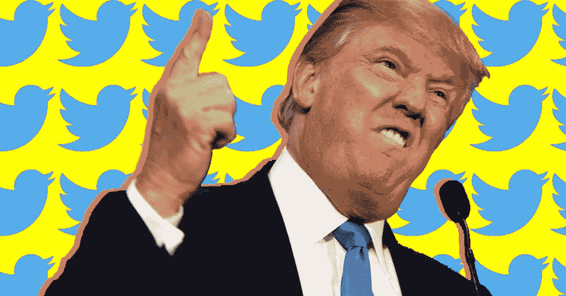

# 这场革命将会在推特上发布

> 原文：<https://medium.com/hackernoon/the-revolution-will-now-be-tweeted-c54ea887598>

## 一些不那么微妙的细节如何将美国带入一场没人想要的战争。

我们到了，2018 年才过去几天，这对我们所有人来说应该是一个新的开始。但许多社交媒体平台似乎都陷入了 2017 年的宿醉。

激励了一代人的创业公司现在不得不接受他们的点石成金。当大多数(如果不是全部的话)这些平台推出时，它们提供了一个新的和萌芽的民主化互联网的承诺。一个任何人都可以随心所欲地做任何事/说任何话的互联网。最后，给小人物一个声音。但是当我们进入今年，它是曾经的想法，小家伙现在制造所有的噪音。

脸书发现自己处于国际宣传阴谋的中心。在 2017 年的最后几天，一个臭名昭著的游戏恶作剧，拍打，[变成了一个无辜旁观者的致命事件](https://www.nytimes.com/2017/12/31/us/wichita-swatting-barriss.html?_r=0)。YouTube 发现自己陷入了另一场洛根的争议中。

这位 [YouTube 明星在他的频道上发布了一段视频](https://www.theverge.com/2018/1/2/16841260/logan-paul-youtube-suicide-controversy-carelessness-online-celebrity)，视频显示他和朋友在日本旅行。当他们在一个众所周知人们自杀的森林中探险时，洛根发现了一具明显的尸体，并开始展示更多的尸体。在几次拙劣的道歉之后，这位网络名人彻底删除了这段视频。

为了不被更新的自己超越，在所有罗根·保罗人的回应中，川普放下了高尔夫球杆，拿起了推特。自今年年初以来，他发布了许多推文，其中一条包括另一条对媒体的抨击:

> 我将在周一下午 5 点宣布年度最不诚实和腐败媒体奖。主题将涵盖来自假新闻媒体的各种不诚实和不良报道。敬请期待！- [@realDonaldTrump](https://twitter.com/realDonaldTrump/status/948359545767841792)

但风暴中有一条推文引起了许多美国人的关注:

> 朝鲜领导人金正恩刚刚表示，“核按钮一直在他的办公桌上。”会有人从他的枯竭和食物匮乏的政权，请告诉他，我也有一个核按钮，但它是一个更大和更强大的一个比他的，我的按钮工作！- [@realDonaldTrump](https://twitter.com/realDonaldTrump/status/948355557022420992)

这导致许多人走上讲台，抗议@realDonaldTrump 被暂停网络服务。

尽管声称他们不会在 9 月份暂停他的账户，因为他“有新闻价值”，但人们坚持这样做了。当人们没有得到他们想要的答案时；他们走上街头。照亮 Twitter 的办公室。

但是让我们暂时离开现实生活，想象一个世界，Twitter 的首席执行官 [@Jack](http://twitter.com/Jack) 确实暂停了美国总统的账户。我们期望会发生什么？这是总统的高尔夫球童出身的社交媒体经理如何回应总统在撰写推文时应该有更多方向的说法。

> 继续你的夜晚 [@BrianStelter](https://twitter.com/brianstelter) 。虽然你最想看到的是推特 ToS 违规处理: [@realDonaldTrump](https://twitter.com/realDonaldTrump) ，但你和你所有的自由派朋友什么都没有。继续给推特打电话[哭泣表情符号]别想成为新闻。只报道新闻&尽量保持真实！— [@Scavino45](https://twitter.com/Scavino45/status/948378304410718208)

也许你还记得 2017 年唐纳德·J·特朗普的推特账户被暂停的那短暂而辉煌的 11 分钟？[关注度立即跃升至 12](http://www.breitbart.com/tech/2017/11/03/twitter-users-express-concern-employee-temp-removes-president-trumps-account/) 。人们开始恐慌，担心公司不自量力。这一事件让一些人呼吁放松对所有社交媒体的监管，其他人则呼吁或许更严格的监管。

> 一个心怀不满的员工在他们出门的时候恶作剧地把我们扔进了混乱之中。现在分散社交媒体。— [@NeerajKA](https://twitter.com/NeerajKA/status/926268218456657920)
> 
> 说真的，总统推特上的安全对于参议院听证会来说并不是最糟糕的主意。破坏的可能性很大。— [@BenjySarlin](https://twitter.com/BenjySarlin/status/926449753029791744)

不管平台试图做什么，它们总是会陷入用户炼狱。他们做什么都会被诅咒，什么都不做也会被诅咒。到目前为止，这些网络只需要担心确保人们的第一修正案权利不被侵犯。如果是的话，他们可以道歉，然后大家都会继续前进。但可怕的是，当我们有两个(显然)成年男子在争论他们纽扣的尺寸时，道歉可能太少太晚了。

> 请做好准备，我们可怕的领导有一点点可能会不知不觉地将我们带入第三次世界大战。— [@realDonaldTrump](https://twitter.com/realDonaldTrump/status/373743492151136256)

*对此有什么想法或评论，留言评论或* [*推特我*](https://twitter.com/jeffsangwan) *。要查看更多我的作品，请点击*[*【jeffphungglan.com】*](http://jeffphungglan.com)