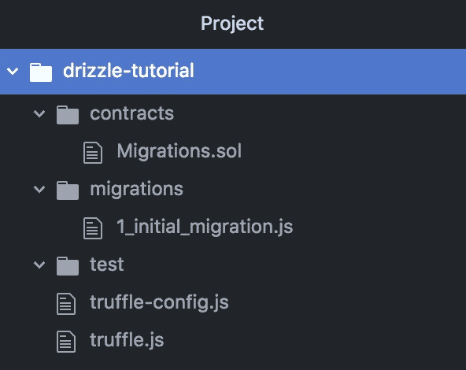
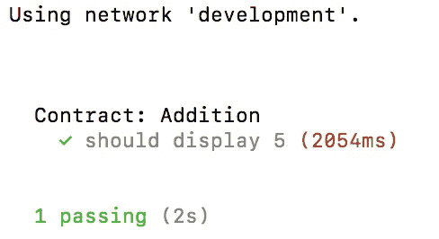
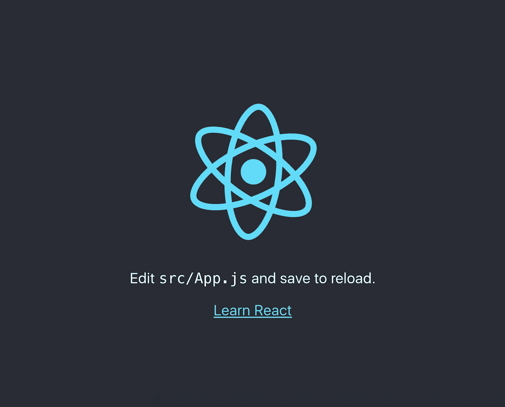
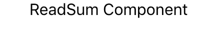
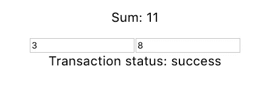

# 开发你以太坊 Dapp 的正确方法在这里:毛毛雨！

> 原文：<https://medium.com/hackernoon/the-right-way-to-develop-your-ethereum-dapp-is-here-drizzle-a633af45f031>


*开始之前:请不要问我为什么要放那些天上掉下来的、令人垂涎的甜点。我没办法。松露男选择了非常美味的名字。我相信这些照片会让 dev 更迷人！*😉

这篇文章的灵感来自于 [Adrian Li](https://medium.com/u/f5bd3cf54c72?source=post_page-----a633af45f031--------------------------------) 对松露框架的贡献。阿德里安的作品可以在[这里](https://truffleframework.com/tutorials/getting-started-with-drizzle-and-react)找到。强烈建议你读一读！

# 所以让我们开始吧..


Source: [https://giphy.com/gifs/chris-pratt-jimmy-kimmel-rVbAzUUSUC6dO](https://giphy.com/gifs/chris-pratt-jimmy-kimmel-rVbAzUUSUC6dO)

# 毛毛雨是什么？

**毛毛雨**于 2018 年 2 月加入松露套件。它是 Truffle 的第一个前端开发工具。当然，它是为了让开发者的生活轻松很多。它利用引擎盖下的[反应](https://hackernoon.com/tagged/react)。

## 毛毛雨是做什么的？

*   将您的智能合同数据与前端无缝同步
*   将交易数据从[区块链](https://hackernoon.com/tagged/blockchain)转移到 Redux store 很容易。

在本教程中，毛毛雨的真正力量将从头开始展示。这可能是评估一个框架的潜力的最好方法，同时了解整个机制在幕后是如何运作的。

# 开始前

*   需要松露的基本知识。**(不是毛毛雨！)**
*   JavaScript 知识，ReactJS

## 设置开发环境

*   [Node.js v8+ LTS 和 npm](https://nodejs.org/en/) 。Npm 版本 5.2+。
*   松露:`npm install truffle -g`。要检查它是否安装正确，请在您的终端上键入`truffle version`。
*   加纳切-cli: `npm install ganache-cli -g`。Ganache 将被用来建立一个个人的，本地以太坊区块链与虚拟账户为开发目的。
*   创建-反应-app: `npm install create-react-app -g`。只需一个命令，就可以设置一个现代化的 React web 应用程序。感谢脸书。

# 步骤 1:创建 Truffle 项目

步骤 1.1:创建你的 dev 文件夹，并移入其中。

```
$ mkdir drizzle-tutorial
$ cd drizzle-tutorial
```

**步骤 1.2:初始化松露**

```
$ truffle init
```

输出将如下所示:

```
Downloading...Unpacking...Setting up...Unbox successful. Sweet!Commands:Compile:        truffle compileMigrate:        truffle migrateTest contracts: truffle test
```

该操作创建了一个基本的项目结构。在任何文本编辑器中打开`drizzle-tutorial`文件夹。



*   `**contracts/**`:Solidity 智能合约目录
*   `**migrations/**`:部署文件的目录
*   `**test/**`:用于测试您的应用程序和合同的测试文件目录
*   `**truffle.js**`:松露配置文件(即将弃用)
*   `**truffle-config.js**` : 松露配置文件

# 步骤 2:使用 Ganache 启动个人区块链

打开终端并运行以下命令:

`ganache-cli -b 2`

`-b`代表闭塞时间，为 2 秒。换句话说，这个个人区块链每 2 秒挖掘一个新块。这在请求提交事务和实际提交事务之间产生了一个假的时间延迟。默认情况下，Ganache 会立即执行。

这个过程默认运行在 [http://127.0.0.1:8545](http://127.0.0.1:8545) 上。您也可以在 metamask 上打开这个 RPC。

# 步骤 3:编写最小智能协定并配置该协定

**步骤 3.1:在** `**contracts/**` **目录下新建一个名为** `**Addition.sol**` **的文件。**

```
pragma solidity ^0.4.24;contract Addition {
  int public sum = 0;function add (int x, int y) public {
    sum = x + y;
  }
}
```

**步骤 3.2:要告诉 truffle 我们的个人区块链(Ganache)正在哪里运行，我们必须执行以下操作**

在`truffle.js`(如果你使用的是 windows `truffle-config.js`)中，做如下修改。

```
module.exports = {
  networks: {
    development: {
      host: "localhost",
      port: 8545,
      network_id: "*" // Match any network id
    }
  }
};
```

# 步骤 4:编译和迁移智能合同

**步骤 4.1:编制智能合同**

启动您的终端并运行命令:

```
truffle compile
```

以下是该命令的输出:

```
Compiling ./contracts/Addition.sol...Compiling ./contracts/Migrations.sol...Writing artifacts to ./build/contracts
```

**步骤 4.2:将它们迁移(部署)到我们的个人区块链**

在`**migrations/**`目录下创建一个名为`**2_deploy_contracts.js**`的新文件。

```
const Addition = artifacts.require("Addition");module.exports = function(deployer) {
  deployer.deploy(Addition);
};
```

在终端中，运行以下命令:`truffle migrate`。确保 ganache 正在运行。此外，确保使用的 Solidity 编译器是最新的。

以下是上述命令的输出:

```
Running migration: 1_initial_migration.jsDeploying Migrations...... 0x8c5942b90b785a51ccfe55dcbbc62e0f5469484b72f0ef5ee5fe21e8cef91d3cMigrations: 0x980b663f1cedfad76349e0c4da1e0c7405b1fd23Saving successful migration to network...... 0xe3b1ad2a400d341d894170b8930471ee6d7fcb50314993df3418b4b3a517ba03Saving artifacts...Running migration: 2_deploy_contracts.jsDeploying Addition...... 0x1629b636f1457d91350d5e069ca6a9e88fde72e3438ad9f6abb83c5dfa4675afAddition: 0x558c220aac56c27a21215bd77551a51e0070d1b6Saving successful migration to network...... 0xb3530be9102f4b2d914fd07dcdd51d10d7cbc496aab28b278ec35e4e4b476af3Saving artifacts...
```

# 步骤 5:测试我们的合同

为了验证一切是否正常，让我们用摩卡测试一下我们的合同。

在`**test/**`目录下创建一个名为`**Addition.js**`的新文件。

```
const Addition = artifacts.require("./Addition.sol");contract("Addition", accounts => {
  it("should display 5", async () => {
    const addition = await Addition.deployed();
    await addition.add(3, 2, { from: accounts[0] });
    const storedSum= await addition.sum.call();assert.equal(storedSum, 5);
  });
});
```

使用命令`truffle test`运行测试。以下是输出:



厉害！现在我们知道合同实际上是有效的。

# 步骤 6:创建 ReactJS 项目

要引导一个极简的 react 项目，运行下面的命令:`npx create-react-app client`。这可能需要几分钟时间。

该命令将创建`client`。

输出将如下所示。(这不是完整的输出，因为它很长)。

```
Creating a new React app in /Users/niharikasingh/Desktop/playground/drizzle-tutorial/client.Installing packages. This might take a couple of minutes.Installing react, react-dom, and react-scripts...**yarn add v1.10.0**info No lockfile found.[1/4] 🔍  Resolving packages...warning react-scripts > eslint > file-entry-cache > flat-cache > circular-json@0.3.3: CircularJSON is in maintenance only, flatted is its successor.warning react-scripts > jest > jest-cli > prompts > kleur@2.0.2: Please upgrade to kleur@3 or migrate to 'ansi-colors' if you prefer the old syntax. Visit <https://github.com/lukeed/kleur/releases/tag/v3.0.0\> for migration path(s).[2/4] 🚚  Fetching packages...[3/4] 🔗  Linking dependencies...[4/4] 📃  Building fresh packages...success Saved lockfile.success Saved 828 new dependencies.
```

现在让我们来看一下`cd client`。我们必须将我们的智能合同与这个 React 项目联系起来。我们可以直接复制`client`文件夹中的`/build/contracts`文件夹，或者使用以下命令:

```
cd src
ln -s ../../build/contracts contracts
```

# 第七步:安装毛毛雨(耶！)

在运行安装命令之前，确保您在项目的`client`目录中。为此，在终端中运行`cd ..`。

要安装毛毛雨，运行下面的命令，准确地说花了我大约 3 分钟的时间:

```
npm install drizzle --save
```

也没有其他依赖！多酷啊。不需要安装 Web3.js 或其他任何东西。毛毛雨包含了我们使用智能合约所需的一切。

在端口 3000 上运行 React 前端。为此，运行`npm start`。并将浏览器指向 [http://localhost:3000。应该会出现下面的页面。](http://localhost:3000.)



# 步骤 8:实例化毛毛雨存储

我们先要对`**client/src/index.js**` 做一些改动。

```
import React from "react";
import ReactDOM from "react-dom";
import "./index.css";
import App from "./App";// import drizzle functions and contract artifact
import { Drizzle, generateStore } from "drizzle";
import Addition from "./contracts/Addition.json";// let drizzle know what contracts we want
const options = { contracts: [Addition] };// setup the drizzle store and drizzle
const drizzleStore = generateStore(options);
const drizzle = new Drizzle(options, drizzleStore);// pass in the drizzle instance
ReactDOM.render(<App drizzle={drizzle} />, document.getElementById("root"));
```

注意，`**drizzle**`实例作为道具被传递到`**App**`组件中。

# 步骤 9:重塑 client/src/App.js

**步骤 9.1:添加状态变量**

我们要做的是在我们的应用程序组件中添加以下代码行:

```
state = { loading: true, drizzleState: null };
```

我们将在这里使用两个状态变量:

1.  `**loading**` —表示毛毛雨是否已完成初始化，应用程序是否准备就绪。初始化过程包括实例化`**web3**`和我们的智能契约，获取任何可用的以太坊账户，并监听(或者，在不支持订阅的情况下:轮询)新的块。
2.  这是我们将在顶级组件中存储毛毛雨商店状态的地方。如果我们可以保持这个状态变量是最新的，那么我们可以简单地使用简单的`**props**`和`**state**`来处理毛毛雨(也就是说，你不必使用任何 Redux 或高级的 React 模式)。

**步骤 9.2:编写一些初始化逻辑**

```
componentDidMount() {
  const { drizzle } = this.props;

  // subscribe to changes in the store
  this.unsubscribe = drizzle.store.subscribe(() => {

    // every time the store updates, grab the state from drizzle
    const drizzleState = drizzle.store.getState();

    // check to see if it's ready, if so, update local component state
    if (drizzleState.drizzleStatus.initialized) {
      this.setState({ loading: false, drizzleState });
    }
  });
}
```

**步骤 9.3:退订商店**

```
compomentWillUnmount() {
  this.unsubscribe();
}
```

这将在卸载应用程序组件时安全地取消订阅，因此我们可以防止任何内存泄漏。

**步骤 9.4:修改 render()方法**

```
render() {
  if (this.state.loading) return "Loading Drizzle...";
  return <div className="App">Drizzle is ready</div>;
}
```

最终文件应该如下所示:

```
import React, { Component } from 'react';
import logo from './logo.svg';
import './App.css';class App extends Component {
  state = { loading: true, drizzleState: null };componentDidMount() {
    const { drizzle } = this.props;// subscribe to changes in the store
    this.unsubscribe = drizzle.store.subscribe(() => {// every time the store updates, grab the state from drizzle
      const drizzleState = drizzle.store.getState();// check to see if it's ready, if so, update local component state
      if (drizzleState.drizzleStatus.initialized) {
        this.setState({ loading: false, drizzleState });
      }
    });
  }compomentWillUnmount() {
    this.unsubscribe();
  }render() {
    if (this.state.loading) return "Loading Drizzle...";
    return <div className="App">Drizzle is ready</div>;
  }
}export default App;
```

在这之后，localhost:3000 应该是这样的:


# 步骤 10:使用毛毛雨从智能合同中读取

在`**client/src/ReadSum.js**`创建一个新文件，并粘贴以下内容:

```
import React from "react";class ReadSum extends React.Component {
  componentDidMount() {
    const { drizzle, drizzleState } = this.props;
    console.log(drizzle);
    console.log(drizzleState);
  }render() {
    return <div>ReadSum Component</div>;
  }
}export default ReadSum;
```

然后在`**App.js**`中，用下面的语句导入新组件:

```
import ReadSum from "./ReadSum";
```

将`App.js` render()方法改为如下:

```
render() {
  if (this.state.loading) return "Loading Drizzle...";
  return (
    <div className="App">
      <ReadSum
        drizzle={this.props.drizzle}
        drizzleState={this.state.drizzleState}
      />
    </div>
  );
}
```

实际情况如下:



现在，让我们实际读取智能合约的价值。

```
import React from "react";class ReadSum extends React.Component {
  state = { dataKey: null };componentDidMount() {
    const { drizzle } = this.props;
    const contract = drizzle.contracts.Addition;// let drizzle know we want to watch 'sum'
    var dataKey = contract.methods["sum"].cacheCall();// save the `dataKey` to local component state for later reference
    this.setState({ dataKey });
  }render() {
    // get the contract state from drizzleState
    const { Addition } = this.props.drizzleState.contracts;// using the saved `dataKey`, get the variable we're interested in
    const sum = Addition.sum[this.state.dataKey];// if it exists, then we display its value
    return <p>Sum: {sum && sum.value}</p>;
  }
}export default ReadSum;
```


# 步骤 11:用毛毛雨在区块链上写字

如果我们希望添加两个新数字并将总和存储在区块链上，请执行以下操作:

首先，让我们创建一个新文件`**client/src/SetSum.js**`并粘贴以下内容:

```
import React from "react";class SetSum extends React.Component {
  state = { stackId: null};handleKeyDown1 = e => {
    // if the enter key is pressed, set the value with the string
    if (e.keyCode === 13) {
      this.setValue(e.target.value1);
    }
  };
  handleKeyDown2 = f => {
    // if the enter key is pressed, set the value with the string
    if (f.keyCode === 13) {
      this.setValue(f.target.value2);
    }
  };setValue = (value1, value2) => {
    const { drizzle, drizzleState } = this.props;
    const contract = drizzle.contracts.Addition;// let drizzle know we want to call the `add` method with `value1 and value2`
    const stackId = contract.methods["add"].cacheSend(this.textInput1.value, this.textInput2.value, {
      from: drizzleState.accounts[0]
    });// save the `stackId` for later reference
    this.setState({ stackId });
  };getTxStatus = () => {
    // get the transaction states from the drizzle state
    const { transactions, transactionStack } = this.props.drizzleState;// get the transaction hash using our saved `stackId`
    const txHash = transactionStack[this.state.stackId];// if transaction hash does not exist, don't display anything
    if (!txHash) return null;// otherwise, return the transaction status
    return `Transaction status: ${transactions[txHash].status}`;
  };render() {
    return (
      <div>
        <input type="number" ref={(input1) => this.textInput1 = input1} onKeyDown={this.handleKeyDown1} />
        <input type="number" ref={(input2) => this.textInput2 = input2} onKeyDown={this.handleKeyDown2} />
        <div>{this.getTxStatus()}</div>
      </div>
    );
  }
}export default SetSum;
```

导入并包含在`**App.js**`中

```
import SetSum from "./SetSum";
```

并将`App.js`的`render()`方法改为:

```
render() {
    if (this.state.loading) return "Loading Drizzle...";
    return (
      <div className="App">
        <ReadSum
          drizzle={this.props.drizzle}
          drizzleState={this.state.drizzleState}
        />
        <SetSum
          drizzle={this.props.drizzle}
          drizzleState={this.state.drizzleState}
        />
      </div>
    );
  }
```

这个应该管用！



交易状态可以是“待定”或“成功”。

毛毛雨 101 就这样结束了。


Source: [https://gfycat.com/giantindeliblebinturong](https://gfycat.com/giantindeliblebinturong)