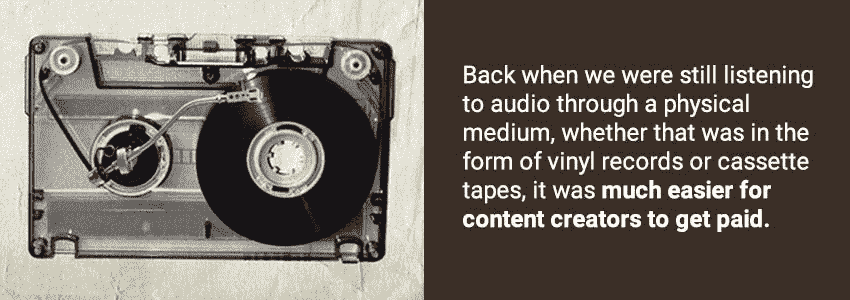
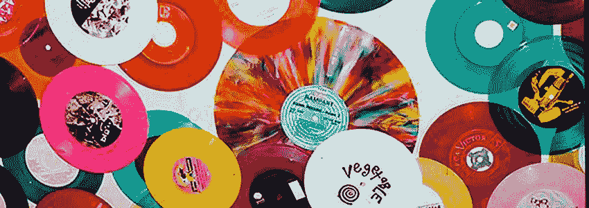
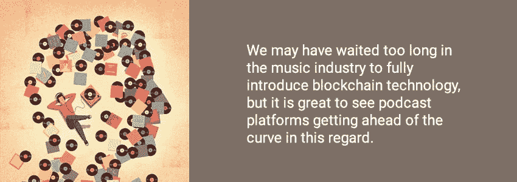

# 音频的兴起终于引起了区块链的注意

> 原文：<https://medium.com/hackernoon/the-rise-of-audio-finally-caught-the-blockchains-attention-c7775171ea57>

现在是做内容创作者，在网上发布东西的最好时机，对吧？当然，有这么多的内容传播选择，从社交媒体到博客，直播流，故事等等，很容易想象艺术家们现在过得很轻松。在互联网出现之前，人们必须出售商品的实体拷贝，如果你想对观众说些什么，你需要上脱口秀或广播节目。但是时代变了，每个人都有自己的声音与世界分享，然而推动音频行业的技术却不愿跟上。我们看到，随着区块链技术的引入，许多行业都获得了急需的推动力。音频行业会是下一个吗？

# 音频进入数字世界

当我们还在通过物理媒介(无论是黑胶唱片还是盒式磁带)收听音频时，内容创作者获得报酬要容易得多。当然，他们可能签了一份糟糕的合同，而大部分的钱实际上都流向了他们的制片人/经纪人/导演等。，但底线是物理媒体通常只在交换金钱时才会离开商店。

当音频进入数字世界，游戏完全改变了。突然之间，内容创作者不知道他们的内容去了哪里，因为这是在苹果音乐时代之前，创作者没有办法从他们创造的东西中获得在线支付。[来自网络区块链媒体](http://dotblockchainmedia.com/)的 Benjii Rogers 在他的[媒体文章](/cuepoint/bc-a-fair-trade-music-format-virtual-reality-the-blockchain-76fc47699733)中指出:

*“歌曲可以有多个作者、表演者、出版商和许可证，甚至按地域有不同的使用权。一首歌有时不得不在不同的时间通过不同的组织支付给不同国家的多组人。更糟糕的是，世界上任何地方都没有追踪所有权的中央数据库。”*

但这过去不是，现在仍然不是一个仅限于音乐的问题。毫无疑问，正如我们在另一篇文章中讨论的[，音乐家的工作没有得到公平的补偿，但这个问题也延伸到了其他类型的音频。例如，播客仍然停留在一种货币化的设计中，这种设计依赖于个人广告商作为支持创作者的主要方式，以换取大声疾呼和认可，](https://howtotoken.com/explained/artists-fans-and-where-all-the-money-is-going/)[根据 entrepreneur.com](https://www.entrepreneur.com/article/277912)的说法。因为播客是一种个人形式的媒体，主持人通常受到听众的尊重，他们会仔细聆听每一个词，所以需要为产品背书会降低所有相关方的整体体验。

鉴于播客和有声读物比音乐行业年轻得多，这些新兴行业的主要参与者从前辈的错误中吸取教训将是明智的。国内流离失所者解释说:

*“鉴于区块链有能力将所有利益相关者聚集到一个平台上，共享数据并执行智能合同，价格优化和增加透明度的前景仍然巨大。”*

但是，正如斯坦·科宁在他关于华纳音乐集团的书里写的那样，“在采用新技术的竞赛中，音乐产业历史上一直领先于阿米什人。”当谈到采用新技术时，音乐行业似乎总是落后，即使有艺术家(如伊莫金·希普和比约克)试图改变这种情况，音乐行业要轻松地采用区块链的解决方案可能为时已晚。

# 仍然小到可以改变

音乐产业是巨大的([【2016 年 160 亿美元](https://www.musicbusinessworldwide.com/global-recorded-music-industry-reached-16-1bn-2016-7-yoy/))。与有声读物([、2016 年 21 亿美元](https://www.audiopub.org/uploads/pdf/APAC2017PR_final.pdf))和播客([、2016 年 1.19 亿美元](https://backyardmedia.us/blog/2018/1/16/heres-how-fast-the-podcast-industry-is-growing))相比，它难以采用新技术也就不足为奇了。然而，有声读物和播客可能仍然很小，足以将新技术融入其核心，以帮助在问题发生前就将其根除。数字音频世界的一个主要问题是缺乏对内容的跟踪和问责，区块链肯定可以帮助解决这个问题。[知识产权专家比尔·罗森布拉特](http://www.giantstepsmts.com/bios.htm)[在接受采访](https://blog.digimarc.com/ArticleDetails?UrlName=Technology-Expert-Expects-Blockchain-will-Revolutionize-Music)时表示:

*“已经有各种各样的尝试来解决数据问题，通过建立巨大的、集中的数据库来包含管理权利和处理版税交易所需的所有数据……这些项目都失败了……原因有很多，包括在一个地方收集和维护所有数据的复杂性……区块链是一个完全不同的方法。”*

他继续讨论了区块链被用于跟踪音频媒体所有权的想法，本质上是通过在媒体本身上使用不可变的数字水印(类似于但远比我们现在使用的当前的"[元数据](https://www.lifewire.com/what-is-music-tagging-2438569)"更先进)。当然，能够跟踪这一点的全部目的是确保内容创作者不仅控制他们的内容，而且对他们所做的工作给予公平的补偿。如果我们能够尽早解决这些潜在的问题，这可能有助于该行业更快地发展。正如[主播](https://www.linkedin.com/in/mmignano)的首席执行官兼联合创始人迈克尔·米格纳诺在 Quora 上写道:

“播客，曾经是一种亚文化，现在在美国每月接触的人数和推特一样多(确切地说，大约 6700 万)。”

# 获得报酬

如果创作者想获得报酬，在将某些东西发布到互联网上之前，需要遵循一些特定的步骤。

1.  选择一个他们想发布的平台。这个平台负责监管下载，确保那些下载不能被复制和上传到其他地方，并作为用户和创作者之间的金融渠道进行运营。
2.  以他们的名义保护他们的作品；没有证据证明他们是所述内容的所有者，他们不能保证资金。
3.  创作者必须推广他们的内容。这通常是在用户的帮助下发生的，这些用户喜欢这些内容，并在社交媒体上分享这些内容以进行传播。
4.  在他们自己得到报酬后，再付给那些在这个过程中帮助过他们的人。

目前的系统有很多不尽人意的地方。例如，在 Audible 上，当用户帮助管理内容(通过标记、投票、添加评论等)时，他们无法获得回报。Audible 提供的唯一奖励系统是通过[推荐](https://www.audible.com/affiliate-intro)和[里程碑计划](https://www.audible.com/mt/MilestoneProgram)，这两者都与内容交互无关。另一个主要问题是，当创作者选择一个平台时，他们强迫自己进入一个筒仓，他们的内容基本上被锁定在那个特定的地方。这类似于音乐人选厂牌，作家选出版社等等。当前的行业越来越陈旧，急需改变。 [IDB](https://www.iadb.org/en) 在其[广泛的研究论文](https://publications.iadb.org/bitstream/handle/11319/8627/The-Impact-of-Digital-Innovation-and-Blockchain-on-the-Music-Industry.PDF?sequence=1&isAllowed=y)中解释道:

*“总体而言，虽然价值已经从内容创作者、标签、工作室和出版商等转移到苹果和谷歌等内容中介，但区块链也可能会扰乱他们的商业模式。”*

在调查区块链科技可能帮助这一过程的不同方式时，我们通过 [ContentBox](https://contentbox.one/) 看到了一个完美的例子，这是一家建立在播客/有声读物巨头 Castbox.fm 肩膀上的公司。通常，当区块链解决方案进入市场时，它们似乎是凭空产生的，采取的形式是一家没有行业经验的公司，由一个从未有人听说过的团队领导。在这种情况下，事实正好相反，这应该让播客和有声读物爱好者欢欣鼓舞。[播客社区强烈推荐](https://www.reviewgeek.com/1533/the-best-podcast-apps-for-your-smartphone/)Castbox，特别是它的音频搜索功能(可以让你找到标题/描述中可能没有提到的主题)，以及直观的用户界面，让管理播客和有声读物变得轻而易举。

Castbox 已经在帮助改革播客行业，但他们意识到，通过将区块链技术纳入他们当前的系统，他们可以做得更多。ContentBox 最棒的一点是内容创建者/用户的互联体验。帮助管理内容的用户，无论是通过添加标签、描述、评论等，都将在平台上获得一种数字货币的奖励(可以用于其他内容或在交易所交易)。

除了用户/创作者的互动，内容创作者将有机会从为他们不一定想要支持的产品做代言/广告中解脱出来。能够对播客收取少量费用将有助于创作者支持他们的作品，而不必严重依赖外部赞助商。在传统平台中，创作者通常会将大部分收入拱手让给平台，从而迫使对赞助商的需求增加。

然而，在这方面使用区块链的真正好处是大多数区块链式项目共享的好处:通过智能合约以不变的方式自动化一切的能力。智能合同保持一切公平，降低成本，并确保不涉及任何人为错误(或贪婪)。更低的平台成本意味着更高的创作者收益，这是一种双赢。

# 市场准备好了吗？

播客当然越来越受欢迎，虽然围绕这种音频媒体形式的产业还不是很大，但它肯定会发展起来。音乐产业也有类似的问题，尽管一些[区块链公司](https://howtotoken.com/explained/how-can-music-streaming-services-give-artists-what-they-deserve/#examples-of-blockchain-services-for-music-streaming)正试图改变这种情况，但整个形势可以被视为煤矿中的金丝雀。

我们可能在音乐行业等待了太久才完全引入区块链技术，但很高兴看到播客平台在这方面走在了前面。他们还有很长的路要走，但随着像 Castbox.fm [这样的公司为 ContentBox 的平台](https://contentbox.one/)带来 1800 万用户，区块链播客平台有着光明的未来。

## 关于作者:

基里尔·希洛夫——geek forge . io 和 Howtotoken.com 的创始人。采访全球 10，000 名顶尖专家，他们揭示了通往技术奇点的道路上最大的问题。加入我的**# 10k QA challenge:**[geek forge 公式](https://formula.geekforge.io/)。