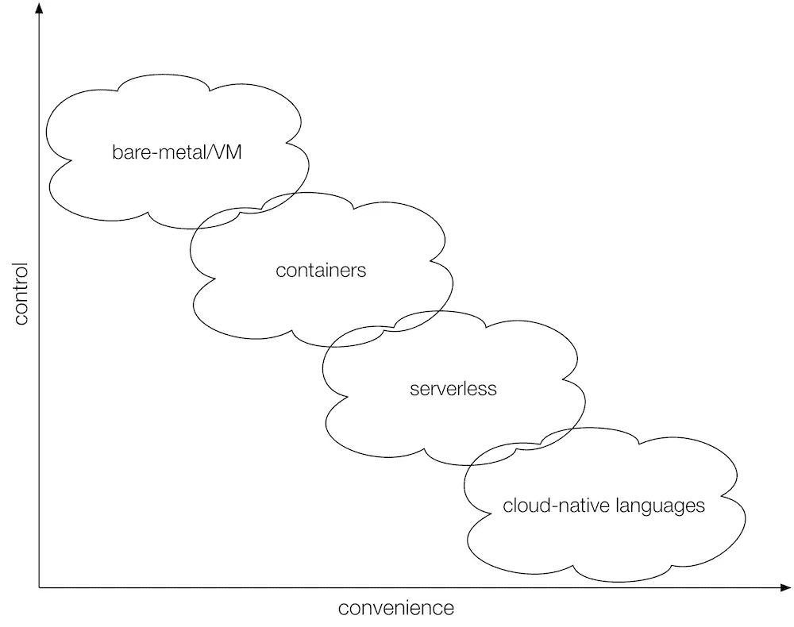

# 云原生编程语言的兴起

> 原文：<https://medium.com/hackernoon/the-rise-of-cloud-native-programming-languages-211a5081f1b2>

在过去几年中，部署代码变得越来越容易。首先，随着容器和容器平台的引入，如 [Kubernetes](https://hackernoon.com/tagged/kubernetes) ，然后通过[无服务器](https://hackernoon.com/tagged/serverless)或功能即服务产品，如 AWS Lambda，现在我们见证了云原生编程语言的崛起。

我喜欢把它想象成一个频谱，可以从两个维度来理解:*控制*与*便利*:

控制意味着您可以根据自己的需要调整运行时环境的各个方面。例如，您可能需要完全控制网络堆栈或操作系统的特定版本。另一方面，便利性代表开发者为了运行其应用程序而创建所述环境的努力。请注意，虽然更高的抽象级别确实意味着开发人员的工作量更少，但是仍然需要有人负责创建和维护底层基础设施。比方说，您正在使用无服务器产品:通常这些产品在容器中执行，需要在某个主机上运行——这部分由无服务器产品的提供商负责，但仍有人负责供应和维护这些产品。

解决了这个问题，现在让我们来看看云原生编程语言。

## [超粒子](https://metaparticle.io/)

在奥斯汀的 KubeCon 2017 上，Brendan Burns 做了一个主题演讲，正式介绍了超粒子:

## [芭蕾舞演员](https://ballerina.io/)

WSO2 也是在 2017 年和芭蕾舞演员一起开始的。他们在哥本哈根的 KubeCon 2018 上展示了如何在 Kubernetes 上使用它。

## [普鲁米](https://pulumi.io/)

这个领域的最新竞争者是 Pulumi，[于 2018 年 6 月推出](http://joeduffyblog.com/2018/06/18/hello-pulumi/)，它也支持 Kubernetes。

作为一名开发人员，这意味着什么呢？我认为，我们现在有一个丰富的工具箱，从直接使用容器到利用 FaaS 产品来云化本地编程语言。根据您的用例以及您的组织的需求，您可以为任务选择合适的工具。我认为我们还可以期待在不久的将来看到更多(甚至更专业的)云本地语言出现，所以关注这个领域肯定没有坏处。