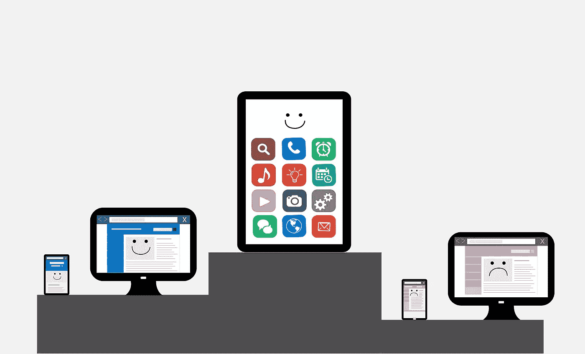
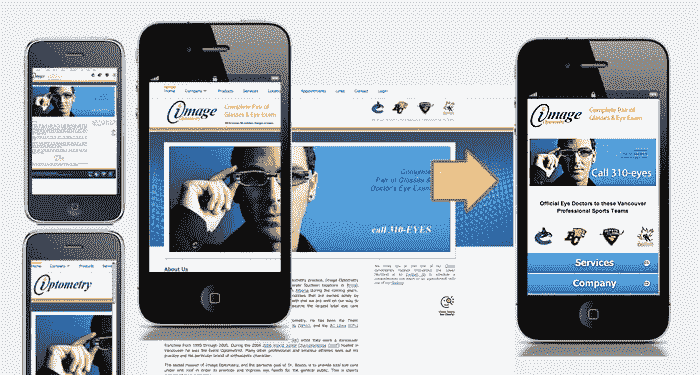
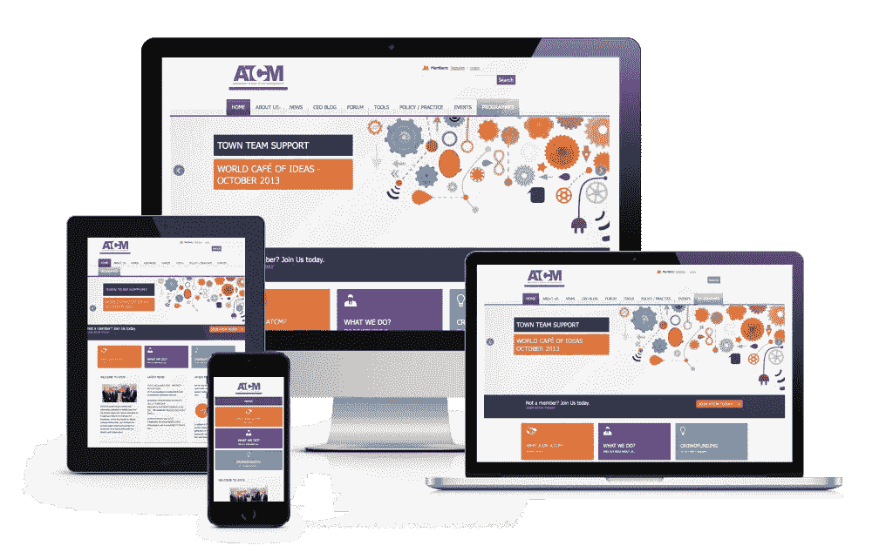
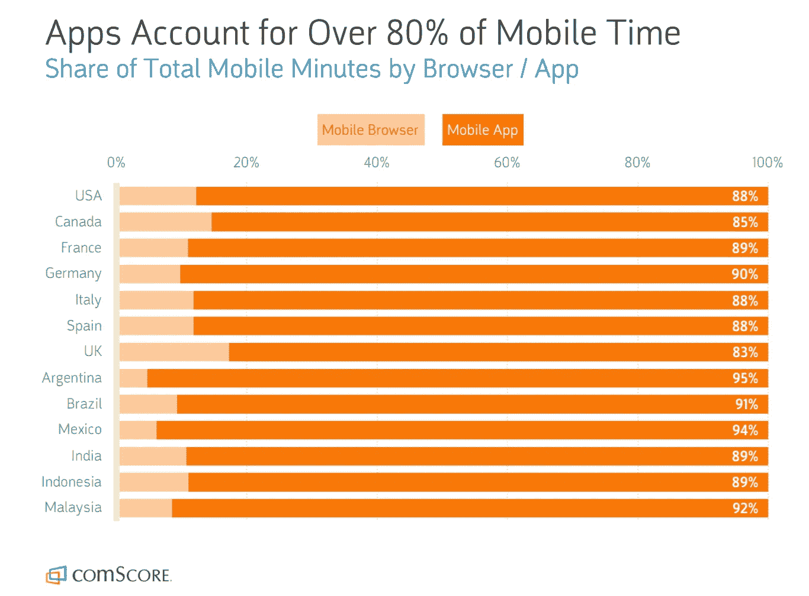

# 移动应用的兴起:为什么“移动友好”和“移动响应”不再奏效

> 原文：<https://medium.com/hackernoon/the-rise-of-mobile-apps-why-mobile-friendly-mobile-responsive-no-longer-cut-it-5f6079a42a14>

几乎每一个拥有网站的企业都明白为什么 T2 移动体验如此重要。毕竟，如今超过 50%的网络流量都是通过移动设备(Statistica)流动的，这带来了一大笔钱。

但是，什么才是有效的移动体验呢*今天*？

在过去的七年里，移动体验的门槛不断提高。曾经领先的“移动友好”网站现在已经过时，移动用户需要更好、更吸引人的体验。

在探索我们目前所处的位置之前，让我们简要回顾一下“移动体验”的最新发展。

# 颠覆开始了:“移动友好”的诞生

大约八年前，世界开始接受这样一种观点，即我们很快就会更专注于手机而不是电脑。最初的 iPhone 和后来的型号用它们华丽的触摸屏和移动互联网的巫术迷惑了我们。

也是一个大大的“啊哦！”许多公司意识到，由于各种原因，他们的网站和服务甚至无法在手机上查看。(示例包括固定宽度设计、flash 内容、下拉“悬停”菜单和大图像。)

不想错过移动流量的企业不得不争先恐后地创建或重新设计没有这些限制的网站。

起初，这通常意味着建立一个适合所有人的手机友好型网站。这些网站都是为最小公分母设计的——可以在桌面和移动浏览器上工作，导致用户体验在桌面或移动上都不太好(除非你喜欢通过挤压和缩放来点击链接)。

后来，移动友好开始涉及提供一个独立的移动网站，以及桌面版本的网站。这些移动网站本质上通常是准系统，因为许多企业无法证明用单独的代码库创建和维护第二个全功能网站是合理的。

Many early mobile-friendly websites were created and maintained separately from their desktop counterparts.

# “移动响应”网站提高了门槛

快进到大约 2014 年。甚至落后的企业也实现了某种形式的手机友好网站。

复选框已选中，符合要求。*还是不是？*

唉——到目前为止，提供一个手机友好型网站仍然让你疲于与邻居攀比。许多企业已经转向更好的东西:移动响应网站。

移动响应站点使用 CSS 媒体查询，根据设备(桌面或移动)和/或屏幕大小动态呈现不同的用户体验。

在移动响应网站上，当在智能手机上查看时，图像和文本可能会动态调整大小。传统的导航菜单可以变成“汉堡包”菜单，内容可以神奇地填满每一个可视空间。

今天，移动响应网站无处不在。WordPress、Squarespace 和其他网站平台提供了开箱即用的移动响应主题和产品。经历网站重新设计的企业通常认为移动响应能力是一项关键要求(而不是竞争优势或差异化)。

Mobile responsive websites are created and maintained on a single code base but can provide optimized experiences across many different devices and displays.

虽然移动响应网站在桌面和移动上都可以看起来很棒，但它们不是移动体验的最终目标。

# 为什么应用程序是当今移动体验的巅峰

消费者现在平均每天花在智能手机上的时间超过四个小时(eMarketer)。对于利用当今移动设备全部功能的企业来说，这是一个巨大的机会。

为了提供这种深度的移动体验，并再次打破公平竞争的局面，如今许多企业都在开发原生移动应用，或者为特定移动平台(例如 iOS 或 Android)编写的应用。

当你考虑数据时，对移动应用的兴趣高涨并不令人惊讶:

很明显，移动应用是提供卓越移动体验的关键。但是为什么应用程序相对于移动网站如此明显的胜出呢？

**以下是本地移动应用相对于移动网站的主要优势:**

*   卓越的性能和响应能力(部分原因是应用程序数据存储在本地，还因为应用程序是用本地编程语言编写的——例如，iOS 版的 Swift 和 Android 版的 Java。)
*   应用程序可以离线使用(某些功能可能需要互联网接入)
*   更深入、更丰富的应用内功能体验，例如:成像/相机、基于 GPS 的地理定位和地图；消息传递、增强现实和虚拟现实(AR/VR)以及其他技术集成
*   推送通知
*   手势、滑动、点击、长按和其他交互
*   从主屏幕一键访问—无需打开移动浏览器来启动体验。

所有这些优势都归结为一个概念，即本机应用程序提供了明显更强的用户体验，提供了更多的用户，更多的参与和更多的收入。

***关于 PWAs*** *的快速说明:虽然渐进式网络应用(PWAs)正在通过提供推送通知、一键访问和一些硬件控制来缩小与原生移动应用的差距，但它们仍然是为网络浏览器编写和操作的，这一事实带来了原生移动应用没有面临的性能和功能限制。然而，对于那些希望提供更轻松或不同的应用程序选项，而不需要在 App Store 或 Google Play 上单独下载的企业来说，它们仍然是一个有吸引力的选择。例如，脸书今年早些时候刚刚推出了 PWA，Twitter 的 PWA(称为 Twitter Lite)在一年多的时间里取得了巨大成功。这并不是说用户正从脸书或 Twitter 的本地移动应用涌向他们的 pwa。更确切地说，pwa 为以前在移动浏览器上使用这些服务的人提供了更好的移动体验。*

不过，移动应用并不适合所有企业。创建一个原生移动应用程序的成本通常比创建一个响应式网站的成本更高——如果你的应用程序没有真正超越网站现有的功能，那么它的好处是有限的。

然而，对于希望更深入和/或更频繁地吸引移动用户的企业来说，没有比提供原生移动应用更好的方法了。

*“在这一点上，与移动应用相关的投资回报率是不可能被忽略的。例如，最近的一项研究表明，用户在电子商务移动应用程序中每次浏览的产品是在移动网站上的 4.2 倍，”洛杉矶和旧金山领先的移动应用程序代理公司*[*citrus bits*](https://citrusbits.com/)*的首席执行官哈利·李解释道。“我们为之开发移动应用的许多企业，现在正主导着竞争对手，这些竞争对手要么对应用游戏反应迟钝，要么在移动应用计划上表现不佳。”*

# 展望未来

如果说移动体验的简史教会了我们什么，那就是门槛将不可避免地提高。

今天最优秀的移动应用仍然需要不断更新，不仅是为了兼容新的操作系统和 API，也是为了集成人工智能(AI)或机器学习、区块链、AR/VR 和其他改变游戏规则的体验等新兴技术。

此外，随着支持移动体验的基础设施的改善，例如， [5G 连接比 4G LTE](https://citrusbits.com/three-ways-5g-will-transform-the-world/) 快 100 倍，可以肯定的是，移动体验将会发生翻天覆地的变化。

# 从西瓜中获得免费资源

[*电子书:应用创建之旅每一步的制胜秘诀——免费下载*](https://citrusbits.com/free-ebook-winning-tips-for-every-step-of-the-mobile-app-creation-journey/)