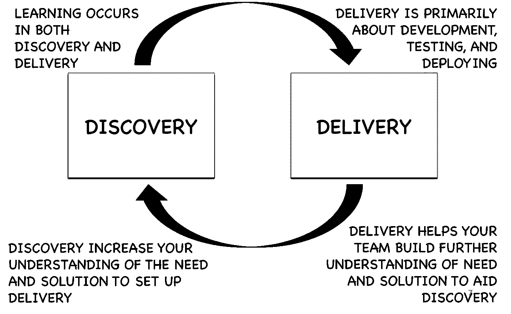

# CTMO 的崛起:将产品技术应用于营销

> 原文：<https://medium.com/hackernoon/the-rise-of-the-ctmo-applying-product-techniques-to-marketing-17fe1aedea54>

市场营销已经不是过去的样子了。我总是说，营销过去很像《广告狂人》。这位营销人员坐下来，喝了点威士忌，抽了根雪茄，决定哪些是营销活动所需的信息，哪些是登录页面的文案，哪些是该写在博客上的内容，哪些是该参加的活动。

那些时代已经过去了。除了品牌营销和 DevRel 之外，大多数营销战略和战术现在都可以衡量。大多数营销人员现在被要求衡量一切并展示投资回报率，但从来没有人谈论如何提高战略和战术的投资回报率。在我的职业生涯中，我了解到最好的方法之一就是应用最新的产品技术。我们将在这篇博文中了解更多。

# 产品技术 TL；速度三角形定位法(dead reckoning)

马蒂·卡甘在他的受[启发的书](https://www.amazon.com/INSPIRED-Create-Tech-Products-Customers-ebook/dp/B077NRB36N)中解释了什么是产品经理的工作。总之，我认为项目经理的工作分为两大部分:发现和交付。

发现就是找出我们需要建造什么。我们应该创造一些东西，为客户增加价值，让我们更接近公司设定的目标。在发现阶段，我们需要快速迭代不同类型的原型/访谈/调查/问题，以最快的速度学习。

交付就是构建我们在 discovery 中发现的东西。这也是为了衡量我们是否更接近我们的预期结果，并使用这些信息作为更多发现的反馈。“以产品为导向的工程团队会等到交付产品并能够衡量结果后，才庆祝他们的胜利。”

尽管它们看起来像是“孤立的”阶段，但是高功能的产品团队总是同时进行发现和交付。

# 在营销中应用发现

我是一名工程师，前段时间开始做市场营销。我记得当时我问其他营销人员我应该关注什么。他们的回答是:*你应该做更多的广告*你应该建立你的社交媒体账户*创建一个博客，并在搜索引擎优化上大力投资

这些答案完全没有意义。如果他们不了解我的潜在客户和客户，他们怎么能如此肯定地告诉我该采取什么策略呢？他们怎么能如此确定对他们有效的方法对我也有效呢？

这就是发现产生的地方。

要让营销奏效，它需要挖掘你的客户的习惯。为了做到这一点，我决定最好的选择是在我们的目标市场进行采访，以了解他们的习惯是什么。

我通过 Twitter 或 LinkedIn 寻找要采访的人，给他们一张亚马逊礼品卡，以换取他们的时间，并告诉他们我不会提及或试图销售我们的产品，哪怕一次。

我的问题通常是:*你典型的一天是怎样的？你什么时候使用每种设备？你用的最多的应用是什么？*您想了解什么？你对认证感兴趣吗？为什么？*你去哪里学那些东西？谷歌？论坛？聚会？会议？分析师？哪些

我使用这些发现问题中的信息来告知我们应该尝试什么样的战略和战术。

例如，通过采访使用 React 的开发人员，我了解到当他们遇到困难时，他们通常会阅读关于身份验证的内容，然后在谷歌上搜索。我可能会考虑使用以下假设进行试验(在交付阶段):“如果我们创建针对 react 开发人员在遇到困难时使用的 SEO 关键字的博客内容，我们应该能够增加流量并注册 Auth0 X%”另一个例子可能是来自财富 500 强公司的产品经理，他们参加产品论坛并有兴趣了解区块链。我可能会考虑在这样的聚会上尝试“分散身份”的谈话。

作为发现阶段的一部分，我通常用“模型”做“用户测试”。我会带着一个演讲或博客的提纲回去问他们早期的想法。其他时候，一旦我交付了一些东西(一次演讲、一篇博文、一个分析师的内容)，我通常会回到我采访的人或一些新人那里，做更多的“用户测试”。我要求他们阅读内容并分享他们的想法，以及他们希望如何以及在哪里阅读该类型的内容。请记住，正如我之前所说，发现和交付通常是重叠的。

# 在营销中应用交付

一旦你完成了足够的发现，是时候开始向你的潜在客户和客户提供价值了。

我的送货规则是:

*   首先关注一个实验性的 MVP :想想你能做的最小努力是什么来测试你的假设，看看是否值得在它上面投入更多。例如，对于 Auth0 的博客，我们有一个访问、注册和填表的基线指标。在 1 到 2 个月的时间里，我们使用 2/3 的博客文章对特定主题进行了实验。
*   *有目标和 KPI*:在开始测试之前，你要有你想要衡量的 KPI 和你想要达到的目标，这很重要。
*   *学习，学习，学习*:如果你什么都没学到，那你考试就不及格。确保如果你的测试没有达到预期的目标，你不要放弃它，而是努力学习发生了什么。这有助于你为以后的实验创造更多的发现机会。还要确保深入挖掘有效的实验。随着进一步的发现，你可能会使他们更加成功。

让我告诉你一个我们在 Auth0 的很好的交付例子:有一次我们采访了几个开发人员，我们了解到当他们陷入实现认证时，他们阅读内容。因此，我们试着写了 3 篇博文，讲述如果你在实现 Auth 时遇到困难，如何将 Auth0 与 Angular 结合使用。我们设定了一个在某段时间内这篇博文的注册目标。实验彻底失败了。我们没有达到我们的目标。然而，我们了解到我们有很多访问者，但是我们的注册转化率很低。经过进一步的研究，我们发现这是因为所有的游客都回来了，并且已经使用了 Auth0。由于这些信息，我们再次进入 discovery，看看开发人员是否会对绿地内容比 Auth0 相关内容更感兴趣。通过重新测试，我们能够验证这个新的假设。

# 结论

我希望这篇文章能帮助你更好地理解如何使用已知的产品技术来不断创造新的策略，并使用定性和定量数据来提高现有策略的投资回报率。