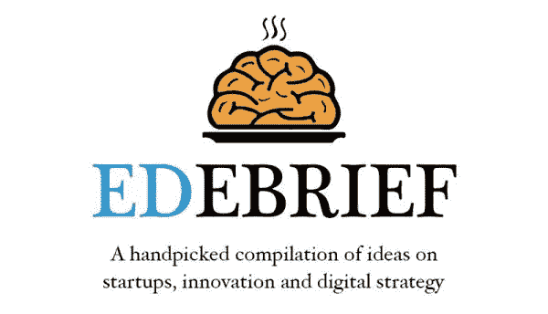
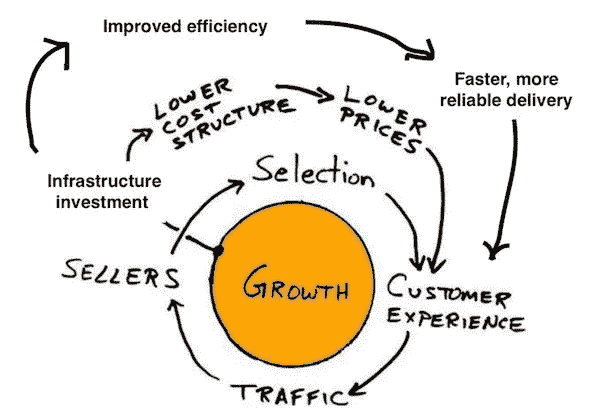
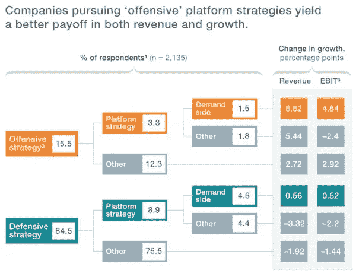

# 数字市场经济的兴起

> 原文：<https://medium.com/hackernoon/the-rise-of-the-digital-marketplace-economy-6bd7607d537e>

Source: [http://odlco.com/catalog/tsukiji-fish-market-tokyo-japan](http://odlco.com/catalog/tsukiji-fish-market-tokyo-japan)

前 15 大公共平台公司已经代表了全球 2.6 万亿美元的市值。这些技术驱动的商业模式由外而内由买家和卖家驱动，正在重新定义行业的未来。

市场看起来很简单:一切都是为了匹配供给和需求。但在现实中，市场绝不简单。易贝被认为是第一个对其交易双方进行规模化的市场之一——买家*和卖家*——乍看起来可能并不复杂。它让*卖家*发布他们想要出售的商品，并帮助*买家*找到他们想要的东西。然而，在幕后，易贝会根据购买行为、价格、卖家的声誉、一年中的时间等因素，帮助确定哪些商品会浮出水面。市场是一个复杂的系统，难以启动、微调和扩展。**

**尽管市场通常从小规模开始——易贝开始专注于收藏品，优步从豪华轿车的汽车共享应用开始，亚马逊从书籍开始——它们可以变大——当它们变大时，它们会变得非常大。这是由于它们固有的网络效应。每增加一个卖家或买家，平台的整体效用就会增加。这种良性循环有助于建立一个积极参与的受众群体，进而转化为高度可防御的商业模式。**

**但是，这些赢家通吃的市场对终端客户来说总是好的吗？这些平台的主导地位有时会导致每笔交易收取过高的手续费。GroupOn 的收取率约为 38%(这是在要求商家提供 50%的折扣后)，这意味着供应商可以从每笔交易中收回 30%。这可能是 GroupOn 核心日常交易业务陷入困境的原因。决定什么价值*可以被提取*还是什么价值*应该被提取*对于构建成功的市场商业模式至关重要。**

****

**如果你不想错过即将推出的版本， [**在这里订阅**](http://eepurl.com/dgCjPT) 。**

# **创业和产品管理**

****

**来源:亚马逊**

*   ***12 分钟阅读*——集市有独特的好处。它们涉及低资本成本——因为库存是由供应商带来的——并且它们可以通过随着需求的增加提供更多的产品来进行自我修正。但是他们有警告。他们从第一天起就需要一定的供应，因此很难开始，他们还需要密切控制库存的质量**
*   ***5 分钟阅读* —任何在亚马逊工作过的人都听说过“飞轮”这个术语。飞轮是一个系统，其中每个部件都是加速器。随着亚马逊增加客户数量，更多的卖家被吸引通过他们的平台销售，这增加了产品供应，因此吸引了更多的客户[[T3 通过亚马逊 T5]](http://www.amazonianblog.com/2017/05/understanding-amazons-flywheel.html)**
*   ***10 分钟阅读*——市场从一个利基市场开始，然后迅速发展成为庞大的买家和卖家网络。新的地理市场、新产品和价格点以及减少摩擦是他们的成功之路[ [**经由陈楚翔**](http://andrewchen.co/how-to-build-a-billion-dollar-digital-marketplace-examples-from-uber-ebay-craigslist-and-more/) ]**
*   ***9 分钟阅读* —为市场选择和实施正确的商业模式并不是一件容易的事情。随着平台流动性的增加，货币化策略的数量也在增加**
*   ***10 分钟阅读* —一个真正的市场需要消费者和供应商双方的自然拉动。在评估一个新的市场机会的潜在成功时，有不同的因素需要考虑**

# **数字战略和趋势**

****

**来源:麦肯锡洞察**

*   ***5 分钟阅读* —行业领导者正在通过开发新的技术平台来建立可防御的业务。菲亚特(联网汽车)、施耐德电气(智能城市)、高盛(客户分析)就是很好的例子。追求进攻性平台战略的公司在收入和增长上都取得了更好的回报[ [**通过麦肯锡洞察**](https://www.mckinsey.com/business-functions/digital-mckinsey/our-insights/new-evidence-for-the-power-of-digital-platforms) ]**
*   ***5 分钟阅读* —占主导地位的数字平台的崛起正迫使人们重新思考竞争理论。市场让反垄断问题变得更加难以回答[[**via Financial Times**](https://www.ft.com/content/9dc80408-81e1-11e7-94e2-c5b903247afd)——*需要订阅***
*   ***10 分钟阅读* —市场是钱包花园的典范。虽然这为初创公司提供了诱人的增长机会，但它也导致了脸书的口号:“加入我们，否则我们将复制你”[经由马特沃德 T5]](https://thinkgrowth.org/facebooks-mantra-join-us-or-we-will-copy-you-platforms-marketplaces-and-playing-with-fire-8810700c6a)**

# **必听的播客**

*   **听 40 分钟——12 年前，当约翰·齐默还在上大学的时候，拼车还不是一件事。但是一堂关于绿色城市的课让他想到了道路上过剩的未充分利用的汽车，并最终引导他共同创立了 Lyft[[**via my How build This**](https://www.youtube.com/watch?v=nmnJy41wiU4)]**

# **出发前，请考虑:**

*   ***推荐*或*分享*如果你觉得有用。它给了我🔋写作时要知道人们会从中发现价值**
*   **如果你不想错过即将推出的版本
    [**请在此订阅**](http://eepurl.com/dgCjPT)**

**文章 [**数字市场经济的兴起**](http://www.enricdurany.com/productivity-better-every-day/newsletter/digital-marketplace-platform-economy/) 最早出现在 [**Enric Durany**](http://www.enricdurany.com/) 上。**