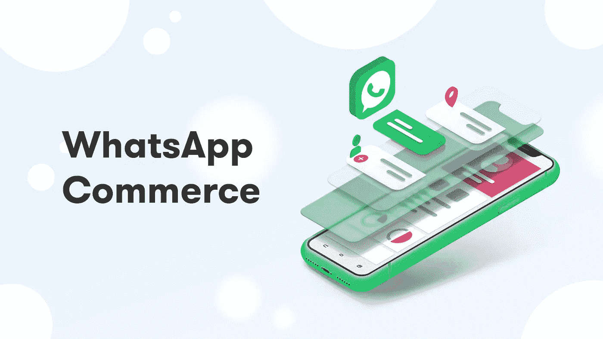
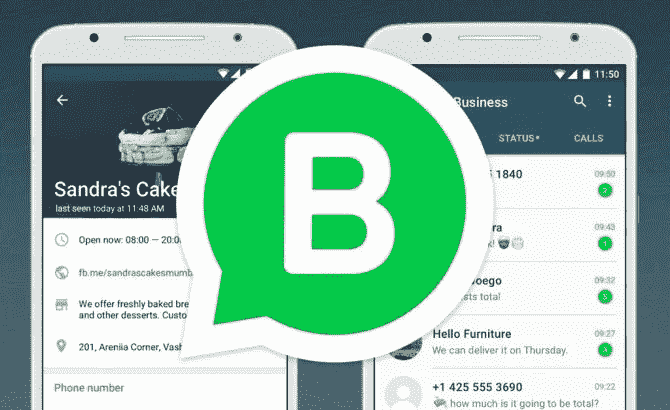
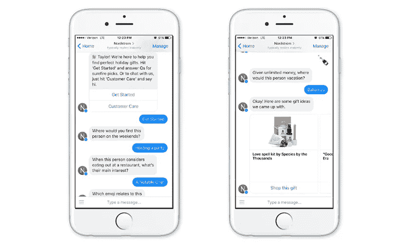
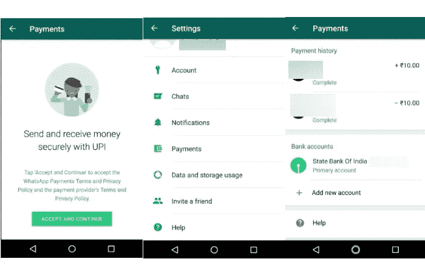
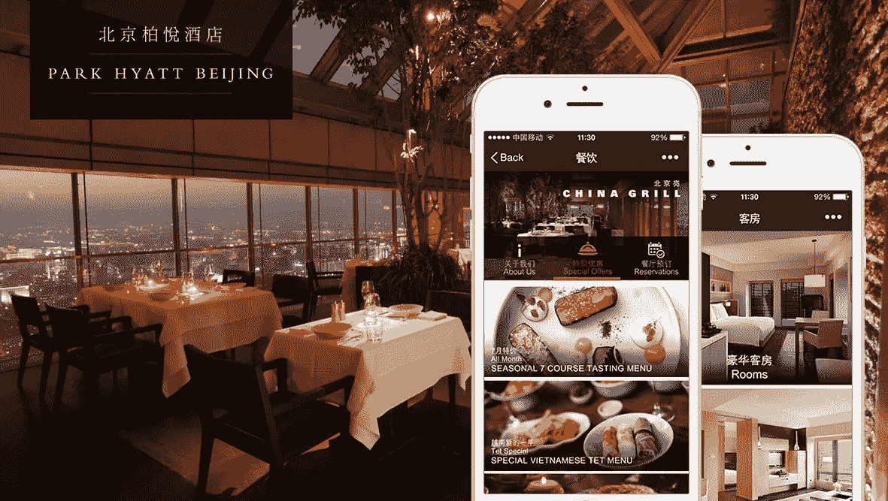
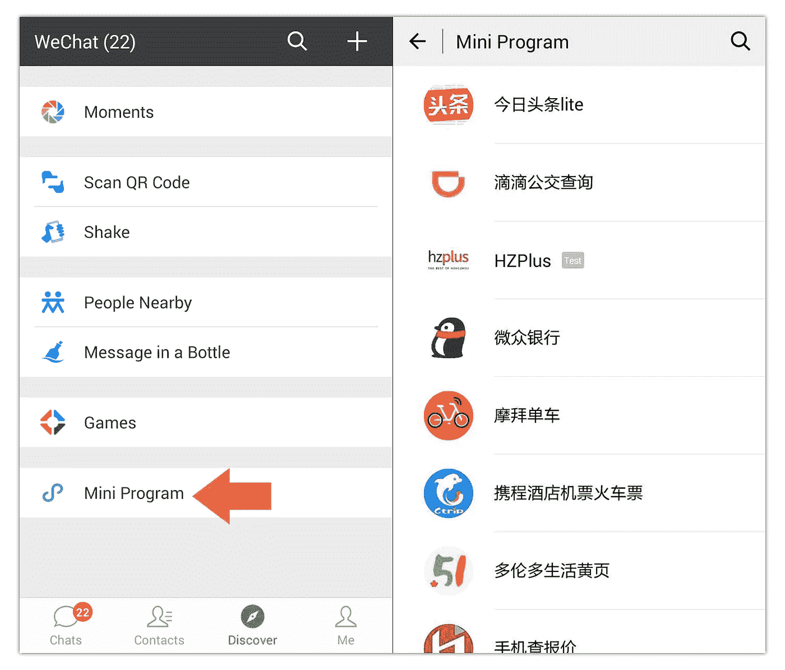

# Whatsapp 商务的崛起

> 原文：<https://medium.com/hackernoon/the-rise-of-whatsapp-commerce-6f46f55674f5>

拥有 15 亿活跃用户的 Whatsapp 毫无疑问是最受欢迎的即时通讯应用之一。自 Whatsapp 于 2009 年首次推出以来，这是一个漫长的旅程。尽管 Whatsapp 在最终用户中很受欢迎，但对于公司来说，将这款即时通讯应用作为沟通渠道从来都不容易。与其他竞争对手不同，Whatsapp 一直不愿意为企业用户提供解决方案。

# Whatsapp API 的推出

然而，这一切在两周前发生了变化，Whatsapp 终于推出了面向企业客户的官方 API。这是 Whatsapp 首次开放平台，因此他们非常谨慎，以免损害最终用户体验。尽管如此，我们已经可以看到 Whatsapp 在提高客户参与度方面有着巨大的潜力。

Whatsapp Business

让我们来看看当前 Whatsapp API 的一些本质特征:

我们首先需要知道的是，API 仍然处于受限的**早期访问模式**。这意味着每家公司都需要申请 Whatsapp 的正式批准才能使用该 API。为了申请访问权限，企业需要分享许多信息，如行业、公司规模、Whatsapp 中预期的信息量等。

其次，由于 Whatsapp 非常重视用户隐私和安全，每个企业都需要一个**专用服务器来托管 API** 。对于没有大量技术资源的公司来说，这将使 API 的集成更具挑战性。幸运的是，Whatsapp 还允许像 [**Landbot**](https://landbot.io/whatsapp) 这样的第三方开发者作为解决方案合作伙伴，帮助商业用户快速采用 API。

第三，为了避免公司的滥用，如向用户发送垃圾邮件，每个企业用户都需要正式请求**用户选择加入许可**以向用户发送主动消息。以下是 Whatsapp 的说明:

> 用户必须首先同意通过第三方渠道接收 WhatsApp 上的消息。这可以是你的企业今天用来与人沟通的任何渠道——你的网站、应用程序、电子邮件、短信、零售点等。
> 
> 选择加入必须是有效的选择加入。这意味着它必须由用户操作触发，如输入电话号码或勾选方框表示同意。
> 
> 清除选择加入消息，以便用户知道该人注册的消息类型。

最后一点，Whatsapp 会把两种不同的消息分开:

**-对话消息:** Whatsapp 提供公司与客户之间 24 小时内的免费消息。一旦超过该时间限制，公司可以 a)等到客户再次写信，或者 b)发送预先定义的具有相关费用的主动消息。

**-消息模板:**这是每个公司可以向用户发送的主动消息内容，用于非促销性用例。这种消息可用于购买/预订确认、订单跟踪、接收付款信息等。每条信息的费用从 0.005 美元到 0.09 美元不等，具体取决于你想发送信息的国家。

# Whatsapp 商务的崛起

在回顾了 Whatsapp API 的特点后，我们可以看到它仍处于早期阶段，许多事情可能会发生变化。我相信 Whatsapp 团队将需要至少 3-6 个月的时间来测试当前的模式，并了解企业和最终用户的采用情况。在初步测试之后，他们将向所有人开放 API 访问。因此，我认为我们可以在 2019 年看到 Whatsapp API 的爆炸式采用。

大规模采用将产生一个基于所谓的 Whatsapp 商务的新生态系统:

> *这是一种新的商业模式，来自不同行业的公司将通过使用 Whatsapp 作为主要渠道提供产品和服务来与客户互动。*

消息应用充当商业平台的想法并不新鲜，微信(中国的 Whatsapp)已经成为中国许多消费者的互联网同义词。另一方面，来自脸书的 Messenger 推出了聊天机器人，显然是想复制微信在西方的成功。许多其他较小的消息应用程序，如 Line，Kik，甚至 Snapchat，都试图成为各自市场的微信。

Example of Nordstrom´s Messenger bot

与西方的一些竞争对手不同，Whatsapp 有一个显著的优势，那就是它在西班牙、巴西或印度等许多国家的巨大渗透率。Whatsapp 可以利用该平台在这些市场的受欢迎程度，建立一个广泛的生态系统，就像微信在中国一样。

为此，需要做几件事:

*   **原生支付:**微信的一个关键组成部分是允许用户为各种使用场景进行支付的可能性:p2p、银行、餐厅、电子商务等。根据腾讯的官方数据，微信正在创造+1.2 万亿美元的收入。Whatsapp 已经在印度测试原生支付功能，用户超过 100 万。Whatsapp 团队将很快向许多其他国家推出这一新功能。原生支付将允许公司在 Whatsapp 内部为客户提供更好的购买体验。

Whatsapp payment feature

*   **O2O:** 微信的另一个突出特点是线上线下世界的融合。例如，在中国，当用户去餐馆时，她可以通过扫描二维码直接点餐。吃完饭后，她可以直接用微信支付。O2O 模式让传统零售商有更好的机会与纯线上玩家竞争。同时，它扩展了用户使用消息应用程序的用例。目前，Whatsapp 仍然非常专注于在线世界，但通过二维码(他们已经用它来连接 Whatsapp 的网络会话)等机制，他们可以帮助企业在许多离线场景中提供更好的服务。

O2O in a Chinese restaurant

*   **迷你程序:**一年前，微信推出了一项名为迷你程序的新功能，用户无需下载应用程序即可快速访问该应用程序。这大大减少了用户尝试使用频率较低的新应用程序(如酒店或电子商务应用程序)的摩擦。此外，当从微信访问迷你程序时，用户通过他们的微信帐户进行识别，这使得该过程没有摩擦，而没有创建新帐户、输入支付信息等麻烦。鉴于西方对隐私相关问题的限制，这最后一部分将很难完成。但我们应该想办法减少用户获得产品或服务的摩擦。

How to access Mini Program inside Wechat

# 结论

总而言之，我们可以说 WhatsApp API 仍处于初始阶段，但它为所有类型的公司提供了许多机会，这些公司希望利用 15 亿用户的潜力。我们需要考虑 API 的局限性，从而相应地设计我们的沟通策略。

另一方面，我们知道 WhatsApp 本身仍面临许多挑战，要围绕消息平台建立一个强大的生态系统。我鼓励所有与 WhatsApp 合作的企业家分享他们的经验，并帮助在不久的将来实现 WhatsApp 商务。

[*Landbot*](https://landbot.io/whatsapp) *是 WhatsApp 的官方合作伙伴，专门帮助公司在不同的即时通讯渠道上创造对话体验。*

更多我的内容请订阅我的 [WhatsApp 简讯](https://bit.ly/DC_WA_newsletter)。