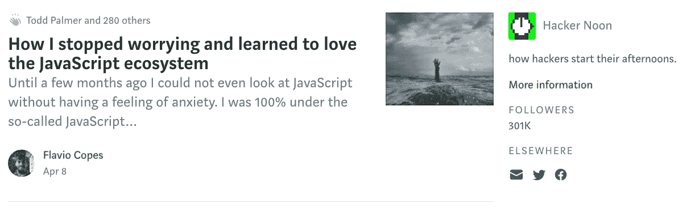

# 通往 30 万公里的道路

> 原文：<https://medium.com/hackernoon/the-road-to-300k-6c6d7ed9a248>

**黑客正午本周超过 30 万中等关注者**。真是令人羞愧。这是一大堆工作。归根结底，很多人相信 HackerNoon.com[是一个阅读伟大科技故事的地方。这不是我掉以轻心的事。然而，这并不意味着什么，因为当一天又一天被关注者的数量所驱动时，你永远不会有你想要的关注者或关注者数量——也许这是因为他们称他们为“*关注者*”哦，社交媒体。这些是读书的人。我关心为读者提供一些值得他们花时间的东西。通过关注故事，我们为读者服务。故事总是第一位的。技术专家写下他们的工作，他们的失败，和他们走过的墙。有目的的写作。体验写作。发布您想要分享的作品。这是关于你如何改变科技，以及你如何与科技和平共处。今天中午向 Hacker 提交您的故事。](http://hackernoon.com)

## **最近的一个** [**播客**](https://www.indiehackers.com/podcast/048-david-smooke-of-hacker-noon)

如果你想了解更多关于我如何自举并运行 Hacker Noon 和 [@AMI](http://twitter.com/ami) 的故事，可以在 [iTunes](https://itunes.apple.com/us/podcast/048-publishing-wildly-successful-content-online-david/id1206165808?i=1000408266276&mt=2) 或 [Google Play](https://play.google.com/music/m/Dzxxgkynoouzbmerf5wvk4nqa3e?t=048__Publishing_Wildly_Successful_Content_Online_with_David_Smooke_of_Hacker_Noon-The_Indie_Hackers_) 上查看我最近的 [**独立黑客播客**](https://www.indiehackers.com/podcast/048-david-smooke-of-hacker-noon) 。分享我对出版的看法很有趣——非常感谢考特兰·艾伦邀请我参加节目！

## **即将到来的故事集锦**

我们已经开始发布亚当·扎卡里·乏色曼即将出版的新书《T2》的节选前 5 段摘录可在 hackernoon.com/history-of-programming 的[找到。我们还将推出更多内容，所以请务必将该页面设为书签，以了解一个行业的十年演变。](https://hackernoon.com/history-of-programming/home)

# 本周十大科技故事:

****一个来自旧金山的孩子如何在印度创办了一所学校。**作者 ** [作者](https://medium.com/u/e9c3aad5352b# HODL 评论 Reddit </strong> </a> <strong class=)[安东尼谢](https://medium.com/u/9cf527f6b465?source=post_page-----6c6d7ed9a248--------------------------------)。“*所以我决定分析每一条提到“HODL”的 Reddit 评论，以研究 HODL 与加密货币市场总价值(市值)之间的关系……平均而言，市场损失最大的日子和市场收益最大的日子都有更高的 HODL 评论数。”*

[**web pack 4 的故事以及如何最终以正确的方式配置**](https://hackernoon.com/a-tale-of-webpack-4-and-how-to-finally-configure-it-in-the-right-way-4e94c8e7e5c1)Margarita Obraztsova。*“web pack 4 是迄今为止最受欢迎的模块捆绑器，刚刚经历了一次大规模更新。它必须提供许多新的东西，例如零配置、合理的默认值、性能改进、开箱即用的优化工具。”*

[**联网情趣用品如何说明我们需要担心物联网**](https://hackernoon.com/how-internet-connected-sex-toys-makes-it-clear-that-we-need-to-worry-about-the-internet-of-things-525c2156e4e2) 作者[艾达艾伦](https://medium.com/u/56727345afdb?source=post_page-----6c6d7ed9a248--------------------------------)。物联网设备有很多有问题的方面，但是随着性的介入，有问题的方面变得更加明显。凡是联网的 [*都可以被黑。*](https://www.nytimes.com/2016/10/17/technology/security-internet.html) *如果不是你的女朋友在遥控情趣用品，而是其他人侵入了它，你会有什么感觉？”*

[**椭圆曲线加密背后的数学是什么？**](https://hackernoon.com/what-is-the-math-behind-elliptic-curve-cryptography-f61b25253da3)**[汉斯·克努特](https://medium.com/u/d5fb01350753?source=post_page-----6c6d7ed9a248--------------------------------)。*“公钥、私钥和数字签名构成了公钥加密的基本组件。无论使用什么数学基础来实现公钥密码系统，它至少必须满足以下条件:(1)导出对应于给定公钥的私钥在计算上是不可行的。(2)可以证明一个人知道对应于公钥的私钥，而在该过程中不泄露关于私钥的任何有用信息。此外，这种证明可以通过需要验证特定消息的方式来构建。这样，证据就形成了该信息的数字签名。”***

**[**如何破解你的思维像理查德布兰森**](https://hackernoon.com/how-to-hack-your-mind-to-think-like-richard-branson-959dc53238b7) 作者[医学博士马塞尔明斯特](https://medium.com/u/b80cbd7da7d?source=post_page-----6c6d7ed9a248--------------------------------)。“你需要在生活中开辟出一些不被战略、筹资和招聘困扰的时期。经验丰富的企业家知道这说起来容易做起来难；实际上，你每时每刻都在做这三件事情中的一件。我找到的最好的方法是什么？腾出时间与鼓舞人心的人交谈，以理清你每天的混乱。重获创造力不仅有助于你开发创意，还能帮助你建立自己的公司。”**

## **“一项业务必须参与其中，必须充满乐趣，还必须锻炼你的创造本能。”—理查德·布兰森**

**[**我们是如何赚到 10 万美元交易密码猫**](https://hackernoon.com/how-we-made-100k-trading-cryptokitties-2d69aebe715b) 作者[伊万·博加特](https://medium.com/u/1ff4cbafc96f?source=post_page-----6c6d7ed9a248--------------------------------)。现在的问题是，我们应该买哪只小猫？该市场提供了 4 种给小猫分类的方法:最便宜的第一，最贵的第一，最新的第一，最老的第一(注:该网站已经重新设计)。前三种选择显然是短暂的:你总是可以在市场上推出更便宜、更贵或更新的猫咪。然而，最古老的就像钻石:永远。因此，我们决定购买个位数的方正猫，尽管它们的价格已经很高:有人刚刚在 `*25 ETH*` *抢走了它们，并在* `*50 ETH*` *(* `*$25K*` *)重新列出了阵容，方正猫 1 号在* `*150 ETH*` *的交易价格甚至更高。”***

**[**亚马逊股东信**](https://hackernoon.com/lessons-from-amazons-shareholder-letters-aa868bc549e4) 的教训[苏萨(Sudharshan Karthik)](https://medium.com/u/293c677ca38c?source=post_page-----6c6d7ed9a248--------------------------------) 。“我不断提醒我们的员工要害怕，每天早上醒来都很害怕。不是我们的竞争对手，而是我们的客户。我们的客户成就了我们的事业，他们是我们与之建立关系的人，也是我们欠他们很多的人。我们认为他们对我们忠诚，直到有人向他们提供更好的服务(1998 年)。”**

****[大卫 O.](https://medium.com/u/1bc0cb87a6e?source=post_page-----6c6d7ed9a248--------------------------------) *微软笔记本电脑异常*** “品牌就是身份，它必须是有效的一致叙述。没有人比汽车行业更了解这一点。你知道拥有宾利的同一个集团拥有奥迪吗？他们为什么不把它结合在一起？或者用母公司的名字称呼；大众？品牌权利是非常重要的。在当今世界，人们拥有的不仅仅是功能。如果我在微软身居高位，我会创建一个硬件品牌，建立强大的信誉，独立于微软品牌，定义品牌的身份和目标，在社交圈子中推广，抓住年轻一代的心，甚至可以为这个品牌任命一位聪明可爱的 16 岁总裁。人们会认为这是一个有很多钱的创业公司，但如果他们调查，他们会意识到这是微软。微软的价值会因为他们有了一个新品牌而飙升。”**

**直到下一次，不要把世界的现实想当然。**

**亲切的问候，**

**大卫·斯穆克**