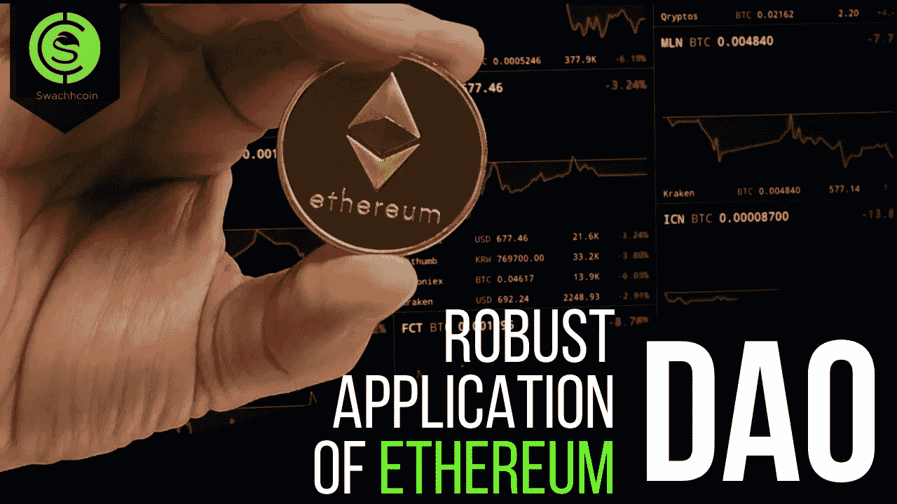

# 以太坊 DAO 在废物管理中的稳健应用

> 原文：<https://medium.com/hackernoon/the-robust-application-of-ethereum-dao-in-waste-management-74e592544128>

Website: [www.swachhcoin.com](http://www.swachhcoin.com)

## **简介**

为了充分理解以太坊道在废物管理中的应用，有必要对基本概念进行检查。以太坊就是这样一个概念。以太坊指的是基于区块链技术的分散平台，允许开发者构建和部署分散应用(dApps)。以太坊运行智能合约，这些智能合约是完全按照程序运行的应用程序。因此，它们消除了第三方干预、审查、停机和欺诈的可能性。

根据以太坊的*联合创始人*维塔利克·布特林*的说法，以太坊的梦想始于对一个平台的想象，这个平台超越了比特币所允许的金融用例。Buterin 表示希望以太坊能够成为所有区块链用例的解决方案，这些用例没有专门的系统来帮助它们的操作。*

从一开始，它就经历了快速的发展，并被许多开发者迅速采用。几家公司也直接或间接地为以太坊的采用做出了贡献。例如，据报道， *JP 摩根*和*微软*是一些致力于通过建立企业以太坊联盟来支持以太坊发展的组织。该联盟的唯一目的是确保以太坊的潜力在所有行业中得以实现。

*以太坊*为多个行业的高级解决方案开发做出了贡献，废物管理行业也不例外。废物管理是指从废物产生到最终处置的所有废物处理行动和活动。这将包括废物收集、运输、处理、处置，甚至回收。

除其他外，对废物进行管理是为了减少不适当的废物管理对健康和环境的不利影响。然而，目前的废物管理系统存在不足。诸如缺乏适当的收集机制、处理方法，甚至个人缺乏对环境的深入了解等问题都是造成目前系统不完善的原因。因此，有必要采用一种能够促进全球适当废物管理的制度。正是在这个意义上，以太坊 DAO 在废物管理系统中的应用变得高度相关。

## **以太坊刀**

**道**也被称为*去中心化自治组织*简单来说就是一个基于智能合约运作的组织。以太坊 DAO 是以太坊的应用之一，旨在消除对中间人的需求。它可以通过编程实现传统公司所能做到的一切，甚至是以更高效的方式。以太坊 DAO 运行的智能契约只是简单的程序，按照创造者开发它们的方式执行功能。智能合同可用于不同目的，包括但不限于资金转移，也可用于废物管理行业。例如，智能合同可以设置为自动将奖励转移给妥善管理废物的个人。

## 【Swachhcoin 项目如何使用以太坊区块链解决废物管理问题

Swachhcoin 是在以太坊区块链上开发的，这赋予了它区块链技术的一般固有特征。Swachhcoin 是专门使用以太坊区块链来解决废物管理问题的，它试图通过不同的方法来实现这一目标。

首先，Swachhcoin 使用广泛的基础设施，包括不同的智能合同，其中废物管理过程中的所有行动都将以透明、可追溯和不可逆的方式启动和记录。这为废物管理过程的充分透明提供了空间。区块链技术的基本属性和本质是改变代码、影响或篡改它们是不可能的。

此外，正在利用以太坊区块链开展若干基于 DAO 的行动，以简化在过时基础设施上运行的当前废物管理行业的传统运作。从长远来看，这将有助于更快和更有效的废物管理过程，同时也消除了当前废物管理系统的所有问题。

*交换刀*，除了区块链的典型特征，还有高级特征。例如，SwBIN 被编程为允许分散广告的特征。有了这个功能，交换令牌持有者可以使用他的令牌在他选择的任何位置为 SwBIN 上的特定内容的广告付费。

Swachhcoin 还有农村福利方案，其运作将得到 swachdao 的援助。农村福利项目是一个既非慈善也非慈善的项目。在一些村庄设立废物储存设施(随后扩展到其他村庄)是一项创新计划，旨在鼓励村民将废物储存在废物储存设施中。垃圾将被收集，村庄将根据 SwBIN 奖励计算器的计算结果，以农村福利基金的形式获得金钱奖励。预计奖金将用于这些村庄的发展。这个过程是由施瓦希道辅助的。

Swachh DAO 的另一个特点是自主慈善事业，用于捐赠目的的 Swachhcoin 资金以公平和透明的方式转移到特定组织。Swachhcoin 上存在的基础设施消除了资金没有被分配给其最初打算分配给的组织或个人的可能性。所有这一切之所以成为可能，是因为实施了 swachdao 基础设施。

总之，通过以太坊道的稳健应用，无论是从短期还是从长期来看，Swachhcoin 都有很多潜在的好处。这些好处包括创建一个全球分散的废物管理生态系统，提供一个为适当的废物管理提供必要的广泛基础设施的网络，以及积极改变人们对废物的看法，将其视为一种有利可图的未开发资源。此外，它还将有益于环境，因为它将导致环境的改善，并最终有助于废物管理行业的盈利。

> 注意:谨防骗子。始终用 Swachhcoin 验证你的沟通渠道。骗子可能会试图冒充球队官员。永远相信[www.swachhcoin.com](http://www.swachhcoin.com)上的信息和链接。骗子也可能试图使用相似的域名进行诈骗。时刻保持警惕。如果你注意到一些可疑的事情，请将同样的事情通知我们 info@swachhcoin.com

## 加入我们的 TokenSale，享受#HODL 优惠:[**【https://swachhcoin.com/ico**](https://swachhcoin.com/ico)

## 在此加入我们的社区:

[Official Telegram Discussion Group](https://t.me/swachhcoin)

[Twitter Channel](https://twitter.com/@swachhcoin)

[Facebook FanPage](https://www.facebook.com/swachhcoinofficial/)

[Swachhcoin Subreddit](https://www.reddit.com/r/swachhcoin/)