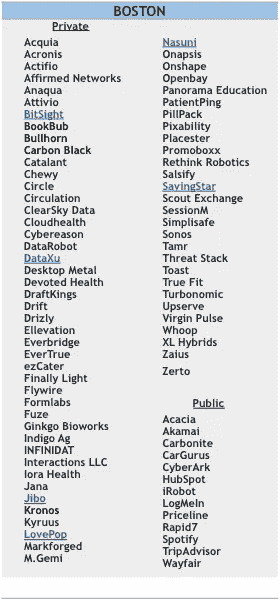
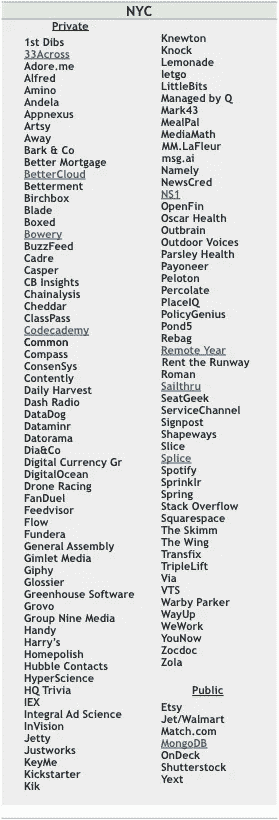
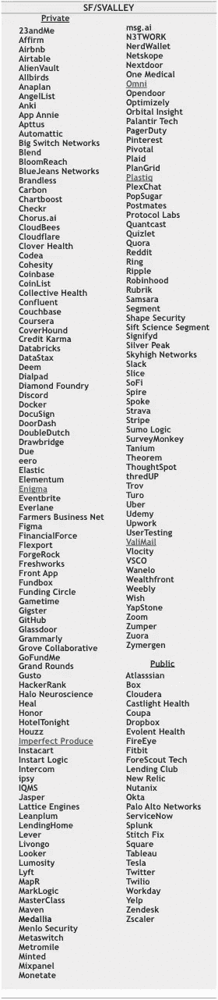
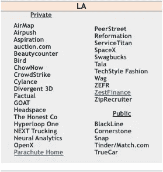
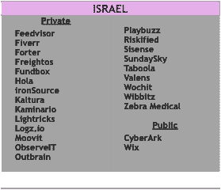
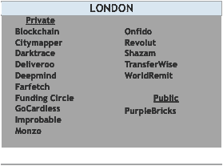

# 火箭船启动名单:2018

> 原文：<https://medium.com/hackernoon/the-rocket-ship-startup-list-2018-6e92f79fa66b>

## 应届毕业生？跳上这些高飞行公司之一

渴望投身于[初创企业](https://hackernoon.com/tagged/startup) [社区](https://hackernoon.com/tagged/community)(又名 [StartUpLand](http://www.jeffbussgang.com) )的即将毕业的学生常常难以选择正确、具体的机会来开始他们的职业生涯。

每年春天，我都会提供一份令人兴奋的、成长中的、招人的初创公司的综合清单——包括私人的或最近上市的——这些公司都值得考虑作为在 StartupLand 开始或继续职业生涯的地方。上榜的标准是主观的，但综合了筹资(通常在最近一轮中超过 1000 万美元)、规模(通常超过 50 名员工)、势头(通常收入增长或用户超过 50%)和招聘(通常超过 10 个公开招聘，包括许多适合最近大学或商学院毕业生的入门级职位)。

在我们进入公司之前，我建议看看我的帖子[获得你的第一份创业工作](https://seeingbothsides.com/2017/10/25/getting-your-first-startup-job/)和[你适合创业吗？在这里，我会给出一些更详细的建议，告诉你如何选择合适的公司，如何让自己找到工作。](https://hbr.org/2017/11/are-you-suited-for-a-start-up)

一旦你回顾了这个框架来决定你在寻找什么，这篇文章会给你一个超过 500 家公司的列表。

像往常一样，这个列表是根据地理位置来编辑和组织的，因为我相信选择一个地理位置来插入(并贡献)一个社区和生态系统。我收到了来自世界各地的天使、企业家、律师和风投的精彩投入，帮助我进行压力测试并编制了这份名单(注:Flybridge 投资组合公司用蓝色标出)。我知道这份名单中没有来自印度或中国的公司。我希望将来能覆盖这些地区，但是我觉得我现在没有足够的智慧。我还会向人们推荐斯坦福大学的安迪·拉赫勒夫(Andy Rachleff)的[恐怖清单](https://blog.wealthfront.com/2018-wealthfront-career-launching-companies-list/)，他每年秋季都会发布类似的主题(尽管更侧重于硅谷)。

我确定我犯了很多错误和疏漏，都是我自己的。欢迎反馈！

# 东海岸

# 西海岸

# 国际的

# 其他创业中心

**ATL:** Bitpay，Ionic Security，Kabbage，MailChimp

**池:** AvantCredit、 [bloXroute](https://bloxroute.com/) 、BucketFeet、Civis Analytics、Dough、Fooda、Groupon、Iris Mobile、Kapow、Narrative Sciences、 [Precognitive](https://precognitive.io/) 、Raise.com、ShopRunner、Shiftgig、SpotHero、SproutSocial、Tastyworks、Uptake

**CO:** FullContact，Ibotta，LogRhythm，Rally，SendGrid，Sympoz，TeamSnap，VictorOps，Webroot， [Welltok](http://www.welltok.com/)

**DC:** 2U，Cvent，Optoro，Sonatype，Vox Media，WeddingWire

**海:** Apptio、Avalara、Avvo、ExtraHop、Julep、Juno、Koru、OfferUp、Outreach、Peach、玄关、Pro、Redfin、Rover.com

**UT:** 竹 HR，天棚税，Domo，健康催化剂，HireVue，InsideSales，结构，Lucid 软件，观察点，复数视线，质量，解决方案 Reach，工作前沿

就是这样！特别感谢所有为我提供匿名意见的人，以及我的同事卡罗琳·康斯特布尔，她帮我做了大部分繁重的工作来编制这份名单。