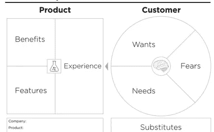

# 洞察力在企业家精神中的作用:一个由三部分组成的框架

> 原文：<https://medium.com/hackernoon/the-role-of-insight-in-entrepreneurship-a-3-part-framework-4fe8864d0ebf>

大约 15 年前，我开始教授企业家精神，此后不久，我开始认真研究新商业概念的发展。我现在认为[业务](https://hackernoon.com/tagged/business)概念[开发](https://hackernoon.com/tagged/development)过程有三个步骤。

1.  开发客户价值主张
2.  发展商业模式

3.开发金融模型和融资

我的研究始于资本筹集，我通常把我的职业生涯解释为在战略和资本的交叉点上工作。我在印尼建立了一家价值十亿美元的公司，这也促成了一本关于商业模式的书。今天，我在佛罗里达国际大学管理着两个孵化器和一个加速器，在那里我花了很多时间来定义初创公司的客户价值主张。正如你可能从我对企业家精神的逆向探索中预测的那样，我今天对客户价值主张的研究侧重于开始——洞察力和机会。

**简介**

在过去两年半的时间里，我几乎每天都与初创公司的创始人一起工作，我的经验告诉我，开发一个新的商业概念最难的部分是提出一个能带来巨大市场机会的见解。这个过程有两个部分:

1.发展解决大问题的洞察力

2.将洞察力转化为巨大的机会

**洞察力**

或许 20 世纪最著名的企业家精神学术作家是奥地利学派经济学家伊斯雷尔·柯兹纳。[【3】](#_ftn3)继法·哈耶克(FA Hayek)对信息理论在市场中的作用进行深刻的早期思考之后，柯兹纳将洞察力定义为“信息的正不对称”。虽然这个定义很精确，但当在一个充满抱负的企业家的礼堂里使用时，它通常会造成震耳欲聋的沉默。我发现的对洞察力最好的简单定义是称之为“发现”——发现新的东西。现在我们已经定义了洞察力的背景，让我给你一个可以开发洞察力的工具，它来自于设计思维。[【4】](#_ftn4)

在设计思维的第二步中，人们重新构思问题。我发现的重新定义问题的最好方法之一是寻找一个关于问题的关键假设并改变它。通过改变一个关键假设来改变对一个问题的看法就是洞察力。大多数重大科学发现都说明了我的观点。比如爱因斯坦重新定义了时间，让时间相对于观察者。他改变了什么关键假设？他改变了一个不亚于牛顿的假设，即时间是绝对的。爱因斯坦用他的相对论开创了一个全新的物理学，也许是通过改变关于时间的假设。想想早期的独木舟，然后想想帆船，以及我们是如何从独木舟变成帆船的。每个人都可以很快意识到，有人想节省能源，并把帆放在休息区。很少有人意识到，更有意义的“洞见”或发现是把防空洞拆成碎片，这样就可以有更大、更安全的开放水域船只在七大洋航行。这种固定物体的分解涉及功能固定性[【5】](#_ftn5)，在防空洞的情况下克服它涉及假设的改变，这导致了世界变化的洞察力。

洞察力视角的改变也标志着发现过程从分析到创造的转变。没有洞察力的创造力很少产生任何有价值的东西，认识到一个关键假设已经改变是一个很好的指标，表明一个人可以进入创造性阶段。在设计思维中，这个创造性的过程是第三步——构思。定义了洞察力之后，现在让我们转向同样具有挑战性的目标，即识别一个巨大的市场机会。

**机遇**

许多追求创业的人没有认识到创业是为了给社会创造一个更美好的未来。财富，工作，产业集群，甚至产品都是副产品。如果你不能达到一个更好未来的社会标准，那么至少要达到萨姆·奥特曼总裁解释的 Y 组合要求。

“比起衍生产品，我们更喜欢新事物。大多数真正的大公司都是从全新的东西开始的(一个可接受的新定义是好 10 倍。)如果有另外 10 家公司同时启动同样的计划，而且听起来很像已经存在的东西，我们会持怀疑态度。”

这意味着，我们可能不需要另一个遛狗或教科书销售或约会应用程序。事实上，有些人说我们不需要更多的应用程序。当然，教训可能是不要专注于应用构建的技术，而是专注于原始的洞察力。认识到获得洞察力的目标是创造价值，经济学家称之为效用，我称之为客户的“目的实现感知”。为了创造价值，企业家必须将洞察力与创新结合起来，以解决客户问题。创新被著名经济学家约瑟夫·熊彼特定义为“商业化的发明”。发明可以理解为一种新的、有形的过程、方法、组合物或装置。因此，创新是通过发明将洞察力转化为价值的过程。这种创造的价值是客户价值主张(完成新业务概念开发的第一步)和可持续竞争优势的基础。竞争优势创造了沃伦·巴菲特所推崇的保护性“护城河”。因此，它还允许企业家决定与客户分享多少价值，以及企业获取多少价值。

**客户价值**

Customer Value Canvas Credit: Alex Osterwalder

我认为大多数企业家未能创造客户价值，因此没有发现大的市场机会。如果我们试图归纳发现持续创造客户价值的见解，我回到信息论和物理学。阿尔伯特·爱因斯坦和克劳德·香农向我们展示的是，现实可以用信息和能量来理解。因此，我们应该探索信息理论和能量的基本原理，以找到洞见，这些洞见分为三类。

1.信任

2.透明度

3.转型[【6】](#_ftn6)

这种框架的一个优势是，它推动企业家自然而然地超越产品和服务，转向发明以及定义客户体验的流程和方法。顾客越来越多地将顾客体验而不是产品或服务作为他们购买的决定因素。

**信任**

越来越多的生物学家和复杂性科学家向我们展示，群体和共享是所有生物的自然行为，如黏菌、蚂蚁甚至植物。要让分享发挥作用，有一个必要的条件——信任。有机体的认知处理能力越强，就越需要信任来允许分享。如果信任是这样一个基本概念，那么在任何商业概念中，企业家都需要理解客户如何获得足够的信任以便购买。如果一个人不能证明信任是如何建立的，他就不能理解客户。相反，如果你能促进信任或让信任更容易达成，这种洞察力就有可能颠覆一个大市场。(还要记住，记录新商机的最简单方法是挑选一个现有市场，这正是贝佐斯对亚马逊所做的。)

事实上，电子商务的早期就说明了关于信任的问题。Comp-U-Card 是首批成功的在线商家之一。为什么他们能成功销售品牌电视和汽车，却不能销售时装？顾客知道索尼电视是什么，因为他们在商店里见过它，但时尚商品总是有合身的问题和很少的标准化。Comp-U-Card 之所以成功，是因为他们选择了顾客不太关心的商品。故事是这样的，当 E-Bay 增加了客户评论后，产品就适应了市场。在那之前，顾客不知道他们是否可以信任卖家。顾客书评为亚马逊的信任增加了一个新的维度，Yelp 进一步证明了信任的力量是成功的新商业理念的基本要求。

**透明度**

如果你理解了前面提到的不对称和信任，那么透明度的重要性就很容易理解了。许多评论家说，信息每 18 个月翻一番，而且在 10 年、20 年或 30 年内，信息将很快在几小时内翻一番。假新闻，脸书和 Equifax 似乎每天都在头版。政府透明度是另一个经常出现在头版的问题，尤其是在总统不受部分媒体欢迎的情况下。透明度也许是一种不言而喻的行为规范，一种分享政府、企业、非营利组织和个人所需信息的手段。然而，在互联网时代，脸书和其他人通过对信息获取的有利控制创造了巨大的财富，评论员称之为瓶颈。可以说，提高透明度的最大工具要么是印刷机，要么是谷歌搜索。我将谈论谷歌，因为古腾堡没有博客。实际上，谷歌向我们展示了由用户选择的主题所策划的世界信息。在监管文本之后，谷歌继续监管视频、地图、图像，现在谁知道人工智能(AI)在监管什么。

有些人会说，人工智能的最大挑战是获取信息来训练算法，以理解重要的变量，这样我们就可以准确地进行预测分析。对我来说，这听起来像是一种现代形式的透明。许多技术专家说，每个公司都应该将人工智能融入他们的业务。也许更好的建议是看看透明度在哪里能为客户创造最大的价值。今天，我们往往会被第四次工业革命的新技术分散注意力，但更好的方法是寻找透明度等基本原则可以创造客户价值的新机会。区块链就是这样一个例子，它结合了信任和透明的强大功能。

日益流行的区块链和其他分布式账本技术(DLT)可以理解为“信任技术”。区块链是一个防黑客的分布式账本，可以捕获交易或信息的每个细节。它首先创造了信任，因为交易记录存储在多台计算机上，无法被黑客入侵，不受收取直接或间接访问费的中间人的控制。其次，区块链通过记录整个历史来提供透明度，例如，一所房子已经出售了六次。这种信任和透明的结合使区块链成为一种强大的新技术。当然，我们可能还没有找到区块链技术的商业成功案例(想想个人电脑的 Office)。我的观点是，用例将发生在拥有大量详细信息和权利的领域，如音乐或个人安全，例如，我的大学记录将是我的资产，而不是大学的。

**变身**

变换是一个奇怪的概念，因为物理学对它的解释非常简单。根据熵，每个物体最终会分裂成越来越小的单元，原子，最终是粒子。因此，如果我们在寻找一种洞察力，我们可以从把事物分开开始。如果这是一个过于戏剧化的想法，想想爱因斯坦是如何将创造力定义为“组合过程”的。能结合的，能分解的，能转化的。

应用转型最简单的方法之一是使用迈克尔·波特的三步价值链概念[【8】](#_ftn8)。在企业中创造价值的过程包括:

1.创造或采购产品，

2.将产品分发给顾客

3.客户体验

这三个步骤中的每一步都涉及多个流程，在这些流程中，可以为企业创造额外的价值，或者与客户分享额外的价值[【9】](#_ftn9)。一本关于在价值链中创造创新的优秀书籍是[拉里·基利的*十种创新* : *建立突破的原则*](https://www.amazon.com/Ten-Types-Innovation-Discipline-Breakthroughs/dp/1118504240/ref=sr_1_1?ie=UTF8&qid=1528046629&sr=8-1&keywords=Larry+Keeley%25E2%2580%2599s+Ten+Types+of+Innovation%253A+The+Discipline+of+Building+Breakthroughs) 。将流程作为商品的价值链的一部分外包出去，是创新和价值创造的潜在机会。外包提供商可能比你的公司做得更好，并为客户创造额外的价值。(组合流程，有些人称之为联合生产，是通过将流程加入一个流程来改进流程，从而创造价值的另一种方式。)

分裂或转变的显著例子比比皆是。Airbnb 将房屋和公寓拆分为出租单元，云计算改变了计算机基础设施，并在为人工智能提供更好性能的压力下继续转变，还有无数的例子可以证明我们将司机从汽车、割草机甚至坦克和战斗机中剥离出来。通过识别一种洞察力来实现转型，这种洞察力允许人们打破现有的流程，通过创新释放新的价值，最好是在现有的大市场中。

**结论**

创新是通过发明将洞察力转化为价值的过程。发明可以理解为一种新的、有形的过程、方法、组合物或装置。三个 t(信任、透明和转换)帮助您决定从哪里开始分析以找到洞察力。如前所述，大型现有市场记录了市场规模。考虑到这一点，你现在应该准备好开始这个过程，拥抱企业家精神，找到那个巨大的机会。

[【1】](#_ftnref1)[十亿美元公司:高增长公司商业模式企业家指南](https://www.amazon.com/Billion-Dollar-Company-Entrepreneurs-Companies/dp/3838373316/ref=sr_1_1?s=books&ie=UTF8&qid=1528044400&sr=1-1&keywords=billion+dollar+company)

[【2】](#_ftnref2)[http://startup.fiu.edu/](http://startup.fiu.edu/)

[【3】](#_ftnref3)[竞赛与创业](https://www.amazon.com/Competition-Entrepreneurship-Collected-Israel-Kirzner/dp/0865978468/ref=sr_1_1?s=books&ie=UTF8&qid=1528045370&sr=1-1&keywords=israel+kirzner)

[【丁校操作员手册】](https://dschool.stanford.edu/resources/george-kembels-dschool-operators-handbook)

[【5】](#_ftnref5)功能固定性在这篇中间文章中有更详细的解释，[创业的基础:重复了 4 万年的巨大市场机会](/@rhhfla/the-foundation-of-entrepreneurship-large-market-opportunities-that-have-repeated-for-40-000-years-933deeac16a1)

[【6】](#_ftnref6)变换在这里用的是白话，而不是洛伦兹变换的简称。

[【7】](#_ftnref7)[https://www . weforum . org/agenda/2016/01/the-fourth-industrial-revolution-what-it-means-and-how-to-response/](https://www.weforum.org/agenda/2016/01/the-fourth-industrial-revolution-what-it-means-and-how-to-respond/)

[【8】](#_ftnref8)[https://www.mindtools.com/pages/article/newSTR_66.htm](https://www.mindtools.com/pages/article/newSTR_66.htm)

[【9】](#_ftnref9)[价值创造与价值获取:战略中价值的一致定义](https://onlinelibrary.wiley.com/doi/abs/10.1111/1467-8551.00147)，Cliff Bowman 和 Veronique Ambrosini