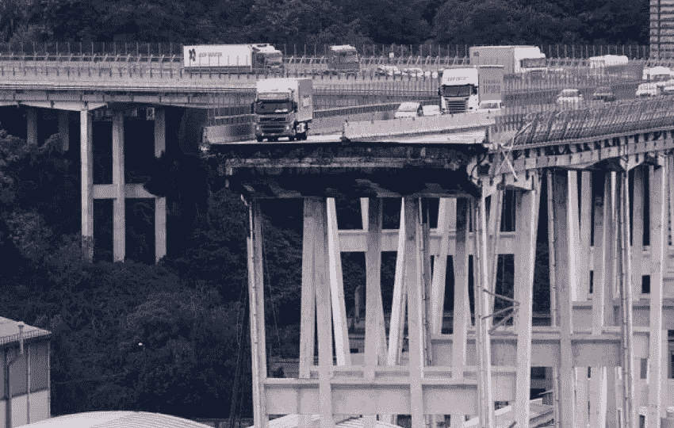

# 热那亚悲剧的根源，以及区块链和代币经济学如何在未来有所帮助

> 原文：<https://medium.com/hackernoon/the-roots-of-the-tragedy-of-genoa-and-how-blockchain-and-token-economics-can-help-in-the-future-e68398164aa1>

The collapsed Morandi bridge — Genoa — Italy

## **基础设施崩溃**

热那亚[【莫兰迪】公路桥](https://en.wikipedia.org/wiki/Ponte_Morandi)的戏剧性坍塌深深震撼了我。我被一种深深的悲伤感和越来越强烈的愤怒所包围。

怎么会这样？

我开始搜索关于 Atlantia SpA 的信息[，这家私人公司持有意大利高速公路的特许权，该特许权是在 90 年代末的最后一波私有化中授予的。Atlantia 由贝莱德、汇丰和其他意大利银行(各占 5%)等机构投资者以及持有 30%最大股份的贝纳通集团控股公司所有。](http://www.atlantia.it/en/)

看到 Atlantia 的财务状况，人们的愤怒与日俱增。一家经营特权寻租垄断的公司，每年收取干净的€36 亿英镑的过路费，2017 年净赚€15 亿英镑，怎么可能让一座桥垮塌？为什么这家公司没有义务将收入的很大一部分再投资于维护？有哪些安全网和控制措施？谁没有监督阿特兰蒂亚在做什么？

## 错误的激励是导致灾难的原因

撇开崩溃背后的技术原因和主管当局将确定的具体责任不谈，这场悲剧的根源有一个非常根本的原因:错误的激励措施和错误的私有化模式。

正如 2007 年的金融危机从根本上说是由错误的激励引起的——这种激励允许银行从事掠夺性贷款行为，从而引发了次贷泡沫。通过增加控制，你可以试图让一个错误的商业模式——由私人特许经营者经营的公共战略资产——暂时发挥作用，直到控制迟早失效，其戏剧性的后果是所有人都可以看到的。

因此，最好的办法是创造一种完全不同的模式，以经济和符合公民利益的方式运营战略性公共资产，而不是盲目地将它们交到不择手段的私人手中，也不是无效和浪费的公共手中。我们必须设置正确的激励机制，这样我们就可以拥有一个可持续的商业模式，而不需要过多的控制。

区块链和代币经济学正在帮助我们创造这种新的商业模式。

## **令牌-有效调整激励措施的经济学**

虽然[代币经济学](https://en.wikipedia.org/wiki/Token_economy)的起源可以追溯到 19 世纪早期——在精神病学研究领域——但这个术语现在通常被密码世界借用来泛指一个经济激励系统，用于影响利益相关者的行为，使其朝着有利于整个系统的预定义良性模式发展。代币经济学是社会研究的一个分支，它与传统经济学没有什么不同，除了它密切关注[行为经济学](https://en.wikipedia.org/wiki/Behavioral_economics)和[博弈论](https://en.wikipedia.org/wiki/Game_theory)，以便提供正确的经济激励来推动个人行为。

## **构建基于区块链的新系统来管理战略性公共资产**

现在让我们以意大利高速公路为例，看看如何利用区块链和代币经济学重新构建这个失败的特许经营系统，为所有利益相关者提供更好的激励措施，让他们行为得当。

我不知道以前有人提出过下面的建议，因此把它作为一个试验性的工作建议，可以对它进行批评、改进和修改。此外，我相信密码界的伙伴们会愿意为这场辩论做出贡献，并通过提示、评论和建议来改进该提议。

1.特许权将被终止，资产的管理将回到公共手中。终止特许权的理由完全是合法的。不涉及这个问题，我只想说，43 人丧生似乎是立即终止特许权的“正当理由”。

2.主要利益相关者将是:

-拥有该资产的国家；

使用高速公路并支付通行费的公民；

-维护和施工承包商。

3.资金流动将是:

收取的通行费；

-建筑和维护工程的付款。

4.整个系统必须运行在开放访问的公共区块链上。这意味着任何公民都可以访问所有相关文档，例如财务、维护账单、安全报告、工程报告、公开招标程序、承包商账单等。一切都将在公众和政府的监督下公开，数据不能被任何利益相关者更改或破坏。

5.国有资产将被转让给一家特殊目的公司/新公司，其股份将被[令牌化](https://cointelegraph.com/news/why-tokenization-is-still-a-chimera-expert-take)比如说 1:1 (1 股相当于 1 个令牌)。代币也将在区块链上上市。[股权令牌](/@andreabianconi/the-future-of-icos-and-the-potential-of-securities-token-offerings-4047a3bf1a5a)将代表分享利润的经济权利，该利润被确定为收取的通行费减去所有维护和建设成本，所有其他间接成本除外。排除所有间接成本的原因是为了避免使用间接非业务相关成本来减少收入，并对下面第 8 条中的收入分配产生不利影响。

6.预定百分比的代币可以被[空投](/the-mission/what-are-airdrops-in-crypto-world-a345725c75e0)给高速公路用户/市民，例如给所有使用 [Telepass 高速公路支付系统](https://www.telepass.com/en/group-and-relations/chi-siamo)的人。

7.施工和维护承包商的报酬如下，智能合同用于确保付款条款的可执行性，以及在违反已完成工程的保证时对承包商的追索权:

-一部分将在达到里程碑时分期支付。

-一部分将以实物形式支付，即持有资产的公司的股权凭证。这确保了承包商对产生稳定现金流的资产的持续功能感兴趣。智能合同确保在新建或维护资产的保修期到期之前，承包商不能出售令牌。在出现争议的情况下，公共行政部门将对分配给承包商的代币拥有额外的追索权，这些代币可以通过智能合同条款自动收回或烧毁。显然，争端解决机制和所谓的“T8 神谕”也必须到位。

-承包商还必须认购按合同价值百分比计息的政府债券。这种政府债券也可以是“象征性的”，从而确保在承包商违反合同义务或其担保/保证或维护期时，对承包商有额外的追索权。该债券将作为智能托管的抵押品持有。虽然它的功能类似于传统的[履约保证金](https://www.investopedia.com/terms/p/performancebond.asp)——银行代表承包商担保履约——但这里的区别在于，国家债券对承包商没有成本，它在一个良性循环中对政府和承包商都有利，承包商收到利息付款，(简单地说，这是一种在内部为政府债务融资的方式，从而减少对机构投资者的依赖，并阻止他们对意大利主权债务的投机)。

8.治理还应确保国家不浪费资金，并将所有收入(收取的通行费)用于维护和新投资。这意味着所有收入将被指定(I)用于维护或(ii)再投资于新的基础设施或(iii)分配给所有令牌持有者。剩余利润的再分配比例也可以改变，以便通过奖励(以更高的比例)勤奋的承包商和公民来最大限度地增加激励，这些承包商和公民可以将支付的款项用作退税或支付的通行费的部分报销。

9.一个有效的治理体系应该是内在的，令牌持有者至少具有监督和建议的作用，即使最后的决定是由州代表做出的。

## **结论**

显然，上述机制的实际实施将面临一些复杂的挑战，主要是政治以及法律和技术挑战。尽管我有理由相信，法律和技术问题可以得到有效处理，但在政治上，这完全是另一回事。

这里需要注意的是，这种新机制以及区块链和令牌经济学的结合使用将更有效地调整利益相关者的激励，并将抑制私人利润的最大化和维护及投资成本的最小化，这是这场悲剧的真正根源。考虑到意大利重要基础设施项目的公共投资现状以及解决当前僵局的呼声，上述提议至少值得认真考虑，并进行建设性和公正的政治辩论。

这也是一种可以在任何需要经济有效地管理公共战略资产的地方实施的机制，而不会让它们盲目地落入不可靠的私人手中或浪费的公共手中。在这方面，意大利并不孤单。

## PS:出于盲目的愤怒，在上周热那亚公路桥倒塌后，我开始撰写上述提议，内容是基于区块链的公共战略资产管理模型，其中激励和密码经济学发挥着关键作用。据我所知，这是同类产品的第一个型号，我期待您的反馈来挑战它并改进它。

## 非常感谢所有愿意做出贡献的人。

# token ization # smart contract # bianconiandrea # token economics #区块链#MorandiBridge