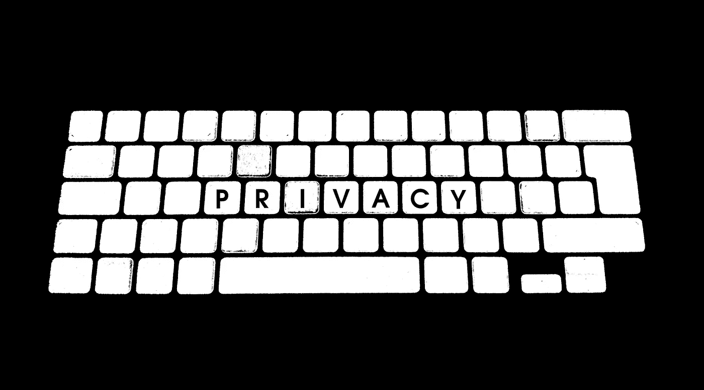
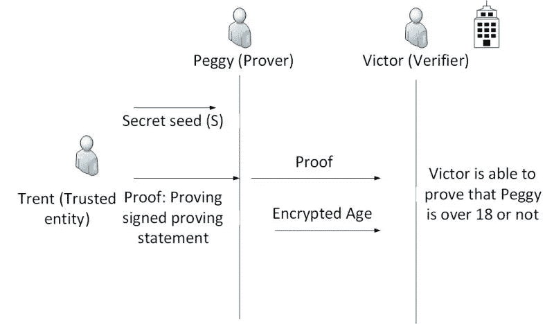

# 对零知识证明的狂热，以及它留下隐私硬币的地方

> 原文：<https://medium.com/hackernoon/the-rush-for-zero-knowledge-proofs-and-where-it-leaves-privacy-coins-32efdf27f18b>

Source: [g4ll4is](https://www.flickr.com/photos/g4ll4is/)

目前，围绕零知识协议(最常见的是 zk-SNARK，即知识证明的零知识简洁非交互式论证)的实现，在许多最大的公共区块链中人气激增。零知识证明为公共区块链增加了相当多的隐私层，并且不会像公共区块链目前所做的那样，暴露发送资金者的交易历史。截至发稿时，几个最著名的货币正在讨论采用 zk-SNARKs，包括卡尔达诺、创、泰佐斯，也许最著名的是以太坊。

有许多原因可以使交易历史保密。长期以来，人们普遍认为隐私区块链的存在是为了保护交易历史不被执法机构发现，但这并不是它们的效用范围。企业不希望公开他们的付款或客户名单，拥有大量余额的个人可能不希望公开这些信息，因为害怕被发现盗窃、欺诈或招揽。有许多方法可以实现这种隐私——不久 Viewnodes 将发布其中许多方法的比较，包括硬币混合和环签名(由 Monero 流行)。然而，鉴于零知识证明背后的热情，本文将揭示这种技术，并解决如果它被一些更大的参与者采用时的一些影响。

**什么是 zkp 和 zk-SNARKs？**

零知识证明(简称为 ZKP ),因为它们适用于区块链，是保护发送交易的个人隐私的非常好的解决方案。它们提供交易发生的确认，而不泄露发送者的详细信息，特别是发送者的交易历史，也许更重要的是交易金额。

这个概念的发明并没有考虑到加密货币——它们最初是在 20 世纪 80 年代的作为一种加密过程提出的。零知识证明是一种向某人证明你知道某事的方式，但不透露你是如何知道的。有很多类比可以用来证明这个想法，比如一个[游戏](/@argongroup/on-zero-knowledge-proofs-in-blockchains-14c48cfd1dd1)，你可以向一个盲人证明两个不同颜色的斯诺克球确实不同。

具体到在区块链的使用，zkp 可以证明交易是合法的，就像在比特币和(几乎)所有公共区块链中发生的那样，但也可以增加相当大的隐私好处。发送交易的人(“证明者”)不会向包括接收者(或“验证者”)在内的任何人透露任何不必要的信息，而验证者仍然可以确信交易是合法的。接收者知道有问题的货币的数量，但是不知道发送者拥有哪种面额或特定的硬币，更重要的是，接收者看不到货币的历史，理论上使其完全可替换。这解决了长期以来人们担心的“黑名单”问题，该问题已经参照比特币进行了理论化，即供应商将拒绝接受受污染的比特币，因此一些比特币的价值将低于其他比特币。至关重要的是，它们还能防止第三方看到交易金额和交易轨迹。

为了理解 ZK-斯纳克具体做什么，我们只需要分解每个函数的[名称。简洁意味着证明可以被快速验证，这与需要几轮验证的零知识证明相反。非交互式意味着发送者发布他们的证明，然后接收者独立地验证它，而不与发送者，或者更准确地说，证明者交互。最后，知识论证是指验证证明正确性的特定计算过程的知识。](https://www.mycryptopedia.com/zk-snarks/)

**已经使用 ZK 货币的货币**

ZCash 和 PIVX 都通过 ZeroCoin 协议利用零知识证明，它们之间的主要区别是 ZCash 基于工作共识机制的证明，而 PIVX 是具有主节点的利害关系证明货币，而 ZCash 专门利用 ZK-斯纳克。尽管是相对较新的项目，但两者都表现出了强烈的热情。截至本文撰写之时，ZCash 的市值排在前 20 名，而 PIVX 的市值在 90 左右。Monero 是最著名的隐私硬币，最近采用了一种有点类似的基于范围证明的机制，顾名思义，这是一种证明，证明交易中的金额符合其应有的范围，同样不会向公众透露历史数据或具体金额。

**针对中关村的大项目**

今年已经出现了很多实现 ZK-斯纳克或者至少某种形式的零知识证明到现有区块链的提议。在加密货币的早期阶段，有一种改善隐私的愿望:Andreas Antonopoulos 建议，隐私必须在可扩展性之前添加，因为正如互联网的情况一样，[一旦实现可扩展性，就很可能无法引入隐私。](https://www.youtube.com/watch?v=JeJzwZgxF50)

以太坊创始人 Vitalik Buterin 宣布，zkp 早在 2016 年就在以太坊的路线图上，并详细撰写了关于 ZK-斯纳克的[问题和好处。Ernst & Young 还为以太坊区块链上的私人交易开发了一个专有的基于零知识证明的](/@VitalikButerin/zk-snarks-under-the-hood-b33151a013f6)[应用](https://www.ey.com/en_gl/news/2018/10/ey-launches-the-world-s-first-secure-private-transactions-over-the-ethereu-public-blockchain)，允许公司在公开的区块链上混淆交易，同时保留他们自己的私人记录。所有这些都指向以太坊在不久的将来采用某种形式的 ZKP 的可能性。

[Tron 将在 2019 年初采用 ZK-SNARKs](https://www.investinblockchain.com/tron-privacy-coin-zk-snarks/)，创始人贾斯汀·孙(Justin Sun)建议发送者在进行交易时可以选择启用或禁用隐私。类似地，一份[提案](https://cryptoinsider.com/tezos-zk-snarks-protocol-upgrade/)被提交给 Tezos public Github，以采用 ZCash 的 ZK-斯纳克模型进行 Tezos 交易。最后，IOHK 的 Charles Hoskinson 已经多次表示要将 SNARKs 引入 Cardano，爱丁堡大学的一个研究实验室正在探索可能引入该货币的模型。

**对现存隐私币的影响**

这里的争论点很简单:如果以太坊甚至比特币这样的老牌货币采用零知识协议，还会有隐私币的需求吗？我们已经确定，目前，隐私硬币服务于一个重要的目的，并以一种 BTC 和其他人没有的方式提供可替代性。然而，如果零知识证明成为规范，除了作为新的隐私技术的测试案例，它们是否还会保留任何效用还不清楚，这些新的隐私技术可能会得到更广泛的应用。很难说这种硬币会一直有价值，除非它们还能提供其他技术优势。Monero 开发商已经认识到了这一点——他们在 10 月份更新的 bulletproofs 不仅增加了隐私，还将费用降低了 95%，平均每笔交易约 1-2 美分。

必须对设计和测试隐私协议的平台给予应有的信任，这些平台将很可能被实施，尽管是以一种适应的方式，用于除了私人交易之外有更多用途的许多较大项目。正如广泛的开源开发者社区所期望的那样，为了最终用户的利益，最好的想法将被改编并集成到任何动态项目中。隐私只是其中的一个例子，但却是一个非常重要的例子。

Viewnodes 编辑拜伦·墨菲的文章。有关 Viewnodes 提供的一些服务的信息，包括我们的 Tezos 代表，请单击[此处](https://www.viewfin.com/viewnode/tezos/#aboutus)。