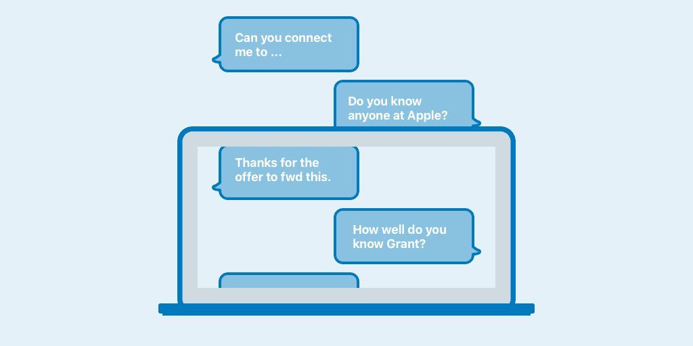
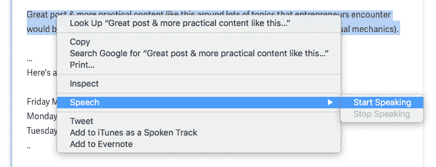
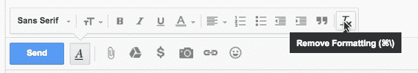

# SaaS 创始人客户介绍指南

> 原文：<https://medium.com/hackernoon/the-saas-founders-guide-to-customer-intros-ff6f53a2a7d9>

对于刚开始开发客户的 SaaS 创始人来说，介绍是一种接触潜在客户的好方法。而风投是这些 intro 的伟大[来源之一，尤其是对初创公司而言。他们整天都在与大大小小的公司会面，因此他们处于一个绝佳的位置，可以将你与感受到你试图解决的难题的潜在客户联系起来。(此外，从风险投资的角度来看，这是对你的公司进行尽职调查的一种简单方式，所以他们也从促进这些介绍中受益。)即使你的公司在扩大，你开发了一个可重复的流程来通过你的漏斗带来新客户，热情的介绍仍然非常有价值。](/@duro/investors-dropping-names-like-its-hot-a019bf65e5a0)

当那些介绍邀请真的到来时，你需要准备好充分利用它们，同时尊重介绍的([有时微妙的](https://twitter.com/JoeFernandez/status/810724907902345216))礼仪。这篇文章将引导你通过微妙的艺术有效地利用这些介绍。

## 为每次会议做准备

伟大的引荐始于引荐要约被延长之前，所以你应该做一些研究，以了解任何给定的风投能为你建立的最强的潜在联系。我通常从他们基金网站的“投资组合”部分或他们的 [CrunchBase](https://www.crunchbase.com/) 页面开始。然后，我深入研究每家公司，看看它们是否符合我的目标客户档案(这是一项非常耗时的任务，但你也可以深入了解每家公司资助的公司类型)。

## 在会议期间

如果你要会见的人提出在会议期间做介绍，**记下他的名字和公司。如果你不确定为什么那个人或公司会感兴趣，这是停下来问:“那可能很有趣。你认为他们对我们正在做的事情感兴趣有什么特别的原因吗？”这不仅会为后续的电子邮件介绍提供必要的背景，而且如果这不是适合你的介绍，也会消除任何误解。**

## “我能帮什么忙？”

即使他们一开始没有主动提出帮你联系任何人，大多数风投也会在会议结束时说一些话，比如，“让我知道我能帮上什么忙。”这是你利用会前准备工作提出问题的机会。比如，“我事先看了你的投资组合公司，我认为 A 公司的人可能有兴趣[了解](https://hackernoon.com/tagged/learning)我们正在做的事情，因为 X & Y。你愿意帮我联系那里的人吗？”

分享你认为公司 A 会感兴趣的原因提供了可能引发其他可能的介绍要约的背景。

## 流动

一旦提供了介绍，它有助于了解这些介绍应该如何工作的最佳流程。

*   **步骤 0:** 提出介绍要约。
*   **第一步:**你接着给介绍人发了一封电子邮件，请求介绍(具体布局详见下文)。
*   **第二步:**介绍人可能会将你的电子邮件转发给你要求介绍的人([，而不会抄送给你](http://avc.com/2009/11/the-double-optin-introduction/))。
*   **第三步:**收件人将阅读这封转发的电子邮件，并回复介绍人是否愿意接受介绍。介绍人和接受人之间关系的强度非常重要，但一般来说，(好的)风投是强有力的联系者。
*   假设答案是肯定的，你会收到一封电子邮件，抄送给你想介绍的人。
*   **步骤 4a:** 如果你没有收到关于介绍的回复，请在大约 7-10 天后跟进。介绍人可能会伸出手，试图从你希望介绍的人那里得到回应。坚持不懈是有回报的，但我一般不会要求他们提交超过两次(在第二次跟进时，你可以尝试调整主题行，将消息放到线程之外，以获得额外的提升)。如果你在两次跟进后没有任何运气，你最好转移到一个新的介绍来源。
*   **第五步:**你(而不是对方)会迅速回复(感谢介绍人并把他/她转到密件抄送)。作为接受介绍的人，你应该自己来回安排(即**不要**使用助手、 [AI](http://www.amy.ai) 或[日历链接](http://www.calendly.com)安排会议)。换句话说，要谦虚，要有人情味。
*   如果你想亲自见面，主动提出去他们的办公室(你在浪费他们的时间；也不要征收通勤税。务必提前 5-10 分钟到达，办理入住手续。如果是一个较小的公司(例如，少于 20 人)，尽量准时，因为他们可能没有接待区。
*   **步骤 6a:** 如果你想远程会面，了解他们所在的时区(这样你就可以确保你建议的时间是合理的)，并询问他们对会面方式的偏好(例如，电话、视频、Zoom 或其他会议工具)。发送 2 或 3 个适合你的特定时间选项会很有用，而且对他们的时区来说也是合理的。(我经常在我的日历上放一个占位符，标题里有一个问号，(例如。“A 公司？”)对于《泰晤士报》，我建议确保自己不会重复预订[和](https://hackernoon.com/tagged/book)。)
*   **第七步:**一旦约定好时间，就发送一份包含会议细节的日历邀请函。我通常会发出 45 分钟会议的邀请(如果进展顺利，30 分钟太短了，60 分钟感觉有点令人印象深刻)。邀请函的标题也很重要，因为这将是他们在日历上认出它的名字(我选择“Name & Grant”或“Company A & Replicated”)。
*   步骤 8: 为这次会面做必要的准备工作，比如阅读关于他们业务的文章，查看他们最近的博客帖子和公告。

## 介绍电子邮件模板

甚至在你得到你的第一个介绍之前，你就应该有一个坚实的模板来用于介绍。我举了一个例子，大约 36 个月前，我们用这个例子获得了第一批客户(这封电子邮件的介绍让 [NPM 成为了我们的一个大客户](https://www.npmjs.com/enterprise))。

> **主题:** NPM 企业(已复制)
> 
> 嘿汤姆，
> 
> 谢谢你主动向我们介绍 NPM 的团队。我们很乐意向他们展示我们在 Replicated 正在构建的东西，看看它是否适合 NPM 企业。我将快速描述我们为上下文所做的工作:
> 
> *复制(*[*www.replicated.com*](https://www.replicated.com)*)将现有的基于云的 SaaS 产品扩展为易于安装、许可和管理的版本&，并在其客户的私有环境(内部数据中心或私有云)中提供支持。与当前的替代品(虚拟机)不同，我们这样做不需要 SaaS 供应商维护二级产品/代码库，也不需要构建公共云版本不必要的许可/更新/支持功能。*
> 
> 非常感谢你的帮助。
> 
> 最好，
> grant@replicated.com
> 创始人，
> 复制者

以下是制作模板简介的一些关键建议:

*   了解它将被转发(而不是复制和粘贴)，并创建适合该交付模式的内容。
*   不要发送一封要求一次做多个介绍的电子邮件介绍；跟进每个介绍的独特电子邮件(便于转发)。
*   会议结束后尽快发送。介绍人对介绍的印象越深刻，他们就越有可能坚持下去。
*   就像日历邀请一样，使用一个主题来为接收方提供上下文。我总是在主题后面的括号中包含我们公司的名称(例如，NPM 企业(复制))。
*   在发送介绍请求之前，对公司做一些快速调查。有时他们会在 Twitter 或博客上发布相关或相关的内容或评论。如果他们有，参考这些材料会有所帮助，以表明你正在注意和做腿部工作。

## 不要搞砸了

第一印象只有一次机会，所以要确保你的电子邮件不会因为打字错误和格式错误而影响第一印象。为了获得不同的视角，我在完成电子邮件的第一次迭代后，实际上改变了撰写框的窗口比例，以改变换行符(我发现换行符往往会掩盖打字错误或语法错误)。

此外，我不会在晚上 10 点后发邮件，因为我已经意识到在那之后我更容易打字错误。所以，我会把它们写好，早上发之前再读一遍。

对于真正重要的电子邮件，我会让我的共同创始人作为额外的一层校对。另一个最受欢迎的技巧是使用 Mac 功能向您朗读突出显示的文本，因为听到您的文本大声朗读对于发现奇怪的措辞问题非常有用。

格式化也可能有点麻烦。你是否注意到电子邮件的不同部分(通常是模板部分)的字体或颜色略有不同？这似乎是由于邮件作者从另一封邮件的引用文本部分复制并粘贴了这一部分(在 Gmail 中经常看起来略带紫色)。如果你使用 Gmail，它提供了一个功能(如下所示)来删除文本格式和摆脱任何臭味。

当然，解决这个问题最可靠的方法是将您的电子邮件正文复制并粘贴到一个文本编辑器中，如 Atom，然后将其复制并粘贴回您的撰写窗口。

## 让它们发光

但是要记住的最重要的事情是，别人为你做的每一次介绍都会将他们的关系资本投入到他们刚刚介绍的新关系中。不要认为这是理所当然的。你必须拿出成果，易于合作并听取反馈——不仅要为你的公司达成交易，还要确保你不会过河拆桥。

但那是另一个时间的另一篇文章。

*如果你有兴趣了解如何让你的 SaaS 公司在企业客户中更加成功，请查看我们在* [*网站上创建的庞大指南。*](http://www.enterpriseready.io)