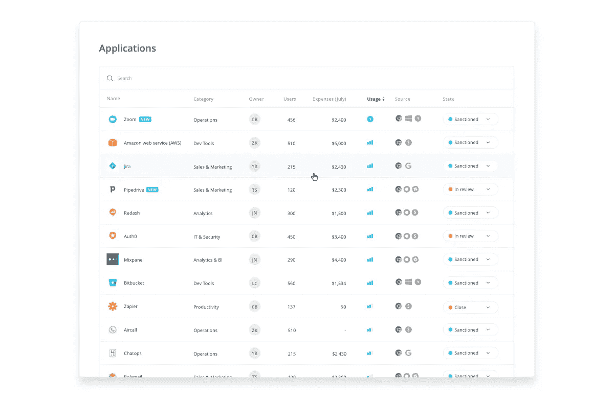
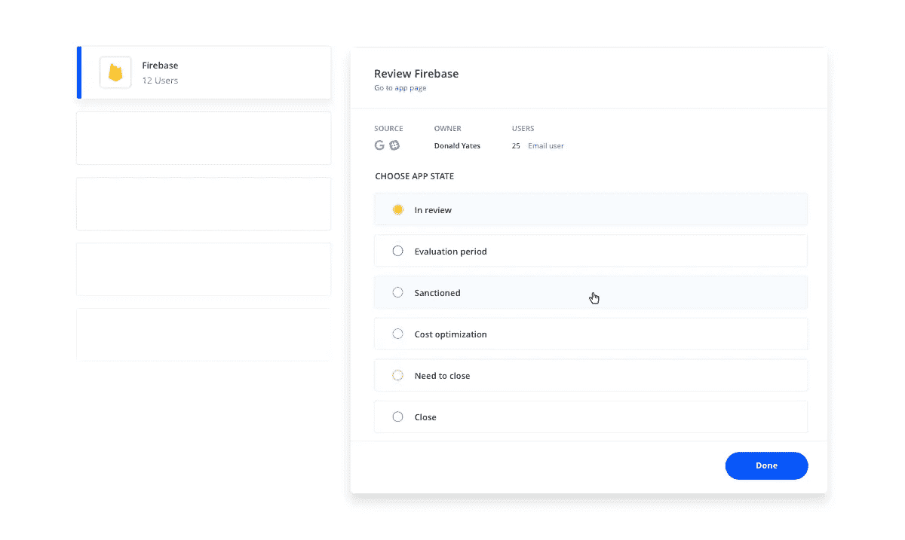
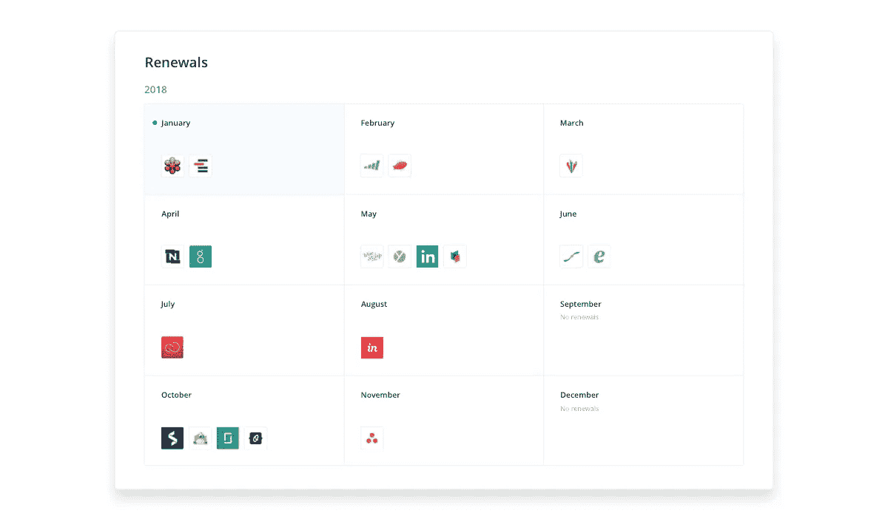
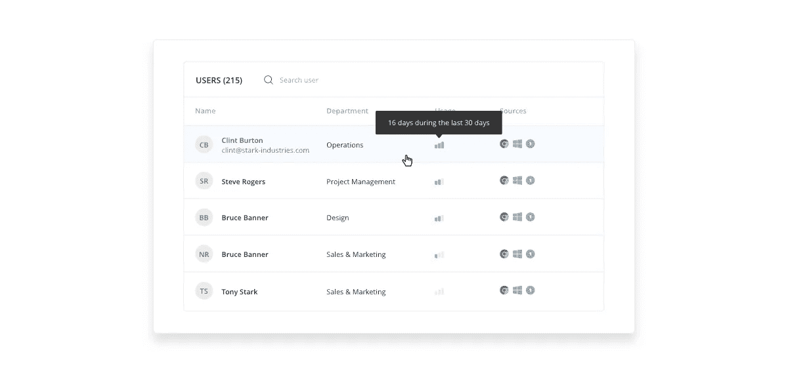

# SaaS 的生命周期

> 原文：<https://medium.com/hackernoon/the-saas-lifecycle-f8485f1a50b>

今天，大量的 SaaS 产品正在改变它的运作方式。软件的数量比以往任何时候都要增长，并且软件越来越多地被作为一种服务来消费，这已经不再令人惊讶了。

让您的组织使用更多云服务，无论是 IaaS 还是 SaaS，对组织和 IT 来说都是一种范式转变。

SaaS 的设置和注册非常简单，这给人一种 SaaS 不需要管理的错觉。只需点击一个按钮，员工就可以注册并开始使用新的 SaaS。如果您的员工精通技术，他们可以管理自己正在使用的 SaaS 业务线。您不再需要关心安全补丁、计算能力分配或升级。那么，为什么 SaaS 需要被管理，为什么它应该关心它的生命周期？

# SaaS 仍然需要管理

我们需要承认这样一个事实，当软件作为服务被消费时，虽然许多传统的软件管理任务现在不再相关，但仍然有许多任务留在 IT 部门的门口，其中一些任务比以前更具挑战性。

例如，跟踪您的 SaaS 库存的简单任务不再是微不足道的。信息分散在各种工具中，保存 Excel 文件总是过时的。例如，另一个问题是知道谁在使用哪个 SaaS？即使使用像 Okta 和 Onelogin 这样的 SSO 工具，it 仍然几乎不可能知道真实的用法，因为许多 SaaS 仍然在 SSO 范围之外。

谁是您的本地管理员？哪个 SaaS 应该退役？您的员工是否正确使用了 SaaS 的产品？哪些数据正在共享？

为了让它完全掌握 SaaS 管理，他们必须首先承认一个事实，即 SaaS，像传统的软件一样，有它的生命周期。每个被介绍到你的组织的 SaaS 都住在那里，有一天可能会离开。如果你不拥有 SaaS 的生命周期，那么你就不能管理它。如果你不去管理它，那么它会很快发展到你觉得自己失控的地步。如果处理不当，SaaS 的广泛提供以及它们在组织中的快速适应会很快超过您的 IT。

# SaaS 的生命周期是什么？

我们可以清楚地将 SaaS 分为 5 个生命周期阶段:

1.  计划
2.  在检查中
3.  适应(认可)
4.  最佳化
5.  退休

让我们逐一检查:

# 计划

当一个 SaaS 通过一个正确的采购订单请求[明确地或通过一个签约](https://blog.toriihq.com/shadow-it-the-good-the-bad-and-the-ugly/)的员工隐含地引入到您的组织中时，那么这个 SaaS 需要被映射到您的系统中。我们知道，适当的发现是压倒性的，因为这是人们对绘制的 SaaS 的数量感到最惊讶的地方。绘制的 SaaS 的数量通常比人们最初估计的要高几个数量级，而且只有一两个员工使用的 SaaS 的长尾很长。

# 在检查中

每个 SaaS(包括供应商和产品)都应根据贵公司的政策和法规进行审查。它必须了解其安全风险、成本、使用它的原因、与现有工具的集成、与其他工具的重叠、合规性适合度等。一些工具因为其使用或声誉较高而可以快速审查，而其他工具可能对您的组织有更深的影响，并且可能需要更多的利益相关者参与进来以了解全貌。

# 适应(认可)

受制裁的 SaaS 是指 IT、法律、安全和其他利益相关方认可的。成本估算是已知的，并得到批准。一个明确的业务所有者被分配到 SaaS。员工被告知这个 SaaS 已经被批准了。所有 SaaS 详细记录，合同和使用条款可以很容易地检索。预测计划中设置了所有续订日期，并且设置了续订通知。

# 最佳化

必须不断监测 SaaS 的两个方面。成本和利用率。SaaS 成本很容易溜走。许多 SaaS 是以按使用付费或按座位付费的许可模式提供的，如果不加以监控，其成本会很快失控。大多数供应商的利用率通常不透明。只有在极少数情况下，供应商才会主动通知您有员工占用了座位，但他们并没有真正使用 SaaS，或者几乎没有从中获得任何好处。出于这些原因，偶尔检查一下你的 SaaS 工具，并提前获得所有关于成本和使用的相关信息是很重要的。

# 退休

找到相当多孤立、重复和未使用的 SaaS 并不罕见。虽然许多人都渴望将新工具引入您的组织，但只有少数人会在他们之后主动清理垃圾。
退役 SaaS 是一项不容忽视的重要任务。从安全性、成本和时间角度来看，这很重要。不要低估清理 SaaS 桌子能给你的组织带来的价值。添加注释或报废原因也很有用，因为有些工具在最初报废的原因未知时会重新回到公司。

# SaaS 管理工具

随着组织的发展，云服务的使用可能会增加。使用 SaaS 管理工具已经成为 IT 工具箱中的强制性工具。尝试仅使用 Excel 和其他临时工具来绘制 SaaS 并管理其生命周期并不是正确管理作业的最有效方式。
通过使用 SaaS 管理工具，该工具可以提供自动映射和发现、真实 SaaS 使用情况、相关成本以及您需要的所有信息，并不断更新和轻松检索，使 IT 部门能够控制组织。

> 给[鸟居](https://toriihq.com)一个尝试！这是一个简单快速的设置，它为您提供了所需的即时可见性和 SaaS 生命周期管理。

*原载于 2018 年 1 月 22 日 blog.toriihq.com**的* [*。*](https://blog.toriihq.com/the-saas-lifecycle/)