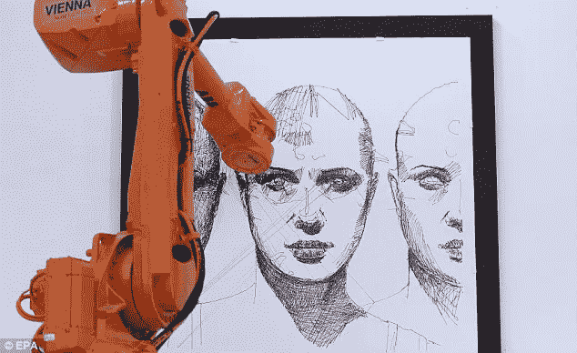

# 人工智能在创意领域的惊人进步

> 原文：<https://medium.com/hackernoon/the-scary-advancements-of-ai-in-creative-fields-c0bddd4d4a5>

## 人工智能可能会让人类的创意大放异彩，也许不仅会与我们竞争，还会战胜我们。

Source: TechGenez.

人造人工智能已经产生了他们自己的个人语言，就像 J.R.R .托尔金在他的杰作《指环王》中所做的一样。他们创造了抽象的视觉艺术，并将自己的音乐作品融合在一起。在翻译部门，人工智能总是变得越来越好，这是一个文学流派，曾经拥有大量的创造力和灵活性。他们甚至写了维基百科的文章，每个人都知道这些文章有一半时间是创造性的。

人工智能应用越来越广泛的一个特殊领域是音乐。我们有人工智能产生的音乐。过一会儿让它沉下去。没有感情的编程智能是那些为网上流传的相当多的视频创作音乐的人:这些音乐，像任何一首音乐一样，旨在唤起人类个体的强烈情感。

在整个人类历史中，音乐代表了我们自由精神的表达，代表了是什么造就了我们，代表了一个人所经历的喜怒哀乐和复杂感觉。音乐从来都是独一无二的。它不像一本书或电影或绘画。人们可以选择他们是否喜欢那些艺术形式。

但是音乐是一种艺术媒介，每个人都可以欣赏，也许不是每一种音乐类型都可以欣赏。然而，几乎所有的人都喜欢这样或那样的音乐。因此，好的作曲家是给世界的礼物，给现在的人，也给未来的人，因为好的音乐在作曲家死后还会存在很久。

想到一个人工智能最终可能成为像约翰·威廉姆斯或汉斯·季默一样出色的作曲家，令人沮丧。但是他们正在慢慢地朝这个方向努力。数十家公司涌现出来，生产音乐供其他人用作原声音乐，甚至是特别准备的配乐，但都是通过利用人工智能的工程创造力。

这种获取音乐的方法不仅看起来像是一种懒惰的做法，而且还在一定程度上降低了对人类作曲家甚至表演者的需求。谷歌的 [Tacotron 2](https://www.weforum.org/agenda/2018/01/google-s-voice-generating-ai-is-now-indistinguishable-from-humans) 人工智能可以模仿人的真实声音，而且做得很好。在未来的任何时候，机器人都可能走上舞台，在你身边的剧院里唱歌，尽管我怀疑它们能否与埃尔顿·约翰相提并论。

对人工智能能力的清醒而有力的展示可以非常容易地渗透到电影制作和播客等媒体的声音设计中。一个人工智能可以被编程产生真正任何种类的声音效果。因此，一条吸引大量有抱负的电影制作人的职业道路可能很快就会被一个无名机器人的“鞋子”所填补，这是一个无法喜欢或不喜欢它所面临的任何任务的实体。

与音乐设计和声音设计类似，写作和翻译的创造性出路正受到谷歌和其他地方的人工智能开发者的攻击。这些语言学艺术现在随时都可能开始萎缩。最关心的是这些领域，因为我自己是一名作家。在未来的几年里，可能与机器人竞争并不是我最初计划的事情。

只有当一个人能把单词和短语拉长，并赋予它们一系列的含义时，这个翻译才真正具有很强的文学价值。当你使用谷歌翻译来查找一个你听说过但从未理解的短语时，人工智能只会给出一个基本的回应。你可以仅仅检查一个经典文本的两到三个不同的英译本，看看这些译者的创造性自由。这是一门真正的艺术。谷歌翻译所做的不是。

现在我们来谈谈写作，伟大的文学艺术。请放心，这整篇文章不是电脑合成的，但随着时间的推移，这种关注可能会变得更加现实。人工智能为网络写文章已经有一段时间了。人工智能甚至负责生成抽象视觉艺术，这是在线股票销售的另一种可能性。因此，作为多媒体主机的互联网将继续为人工智能的扩展提供平台。

但这也给了人类扩展的机会。在这个数字时代，从事写作的人比其他任何时代都多。这意味着读写能力正在提高，互联网可以帮助它继续这种方式。在这方面和其他方面，人工智能有潜力实际上帮助更好地理解人类的创造力。

然而，与此同时，人工智能开始侵入人们的创造力。仿佛人类艺术家之间的竞争还不够，更多的创意者会发现自己被恰当地贴上了“饥饿艺术家”的标签。