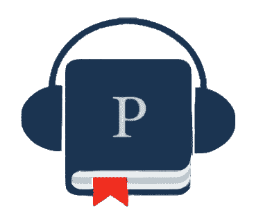

# 🅟🅞🅓🅒🅐🅢🅣🅢&…我失败的创业

> 原文：<https://medium.com/hackernoon/the-search-for-sound-492d9bcd00e2>

> "我想知道是否有埃隆·马斯克关于自动驾驶汽车的播客？"
> 
> “我知道我对虚拟现实感兴趣，但是我在哪里可以了解它？”
> 
> *“我记得主持人提到了一部有趣的电影，叫什么来着？”*

# **𝚂𝚘，**[**𝙿𝚘𝚍s𝚘𝚞𝚛𝚌𝚎**](http://podsource.org)**？**

我们有些人是右撇子，有些人是左撇子，但很少有人两者都是。有些人喜欢音频，有些人喜欢视觉，但大多数人都喜欢两者。[**pod source**](https://hackernoon.com/tagged/podsource)**两者皆是。这是一个专注于播客的互联网媒体平台，将声音和它的老朋友:视觉结合起来。**

就像之前的黄色新闻一样，假新闻和虚假新闻在我们的媒体中找到了真正的敌人:网络广播。铸造是声音进化的下一个阶段。*新型*公共接入对讲电台，以及更多**。这是可以搜索的。它是策划好的。而且是个性化的。**

在这个 [POC](https://en.wikipedia.org/wiki/Proof_of_concept) 中，Podsource 将迎合喜欢看和听**的个人。据我所知，我们大多数人都是这样。除非你是贝多芬。或者你有爪子，那么你可能是一只狗。**

# 𝙰 𝙳𝚒𝚏𝚏𝚎𝚛𝚎𝚗𝚝 𝙺𝚒𝚗𝚍 𝚘𝚏 𝙸𝚗𝚝𝚎𝚛𝚗𝚎𝚝-𝙼𝚎𝚍𝚒𝚊 𝙿𝚕𝚊𝚝𝚏𝚘𝚛𝚖

> “当一些东西分散而混乱时，总需要有人来组织环境中的所有无序。”——Josh Wolfe，Lux Capital[【1:10:00】](http://18.188.2.142/episodes/view/4429)

## 声音的交响乐

眼下，互联网和内容产业是**分散**和**无序的。这不是简单的自我组织，我们都必须这样做。就像电视或音乐流媒体服务一样，我们的网站拥有数百万个声音，这一切都是从。更重要的是，Podsource 也可以像 Google 一样被搜索到主题、艺术家、引用、概念和任何类型的提及。**

你知道一群声音比一个人单独听起来有多好听，但我们还是不会放弃对自己放声歌唱。类比继续如下。如果创作者和艺术家能够走到一起，并同意将他们的声音放在一个地方，那么我们都将创造出一个更真实的社交网络——一个声音网络

> L⃝o⃝g⃝i⃝c⃝

# 𝚆𝚑𝚢 𝙿𝚘𝚍s𝚘𝚞𝚛𝚌𝚎？

首先，它是免费的。免费很好。我们都喜欢免费的。当然，公司将需要赚钱，但它肯定不会以牺牲用户为代价(除了偶尔的广告)。如果你以前用过 Patreon，你会知道一些创意人员已经开始为他们的工作接受贡献，就像维基百科一样。我们将使用类似的模型。艺术家可以**选择**是否对他们的内容收费，接受捐赠，和/或包含广告。自由是你的。毕竟，

> "水涨船高。"

# 𝙷𝚘𝚠 𝚊𝚋𝚘𝚞𝚝 𝚝𝚑𝚎 𝙰𝚞𝚍𝚒𝚎𝚗𝚌𝚎?

## 把最好的留到最后

总之，Podsource 平台是创意人员**和他们的内容(即播客)的一个有组织的中心。我们也知道 Podsource 正在使发布过程变得简单和通用。然而，这仍然留下了最重要的问题:这对听众有什么好处？**

**𝚃𝚑𝚛𝚎𝚎𝚊𝚗𝚜𝚠𝚎𝚛𝚜:**
*1。策展和个性化建议
(专家们的耳朵可能已经被蜂蜡填满了。)
2。收藏夹、收藏、播放列表和收听历史记录。
3。搜索姓名、主题、提及等*

如果你记得这篇文章中的一件事，那就是:

## ℙ𝕠𝕕𝕊𝕠𝕦𝕣𝕔𝕖是无线电的进化者，𝕪𝕠𝕦'𝕣𝕖负责。

Why Hello, [Podrick](http://podsource.org)

## 感谢阅读，

杰里米

> *鼓掌，分享，* [*加入运动*](http://podsource.org) *自己去看。🚀*